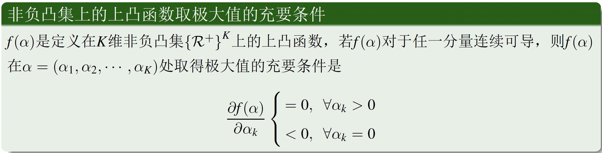
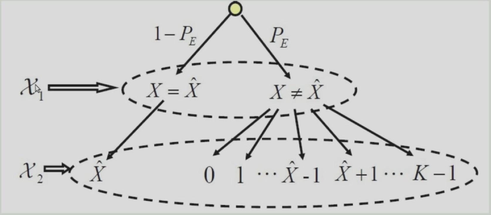
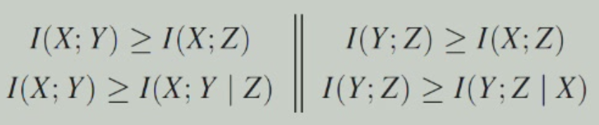

---
hide:
  #- navigation # 显示右
  #- toc #显示左
  - footer
  - feedback
comments: true
--- 

# Chapter 2 : 随机变量的熵和互信息

## 概率论基础

随机变量的概率空间 $\{X,\mathcal{X},q(x)\}$

- $\mathcal{X}$：$X$ 的取值空间，$\mathcal{X}=\{x_k;k=1,2,...,K\}$
- $q(x)$：事件 $\{X=x\}$ 发生的概率，$q(x)\geq 0$，$\sum_{x\in\mathcal{X}}q(x)=1$

联合变量对 $(X,Y)$，二维随机变量 $\{(X,Y),\mathcal{X}\times\mathcal{Y},p(x,y)\}$

- $p(x,y)=P\{X=x,Y=y\}$
- $\mathcal{X}=\{x_k;k=1,2,...,K\}$，$\mathcal{Y}=\{y_j;j=1,2,...,J\}$
- $p(x_k,y_j)\geq 0$，$\sum_k\sum_j(x_k,y_j)=1$
- $\sum_k p(x_k,y_j)=\omega(y_j)$，$\sum_j p(x_k,y_j)=q(x_k)$

!!! note "条件概率"

	$$
	p(x|y)=\frac{p(x,y)}{\omega(y)},\quad p(y|x)=\frac{p(x,y)}{q(x)}
	$$
	
***
## 事件的自信息

!!! note ""

	自信息：事件发生后提供的信息量

> 信息量是信息论的重要概念，事件的信息量基于该事件发生的概率

定义：对于概率空间 $\{X,\mathcal{X},q(x)\}$，事件 $\{X=x_k\}$ 的自信息定义为 $I(x_k)=-\log_a q(x_k)$

- 当 $a=2$ 时，信息量的单位是比特（bit）；当 $a=e$ 时，信息量的单位是纳特（nat）
	- 这便是信息所谓比特的来源

定义为概率的负对数的优点：

- 符合**概率越小，信息量越大**的要求
- 对数函数是比较简单的函数，**容易进行数学处理**，
- **对数函数的可加性**符合生活中关于**信息可叠加性**的经验

!!! note "事件自信息的本质"

	- 事件发生后对外界（观察者）所提供的信息量
	- 事件发生前外界（观察者）为确证该事件的发生所需要的信息量，也是外界为确证该事件所需要付出的代价
	- 事件的自信息并不代表事件的不确定性，事件本身没有不确定性可言，它要么是观察的假设和前提，要么是观察的结果

事件自信息的性质：

- $q(x_k)$ 越大，$I(x_k)$ 越小，概率越小的事件其自信息越大
	- e.g. 某一个城市的天气经常下雨，即下雨天的概率比较大，那么当该城市气象台预报第二天将要降雨的时候，此时信息量比较小；相反，如果预报第二天是个晴天的时候，此时这个信息的信息量是比较大的
- $q(x_k)=1,I(x_k)=0$，确定事件的自信息为 0
	- e.g. “明天的最低气温低于100度”这句话的信息量几乎为 0，因为该事件发生的概率基本为 1
- $q(x_k)\rightarrow 0,I(x_k)=\infty$
	- “张三买彩票中了 500 万”，这句话的信息量是巨大的，因为中彩票头的概率基本上趋向于 0
***
### 事件的条件自信息

对于二维随机变量 $\{(X,Y),\mathcal{X}\times\mathcal{Y},p(x,y)\}$，事件 $Y=y_j$ 发生后，事件 $X=x_k$ 的条件自信息为$I(x_k|y_j)=-\log p(x_k|y_j)$

!!! note "事件条件自信息的本质"

    - 事件 $Y=y_j$ 发生后，事件 $X=x_k$ 再发生需要新的信息量
    - 事件 $Y=y_j$ 发生后，事件 $X=x_k$ 再发生提供给观察者的信息量

!!! example "Example"

	=== "Example 01"
	
		- $x_k$：杭州下雨，$y_j$：上海下雨
		- $I(x_k)$：杭州下雨需要的信息量，$I(x_k|y_j)$：上海下雨后杭州下雨需要的信息量
		- $q(x_k)=0.5,p(x_k|y_j)=0.75$，则 $I(x_k)=1\text{bit},I(x_k|y_j)=\log_2(\frac{4}{3})\text{bit},I(x_k)>I(x_k|y_j)$
	
	=== "Example 02"
	
		- $x_k$：杭州下雨，$y_j$：上海晴天
		- $I(x_k)$：杭州下雨需要的信息量，$I(x_k|y_j)$：上海晴天时杭州下雨需要的信息量
		- $q(x_k)=0.5,p(x_k|y_j)=0.25$，则 $I(x_k)=1\text{bit},I(x_k|y_j)=2\text{bit},I(x_k)<I(x_k|y_j)$
	
	=== "Example 03"
	
		- （无关事件）$x_k$：杭州下雨，$y_j$：北京下雨
		- $I(x_k)=I(x_k|y_j)$
***
### 事件的联合自信息

对于二维随机变量 $\{(X,Y),\mathcal{X}\times\mathcal{Y},p(x,y)\}$，事件 $(X,Y)=(x_k,y_j)$ 的联合自信息为：$I(x_k,y_j)=-\log p(x_k,y_j)$，表示事件 $\{X=x_k\}$ 和 $\{Y=y_j\}$ 同时发生需要的信息量，或者同时发生后对外界提供的信息量
***
## 事件的互信息

!!! note ""

	互信息：相互之间提供的信息量

**互信息**是衡量两个随机变量之间的相关性的重要指标，定义为：

$$
I(x_k;y_j)=I(x_k)-I(x_k|y_j)=-\log q(x_k)-\{-\log p(x_k|y_j)\}=\log\frac{p(x_k,y_j)}{q(x_k)\omega(y_j)}
$$

显然可以看出，互信息有对称性 $I(x_k;y_j)=I(y_j;x_k)$

- 事件的互信息的本质：事件 $\{Y=y_j\}$ 发生后对事件 $\{X=x_k\}$ 不确定性的降低，大于 0 表示不确定性降低；小于 0 表示不确定性增加

!!! example "Examples"

	=== "Example 01"
	
		- $x_k$：杭州下雨，$y_j$：上海下雨
		- $I(x_k)$：杭州下雨需要的信息量，$I(x_k|y_j)$：上海下雨后杭州下雨需要的信息量
		- $q(x_k)=0.5,p(x_k|y_j)=0.75$，则 $I(x_k)=1\text{bit},I(x_k|y_j)=\log_2(\frac{4}{3})\text{bit},I(x_k;y_j)>0$
	
	=== "Example 02"
	
		- $x_k$：杭州下雨，$y_j$：上海晴天
		- $I(x_k)$：杭州下雨需要的信息量，$I(x_k|y_j)$：上海晴天时杭州下雨需要的信息量
		- $q(x_k)=0.5,p(x_k|y_j)=0.25$，则 $I(x_k)=1\text{bit},I(x_k|y_j)=2\text{bit},I(x_k;y_j)<0$
	
	=== "Example 03"
	
		- （无关事件）$x_k$：杭州下雨，$y_j$：北京下雨
		- $I(x_k)=I(x_k|y_j),I(x_k;y_j)=0$
***
### 事件的条件互信息

在给定事件 $Z=z$ 的条件下，事件 $X=x$ 和事件 $Y=y$ 的条件互信息为：

$$
I((x;y)|z)=I(x|z)-I(x|(y,z))=\log\frac{p(x|(y,z))}{q(x|z)}=\log\frac{p(x,y|z)}{q(x|z)\omega(y|z)}
$$

表示 $Z=z$ 发生时，事件 $X=x$ 和事件 $Y=y$ 相互之间提供的信息量

!!! example "Example"

	- $x$：杭州下雨，$y$：上海下雨，$z$：宁波下雨
	- $q(x)=q(y)=q(z)=0.125$
	- $p(x|y)=p(x|z)=p(y|z)=0.25$
	- $p(x|y,z)=0.5$
	- $I(x)=3\text{bit},I(x|y)=2\text{bit},I(x;y)=1\text{bit},I(x;y|z)=1\text{bit}$
***
### 事件的联合互信息

联合事件 $\{Y=y,Z=z\}$ 与事件 $\{X=x\}$ 之间的互信息为:

$$I(x;(y,z))=\log\frac{p(x|y,z)}{q(x)}=\log\frac{p(x,y,z)}{q(x)\omega(y,z)}$$

表示事件 $\{Y=y,Z=z\}$ 联合提供给事件 $\{X=x\}$ 的信息量

!!! example "Example"

	- $x$：杭州下雨，$y$：上海下雨，$z$：宁波下雨
	- $I(x)$：杭州下雨需要的信息量，$I(x;y,z)$：上海下雨和宁波下雨这两个事件同时给杭州下雨这个事件的信息量
	- $q(x)=0.125;p(x|y)=0.25$，则 $I(x;y)=I(x)-I(x|y)=1$
	- $p(x|y,z)=0.5$，则 $I(x;y,z)=I(x)-I(x|y,z)=2>I(x;y)$

!!! note "链式法则"
	
	$$
	I(x;(y,z))=I(x;y)+I(x;z|y)
	$$
	
	事件 $\{Y=y,Z=z\}$ 联合发生后对事件 $\{X=x\}$ 的信息量等于事件 $\{Y=y\}$ 对事件 $\{X=x\}$ 的信息量加上事件 $\{Y=y\}$ 已知的前提下，事件 $\{Z=z\}$ 提供给事件 $\{X=x\}$ 的信息量
	
	??? note "Proof"
	
		$$
		\begin{aligned}
		I(x;y,z)&=\log\frac{p(x|y,z)}{p(x)}=\log\frac{p(x|y)p(x|y,z)}{p(x)p(x|y)}\\
		&=\log\frac{p(x|y)}{p(x)}+\log\frac{p(x|y,z)}{p(x|y)}\\
		&=I(x;y)+I(x;z|y)
		\end{aligned}
		$$
		
***
## 随机变量的熵

> 熵：变量的不确定性

**熵**是衡量随机变量不确定性的重要指标，定义为随机变量各个事件的平均自信息：

$$
H(X)=E[I(X)]=\sum_{x\in\mathcal{X}}q(x)I(x)=-\sum_{x\in\mathcal{X}}q(x)\log q(x)
$$

- 熵与自信息的区别：熵针对的是随机变量，自信息针对具体的事件

!!! example "Example"

    二元随机变量 $X$ 的概率分布 $q(x_1)=p,q(x_2)=1-p$，则 $X$ 的熵为：
	
    $$
    H(X)=-p\log p-(1-p)\log(1-p)
    $$
	
    当 $p=0.5$ 时，$H(X)=1$，表示 $X$ 的不确定性最大，即等概率变量的随机性最大，所以熵最大；当 $p=0$ 或 $p=1$ 时，$H(X)=0$，表示 $X$ 的不确定性最小，即确定性变量的熵为 0。
***
### 联合熵

对于二维随机变量 $\{(X,Y),\mathcal{X}\times\mathcal{Y},p(x,y)\}$，事件 $(X,Y)$ 的联合熵为：

$$H(X,Y)=-\sum_{x\in\mathcal{X}}\sum_{y\in\mathcal{Y}}p(x,y)\log p(x,y)$$

表示随机变量 $X$ 和 $Y$ 联合发生后的不确定性

!!! note "链式法则"

	$$
	H(X,Y)=H(X)+H(Y|X)=H(Y)+H(X|Y)
	$$
	
	随机变量 $X$ 和 $Y$ 联合发生后的不确定性等于随机变量 $X$ 的不确定性加上在给定 $X$ 的条件下随机变量 $Y$ 的不确定性。
	
	当 $X$ 和 $Y$ 统计独立时，$H(X,Y)=H(X)+H(Y)$
	
	- 在三元情况下，$H(X,Y,Z)=H(X)+H(Y,Z|X)=H(X)+H(Y|X)+H(Z|X,Y)$
	
	??? note "Proof"
	
		$$
		\begin{aligned}
		H(X,Y)&=E[I(X,Y)]=-\sum\limits_{x\in\mathcal{X}}\sum\limits_{y\in\mathcal{Y}}p(x,y)\log p(x,y)\\
		&=-\sum\limits_{x\in\mathcal{X}}\sum\limits_{y\in\mathcal{Y}}p(x,y)\log p(x)-\sum\limits_{x\in\mathcal{X}}\sum\limits_{y\in\mathcal{Y}}p(x,y)\log p(y|x)\\
		&=H(X)+H(Y|X)
		\end{aligned}
		$$
		
***
### 条件熵

在给定事件 $Y=y$ 的条件下，事件 $X$ 的条件熵为：

$$
H(X|Y=y)=-\sum_{x\in\mathcal{X}}p(x|y)\log p(x|y)
$$

或者也可定义为：

$$
\begin{aligned}
H(X|Y)=E\{H(X|y)\}&=-\sum\limits_{y\in\mathcal{Y}}w(y)\sum\limits_{x\in\mathcal{X}}p(x|y)\log p(x|y)\\
&=-\sum\limits_{x\in\mathcal{X}}\sum\limits_{y\in\mathcal{Y}}p(x,y)\log p(x|y)
\end{aligned}
$$

- 从第二个定义我们可以看出，当 $X$ 和 $Y$ 统计独立时，$H(X|Y)=H(X)$

!!! example "Example"

	随机变量 $X=1$ 表示杭州下雨，$X=0$ 表示杭州不下雨；$Y=1$ 表示上海下雨，$Y=0$ 表示上海不下雨
	
	设 $p(x=1)=0.5;p(x=0)=0.5;p(1|1)=0.75,p(0|1)=0.25$，则 $H(X|Y=1)<H(X)$
	
	$p(X=1)=0.25; p(X=0)=0.75; p(1|1)=0.5, p(0|1)=0.5$，则 $H(X|Y=1)>H(X)$
***
### 熵的性质

对于随机变量 $X$ ，如果

$$\mathbb{X}=\begin{pmatrix}x_1&x_2&\cdots&x_K\\p_1&p_2&\cdots&p_K\end{pmatrix}$$

则有：

$$
H(X)\triangleq H_K({p_1,p_2,\cdots,p_K})\triangleq H_K(P)=-\sum_{k=1}^Kp_k\log p_k
$$

- $H_K(P)$ 对概率矢量 $P$ 的分量是**对称的**，即 $H_K(P)$ 对 $p_1,p_2,\cdots,p_K$ 的排列是不变的——$p_1,p_2,\cdots,p_K$ 的排列不同，$H_K(P)$ 的值不变
- **非负性**：$H(X)\geq 0$
- **确定性**：$H(X)=0$ 当且仅当 $X$ 是**确定性**的随机变量，即 $X$ 的取值只有一个
- **可扩展性**：$\lim\limits_{\epsilon\to 0}H_{K+1}(P_1,P_2,\cdots,P_K-\epsilon,\epsilon)=H_K(P_1,P_2,\cdots,P_K)$ —— 在增加一个概率接近于零的事件时，总熵几乎不变
- **可加性**：$H(X_2)|_{X_2\in\mathcal{X}_2}=H(X_1)|_{X_1\in\mathcal{X}_1}+H(X_2|X_1)|_{X_2\in\mathcal{X}_2}^{X_1\in\mathcal{X}_1}$

!!! note "可加性"

	- $H(X_1)|_{X_1\in\mathcal{X}_1} = H(P(A), P(B))$
	- $H(X_2)|_{X_2\in\mathcal{X}_2} = H(P(A)P_{A_1}, P(A)P_{A_2}, P(A)P_{A_3}, P(B)P_{B_1}, P(B)P_{B_2})$
	- $H(X_2 | X_1)|_{X_2\in\mathcal{X}_2}^{X_1\in\mathcal{X}_1}=\sum\limits_{x_1\in\mathcal{X}_1}P(x_1)H(X_2|x_1)=P(A) H(P_{A_1}, P_{A_2}, P_{A_3}) + P(B) H(P_{B_1}, P_{B_2})$
	
	对变量 X 可以进行多步分层的观察，每一步都可从上一步的观察结果中得到更为细致的结果，变量 X 在最后的观察结果集合中的不确定性等于第一次观察结果的不确定性，加上其后每次观察结果在前一次观察结果已知的前提下的条件不确定性
	
	多元形式：
	
	$$
    \begin{aligned}
    H_M &= -\sum_{k=1}^K \sum_{j=1}^{m_k} p_k q_{jk} \log (p_k q_{jk}) \\
    &= -\sum_{k=1}^K \sum_{j=1}^{m_k} p_k q_{jk} \log p_k - \sum_{k=1}^K \sum_{j=1}^{m_k} p_k q_{jk} \log q_{jk} \\
    &= -\sum_{k=1}^K p_k \log p_k \sum_{j=1}^{m_k} q_{jk} - \sum_{k=1}^K p_k \sum_{j=1}^{m_k} q_{jk} \log q_{jk} \\
    &= -\sum_{k=1}^K p_k \log p_k - \sum_{k=1}^K p_k \sum_{j=1}^{m_k} q_{jk} \log q_{jk} \\
    &= H_K(p_1, p_2, \cdots, p_K) + \sum_{k=1}^K p_k H_{m_k}(q_{1k}, q_{2k}, \cdots, q_{m_k k})
    \end{aligned}
    $$
    

- **极值性**：$H_K(p_1,p_2,\cdots,p_k)\leq H_K(\frac1K,\frac1K,\cdots,\frac1K) =  \log K$，当且仅当 $X$ 是**均匀分布**时取等号。

??? note "Proof"

	$H_K(p_1,p_2,...,p_K)\leq -\sum\limits_{k=1}^Kp_k\log q_k$ 对任何概率矢量 $\pmb{q}$ 均成立。因为：
	
	$$
	\begin{aligned}
	H_K(p_1,p_2,...,p_K)+\sum\limits_{k=1}^Kp_k\log q_k&=\sum\limits_{k=1}^Kp_k\log\frac{q_k}{p_k}\\
	&\leq\log e·\sum\limits_{k=1}^Kp_k(\frac{q_k}{p_k}-1)(\text{由}\ln x\leq x-1)\\
	&=0(q_k=\frac{1}{K},k=1,2,...,K)
	\end{aligned}
	$$
	

- **条件熵小于等于熵**：$H(X|Y)\leq H(X)$——增加条件，减少不确定性。当且仅当 X 和 Y 独立时取等号

??? note "Proof"

	$$
    \begin{aligned}
    H(p_1,p_2,...,p_K)&\leq -\sum\limits_{k=1}^Kp_k\log q_k\\
    H(X|Y) &= E \{H(X|y)\} = -\sum_{x \in \mathcal{X}} \sum_{y \in \mathcal{Y}} P(x, y) \log P(x|y) \\
    &= -\sum_{y \in \mathcal{Y}} \omega(y) \left\{\sum_{x \in \mathcal{X}} P(x|y) \log P(x|y)\right\} \\
    &\leq -\sum_{y \in \mathcal{Y}} \omega(y) \left\{\sum_{x \in \mathcal{X}} P(x|y) \log P(x)\right\} \\
    &= -\sum_{x \in \mathcal{X}} \left\{\sum_{y \in \mathcal{Y}} P(x|y) w(y)\right\} \log P(x) \\
    &= -\sum_{x \in \mathcal{X}} \left\{\sum_{y \in \mathcal{Y}} P(x,y)\right\} \log P(x) \\
    &= -\sum_{x \in \mathcal{X}} P(x) \log P(x) \\
    &= H(X)
    \end{aligned}
    $$
	

- **凸性**：$H(X)$是严格上凸函数， $H(\lambda \vec{P_1}+(1-\lambda)\vec{P_2})\geq \lambda H(\vec{P_1})+(1-\lambda)H(\vec{P_2}),\quad 0\leq \lambda\leq 1$

!!! note "取极大值的充要条件"

	Jensen不等式：令 $(\alpha_1, \alpha_2, \cdots, \alpha_L)$ 是凸集中的一组矢量，$f(\alpha)$ 是该凸集上的一个上凸函数，$(\theta_1, \theta_2, \cdots, \theta_L)$ 是一组概率分布，则有：$\sum_{l=1}^L \theta_l f(\alpha_l) \leq f \left( \sum_{l=1}^L \theta_l \alpha_l \right)$

	首先我们有
	
	
	
	!!! note "怎么理解？"
	
		注意到，此时每个分量为非负。我们要找到极值，就是让这个函数在邻域内的值都比它小。
		
		如果 $\alpha_k$ 大于零，那么这个偏导数一定要为零，否则必定在这个方向或反方向上有增大的空间。-->如果我们增大或减小 $\alpha_k$，那么这个函数的值会增大。
		
		如果 $\alpha_k$ 等于零，那么这个偏导数需要小于或等于零。如果大于零，必定在这个方向上有增大的空间。-->如果我们增大 $\alpha_k$，那么这个函数的值会增大。
		
	把这个移作概率空间。除了要求非负，还要求和为1。所以我们用拉格朗日乘数法，构造函数：
	
	$$
	L(P,\lambda)=H(P)+\lambda(1-\sum_{k=1}^Kp_k)
	$$
	
	求偏导，有：
	
	$$
	\begin{cases}
	\frac{\partial L}{\partial p_k}=\frac{\partial f(P)}{\partial p_k}-\lambda=0\\
	\frac{\partial L}{\partial \lambda}=1-\sum\limits_{k=1}^Kp_k=0
	\end{cases}
	$$
	
	根据前文的解释，我们有：
	
	$$
	\begin{cases}
	\frac{\partial f(P)}{\partial p_k}=\lambda\qquad p_k > 0\\
	\frac{\partial f(P)}{\partial p_k}\leq \lambda\qquad p_k = 0
	\end{cases}
	$$
	
***
### 加权熵

香农熵仅考虑事件发生的客观规律，无法描述主观意义上对事件判断的差别。为了解决这个问题，引入了加权熵的概念

对于随机变量 $X$，定义加权熵为：

$$
\begin{aligned}
\mathbf{X}&=\begin{pmatrix}x_1&x_2&\cdots&x_K\\w_1&w_2&\cdots&w_K\\p_1&p_2&\cdots&p_K\end{pmatrix}\\
H_w(X)&=-\sum_{k=1}^Kw_kp_k\log p_k
\end{aligned}
$$

这相当于给每个事件赋予了一个权重
***
### R$\acute{e}$nyi 熵

$$
H_{\alpha}(X)=\frac{1}{1-\alpha}\log\sum_{k=1}^Kp_k^{\alpha}
$$

当 $\alpha = 0$ 时，$H_{\alpha}(X)=\log K$；当 $\alpha\to 1$ 时，$H_{\alpha}(X)\to H(X)$
***
## 平均互信息

对于两个事件 $\{X=x\},\{Y=y\}$ 之间相互提供的信息量定义为：

$$
I(x;y)=I(x)-I(x|y)=\log\frac{p(x|y)}{q(x)}
$$

其中 $I(x,y)$ 可正，可负，也可为 0

随机变量 $\{(X,Y),\mathcal{X}\times\mathcal{Y},p(x,y)\}$ 相互提供的平均信息量称之为两者之间的平均互信息，简称互信息：

$$
I(X;Y)=E\{I(x;y)\}=\sum_{x\in\mathcal{X}}\sum_{y\in\mathcal{Y}}p(x,y)\log\frac{p(x|y)}{q(x)}
$$
***
### 互信息的性质

- $I(X;Y)=I(Y;X)$
- $I(X;Y)\geq 0$，当且仅当 $X$ 和 $Y$ 独立时取等号

??? note "Proof"

	$$
	\begin{aligned}
	I(X;Y) &= \sum_{x\in\mathcal{X}}\sum_{y\in\mathcal{Y}}p(x,y)\log\frac{p(x|y)}{q(x)}\\
	&= \sum_{x\in\mathcal{X}}\sum_{y\in\mathcal{Y}}p(x,y)\log\frac{p(x,y)}{q(x)w(y)}\\
	&\geq -\sum_{x\in\mathcal{X}}\sum_{y\in\mathcal{Y}}p(x,y)(\frac{q(x)w(y)}{p(x,y)}-1)=0
	\end{aligned}
	$$
	

- $I(X;Y)\leq H(X)$，等号成立的条件是 $X$ 是 $Y$ 的确定性函数；$I(X;Y)\leq H(Y)$，等号成立的条件是 $Y$ 是 $X$ 的确定性函数
	- 事实上，$I(X;Y)=H(X)-H(X|Y)=H(Y)-H(Y|X)=H(X)+H(Y)-H(X,Y)$

***
## 条件互信息

事件的条件互信息：

$$
I(x;y|z)=\log\frac{p(x|y,z)}{q(x|z)}=\log\frac{p(x,y|z)}{q(x|z)\omega(y|z)}
$$

在概率空间 $\{(X,Y,Z),\mathcal{X}\times\mathcal{Y}\times\mathcal{Z},p(x,y,z)\}$ 中，在随机变量 $Z$ 已知的条件下变量 $X$ 与 $Y$ 相互提供的信息量为：

$$
I(X;Y|Z)=E[I(x;y|z)]=\sum_{x\in\mathcal{X}}\sum_{y\in\mathcal{Y}}\sum_{z\in\mathcal{Z}}p(x,y,z)\log\frac{p(x|y,z)}{q(x|z)}
$$
***
## 联合互信息

事件的联合互信息：

$$
I(x;y,z)=I(x)-I(x|y,z)=\log\frac{p(x|y,z)}{q(x)}=\log\frac{p(x,y,z)}{q(x)\omega(y,z)}
$$

在概率空间 $\{(X,Y,Z),\mathcal{X}\times\mathcal{Y}\times\mathcal{Z},p(x,y,z)\}$ 中，随机变量 $Y$ 和 $Z$ 共同提供给变量 $X$ 的信息量为：

$$I(X;(Y,Z))=E[I(x;(y,z))]=\sum_{x\in\mathcal{X}}\sum_{y\in\mathcal{Y}}\sum_{z\in\mathcal{Z}}p(x,y,z)\log\frac{p(x|y,z)}{q(x)}=I(X;Z)+I(X;Y|Z)$$
***
## 相对熵（散度）

定义在相同字符表 $\mathcal{X}$ 上的两个概率分布 $\{p(x)\}$ 和 $\{q(x)\}$ 之间的相对熵（散度），或称 Kullback-Leibler 距离，表示为：

$$
D(p//q)=\sum_{x\in\mathcal{X}}p(x)\log\frac{p(x)}{q(x)}=E_p\{\log\frac{p(x)}{q(x)}\}
$$

表示实际分布 $\{p(x)\}$ 与假定分布 $\{q(x)\}$ 之间的平均差距，因而也称鉴别熵

***
### 相对熵的性质

- $D(p//q)=\sum\limits_{x\in\mathcal{X}}p(x)\log\frac{p(x)}{q(x)}=-\sum\limits_{x\in\mathcal{X}}\log\frac{q(x)}{p(x)}\geq -\sum\limits_{x\in\mathcal{X}}(\frac{q(x)}{p(x)}-1)=0$
- $D(p//q)\neq D(q//p)$
- $I(X;Y)=\sum\limits_{x,y\in\mathcal{X}\times\mathcal{Y}}p(xy)\log\frac{p(xy)}{p(x)p(y)}=D(p(xy)//p(x)p(y))\geq 0$
- $H(X)=-\sum\limits_{x\in\mathcal{X}}p(x)\log p(x)=-\sum\limits_{x\in\mathcal{X}}p(x)\log\frac{p(x)}{1/K}+\log K=H(U)-D(X//U)$
	- 其中 $U$ 是均匀分布
- 如果 $P_1,P_2$ 是独立分布，并且联合分布是 $P=P_1P_2$，如果 $Q_1,Q_2$ 是独立分布，并且联合分布是 $Q=Q_1Q_2$，那么 $D(P//Q)=D(P_1//Q_1)+D(P_2//Q_2)$
***
### 相对熵的应用

假设数据通过未知分布 $p(x)$ 生成，我们想要对 $p(x)$ 进行建模，即使用参数分布 $q(x|\theta)$ 来近似该分布：

$$
\min_{\theta}D(p//q)=\frac{1}{N}\sum_{n=1}^N\log\frac{p(x_n)}{q(x_n|\theta)}
$$
***
## 关于疑义度的 Fano 不等式

定义在相同字符表 $\{0,1,...,K-1\}$ 上的两个随机变量 $X$ 和 $\hat{X}$，其中 $\hat{X}$ 是对 $X$ 的某种估计，估计错误概率定义为：

$$
P_e=\sum\limits_{k=0}^{K-1}\sum\limits_{j=0,j\neq k}^{K-1}\text{Pr}\{X=k,\hat{X}=j\}
$$

则 $\hat{X}$ 已知条件下 $X$ 的疑义度 $H(X|\hat{X})$ 满足下述不等式：

$$
H(X|\hat{X})\leq H(P_E)+P_E\log(K-1)
$$

??? note "Proof"

	=== "方法一"
	
		$$
		\begin{aligned}
		H(X|\hat{X})-H(P_E)-P_E\log(K-1) &= -\sum\limits_{k=0}^{K-1}\sum\limits_{j=0}^{K-1}p(k,j)\log p(k|j)+\sum\limits_{k=0}^{K-1}\sum\limits_{j=0,j\neq k}^{K-1}p(k,j)\log P_E\\
		&+\sum\limits_{k=0}^{K-1}p(k,k)\log(1-P_E)-\sum\limits_{k=0}^{K-1}\sum\limits_{j=0,j\neq k}^{K-1}p(k,j)\log(K-1)\\
		&=\sum\limits_{k=0}^{K-1}\sum\limits_{j=0,j\neq k}^{K-1}p(k,j)\log\frac{P_E}{(K-1)p(k|j)}+\sum\limits_{k=0}^{K-1}p(k,k)\log\frac{1-P_E}{p(k|k)}\\
		&\leq\sum\limits_{k=0}^{K-1}\sum\limits_{j=0,j\neq k}^{K-1}p(k,j)[\frac{P_E}{(K-1)p(k|j)}-1]+\sum\limits_{k=0}^{K-1}p(k,k)[\frac{1-P_E}{p(k|k)}-1]\\
		&=\frac{P_E}{K-1}\sum\limits_{k=0}^{K-1}\sum\limits_{j=0,j\neq k}^{K-1}p(j)+(1-P_E)\sum\limits_{k=0}^{K-1}p(j)-\sum\limits_{k=0}^{K-1}\sum\limits_{j=0}^{K-1}p(k,j)=0
		\end{aligned}
		$$
		
	
	=== "方法二"
	
		$$
		\begin{aligned}
		H(E,X|\hat{X})&=H(X|\hat{X})+H(E|X,\hat{X})=H(X|\hat{X})\\
		H(E,X|\hat{X})&=H(E|\hat{X})+H(X|E,\hat{X})\\
		H(E|\hat{X})&\leq H(E)=H(P_E)\\
		H(X|E,\hat{X})&=P_EH(X|E=1,\hat{X})+(1-P_E)H(X|E=0,\hat{X})\\
		&\leq P_E\log(K-1)
		\end{aligned}
		$$
		
	
	=== "方法三"
	
		
		
		$$
		\begin{aligned}
		H(X|\hat{X})|_{X\in\mathcal{X}_2}&=H(X_1|\hat{X})|_{X_1\in\mathcal{X}_1}+H(X|X_1,\hat{X})|_{X\in\mathcal{X}_2}^{X_1\in\mathcal{X}_1}\\
		&\leq H(P_E)+P_E\log(K-1)
		\end{aligned}
		$$
		
***
### 物理意义

- 已知 $\hat{X}$ 条件下，对 $X$ 还存在的不确定性 $H(X|\hat{X})$ 可分为两个部分。第一部分是估计 $\hat{X}$ 是否准确，这部分的不确定性为 $H(P_E)$；第二部分是如果估计是不准确的，这时 $X$ 可能取值有 $K-1$ 个，这部分的不确定性为 $P_E(K-1)$
- Fano 不等式在证明香农信道编码定理之逆定理时是必须应用的
***
## 马尔可夫链

### 定义

如果随机变量序列 $X_1,X_2,...,X_n$ 的联合概率分布可以写成如下形式：

$$
p(x_1,x_2,...,x_n)=p(x_1)p(x_2|x_1)...p(x_n|x_{n-1})
$$

则称这 $n$ 个随机变量构成马尔可夫链，记为 $X_1\rightarrow X_2\rightarrow ...\rightarrow X_n$

马尔科夫过程是一类重要的随机过程，它的原始模型马尔可夫链，由俄国数学家 A.A. 马尔可夫于 1907 年提出。人们在实际中常遇到具有下述特性的随机过程：在已知它目前的状态（现在）的条件下，它未来的演变（将来）不依赖于它以往的演变（过去）。这种已知“现在”的条件下，“将来”与“过去”独立的特性称为马尔可夫性，具有这种性质的随机过程叫做马尔可夫过程

- $p(xyz)=p(x)p(y|x)p(z|y)\Leftrightarrow p(z|xy)=p(z|y)$
	- 给定现在的状态，未来的状态与过去的状态无关
- $p(xz|y)=\frac{p(xyz)}{p(y)}=\frac{p(x,y)p(z|y)}{p(y)}=p(x|y)p(z|y)\Leftrightarrow I(X;Z|Y)=0$

??? note "Proof"

	$$
    \begin{aligned}
    I(X;Z|Y)&=\sum_{x\in\mathcal{X}}\sum_{z\in\mathcal{Z}}\sum_{y\in\mathcal{Y}}p(x,y,z)\log\frac{p(x|y,z)}{q(x|y)}\\
    &=\sum_{x\in\mathcal{X}}\sum_{z\in\mathcal{Z}}\sum_{y\in\mathcal{Y}}p(x,y,z)\log\frac{p(x,z|y)}{q(x|y)w(z|y)}\\&=0
    \end{aligned}
    $$
    

- $p(xyz)=p(x)p(y|x)p(z|y)=\frac{p(x)p(xy)p(yz)p(z)}{p(x)p(y)p(z)}=p(z)p(y|z)p(x|y)\Leftrightarrow Z\rightarrow Y\rightarrow X$
***
### 数据处理定理

- 如果 $X\rightarrow Y\rightarrow Z$，则：
	- $I(X;Y)\geq I(X;Z)$
	- $I(X;Y)\geq I(X;Y|Z)$

??? note "Proof"

	- $I(X;YZ)=I(X;Y)+I(X;Z|Y)=I(X;Z)+I(X;Y|Z)$
	
	由于 $X\rightarrow Y\rightarrow Z\Rightarrow I(X;Z|Y)=0$，故：
	
	

- 物理意义：增加数据处理的次数，不会使信息量增加
***
### 四变量马尔可夫链

定理：如果 $U\rightarrow X\rightarrow Y\rightarrow V$，则 $I(X;Y)\geq I(U;V)$

证明：

***
## 互信息的凸性

$$
\begin{aligned}
I(X;Y)&=\sum\limits_{x\in\mathcal{X}}\sum\limits_{y\in\mathcal{Y}}p(xy)\log\frac{p(x|y)}{q(x)}\\
&=\sum\limits_{x\in\mathcal{X}}\sum\limits_{y\in\mathcal{Y}}q(x)p(y|x)\log\frac{p(y|x)}{w(y)}\\
&=\sum\limits_{x\in\mathcal{X}}\sum\limits_{y\in\mathcal{Y}}q(x)p(y|x)\log\frac{p(y|x)}{\sum\limits_{x\in\mathcal{X}}q(x)p(y|x)}\\
&=I(\{q(x)\},\{p(y|x)\})
\end{aligned}
$$

- 互信息 $I(X;Y)$ 是关于输入分布 $\{q(x)\}$ 和转移概率矩阵 $\{p(y|x)\}$ 的函数

- 定理一：当转移概率矩阵 $\{p(y|x)\}$ 给定时，互信息 $I(X;Y)=I(\{q(x)\})$ 是输入分布的上凸（凹，Concave）函数

- 定理二：当输入分布 $\{q(x)\}$ 给定时，互信息 $I(X;Y)=I(\{P(y|x)\}$ 是转移概率矩阵的下凸（凸，Convex）函数

