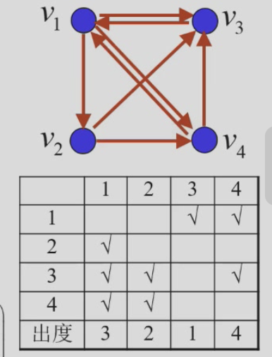
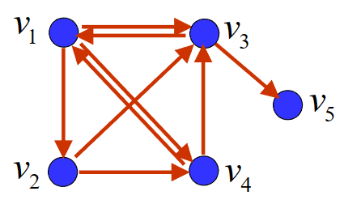
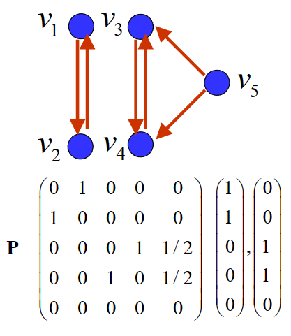
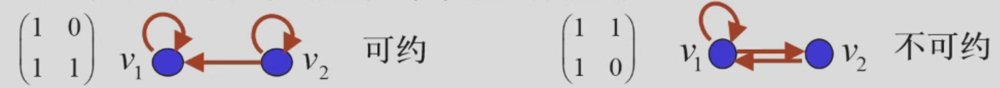

---
hide:
  #- navigation # 显示右
  #- toc #显示左
  - footer
  - feedback
comments: true
---  
# Chapter 01 : 搜索引擎中的 PageRank 模型

## 搜索引擎

### 搜索引擎（search engine）

- 一种用于帮助用户查找因特网信息的技术工具。其工作原理是先以一定的策略在因特网中搜索，发现信息，然后对信息进行理解、提取、组织和处理，最后为用户提供信息和服务。
***
### 互联网信息获取的特点与难点

- 互联网上有海量信息，网页及其内容处于动态变化中，缺乏统一管理
- 具有相同关键词的网页数量众多，如何展示搜索结果，提升用户搜索体验
- 如何给出一种合理、客观、定量、可操作的网页排序规则，使“重要”的网页在搜索结果中靠前显示
***
### PageRank 的网页排序机制

- 互联网中的网页通过超链接（hyperlink）关联
- 网页的重要程度由网页之间的链接关系决定
***
## 网页重要度

### 网页重要度的原则与假设

- 某网页重要，是因为有重要的网页链接到它
	- 对任一网页 A，确定一数值为其重要度，作为网页排序的依据
	- 链接到网页 A 的所有网页对网页 A 的重要度均有贡献，贡献大小与这些网页自身的重要度有关
- 传递性：重要度大的网页链接到网页 A 时对网页 A 的重要度的贡献比重要度小的网页链接到网页 A 时对网页 A 的重要度的贡献大
	- 某网页对其他网页重要度的贡献之和等于它的重要度
- 等效性：网页对它所链接的每个网页的重要度的贡献相等
	- 某网页对其他网页的重要度贡献与它所链接的网页数量呈反比
-  叠加性：链接到网页 A 的网页越多，网页 A 越重要
	- 网页 A 的重要度是所有链接到 A 的网页对网页 A 的重要度的贡献之和
- 无关性：网页链接其他网页的多少，与其本身的重要度无关
***
### 网络链接图

- 互联网中网页之间的链接关系可用图表示，称为网络链接图
	- 顶点：网页 $v_1,v_2,...,v_n$
	- 弧：网页间的链接关系
		- 若网页 $v_i$ 上有链接指向网页 $v_j$，则网络链接图中有一条以 $v_i$ 为起点，$v_j$ 为终点的弧
	- 出度：以某顶点为起点的弧的总数，即该网页链接的网页数量

***
### 网页重要度

- 网页 $v_i$ 的重要度记为 $x_i$，出度记为 $q_i$
	- 网页 $v_i$ 对其它网页重要度贡献之和为 $x_i$（传递性）
	- 网页 $v_i$ 与它链接的 $q_i$ 个网页中的任一个的重要度贡献为 $\frac{x_i}{q_i}$（等效性）
	- 若链接到网页 $v_j$ 的网页有 $v_{j_1},v_{j_2},...,v_{j_k}$，则 $x_j=\frac{x_{j_1}}{q_{j_1}}+\frac{x_{j_2}}{q_{j_2}}+...+\frac{x_{j_k}}{q_{j_k}}$（叠加性、无关性）
- 线性方程组

	$$
	\begin{aligned}
	x_j &= \frac{x_{j_1}}{q_{j_1}}+\frac{x_{j_2}}{q_{j_2}}+...+\frac{x_{j_k}}{q_{j_k}},j = 1,...,n\\
	&= p_{i1}x_1 + p_{i2}x_2 + ... + p_{in}x_n = \sum\limits_{j=1}^np_{ij}x_j
	\end{aligned}
	$$
***
## 随机矩阵

### 随机矩阵

- 各行（列）元素之和均为 1 的非负方阵称为行（列）随机矩阵（row(column) strochastic matrix）
- 各行与各列元素之和均为 1 的非负方阵称为双随机矩阵（doubly strochastic matrix）
***
### 随机矩阵的特征值

- 1 是随机矩阵的特征值

!!! 证明

	- 对行随机矩阵，我们很容易就能取到特征向量为全为1的列向量，此时特征值为1。
	- 对列随机矩阵，因为转置前后特征值相同，所以也是1。

- 任一随机矩阵的模最大特征值为 1

!!! 证明

	- 设 $\lambda$ 是行随机矩阵 $\pmb{P} = (p_{ij})_{n\times n}$ 的特征值，非零向量 $\pmb{x} = (x_1,...,x_n)^T$ 为属于特征值 $\lambda$ 的特征向量。设 $|x_i|=max(|x_j|)>0(1\leq j \leq n)$
	- 由 $\pmb{Px}=\lambda \pmb{x}$，可得 $\lambda x_i = \sum\limits_{j=1}^n p_{ij}x_j$
	- 两边取模，$|\lambda||x_i|=|\lambda x_i|= |\sum\limits_{j=1}^{n} p_{ij}x_j|\leq\sum\limits_{j=1}^{n}|p_{ij}||x_j|\leq|x_i|\sum\limits_{j=1}^n|p_{ij}|=|x_i|$，即 $|\lambda|\leq 1$

***
## 链接矩阵

### 链接矩阵

- 令 $p_{ij} = \begin{cases}\frac{1}{q_j}\space,若有链接自  v_j 链向 v_i\\\space 0\space\space,其他\end{cases}$
	- 记矩阵 $\pmb{P} = (p_{ij})_{n\times n}$ 为（初始）链接矩阵，$\pmb{x} = (x_1,...,x_n)^T$ 为网页重要度向量
	- $\pmb{x}$ 为线性方程组 $\pmb{x}=\pmb{Px}$ 的解
		- $rank(\pmb{I}-\pmb{P})<n$
		- 矩阵 $P$ 有特征值 1
		- 矩阵 $P$ 的每列元素之和为 1，为列随机矩阵

!!! Example 

	=== "Question"
	
		
	
	=== "Answer"
	
		有线性方程组：
		
		$$
		\left\{
		\begin{array}{}
		x_1= \space\space\space\space\space\space\space& & x_3 & +\frac{1}{2}x_4\\
		x_2= \frac{1}{3}x_1& & &\\
		x_3= \frac{1}{3}x_1& +\frac{1}{2}x_2& & +\frac{1}{2}x_4\\
		x_4 = \frac{1}{3}x_1& +\frac{1}{2}x_2
		\end{array}
		\right.
		$$
		
		其中：
		
		$$
		P = \begin{pmatrix}
		0 & 0 & 1 & \frac{1}{2}\\
		\frac{1}{3} & 0 & 0 & 0\\
		\frac{1}{3} & \frac{1}{2} & 0 & \frac{1}{2}\\
		\frac{1}{3} & \frac{1}{2} & 0 & 0
		\end{pmatrix}
		$$
		
		$$
		I - P = \begin{pmatrix}
		1 & 0 & -1 & -\frac{1}{2}\\
		-\frac{1}{3} & 1 & 0 & 0\\
		-\frac{1}{3} & -\frac{1}{2} & 1 & -\frac{1}{2}\\
		-\frac{1}{3} & -\frac{1}{2} & 0 & 1
		\end{pmatrix}
		$$
		
		解得 $x_1 = \frac{12}{31},x_2 = \frac{4}{31},x_3 = \frac{9}{31},x_4 = \frac{6}{31}$

***
### 特殊情况

- 但是，线性方程组 $\pmb{x}=\pmb{P}\pmb{x}$ 还会有特殊情况：

??? Question1

	=== "Question"
	
		- 节点没有出度
		
		
	
	=== "Solution"
	
		- 悬挂网页（dangling link）
			- 若某网页不链接任意其它网页，我们称之为**悬挂网页**。显然，悬挂网页的出度为 0，但它的重要度不为 0。将链接矩阵 $\pmb{P}$ 中对应列的所有元素由 0 修改为 $\frac{1}{n}$ ，得到（修正）链接矩阵 $\pmb{\overline{P}}$  
			- 我们记悬挂网页为第i个网页，记 $\pmb{d}^T=(0,0,⋯,0,1,0,⋯,0)$，其中索引至悬挂网页的值为 1，其余为 0。则有 $\pmb{\overline{P}} = \pmb{P} + \frac{1}{n}\pmb{1}\pmb{d}^T$，其中 $\pmb{1}=(1,1,...,1,...,1)$
		
		对这个例子我们有：
		
		$$
		\pmb{\overline{P}} = \pmb{P} + \frac{1}{5}\begin{pmatrix}
		1\\
		1\\
		1\\
		1\\
		1
		\end{pmatrix}\begin{pmatrix}
		0 & 0 & 0 & 0 & 1
		\end{pmatrix}=\pmb{P} + \begin{pmatrix}
		0 & 0 & 0 & 0 & \frac{1}{5}\\
		0 & 0 & 0 & 0 & \frac{1}{5}\\
		0 & 0 & 0 & 0 & \frac{1}{5}\\
		0 & 0 & 0 & 0 & \frac{1}{5}\\
		0 & 0 & 0 & 0 & \frac{1}{5}\\
		\end{pmatrix}=
		\begin{pmatrix}
		0 & 0 & \frac{1}{2} & \frac{1}{2} & \frac{1}{5}\\
		\frac{1}{3} & 0 & 0 & 0 & \frac{1}{5}\\
		\frac{1}{3} & \frac{1}{2} & 0 & \frac{1}{2} & \frac{1}{5}\\
		\frac{1}{3} & \frac{1}{2} & 0 & 0 & \frac{1}{5}\\
		0 & 0 & \frac{1}{2} & 0 & \frac{1}{5}\\
		\end{pmatrix}
		$$
		

??? Question2

	=== "Question"
	
		- 线性方程组有多个解
		
		
	
	=== "Solution"
	
		- 多解修正
		
			- 若 $\pmb{\overline{P}}$ 有两个属于特征值 1 的线性无关的特征向量，我们就无法得到唯一的网页重要度向量 $\pmb{x}$。于是，我们对 $\pmb{\overline{P}}$ 进行修正，使得 $\pmb{\overline{P}}$ 成为**完全正矩阵**，即 $\pmb{\overline{P}}$ 的所有方阵子式的行列式都大于 0。修正方法如下：
			
			$$
			\pmb{\overline{\overline{P}}} = \alpha\pmb{\overline{P}} + (1-\alpha)\frac{1}{n}\pmb{1}\pmb{1}^T
			$$
			
			- 其中，$\alpha$ 为修正系数，$\alpha = 0.85$（为什么取 0.85 后面会有解释）。$\pmb{\overline{\overline{P}}}$ 是完全正矩阵与列随机矩阵的结合。
			
			!!! note "证明 $\pmb{\overline{\overline{P}}}$ 是列随机矩阵"
			
				$\pmb{1}^T\pmb{\overline{\overline{P}}} = \alpha\pmb{1}^T\pmb{\overline{P}} + (1-\alpha)\frac{1}{n}\pmb{1}^T\pmb{1}\pmb{1}^T = \alpha\pmb{1}^T + (1- \alpha)\pmb{1}^T = \pmb{1}^T$
				
				所以 $\pmb{\overline{\overline{P}}}$ 是列随机矩阵
				
				注意，我们说的是 $\pmb{\overline{\overline{P}}}$ 是列随机矩阵，而我们要求的是 $\pmb{\overline{\overline{P}}}$，所以这里的 $\pmb{1}^T$ 并不是 $\pmb{\overline{\overline{P}}}$ 的特征向量。

!!! note "证明 $\pmb{\overline{\overline{P}}}$ 关于特征值 1 的特征向量有且只有一个"

	- 存在性：$\pmb{\overline{\overline{P}}}$ 是列随机矩阵，所以 1 是 $\pmb{\overline{\overline{P}}}$ 的特征值，所以必存在至少一个属于特征值 1 的特征向量。
	- 唯一性，用反证法：
	
		设 $\pmb{v} = (v_1,v_2,...,v_n)^T$ 和 $\pmb{w} = (w_1,w_2,...,w_n)$ 是 $\pmb{\overline{\overline{P}}}$ 的两个关于特征值 1 的线性无关的特征向量，令 $x_i = -\frac{W}{V} v_i + w_i,i = 1,2,...,n$，其中 $V = \sum\limits_{k=1}^n v_k\not = 0,W = \sum\limits_{k=1}^n w_k$
		
		由于 $\pmb{v}$ 与 $\pmb{k}$ 线性无关，且 $\sum\limits_{j=1}^n\overline{\overline{p_{ij}}}x_j = \sum\limits_{j=1}^n\overline{\overline{p_{ij}}}(-\frac{W}{V} v_j + w_j) = -\frac{W}{V}\sum\limits_{j=1}^n\overline{\overline{p_{ij}}}v_j + \sum\limits_{j=1}^n\overline{\overline{p_{ij}}}w_j = -\frac{W}{V}v_i + w_i = x_i$，那我们就能得到 $\pmb{x}$ 也是 $\pmb{\overline{\overline{P}}}$ 关于特征值 1 的线性无关的特征向量。
		
		我们注意到 $\sum\limits_{i=1}^n x_i = \sum\limits_{i=1}^n(-\frac{W}{V} v_i + w_i） = -W + W = 0$
		
		所以我们尝试证明：如果 $\pmb{x}$ 是 $\pmb{\overline{\overline{P}}}$ 的属于特征值1 的特征向量，那么 $\pmb{x}$ 的分量之和不为零，从而与上面的结论矛盾。这也就证明了属于特征值1的特征向量有且只有一个。
		
		设 $\pmb{x}$ 是 $\pmb{\overline{\overline{P}}}$ 的属于特征值 1 的特征向量，则 $x_i = \sum\limits_{j=1}^n \overline{\overline{p_{ij}}} x_j$
		
		如果 $\sum\limits_{i=1}^n x_i = 0$，则 $\pmb{x}$ 的分量有正有负，则 $|x_i| = |\sum\limits_{j=1}^n \overline{\overline{p_{ij}}} x_j| < \sum\limits_{j=1}^n \overline{\overline{p_{ij}}} |x_j|,i=1,2,...,n$
		
		则有 $\sum\limits_{i=1}^n |x_i| < \sum\limits_{i=1}^n\sum\limits_{j=1}^n \overline{\overline{p_{ij}}} |x_j| = \sum\limits_{j=1}^n|x_j|(\sum\limits_{i=1}^n \overline{\overline{p_{ij}}} ) = \sum\limits_{j=1}^n|x_j|$，矛盾！
		
		所以 $\pmb{\overline{\overline{P}}}$ 关于特征值 1 的特征向量有且只有一个
***
## Perron-Frobenius 定理

### Perron 定理

- 设矩阵 $\pmb{A}$ 为完全正矩阵，则
	- $\pmb{A}$ 的模最大特征值唯一，且为正实数
	- 该特征值代数重数为 1
	- 存在该特征值的一个特征向量，其分量全为正
***
### Perron-Frobenius 定理

- 若矩阵 $\pmb{A}$ 为非负不可约矩阵，则
	- $\pmb{A}$ 的模最大特征值为正实数
	- 该特征值代数重数为 1
	- 存在该特征值的一个特征向量，其分量全为正

!!! 不可约矩阵

	- 不可约矩阵
		- 若干个初等对换矩阵的乘积称为置换矩阵（permutation matrix）
			- 置换矩阵每行和每列都恰有一个元素为 1，其余元素都为 0
		- 若存在置换矩阵 $\pmb{Q}$，使得 $\pmb{Q}^T\pmb{AQ}= \begin{pmatrix}\pmb{X}&0\\\pmb{Y}&\pmb{Z}\end{pmatrix}$，其中 $\pmb{X}$ 和 $\pmb{Z}$ 均为方阵，则称 $\pmb{A}$ 为 可约矩阵，否则 $\pmb{A}$ 为不可约矩阵
	- 不可约矩阵与有向图
		- 若对有向图中任意顶点对 $v_i,v_j$，既存在一条从 $v_i$ 到 $v_j$ 的有向路，也存在一条从 $v_j$ 到 $v_i$ 的有向路，则称有向图是强联通（Strongly Connected）的
		- 给定非负矩阵 $\pmb{A}=(a_{ij})_{n\times n}$，构造有向图 $G(\pmb{A})=(V,A)$，其中 $V=\{v_1,v_2,...,v_n\}$，弧 $(v_i,v_j)\in \pmb{A}$ 当且仅当 $a_{ij}>0$
		- $\pmb{A}$ 是不可约矩阵当且仅当 $G(\pmb{A})$ 是强联通的
	
	
***
### 链接矩阵与重要度向量

- 链接矩阵为完全正、列随机矩阵，模最大特征值为 1，重要度向量唯一且其分量全为正
***
## PageRank 中的矩阵求解

整个互联网有相当多且稀疏的网页，所以我们需要一个好的算法来求解网页重要度向量 $\pmb{x}$。
### 幂法

- 幂法是计算矩阵模最大特征值和对应的特征向量的一种迭代算法

!!! Process

	任取初始向量 $\pmb{x}^{(0)}>0$，且 $\sum\limits_{i=1}^nx_i^{(0)}=1$，我们通过迭代计算 $\pmb{x}^{(k)}=\pmb{\overline{\overline{P}}}\pmb{x}^{(k-1)}$，直到 $\pmb{x}^{(k)}$ 收敛
	
	!!! note
	
		$\pmb{1}^T\pmb{x}^{(k)}=\pmb{1}^T\pmb{\overline{\overline{P}}}\pmb{x}^{(k-1)}=(\pmb{1}^T\pmb{\overline{\overline{P}}})\pmb{x}^{(k-1)}=\pmb{1}^T\pmb{x}^{(k-1)}$
		
		由此迭代可以得到 $\pmb{1}^T\pmb{x}^{(k)} = \pmb{1}^T\pmb{x}^{(k-1)} = 1$
	
	我们展开 $\pmb{x}^{(k)} = \pmb{\overline{\overline{P}}}\pmb{x}^{(k-1)}$：
	
	$$
	\begin{aligned}
	\pmb{x}^{(k)} &= \pmb{\overline{\overline{P}}}\pmb{x}^{(k-1)}\\
	&= \alpha\pmb{\overline{P}}\pmb{x}^{(k-1)} + (1-\alpha)\frac{1}{n}\pmb{1}\pmb{1}^T\pmb{x}^{(k-1)}\\
	&= \alpha\pmb{\overline{P}}\pmb{x}^{(k-1)} + (1-\alpha)\frac{1}{n}\pmb{1}\\
	&= \alpha(\pmb{P}+\frac{1}{n}\pmb{1}\pmb{d}^T)\pmb{x}^{(k-1)} + (1-\alpha)\frac{1}{n}\pmb{1}\\
	&= \alpha\pmb{P}\pmb{x}^{(k-1)} +\alpha\frac{1}{n}\pmb{1}\pmb{d}^T\pmb{x}^{(k-1)} + (1-\alpha)\frac{1}{n}\pmb{1}\\
	\end{aligned}
	$$
	

### 完全正、列随机矩阵幂法的收敛性

记 $V$ 为满足 $\pmb{1}^T\pmb{v}=1$ 的 n 维列向量 $\pmb{v}=\{v_1,v_2,...,v_n\}$ 全体组成的集合。记 $||\pmb{v}||_1=\sum\limits_{i=1}^n|v_i|$
对任意的 $\pmb{v}\in V$，我们取 $\pmb{w} = \pmb{\overline{\overline{P}}}\pmb{v}$，因为 $\pmb{1}^T\pmb{w}=\pmb{1}^T\pmb{\overline{\overline{P}}}\pmb{v}=\pmb{1}^T\pmb{v}=1$，所以 $\pmb{w}\in V$

我们接下来尝试证明 $||\pmb{w}||_1=||\pmb{\overline{\overline{P}}}\pmb{v}||_1\leq c||\pmb{v}||_1$，其中 $c<1$

!!! Proof

	- $\pmb{w}=\pmb{0}$，显然成立
	- $\pmb{w}\not=\pmb{0}$，记 $\pmb{w}=(w_1,w_2,...,w_n)^T,e_i=sgn(w_i)$，则有：
	
	$$
	\begin{aligned}
	||\pmb{w}||_1 &= \sum\limits_{i=1}^n|w_i| = \sum\limits_{i=1}^n e_iw_i = \sum\limits_{i=1}^n(e_i\sum\limits_{j=1}^n\overline{\overline{p_{ij}}}v_j)\\
	&= \sum\limits_{i=1}^n(\sum\limits_{j=1}^ne_i\overline{\overline{p_{ij}}}v_j) = \sum\limits_{j=1}^n(\sum\limits_{i=1}^ne_i\overline{\overline{p_{ij}}}v_j)\\
	&= \sum\limits_{j=1}^n(v_j\sum\limits_{i=1}^ne_i\overline{\overline{p_{ij}}})\\
	&\leq \sum\limits_{j=1}^n(|v_j||\sum\limits_{i=1}^ne_i\overline{\overline{p_{ij}}}|)
	\end{aligned}
	$$
	
	记 $c=\max\limits_{1\leq j\leq n}|\sum\limits_{i=1}^ne_i\overline{\overline{p_{ij}}}|<1$，则有 $||\pmb{w}||_1\leq\sum\limits_{j=1}^n(|v_j||\sum\limits_{i=1}^ne_i\overline{\overline{p_{ij}}}|\leq\sum\limits_{j=1}^n(|v_j|c)=c\sum\limits_{j=1}^n|v_j|=c||\pmb{v}||_1$ 
	所以 $||\pmb{w}||_1\leq c||\pmb{v}||_1$，其中 $c<1$
	
	记 $\pmb{v_0}=\pmb{x}^{(0)}-\pmb{X}\in\pmb{V}$，我们有 $\pmb{1}^T\pmb{v_0}=\pmb{1}^T\pmb{x}^{(0)}-\pmb{1}^T\pmb{X}=1-1=0$，所以 $\pmb{v}_0\in\pmb{V}$
	
	由于 $\overline{\overline{\pmb{P}}}\pmb{X}=\pmb{X}$，$\pmb{x}^{(k)}=\overline{\overline{\pmb{P}}}^k\pmb{x}^{(0)}=\pmb{x}^{(k)}=\overline{\overline{\pmb{P}}}^k(\pmb{X}+\pmb{v}_0)=\pmb{X}+\overline{\overline{\pmb{P}}}^k\pmb{v}_0$
	
	由于 $||\overline{\overline{\pmb{P}}}^k\pmb{v}_0||_1\leq c^k||\pmb{v_0}||_1$，所以 $||\pmb{x}^{(k)}-\pmb{X}||_1\leq c^k||\pmb{v_0}||_1$
	
	所以，$\pmb{x}^{(k)}$ 收敛到 $\pmb{X}$，得证。
***
## 随机浏览

### 随机浏览（Random Surfer）

- 按以下模式浏览互联网的网页
	- 有时从当前网页的链接中随机打开一个网页
	- 有时键入网址新建一个网页
- 从任一网页开始，充分长时间后，访问各网页的概率即为网页重要度

经过统计，随机打开网页的次数与键入网址新建网页的次数之比约为 5:1，这就是 $\alpha=0.85$ 的来源。
***
### 极限概率

记事件 $\{X_m=j\}$ 为时刻 $m$ 访问网页 $v_j$，则 $P\{X_m=i|X_{m−1}=j\}=p_{ij}$

若 $P\{X_m=j\}=x_j$，则 $P\{X_m=i\}=\sum\limits_{j=1}^nP\{X_m=i|X_{m−1}=j\}P\{X_{m−1}=j\}=\sum\limits_{j=1}^np_{ij}x_j$

记 $\pmb{x}^{(m)}=(P\{X_m=1\},P\{X_m=2\},⋯,P\{X_m=n\})^T$，则有 $\pmb{x}^{(m)}=\overline{\overline{\pmb{P}}}\pmb{x}^{(m-1)}$
***
## 随机过程

### 随机过程（Stochastic Process）

- 描述随机现象随时间推移而演化的一类数学模型
- **一族随机变量** $\{X(t),t\in T\}$，其中 $T$ 为参数集，$t$ 是参数。$\{X(t),t\in T\}$ 称为参数为 $t$ 的随机变量
	- $T$ 为整数集的随机过程称为随机序列
***
### Markov 过程

- 在已知目前的状态（现在）的条件下，它未来的演变（将来）不依赖于它以往的演变（过去）
- 在随机序列 $\{X_n,n=0,1,2,⋯\}$ 中（$X_n$ 只能取有限个或可数个数值）
	- $P\{X_{n+1}=i_{n+1}\}$ 只与 $X_n$ 有关，而与 $X_{n-1},X_{n-2},...,X_0$ 无关
	- 对于任意的 $n\leq 0$ 和一列状态 $i_0,i_1,...,i_{n-1},i_n,i_{n+1}$，有$P\{X_{n+1}=i_{n+1}|X_n=i_n,X_{n−1}=i_{n−1},⋯,X_0=i_0\}=P\{X_{n+1}=i_{n+1}|X_n=i_n\}$
