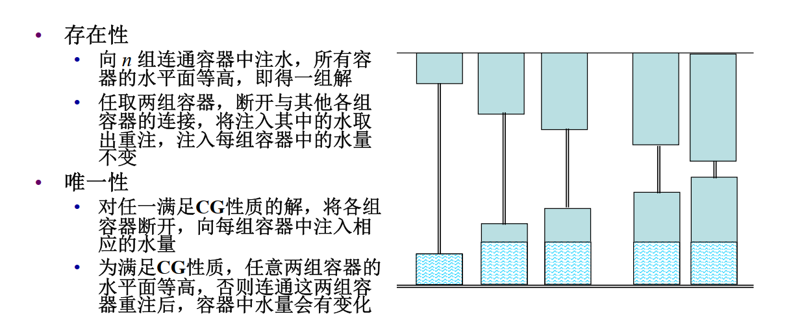
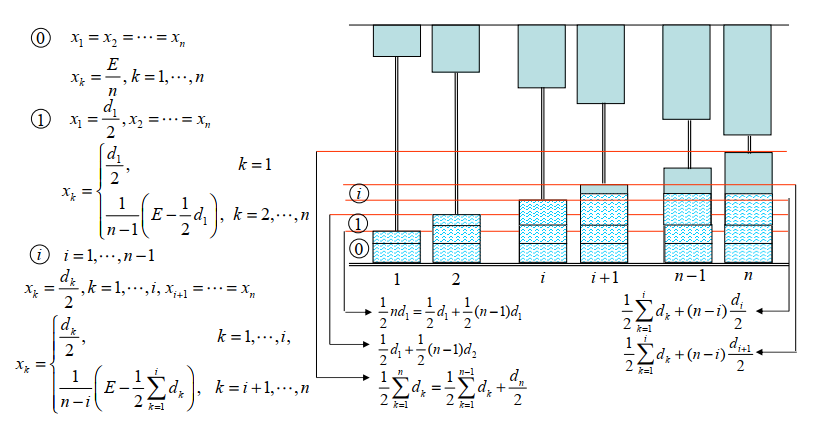
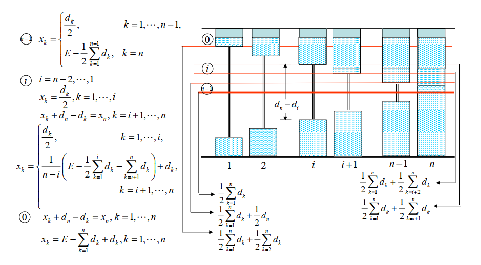

---
hide:
  #- navigation # 显示右
  #- toc #显示左
  - footer
  - feedback
comments: true
--- 

# Chapter 10 : 博弈论模型

## 博弈论的基本概念

> 博弈是多主体，优化是单主体

博弈论研究由一些带有**相互竞争性质**的主体所构成的体系的理论。它能以数字表示人的行为或为人的行为建立模式，研究对抗局势中**最优的对抗策略和稳定局势**，以及如何追求各方的最优策略和决定对策的结果，协助人们在一定规则范围内寻求**最合理的行为方式**
***
### 博弈的要素

- **参与者**（Player）：参与博弈的决策主体
- **策略**（Strategy）：参与者可以采取的行动方案
- **策略组合**（Strategy Profile）：所有参与者选择的策略的集合
- **收益**（Payoff）：参与者在某一策略组合下的收益
    - **费用**（Cost）：参与者在某一策略组合下需付出的代价
***
### 博弈论的假设

参与者是理性的，以最大化他的收益或最小化他的费用作为选择策略的准则
***
### 博弈的分类

**合作博弈（Cooperative Game）**：局中人之间可以结成联盟，协调彼此的策略，并对获得的收益进行再分配

**静态博弈（Static Game）**：所有参与者同时选择策略并行动，且只能行动一次，参与者选择策略时不知道其他参与者的选择。

**完全信息（Complete Information）**：参与者掌握其他参与者的可选策略和收益等信息

**完美信息（Perfect Information）**：在动态博弈中，参与者掌握其他参与者已选择的策略
***
### 简单例子

#### 囚徒困境（Prisoner's Dilemma）

甲、乙两人共同犯罪，警方掌握了一部分犯罪事实，将他们带到警局分别讯问

- 若两人均承认所有罪行，则各被判处 6 个月徒刑
- 若一人认罪，一人不认罪，前者被轻判 1 个月徒刑，后者被重判 9 个月徒刑
- 若两人均不认罪，则以部分罪行各被判处 2 个月徒刑

|          | 乙认罪       | 乙不认罪      |
| -------- | --------- | --------- |
| **甲认罪**  | 甲6个月，乙6个月 | 甲1个月，乙9个月 |
| **甲不认罪** | 甲9个月，乙1个月 | 甲2个月，乙2个月 |
***
## Nash 均衡

Nash 均衡（Nash Equilibrium）

- （完全信息静态）博弈的某个局势，每一个理性的参与者都不会单独偏离它
    - 对每一个参与者，在其他参与者策略不变情况下，单独采取其他策略，收益不会增加
***
### 纯策略与混合策略

**纯策略（Pure Strategy）**：参与者每次行动都选择某个确定的策略

**混合策略（Mixed Strategy）**：参与者可以以一定的概率分布选择若干个不同的策略
***
### Nash 定理

若参与者有限，每位参与者的策略集均有限，收益函数均为实值函数，则博弈必存在混合策略意义下的 Nash 均衡
***
### 最优反应函数

对其他参与者的任一策略组合，参与者的最优反应函数为可使其收益达到最大的策略集合，记为 $B_i(a_{-i})$，即 $B_i(a_{-i})=\{a_i^*|u_i(a_i^*,a_{-i})\geq u_i(a_i,a_{-i}), \forall a_i\in A_i\}$

定义 $\mathscr{B}(a)=(B_1(a_{-1}),B_2(a_{-2}),...,B_n(a_{-n}))$，则充要条件可以写为 $a^*\in\mathscr{B}(a^*)$

- 如果 $a^*$ 只有一个的话，即 $a^*=\mathscr{B}(a^*)$，我们可以由此想到不动点定理
***
#### 不动点定理

- （Brouwer）设 $C\subset\R^n$ 是一个非空有界闭凸集，函数 $f$ 在 $C$ 上连续，则存在 $x^*\in C$，使得 $f(x^*)=x^*$
- （Kakutani）设 $C\subset\R^n$ 是一个非空有界闭凸集，$P_0(C)$ 是 $C$ 中所有非空子集的集合，集值映射 $F:C\rightarrow P_0(C)$ 满足对任意 $x\in C,F(x)$ 是 $C$ 中的非空闭凸集，且 $F$ 在 $C$ 上上半连续，则存在 $x^*\in C$，使得 $f(x^*)=x^*$
***
### Nash 均衡的例子

#### Battle of Sexes

♂️：一起看球赛，收益为3；一起逛街，收益为1；各自行动，收益为0

♀️：一起看球赛，收益为1；一起逛街，收益为3；各自行动，收益为0

|(♂️,♀️)|♂️ 看球赛|♂️ 逛街|
|---|---|---|
|**♀️ 看球赛**|(3,1)|(0,0)|
|**♀️ 逛街**|(0,0)|(1,3)|

可见，双方看球或双方逛街都是均衡状态
***
#### 鸽鹰博弈（Hawk-Dove Game）

|(A,B)|B:鸽子|B:鹰|
|---|---|---|
|**A:鸽子**|(0,0)|(-1,1)|
|**A:鹰**|(1,-1)|(-5,-5)|

可见，一方鹰，另一方鸽子是均衡状态
***
#### 石头剪刀布

- 不存在 Nash 均衡
***
#### 让座

- 公交车上设有宽体单人座，可同时坐下两人但空间较普通双人座狭窄
- 乘车舒适度以单人就坐最佳，与人合坐次之，站立最差
- 两人上车后发现车厢中只余这一个座位，他们各自考虑就坐还是站立
	- 若每人均为自身考虑，自身舒适度愈大愈好。试求其 Nash 均衡
	- 若每人均为对方考虑，对方舒适度愈大愈好，且当对方站立时，宁愿陪同站立而不独坐。试求其 Nash 均衡

均为自身考虑：

|     | 坐     | 站     |
| --- | ----- | ----- |
| 坐   | (2,2) | (3,1) |
| 站   | (1,3) | (1,1) |
***
均为对方考虑：

|     | 坐     | 站     |
| --- | ----- | ----- |
| 坐   | (3,3) | (1,4) |
| 站   | (4,1) | (2,2) |
***
#### Braess 悖论

- 一路网中从 $s$ 到 $t$ 的车流总量为 1。车辆通过路网中每段道路的时间为通过该道路的车流量的非减函数
- 道路 $su$ 和 $vt$ 的通行时间函数为 $c_1(x)=x$，道路 $sv$ 和 $ut$ 的通行时间函数为 $c_2(x)=1$
- Nash 均衡：一半车辆选择路 $sut$，一半车辆选择路 $svt$，每辆车的行驶时间为 $c_1(\frac{1}{2})+c_2(\frac{1}{2})=\frac{3}{2}$，所有车辆行驶总时间为 $\frac{3}{2}$
	- 如果有一辆车由选择路 $sut$ 转为选择路 $svt$，选择路 $svt$ 的车辆数为 $\frac{1}{2}+\epsilon$，每辆车行驶总时间为 $c_1(\frac{1}{2}+\epsilon)+c_2(\frac{1}{2}+\epsilon)=\frac{3}{2}+\epsilon$

- 新建一条从 $u$ 到 $v$ 的道路，通行时间为 0
- Nash 均衡：一半车辆选择路 $sut$，一半车辆选择路 $svt$ 并不是 Nash 均衡，而是所有机动车选择 $suvt$ 路，每辆车的行驶时间为 $2c_1(1)=2$，所有车辆行驶的总时间为 $2$
	- 如果有一辆车由选择路 $sut$ 转为选择路 $suvt$，选择路 $su$ 的车辆数为 $\frac{1}{2}$，选择路 $vt$ 的车辆数为 $\frac{1}{2}+\epsilon$，每辆车行驶总时间为 $c_1(\frac{1}{2})+c_1(\frac{1}{2}+\epsilon)=\frac{3}{2}+\epsilon$
	- 如果有一辆车由选择路 $suvt$ 转为选择路 $svt$，选择路 $sv$ 的车辆数为 $\epsilon$，选择路 $vt$ 的车辆数为 $1$，每辆车行驶总时间为 $c_2(\epsilon)+c_1(1)=2$

> 这体现出了低效的均衡

- 若社会费用为所有车辆行驶的总时间，对任意道路通行时间函数为线性函数的路网，任一 Nash 均衡的社会费用不超过最优社会费用的 $\frac{4}{3}$ 倍
***
#### 网络设计博弈

- 现有一由若干节点和线路组成的通讯网络，每个使用者可借此网络建立两点之间的通讯联系，为此需向网络所有者购买线路使用权
- 每条线路价格不同。若多个使用者共同使用某线路，费用由这些使用者分摊

> 这也是一个低效的均衡

- $k$ 个使用者，起点分别为 $s_i,i=1,...,k$，终点均为 $t$
- 从所有使用者整体利益来看，使用者 $i$ 选择 $s_i-v-t$ 最优，总费用是 $1+\epsilon$
- 使用者 $i$ 选择 $s_i-t$ 是唯一的一个 Nash 均衡，总费用为 $\sum\limits_{i=1}^k\frac{1}{i}=O(\ln k)$
***
## 合作博弈

### 讨价还价

??? question "问题描述"

	两人协商分配一笔总额为 1 万元的资金，约定如果达成协议，双方可以按协议取走各自应得的部分；若未达成协议，则两人分文不得，资金收归他用。

建模如下：

- 用 $(x,y)$ 表示甲、乙讨价还价后获得的资产。讨价还价后两人资产所有可能组成的组合记为 $S$，谈判破裂后两人可得的资产为 $d_0=(x_0,y_0)\in S$。一个讨价还价问题可用 $<S,d_0>$ 来表示
- 讨价还价问题的解为一个函数 $\varphi$，对每个讨价还价问题 $<S,d_0>$ ，有一个唯一的 $d^*=(x^*,y^*)\in S$ 与之对应
- Nash 应用公理化思想，首次给出了讨价还价问题的一种解
	- 至少存在一 $(x,y)\in S$，使得 $x>x_0$ 且 $y>y_0$
	- $S$ 为有界闭凸集

!!! note "讨价还价公理"

	讨价还价问题 $<S,d_0>$ 的解 $d^*=(x^*,y^*)$ 满足一下性质：
	
	- Pareto 有效性：若 $d'=(x',y')$ 满足 $x'\geq x^*,y'\geq y^*$，且 $d'\not=d^*$，则 $d'\not\in S$
	- 对称性：若 $x_0=y_0$ 且集合 $S$ 是对称的，即若 $(x,y)\in S$，必有 $(y,x)\in S$，则 $x^*=y^*$
	- 仿射不变性：记 $\tilde{S}=\{(\alpha_1x+\beta_1,\alpha_2y+\beta_2)|(x,y)\in S\},\tilde{d_0}=(\alpha_1x_0+\beta_1,\alpha_2y_0+\beta_2)$，其中 $\alpha_i>0,\beta_i,i=1,2$ 为实数，则讨价还价问题 $<\tilde{S},\tilde{d_0}$ 的解为 $d^*=(\alpha_1x+\beta_1,\alpha_2y+\beta_2)$
	- 无关选择独立性：设 $<S,d_0>,<S',d_0>$ 为两讨价还价问题且 $S'\subseteq S$，若 $<S,d_0>$ 的解 $d^*\in S'$，则 $<S',d_0>$ 的解也是 $d^*$
	
	讨价还价问题满足以上四条公理的解是唯一的，即为非线性规划（NLP）的最优解
	
	!!! note "证明最优解存在唯一性"
	
		- 存在性：由 $S\cap\{(x,y)|x\geq x_0\}$ 为有界闭集，二元连续函数 $(x-x_0)(y-y_0)$ 的最大值存在
		
		- 唯一性：
			- 若存在两个最优解 $(x_1,y_1),(x_2,y_2)$，则 $(x_1-x_0)(y_1-y_0)=(x_2-x_0)(y_2-y_0)\geq(\overline{x}-x_0)(\overline{y}-y_0)>0$，那么有 $x_1\not=x_0\Rightarrow x_1>x_0\Rightarrow x_1\not=x_2$
			- 不妨设 $x_1<x_2$，则 $y_1>y_2$。由 $S$ 的凸性 $(\frac{x_1+x_2}{2},\frac{y_1+y_2}{2})\in S$，而 $(\frac{x_1+x_2}{2}-x_0)(\frac{y_1+y_2}{2}-y_0)=(x_1-x_0)(y_1-y_0)+\frac{1}{4}(y_2-y_1)(x_1-x_2)>(x_1-x_0)(y_1-y_0)$ 矛盾
		
		
	
	!!! note "最优解的性质"
	
		
	
	
	
	
***
### 破产清偿

#### 两人 - CG问题 | Contested Garment

两人财产争议（CG问题）：

- 甲方声称拥有某物品全部产权，乙方声称拥有该物品一半产权
    - 双方对该物品的一半产权属于甲方均无异议，对另一半产权双方均认为属于自己
- 双方各获得争议部分产权的一半，无异议部分归属甲方
- 甲方获得该物品产权的四分之三，乙方获得四分之一

!!! note "推广"

	
	
	右侧引入容器，两个容器中水平面等高，细管内忽略不计。可以以此列出各个情况。
***
#### n 人 - 破产清偿

- 设债权人 $i$ 的债务额为 $d_i,i=1,...,n$，剩余资产为 $E,E<\sum\limits_{i=1}^nd_i$。记 $\mathbf{d}=(d_1,...,d_n)$ 。一个破产清偿问题可用 $<E,\mathbf{d}>$ 来表示
- 破产清偿问题的解为一个函数 $\varphi$，对每个讨价还价问题 $<E,\mathbf{d}>$，有一个唯一的 $\mathbf{x}=(x_1,...,x_n)$ 与之对应，$x_i$ 表示债权人 $i$ 获得的还款额，$i=1,...,n$
- 破产清偿问题满足 CG 性质的解存在且唯一
	- CG：$f(x_i+x_j,d_i,d_j)=(x_i,x_j),i,j=1,...,n,i\not=j$

**CG性质**：将任意两位债权人所得的还款额之和按CG问题的解重新分配，每位债权人所得的还款额保持不变

**CG问题的解**：两组连通容器中水平面等高

!!! note "存在性唯一性证明" 

	!!! note "存在性" 
	
		- 向 n 组连通容器中注水，所有容器的水平面等高，即得一组解 
		- 任取两组容器，断开与其他各组容器的连接，将注入其中的水取出重注，注入每组容器中的水量不变
	
	!!! note "唯一性" 
	  
		- 对任一满足CG性质的解，将各组容器断开，向每组容器中注入相应的水量  
		- 为满足CG性质，任意两组容器的水平面等高，否则连通这两组容器重注后，容器中水量会有变化  
	
	

!!! note "情况枚举"

	
	
	
***
## 稳定婚姻问题

- $n$ 名男士 $m_1,m_2,...,m_n$ 和 $n$ 名女士 $w_1,w_2,...,w_n$，每位男（女）士有一偏好顺序可对所有女（男）士按其满意度进行排序
- $n$ 个配对 $(m_{i_1},w_{j_1}),(m_{j_2},w_{j_2}),...,(m_{i_n},w_{j_n})$ 组成一组婚姻 $\mathscr{M}$，其中 $i_1,i_2,...,i_n$ 和 $j_1,j_2,...,j_n$ 是 $1,2,...,n$ 的两个排列
- 若一组婚姻不存在不稳定组合，则称为稳定的
	- 一婚姻 $\mathscr{M}$ 称为不稳定的（Unstable）的，若存在不稳定组合 $<m_i,w_l>,(m_i,w_j),(m_k,w_l)\in\mathscr{M}$。但 $w_j\prec_{m_i}w_j,m_k\prec_{w_l}m_i$
- 给定所有男士和女士的偏好顺序，是否存在及如何求出一组稳定婚姻

- 每位男士都选择他最钟爱的女士
- 如果有女士被两位或者以上的男士选择，则这几 位男士中除了她最喜欢的之外，对其他男士都表 示拒绝
- 被拒绝的那些男士转而考虑他（们）的除被拒绝 之外的最满意女士。如果存在冲突（包括和之前 选择某女士的男士发生冲突），则再由相应的女 士决定拒绝哪些男士
- 以上过程持续进行，直至不再出现冲突为止

- 欺骗：若使用“男士选择，女士决定”，女方可以通过提供虚假偏好获得更好的一组稳定婚姻

