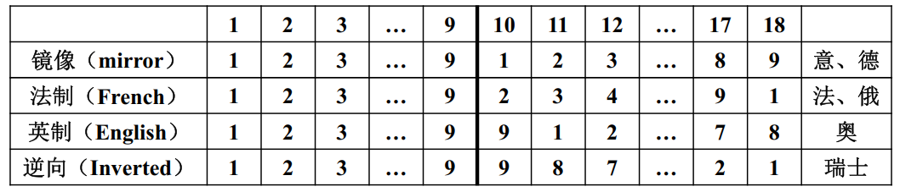
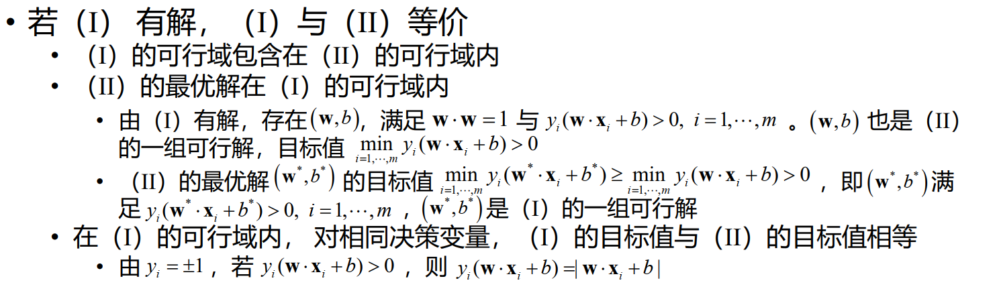
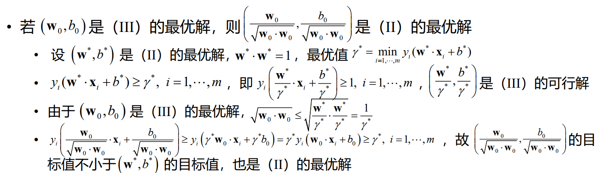

---
hide:
  #- navigation # 显示右
  #- toc #显示左
  - footer
  - feedback
comments: true
---  
# Chapter 02 : 数学规划
## 运筹学

运筹学的主要分支：

- 数学规划（Mathematical Programming）
    - 线性规划（Linear Programming）
    - 非线性规划（Nonlinear Programming）
    - 整数规划（Integer Programming）
    - 多目标规划（Multiobjective Programming）
- 组合优化（Combinatorial Optimization）
- 随机运筹
    - 排队论（Queuing Theory）
    - 库存论（Inventory theory）
    - 可靠性理论（Reliability Theory）
- 博弈论（Game Theory）与决策理论（Decision Theory）
***
## 数学规划

- 若干个变量在满足一些等式或不等式限制条件下，使目标函数取得最大值或最小值
- 研究问题的数学性质，构造求解问题的方法，实现求解问题的算法，以及将算法应用于实际问题

!!! 数学规划分类

	=== "按函数性质"
	
		- 线性规划（linear programming）
		    - 目标函数为线性函数，约束条件为线性等式或不等式
		- 非线性规划（nonlinear programming）
		    - 目标函数为非线性函数，或至少有一个约束条件为非线性等式或不等式
		        - 二次规划（Quadratic Programming, QP）：目标函数为二次函数，约束条件为线性等式或不等式
		        - 带二次约束的二次规划（Quadratically Constrained Quadratic Program， QCQP）：目标函数为二次函数，约束条件为线性或二次等式或不等式
		        - 线性分式规划（linear fractional programming）：目标函数为两个线性函数的商，约束条件为线性等式或不等式
	
	=== "按变量性质"
	
		整数规划（integer programming）：至少有一个决策变量限定取整数值 
		
		- 整数决策变量意义 
		- 用于表示只能取离散值的对象的数量
		- 用于表示约束条件之间的逻辑关系或复杂的函数形式
		- 用于表示非数值的优化或可行性问题
		- 特殊整数规划 
		- 部分决策变量取整数值的数学规划特称为混合整数规划（Mixed Integer Programming, MIP） 
		- 0-1规划：决策变量仅取值0或1的数学规划
	
	=== "按约束条件"
	
		- 无约束优化
		- 约束优化
***
### 数学规划建模的基本要求

- 数学规划模型是问题要求和限制的真实反映
    - 数学规划模型的最优解（可行解）与问题最优解（可行解）是否一致或对应
    - 是否遗漏问题的隐含约束、决策变量的必然要求、多组决策变量间的联系等约束条件
- 数学规划模型应符合数学规划的内容规范和形式要求
    - 要素完整、变量指标运用准确。逻辑关系、集合运算等一般不在数学规划中出现
- 问题可能存在多个数学规划描述，需根据实际情况进行选择和不断完善
    - 复杂目标函数和约束条件的简化， 0-1变量的灵活运用
    - 可行域约简、数学规划的重构、分解与松弛
***
### 数学规划建模的适用范围

- 具有简单最优算法或可转化为已知多项式时间可解问题，不需运用数学规划求解
- 最优解不具必要性，或求解时间要求高于精度要求等问题，不宜盲目运用数学规划求解
- 建立数学规划模型困难，因实例规模或问题结构等原因使求解不具现实可能性的问题，不能直接运用数学规划求解
***
## 食谱问题

也就是说，我们要找到在约束条件下的 $\vec{x}$，使得到 $\min\sum\limits_{i=1}^nc_ix_i$。

***
## 运输问题

这是一个网络流问题。
详见 [洛谷](https://www.luogu.com.cn/problem/P4015)

***
## 数独

- $\sum\limits_{k=1}^9kx_{ijk}$ 的值为在这个格子里填的数字。

***
## 下料问题

??? Question "问题背景"

	现有 $W$ 米长的钢管若干。生产某产品需长为 $w_i$ 米的短管 $b_i$ 根，$i=1,2,⋯,k$。如何截取能使材料最省？

我们构造数学规划模型：

决策变量：$x_{ji}$ 表示第 $j$ 根钢管截取第 $i$ 种短管的数量，$i=1,2,⋯,k$，$j=1,2,⋯$

约束条件：

1. 每根钢管截取的短管总长度不超过钢管长度 $W$，即 $\sum\limits_{i=1}^kw_ix_{ji}\leq W,j=1,2,⋯$
2. 每种短管截取的数量不低于需求量，即 $\sum\limits_{j=1}^nx_{ji}\geq b_i,i=1,2,⋯,k$

我们的目标是使得截取的钢管最少，即 $\min n$。但这个 $n$ 是出现在求和号上的，在线代的数学规划中我们往往不会直接去求解这个 $n$，而是将其转化。

我们构造一个 0-1 变量 $y_j$，表示第 $j$ 根钢管是否被截取，即 $y_j=1$ 表示第 $j$ 根钢管被截取，$y_j=0$ 表示第 $j$ 根钢管未被截取，$j=1,2,⋯$。

所以我们的目标函数可以写成 $\min\sum\limits_{j=1}^n y_j$。

但现在有一个问题：$y_j$ 与 $x_{ji}$ 之间的关系是什么呢？

$\exists i,x_{ji}>0\rightarrow y_j=1\Rightarrow\sum\limits_{i=1}^k x_{ji}>0\rightarrow y_j=1$

约束条件 1 可以写成 $\sum\limits_{i=1}^k w_ix_{ji}\leq Wy_j,j=1,2,⋯$。

所以我们有：

$$
\min\sum\limits_{j=1}^ny_j
$$

$$
s.t.\sum\limits_{i=1}^k w_ix_{ji}\leq Wy_j
$$

$$
\sum\limits_{j=1}^n x_{ji}\geq b_i
$$

$$
x_{ji}\geq 0,y_j\in\{0,1\}
$$

当 $y_j=1\rightarrow\exists i,x_{ji}>0$。给定目标下，最优解自动满足。
***
### 另一种决策变量

同样，这个解法可以用于解决装箱问题。
***
### 装箱问题

两个问题实际上是同一个问题，只是描述的方式不同。

装箱问题指的是给定一系列大小已知的物品和若干个容量相同的箱子，如何将物品放入箱子中，使所用箱子数尽可能少。

***
## 选址问题

??? Question "选址问题"

	=== "问题背景"
	
		平面上有 $n$ 个点，求一个面积最小的圆，使得这 $n$ 个点都在圆内。
	
	=== "数学模型"
	
		记第 $j$ 个点的坐标为 $(x_j,y_j)$，$j=1,2,⋯,n$。我们给出一个带二次约束的二次规划模型：
		
		- **决策变量**：圆心坐标 $(x_0,y_0)$，圆半径 $r$
		- **目标函数**：$\min r^2$
		- **约束条件**：$(x_j−x_0)^2+(y_j−y_0)^2≤r^2,j=1,2,⋯,n$
		
		约束为二次时，比较难写，我们可以将其转化成更简单的形式：
		
		- **决策变量**改为 $λ=r^2−(x_0^2+y_0^2)$
		- **目标函数**改为 $\min\lambda+(x_0^2+y_0^2)$
		- **约束条件**改为 $\lambda+2x_0x_j+2y_0y_j\geq x_j^2+y_j^2,j=1,2,⋯,n$
***
## 时间分配问题

??? Question "时间分配问题"

	=== "问题背景"
	
		有 $T$ 天时间可用于安排复习 $n$ 门课程，每天只能复习一门课程，每门课程至少复习一天。用 $t$ 天时间复习第 $j$ 门课程可使该门课程提高 $p_{jt}$ 分。如何制定复习计划可使所有课程提高的总分尽可能大？
	
	=== "数学模型"
	
		**决策变量**：$x_{jt}$ 表示第 $j$ 门课程是否复习 $t$ 天，$j=1,2,⋯,n$，$t=1,2,⋯,T$
		
		$$
		x_{jt}=\begin{cases}
		1,第 j 门课程复习 t 天\\
		0,其他
		\end{cases}
		$$
		
		**目标函数**：$\max\sum\limits_{j=1}^n\sum\limits_{t=1}^T p_{jt}x_{jt}$
		**约束条件**：$\sum\limits_{t=1}^T x_{jt}=1$
	
	=== "动态规划"
	
		设 $dp[j][t]$ 为用 $t$ 天时间复习 $j$ 门功课提高的最大总分
		
		初始 $dp[1][i]=P[1][i](0\leq i \leq t),P[j][0]=0(1\leq j\leq n)$
		
		$dp[j][t]=max\{P[j][0]+dp[j-1][t-s]\},0\leq s \leq t$
		
		最终答案为 $dp[n][t]$

## 赛程编制

- Symmetry and separation(对称性和分离性)
- Breaks(出现连续的客场或主场比赛--这是我们不愿看到的)
- The carry-over effect
***
### 图的因子分解

图 G 的因子分解，指将 G 分解为若干边不重的因子之并——因子指至少包含G的一条边的生成子图。

一个图 G 的 n 因子，是指图 G 的 n 度正则因子——正则因子指所有顶点的度数都是 n 的因子。

一个 K−8 完全图的 1 - 因子分解如下（不同颜色的边表示不同的因子）：

根据因子分解，我们可以给出赛程编制的一种方法：

同时，我们也可以根据因子分解，给出主客场的安排（尽量不安排连续的客场或主场比赛），例如第一轮和第二轮中：

根据这条路的开头和结尾，我们给出了主客场的安排：

但我们的第八支队伍还没有安排，但无论怎么安排，都会出现 breaks：

这时排出来 6 种 break，而这已经是最少的 break 了。
***
### breaks 数

对 n（偶数）支队伍的赛程，用形如 HAH…HA，长度为 n−1（奇数）的字符串表示每支队伍的主客场安排，称为**模式**（pattern）

- 任何两支队伍的模式互不相同，因为如果存在，这两支队伍相遇时不可能出现两个主场或者两个客场

!!! note "单循环赛程"

	=== "Lemma"
	 
		  $n$支队伍的单循环赛程，全程所有队伍总break数至少为 $n-2$
		  
	=== "Proof"
	
		因为任意两支队伍的模式是互不相同，而只有 HAHA…HAH 和 AHAH…AHA 两种模式没有break，其它模式的 break 数至少为 1，所以总 break 数至少为 $n-2$

!!! note "镜像双循环赛程"

	=== "Lemma"
	 
		  $n$支队伍的镜像双循环赛程，全程所有队伍总break数至少为 $3n-6$
		  
	=== "Proof"
	
		- 若半程没有break，则全程也没有break，这样的队伍至多有两支（HAHAH-AHAHA，AHAHA-HAHAH）
		- 若半程有且仅有一个break，由于模式字符串长度为奇数，在前后半程之间有一个 break （H **A A** H **A - A** **H H** A H），break数为 3
		- 若半程有至少两个 break，全程 break 数至少为 4
		
		所以总break数至少为 $3(n-2)$

!!! note " n（偶数）支队的镜像赛程中的 double-round break"

	=== "Lemma"
	 
		  $n$(偶数）支队的镜像赛程中的 double-round break，全程所有队伍总 break 数至少为 $2n-4$
		  
	=== "Proof"
	
		此时赛程分成多个阶段，我们只考虑每个阶段中的 double-round break。
		
		因为队伍为偶数支，所以每支队伍的模式字符串长度为奇数。
		
		- 若半程没有break，则全程也没有break，这样的队伍至多有两支（HAHAH-AHAHA，AHAHA-HAHAH）
		- 若半程至少有1个break，全程至少有2个 double-round break（H A | A H |**A - A** | **H H** | A H），根据奇数长度的模式字符串，我们可以得到：
			- 前后半程之间若有 break，必为 double-round
			- 若前半程的 break 不为 double-round，后半程的 break 必为 double-round
	
		所以总 double-round break 数至少为 $2(n-2)$

!!! note "其他方案"

	

***
### Example : 世界杯南美赛区预选赛赛程编制（双循环镜像赛程）

有 10 支队伍，每阶段两场比赛

**决策变量**：$x_{ijk}=\begin{cases}1,第 k 轮第 i 支队伍在主场面对第 j 支队伍\\0,其他\end{cases}$

**约束条件（部分）**：

- 每轮各队恰有一场比赛：$\sum\limits_{i=1}^{10}(x_{ijk}+x_{jik})=1，j=1,2,⋯,10，k=1,2,⋯,18$
- 任意两队在前后半程各交手一次：$\sum\limits_{k=1}^9(x_{ijk}+x_{jik})=1,\sum\limits_{k=9}^{18}(x_{ijk}+x_{jik})=1，i,j=1,2,⋯,10，i\not=j$
- 任意两队之间的两场比赛中每队均有一个主场：$\sum\limits_{k=1}^{18}x_{ijk}=1，i,j=1,2,⋯,10，i\not=j$
- 任一队不连续与种子队（用 Is 表示）对阵：$\sum\limits_{j\in Is}(x_{ijk}+x_{jik}+x_{i,j,k+1}+x_{j,i,k+1})≤1, i\in I∖Is,k=1,⋯,18$
***
#### 均衡各阶段主场次数

每支队伍各阶段先主后客（先客后主）的次数尽可能均衡：

定义辅助变量 $y_{il}=\begin{cases}1,第l阶段第i支队伍先主后客\\0,第l阶段第i支队伍先客后主\end{cases}$

$x_{ijk}$ 与 $y_{il}$ 之间的关系：$y_{il}=1\Leftrightarrow \sum\limits_{j=1}^{10}x_{i,j,2l−1}=1且\sum\limits_{j=1}^{10}x_{j,i,2l}=1$

改写一下就是：

$$
\begin{cases}
\sum\limits_{j=1}^{10}(x_{i,j,2l−1}+x_{j,i,2l})\leq 1+y_{il}\\
y_{il}\leq\sum\limits_{j=1}^{10}x_{i,j,2l−1}\\
y_{il}\leq\sum\limits_{j=1}^{10}x_{j,i,2l}
\end{cases}
$$

每支队伍先主后客的总次数尽可能均衡时，$4\leq\sum\limits_{l=1}^9y_{il}\leq 5，i=1,2,⋯,10$
***
#### 各阶段连续客场的次数尽可能少

在法制双循环赛制中 $x_{i,j,1}=x_{j,i,18}, x_{i,j,k}=x_{j,i,k+8}, k=2,3,⋯,9，i,j=1,2,⋯,10，i\not=j$

定义辅助变量 $w_{il}=\begin{cases}1,第l阶段第i支队伍两场比赛均为客场\\0,其他\end{cases}，i=1,2,⋯,10，l=1,2,⋯,9$

$x_{i,j,k}$ 与 $w_{il}$ 之间的关系：$w_{il}=1\Leftrightarrow\sum\limits_{j=1}^{10}x_{j,i,2l−1}=1且\sum\limits_{j=1}^{10}x_{j,i,2l}=1$

改写一下就是：

$$
\begin{cases}
\sum\limits_{j=1}^{10}(x_{j,i,2l−1}+x_{j,i,2l})\leq 1+w_{il}\\
w_{il}\leq\sum\limits_{j=1}^{10}x_{j,i,2l−1}\\
w_{il}\leq\sum\limits_{j=1}^{10}x_{j,i,2l}
\end{cases}
$$

**目标函数** 为：$\min\sum\limits_{i=1}^{10}\sum\limits_{l=1}^9w_{il}$

最后的结果为：

***
## 支持向量机

### 问题描述

我们拟将一数据集 S 分为 C1,C2 两类。每个数据有 n 个特征，用 n 维实向量表示，我们有训练集 $S'=\{\pmb{x}_1,⋯,\pmb{x}_m\}$，其中 $\pmb{x}_i\in R^n$，记 $y_i=\begin{cases}1,\pmb{x}_i\in C_1\\−1,\pmb{x}_i\in C_2\end{cases}$。

假设训练集可线性分离，即存在超平面 $\pmb{w}⋅\pmb{x}+b=0$，使得对于所有 $i$，有 $y_i(\pmb{w}⋅\pmb{x}_i+b)>0$。

!!! Definition "超平面"

	  设 $w$ 为 $n$ 维实向量，$b$ 为实数，$\pmb{w}⋅\pmb{x}+b=0$ 称为 $R^n$ 中的超平面。
	  
	  - $R^n$ 中的点 $x$ 到超平面 $\pmb{w}⋅\pmb{x}+b=0$ 的距离为 $|\pmb{w}⋅\pmb{x}+b|‖\pmb{w}‖$。
	  - 若 $\pmb{w}⋅\pmb{w}=1$，则距离为 $|\pmb{w}⋅\pmb{x}+b|$。

我们现在要做的是找到一个超平面，使得它到两类数据的距离最大（判别效果最好）。

### 数学规划

根据上面的描述，我们可以得到如下的数学规划问题：

$$
\begin{gather}
\max\min\limits_{i=1,⋯,m}|\pmb{w}⋅\pmb{x}_i+b|\\
s.t.y_i(\pmb{w}⋅\pmb{x}_i+b)\geq 0,i=1,⋯,m\\
‖w‖=1
\end{gather}
$$

本目标含绝对值与极小值，约束含二次函数，极难计算。我们将绝对值去掉，得到如下的数学规划问题：

$$
\begin{gather}
\max\min\limits_{i=1,⋯,m}y_i(\pmb{w}⋅\pmb{x}_i+b)\\
s.t.‖w‖=1
\end{gather}
$$

!!! Proof "证明可以转换"

	

但此时目标含极小值，约束含二次函数，依旧难以计算。我们将极小值去掉，得到如下的数学规划问题：

$$
\begin{gather}
\min||\pmb{w}||\\
s.t. y_i(\pmb{w}·\pmb{x}_i+b)\geq 1
\end{gather}
$$

!!! Proof "证明可以转换"

	