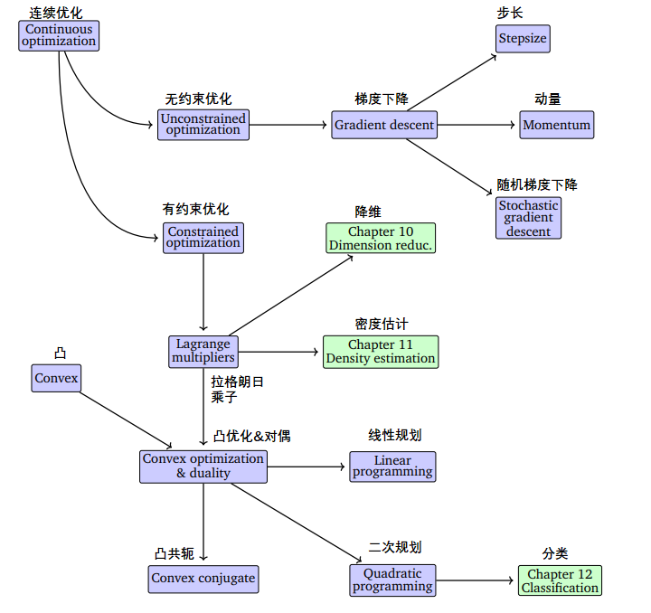

---
hide:
  #- navigation # 显示右
  #- toc #显示左
  - footer
  - feedback
comments: true
--- 
# Chapter 03 : 组合优化

## 组合优化的基本概念

组合优化是应用于离散对象的，从有限多个可行解中找出使某个目标函数达到最优的解的优化问题

- 组合优化是离散数学（Discrete Mathematics）与最优化的交叉学科分支
***
## 组合优化与连续优化

!!! 连续优化

	
	
	连续优化是应用于连续对象的，从无限多个可行解中找出使某个目标函数达到最优的解的优化问题。

相对决策变量为连续变量的连续优化（Continuous Optimization）问题，组合优化问题的最优解缺少好的性质，求解缺少好的工具。
***
## 组合优化例子

### 背包问题

#### 连续背包问题

现有 $n$ 件物品，物品 $j$ 的价值为 $p_j$，大小为 $w_j$。 物品质地均匀，可任意切割。

***
#### 离散背包问题

现有 $n$ 件物品，物品 $j$ 的价值为 $p_j$，大小为 $w_j$。 物品不可切割。
***
