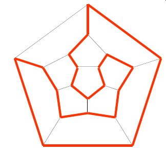
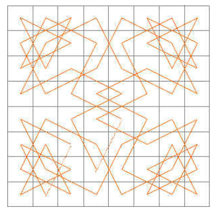
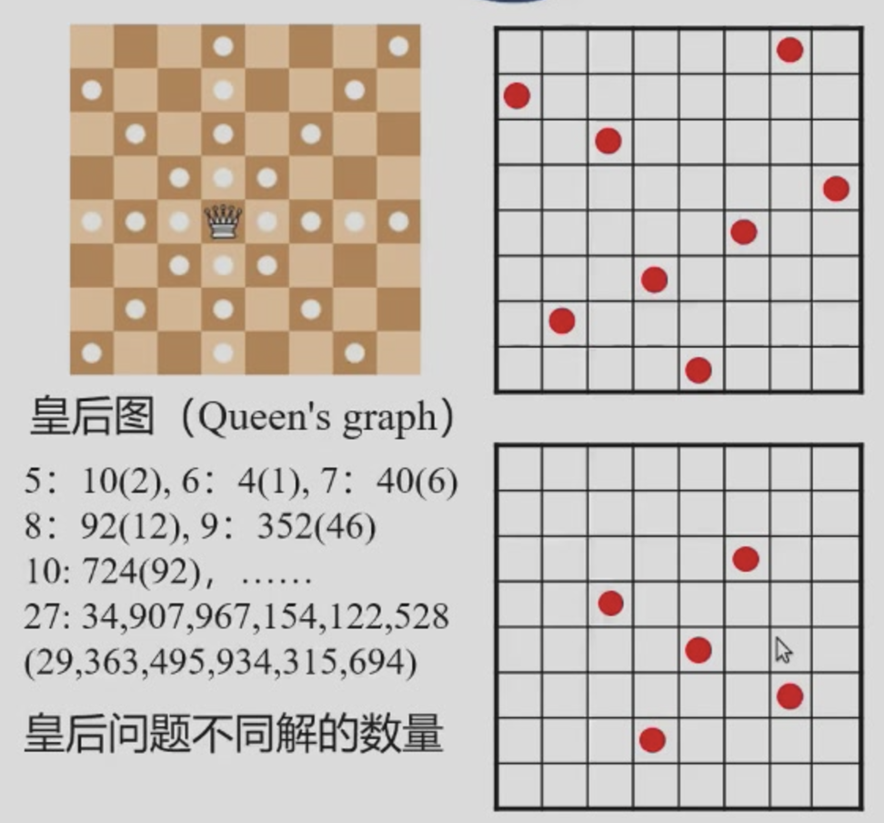
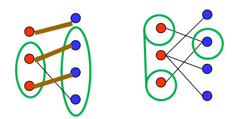
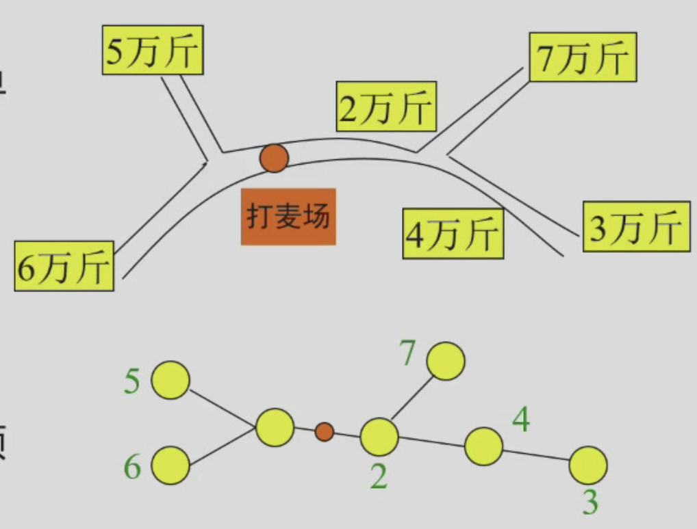
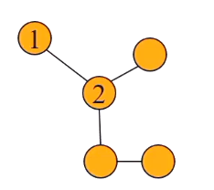
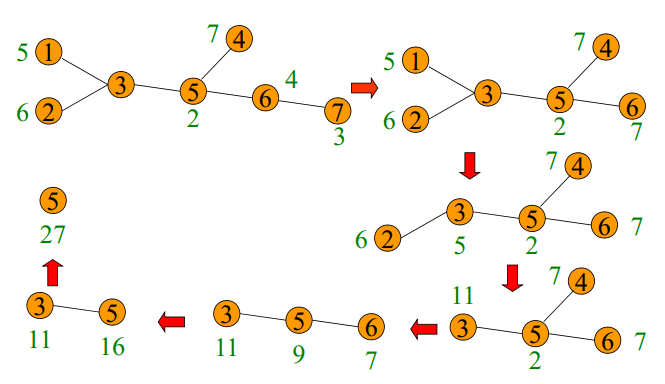
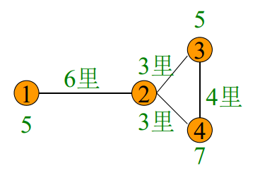
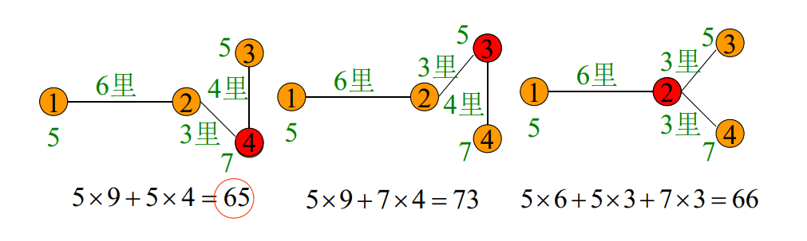

---
hide:
  #- navigation # 显示右
  #- toc #显示左
  - footer
  - feedback
comments: true
--- 
# Chapter 04 :  图论模型

## 图

- **图**是一个有序二元组 $G=(V,E)$，其中 $V$ 是顶点（Vertex）集合，$E$ 是边（Edge）的集合。$E$ 中每条边 $e$ 与 $V$ 中两个顶点关联（Incident）。
	- 若与边关联的两个顶点有序，则称图为有向图（Digraph），否则称为无向图
	- 图可以用以点表示顶点，以曲线段表示边的图形来表示，但图与图形表示（Diagrammatic Representation）中点和曲线段在图形中的相对位置无关
	
	
	
	
- **度**：无向图 $G$ 中与顶点 $v$ 关联的边的数目称为 $v$ 的度，记为 $d(v)$ 或 $deg_G(v)$
	- 图的所有顶点的度的最大值与最小值分别称为最大度和最小度， 记为 $\Delta(G)$ 和 $\delta(G)$
	- （握手定理）所有顶点的度之和等于边数的两倍，即 $\sum\limits_{v\in V}d(v)=2|E|$
- 子图
	- 图 $G'=(V',E')$ 称为图 $G=(V,E)$ 的一个子图（Subgraph），若 $V'\subseteq V,E'\subseteq E$，且 $G'$ 中边的关联关系在 $G'$ 中保持不变
		- 生成子图：$V'=V$
		- 导出子图：$G(V'),G\textbackslash V',G(E'),G\textbackslash E'$
	
	
	
- 树
	- 连通的无圈图称为树（Tree）
	- 图 $G$ 的生成子图称为生成树（Spanning Tree）
		- 最小生成树（MST）是赋权图所有生成树中总权和最少的生成树
		- 可以用 Kruskal 和 Prim 算法解决
***
### 简单图

两端点相同的边称为环（Loop），两端点分别相同的多条边称为平行边（Parallel Edges）

既没有环，也没有平行边的图称为简单图（Simple Graph）。不是简单图的图称为多重图（Multigraph）

- 完全图
	- 任何两个不同顶点之间都有边相连的简单图称为完全图（Complete Graph）
	- $n$ 个顶点的完全图记为 $K_n$， $K_n$ 的边数为 $\frac{n(n−1)}{2}$
- 简单图的顶点数与边数
	- 若 $G=(V,E)$ 为简单图，则边数的上下界为 $|V|−1\leq |E|\leq\frac{|V|(|V|−1)}{2}$
	- 边数接近上界的称为稠密图（Dense Graph），边数远离上界的称为稀疏图（Sparse Graph）

***
### 路

- 顶点和边交替出现的序列 $v_{i_0}e_{i_1}v_{i_1}e_{i_2}...e_{i_k}v_{i_k}$，且序列中与每条边相邻的两个顶点为该边的两个端点，称为连接顶点 $v_{i_0}$ 和 $v_{i_k}$ 的途径（Walk）
	- 若图为简单图，可省略途径中边的符号
	- 经过边互不相同的途径称为迹（Trail）
		- 起点和终点相同的迹称为闭迹
	- 经过顶点互不相同的途径称为路（Path）
		- 起点和终点相同，其余顶点互不相同，也不与起点和终点相同的途径称为圈（Cycle）
		- 边赋权图中一条路所含边的权之和称为它的长度
		- 最短路：图 $G=(V,E)$ 中起点为 $s$，终点为 $t$ 的长度最短的路称为 $s$ 到 $t$ 的最短路（Shortest Path），可以用 Bellman-Ford（无负权圈）、Dijkstra（非负权图，时间复杂度 $O(|E|+|V|\log|V|)$）、Floyd-Warshall（无负权圈）算法解决

***
### 二部图与连通

- 二部图
	- 若图的顶点集可以划分为两个非空集合 $X$ 和 $Y$，使得图中任一条边的两个端点分属 $X,Y$ 两个集合，则称该图为二部图（Bipartite Graph），记为 $G=(X\bigcup Y,E)$
		- $X$ 中所有顶点与 $Y$ 中所有顶点都有边相连的二部图称为完全二部图
	- $G$ 是二部图当且仅当 $G$ 中不存在奇圈
- 连通
	- 若无向图中两顶点 $u,v$ 之间有路相连，则称 $u,v$ 连通（Connected）
	- 无向图中任意两顶点均连通的图称为连通图（Connect Graph）

***
### 最短连接

给定 Euclidean 平面上 $n$ 个点，如何用总长度最短的若干条线段将它们连接起来？

用最小生成树解决最短连接问题：构造 $n$ 个顶点的赋权完全图 $K_n$，边的权为它的两个端点的Euclidean 距离。问题的解即为 $K_n$ 的最小生成树

#### 最小 Steiner 树

允许增加任意多个 Steiner 点的最短连接（就是说，可以在原有的点集中增加任意多个点，使得最后的连接线段总长度最短）

- Gilbert-Pollak 猜想：最小 Steiner 树长度不小于最小生成树长度的 32 倍（当 $n=3,4,5,6$ 时结论是成立的）
***
#### Hamilton 圈与 Hamilton 图

经过图的所有顶点恰好一次的圈称为 Hamilton 圈（Hamiltion cycle）

存在 Hamilton 圈的图称为 Hamilton 图

!!! example "Examples"

	=== "Icosian Game"
	
		问题描述：一个正十二面体的二十个顶点各代表一个城市，是否有一条从某个城市出发，沿正十二面体的棱行走，经过每个城市恰好一次，最后回到出发城市的路线？
		
		
		
	=== "骑士环游（Knight's Tour）"
	
		在 $8\times 8$ 国际象棋棋盘上，马能否按其走子规则，从一个格子出发，经过其它格子恰好一次，最后回到起点？
		
		- 构造“跳马图”，每一格子为图的一个顶点，两个格子之间有 边相连当且仅当马可按走子规则从一个格子跳到另一个格子
		
		
		
		- 推广到一般情况，$m\times n(m\leq n)$ 方格棋盘对应的“跳马图”为 Hamilton 图，除非：
			- $m,n$ 均为奇数
			- 或 $m=1,2,4$
			- 或 $m=3,n=4,6,8$
***
### 特殊顶点集

#### 定义

- 顶点覆盖：$V$ 的子集 $S$ 称为 $G$ 的顶点覆盖（Vertex Cover），若 $E$ 中每条边至少有一个端点在 $S$ 中
- 独立集：$V$ 的子集 $S$ 称为 $G$ 的独立集（Independent Set），若 $S$ 中任何两个顶点在 $G$ 中均不相邻
- 支配集：$V$ 的子集 $S$ 称为 $G$ 的支配集（Dominated Set），若 $V\textbackslash S$ 是 $G$ 的顶点覆盖
- 团：$V$ 的子集 $S$ 称为 $G$ 的团（Clique），若 $V$ 中任何两个顶点在 $G$ 中均相邻

***
#### 特殊顶点集的关系

- $S$ 是 $G$ 的独立集当且仅当 $V\textbackslash S$ 是 $G$ 的顶点覆盖
- $S$ 是 $G$ 的独立集当且仅当 $S$ 是 $G^c=(V,E^c)$ 的团

!!! example "皇后问题"

	- 皇后问题
		- 八皇后问题：最大独立集
			- 在 $8\times 8$ 国际象棋棋盘上，最多可放置几个皇后，使得任一皇后不会被其他皇后吃掉
		- 五皇后问题：最小支配集
			- 在 $8\times 8$ 国际象棋棋盘上，最少需放置几个皇后，使得任何一个格子上的棋子可被至少一个皇后吃掉
	- 皇后问题的图论模型
		- 构造“皇后图”，每个格子为图的一个顶点，两个格子之间有边相连当且仅当位于一个格子中的皇后可吃掉另一个格子中的子
	
	
***
### 匹配（边集）

- 匹配
	- 图 $G=(V,E)$ 边集 $E$ 的一个非空子集 $M$ 称为 $G$ 的一个匹配（Matching），若 $G$ 中任一顶点至多与一条 $M$ 中的边关联
		- 赋权图的匹配的权为匹配中包含的边的权之和
- 完美匹配与最优匹配
	- 若 $G$ 中所有顶点都与匹配 $M$ 中某条边关联，则称 $M$ 为完美匹配（Perfect Matching）
	- 无权图中边数最多的匹配称为最大基数匹配
	- 赋权图中权最大的匹配称为最大权匹配
	- 若赋权图存在完美匹配，权最小（最大）的完美匹配称为最小（大）权完美匹配

***
#### Hall 定理

设 $G=(X\bigcup Y,E)$ 为二部图，则存在匹配 $M$，使得 $X$ 中的任一个顶点均与 $M$ 中的某条边关联的充要条件是 $|S|\leq|N_G(S)|,\forall S\subseteq X$，这里 $N_G(S)$ 为 $G$ 中所有与 $S$ 相邻的顶点集

其等价定理如下图所示：

***
#### Frobenius 定理

设 $G=(X\bigcup Y,E)$ 为二部图，则 $G$ 有完美匹配的充要条件为 $|X|=|Y|$，且对任意 $S\subseteq X$ 和 $S\subseteq Y$，均有 $|S|\leq|N_G(S)|$

!!! example "Example"

	例如：
	
	
	
	左图中，$|S|=2\leq 3=|N(S)|$
	
	右图中，$|S|=2\not\leq 1=|N(S)|$
	
	因为二者左右顶点数不同，所以不能完美匹配
***
## 图的问题

### 打麦场选址问题

??? question "问题描述"

	
	
	- 图上的 1-中位（1-median）选址
		- “有了固定的发点和固定的道路来寻求最好的收点，使运输力为最经济”
	- 数学建模
		- 将道路和麦田抽象为图
			- 麦田、道路的交叉口等打麦场可选地点为图的顶点，道路为连接两个顶点的边
			- 顶点的权为麦田的产量，边的权为道路的长度
		- 在图中选择一个点，使得麦田所在顶点至该点的加权和最小

!!! note "算法"

	=== "无回环情况"
	
		口诀：道路无回环，抓各端，最小的进一站
		
		- 最简单的情况：如果只有两站，应在产量多的麦田建站
		- “抓各端”
			- 若 1 是各端产量最小者，2 是 1 的邻点：
			
			
			
				- 在 1 处或 1,2 之间建场，不如在 2 处建场
				- 若不在 1 处或 1,2 之间建场，1 的麦子进入麦场必经过 2
		- “最小的进一站”
			- 将 1 的麦子并入 2 的麦子
		
		!!! example "Example"
		
			
	
	=== "有回环情况"
	
		口诀：道路有回环，每圈甩一段；化为无回环，然后照样算；甩法有不同，结果一一算；算后再比较，最优可立断。
		
		!!! example "Example"
		
			
			
			将圈甩为：
			
			
***
### 七桥问题

> 问题描述：在 Konigsberg 城，有七座桥梁建在 Pregel 河上，是否有一条从城中某处出发，经过每座桥梁恰好一次，最后回到出发点的路线？
***
#### Euler 图

经过图的所有边恰好一次的闭迹称为 **Euler 回路（Eulerian Circuit）**。存在 Euler 回路的图为 **Euler 图（Eulerian Graph）**。

一连通图是 Euler 图的充要条件是图中没有奇度顶点。

以河流分割而成的城市区域为顶点，桥梁为边，边的端点为该桥梁连接的两片区域。七桥问题等价于在该图中寻找一条闭迹。

可以证明，七桥问题无解。
***
### 中国邮递员问题（Chinese Postman Problem｜CPP）

> 问题描述：一个投递员每次上班，要走遍他负责送信的段，然后回到邮局。问应该怎样走才能使所走的路程最短？

- 将邮递员走过的区域建模为赋权图。街道为边，街道交汇处为顶点，边的权为街道的长度。
- 若赋权图是 Euler 图，任何一条 Euler 回路都是中国邮递员问题的最优解。
- 若赋权图不是 Euler 图，寻找一条总长度最短的回路，该回路可能经过某些边两次以上。
***
### 着色问题

- 顶点着色
	- 图 $G$ 的顶点 $k$ 着色是指将图 $G$ 的每一个顶点用 $k$ 种颜色之一着色，使得相邻的顶点不染同一种颜色
	- 图的顶点 $k$ 着色等价于将图的顶点集划分为 $k$ 个两两不相交的独立集之并
	- 图可顶点 $k$ 着色的最小的 $k$ 值称为图的色数（Chromatic Number），记为 $\chi(G)$
- 边着色
	- 图 $G$ 的边 $k$ 着色是指将图 $G$ 的每一条边用 $k$ 种颜色之一着色，使得相邻的边不染同一种颜色
	- 