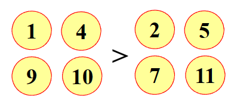

---
hide:
  #- navigation # 显示右
  #- toc #显示左
  - footer
  - feedback
comments: true
--- 

# Chapter 05 : 数论与组合模型

## 组合群式

!!! abstract "Abstract"

	我们以伪币辨识这个例子来讲解组合群式
	
	??? question "问题描述"
		
		12 枚外观相同的硬币中有一枚是伪币，伪币质量与真币不同。天平一次称量只能比较两端质量大小，不能读出质量数值。能否用天平称量三次找出伪币，并说明伪币相对真币偏轻或偏重。

群式分为组合群试和概率群式。

- 组合群式：假定 $n$ 枚硬币中有 $k$ 枚是伪币，如何用尽可能少的检测次数（在任何情况下）找出全部的伪币
- 概率群试：假定 $n$ 枚硬币相互独立地以概率 $p$ 可能是伪币，如何找出全部的伪币，使平均检测次数尽可能少

> 上面👆的这个问题属于组合群式，概率群式会在 [Chapter 06 : 随机模型](https://brucejqs.github.io/MyNotebook/blog/ACEE/Mathematical%20Modeling/Chapter%206/) 中介绍 
***
### 特殊情况

我们的例题其实是特殊情况，$n=12,k=1$

我们称后一次称量依赖于之前称量结果的方案为自适应（Adaptive）的，否则称为非自适应（Non-Adaptive）的
***
#### 自适应方案

硬币真伪的可能性共有 $12\times 2=24$ 种。每一种称量结果对应一种可能性，不同称量结果对应的可能性各不相同

***
#### 非自适应方案

自适应方案缺点在于三次实验不能同时进行，这对一些称量周期大的实验来说是不可接受的。因此我们考虑非自适应方案。

下面是一个可能发生的例子：

!!! example "Example"

	=== "第一次称量"
	
		
		
		如果伪币为重，则在 1、4、9、10 中，如果伪币为轻，则在 2、5、7、12 中
	
	=== "第二次称量"
	
		
		
		此时不知伪币轻重，但是可以确定伪币在补集 3、5、9、11 中
	
	=== "第三次称量"
	
		
		
		如果伪币为重，则在 3、4、7、11 中，如果伪币为轻，则在 1、5、8、12 中
	
	=== "总结"
	
		把我们判断轻重的部分放在一起，可以得到如下的判断表
		
		
		
		每个判断中取三组的交集，即可得到伪币的位置
***
### 一般结论

对于单伪币来说，对任意整数 $w>2$：

 - 若 $3\leq n\leq\frac{3^w−3}{2}$，则存在一种非自适应的称量方案，使用 $w$ 次称量可从 $n$ 枚硬币中辨别伪币并确定轻重 
 - 若 $n>\frac{3^w−3}{2}$，则不存在自适应的称量方案，用 $w$ 次称量即可从 $n$ 枚硬币中辨别伪币并确定轻重

***
#### 自适应方案——Dyson 集

满足以下条件的 $w$ 元向量子集 $S\subseteq\{-1,0,1\}^w$ 称为 Dyson 集：

- $\sum\limits_{\mathbf{v}\in S}\mathbf{v}=\mathbf{0}$，确保天平两端硬币数相等
- 若 $\mathbf{v}\in S$，则 $-\mathbf{v}\not\in S$，确保伪币唯一且能判断轻重

首先我们需要构造出这样的向量集（即准备好称重方案）。例如对于上面的例子，$w=3$，我们构造出如下的向量集合：

对应到那 12 个硬币，1 表示在天平左侧，−1 表示在天平右侧，0 表示不在天平上。我们可以验证，这个集合满足 Dyson 集的条件。

然后我们进行称量，如果得到下面的结果：

那么我们可以得到 1,0,1（1 表示为重）这样的向量，这个向量就与伪币有关。如果我们硬币的标记为 1,0,1，那它就是重伪币；如果为 -1,0,-1，那它就是轻伪币。（在这里就能找出 5 为伪币且是轻伪币）

??? question "Dyson 集如何构造？"

	- 构造映射 $f:\{−1,0,1\}\rightarrow\{−1,0,1\}$，使得 $f(−1)=0,f(0)=1,f(1)=−1$。例如$(−1,0,1,1)\rightarrow (0,1,−1,−1)$，这样的映射有如下性质：
	
		- $x+f(x)+f(f(x))=0,f(f(x))=x$
		- $f(-x)=-f(f(x)),f(-f(x))=-x,f(-f(f(x)))=-f(x)$
		
		
		
	- 令 $\mathbf{f}:\{-1,0,1\}^w\rightarrow\{-1,0,1\}^w$，则 $\mathbf{f}(\mathbf{x})=(f(x_1),...,f(x_w))$
	- 记集合 $S(\mathbf{x})=\{\mathbf{x},\mathbf{f}(\mathbf{x}),\mathbf{f}(\mathbf{f}(\mathbf{x})),−\mathbf{x},−\mathbf{f}(\mathbf{x}),−\mathbf{f}(\mathbf{f}(\mathbf{x}))\}$，有如下性质：
		- $S(\mathbf{x})$ 中向量两两不同
		- 对任意 $\mathbf{v}\in S(\mathbf{x}),\mathbf{f}(\mathbf{v})\in S(\mathbf{x})$
	- 记集合 $S^+(\mathbf{x})=\{\mathbf{x},\mathbf{f}(\mathbf{x}),\mathbf{f}(\mathbf{f}(\mathbf{x}))\}$，有如下性质：
		- $\mathbf{x}+\mathbf{f}(\mathbf{x})+\mathbf{f}(\mathbf{f}(\mathbf{x}))=\mathbf{0}$
		- $\mathbf{v}$ 与 $-\mathbf{v}$ 在 $S^+(\mathbf{x})$ 中至多出现一次
	
	我们要选取的就是属于$S^+(x)$ 的向量，确保 $\mathbf{v}$ 与 $-\mathbf{v}$ 在不同的子集中不被重复选取
	
	因为我们不要 $\{1,1,⋯,1\},\{0,0,⋯,0\},\{−1,−1,⋯,−1\}$，也不要 $S^-(\mathbf{x})=\{−\mathbf{x},−\mathbf{f}(\mathbf{x}),−\mathbf{f}(\mathbf{f}(\mathbf{x}))\}$ 中的向量，所以我们可选取的向量个数为 $\frac{3^w−3}{2}$ 个，也就印证了一般结论中的第一个结论。
	
	那么如何选取 $\mathbf{v}\in S(\mathbf{x})$ 使得 $\sum\limits_{\mathbf{v}\in S}\mathbf{v}=\mathbf{0}$ 呢？我们寻找 $\{−1,0,1\}^w$ 中 $m=\frac{3^w−3}{6}$ 个向量 $\mathbf{v}_1,\mathbf{v}_2,...,\mathbf{v}_m$，使得 $\{-1,0,1\}^w=S(\mathbf{v}_1)\cup S(\mathbf{v}_2)\cup ... \cup S(\mathbf{v}_m)\cup\{-\mathbf{1},\mathbf{1},\mathbf{0}\}$ ，即每个 $\mathbf{v}_i(i=1,2,...,m)$ 对应着不同的 $S^+(\mathbf{x})$。
	
	
	
	然后需要分情况讨论：
	
	!!! note "分情况讨论"
	
		=== "n=3k"
		
			因为 $\mathbf{x}+\mathbf{f}(\mathbf{x})+\mathbf{f}(\mathbf{f}(\mathbf{x}))=\mathbf{0}$，所以我们选取 $S^+(\mathbf{v}_1)\cup S^+(\mathbf{v}_2)\cup S^+(\mathbf{v}_3)\cup...\cup S^+(\mathbf{v}_k)$
		
		=== "n=3k+1"
		
			选取如下：
			
			
		
		=== "n=3k+2"
		
			选取如下：
			
			
	
	至此，我们给出了一般情况下的非自适应方案。这就是为什么我们在第一次称量中要把硬币分成三组的原因。
