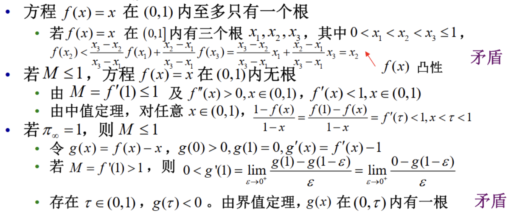

---
hide:
  #- navigation # 显示右
  #- toc #显示左
  - footer
  - feedback
comments: true
--- 

# Chapter 09 : 常微分方程模型

## 追逐问题

??? question "问题描述"

	两艘船在平静的海面上相向而行，海盗船的速度为 $v_p$，商船的速度为 $v_m$
	
	- 两船速度不变。
	- 海盗船的航向始终指向商船。
	
	问：海盗船是否能追上商船？追上时，两船的位置分别在哪里？

### 两船速度不变

若在某一时刻，海盗船与商船位于同一地点 $A(x,y)$，则 $\frac{|AO|}{|MO|}=k$，即 $\frac{\sqrt{x^2+y^2}}{(x−m)^2+y^2}=k$

所以 A 的轨迹为圆（阿波罗尼斯圆）：$(x-\frac{k^2m}{k^2-1})^2+y^2=(\frac{km}{k^2-1})^2$
***
### 两船速度不变，一船方向改变

**商船沿直线**航行，航向垂直于连接商船与海盗船初始位置的直线。在任意时刻，**海盗船的航行方向**为连接商船与海盗船此时位置的直线的方向。

以海盗船初始位置为原点，商船初始位置为 $M(m,0)$，建立直角坐标系，记 $\frac{v_m}{v_p}=r$。设海盗船在与商船相遇前的轨迹为函数 $y=f(x)$，则

在 $t$ 时刻

- 商船位置 $M_t(m,v_mt)$，海盗船位置 $P_t(x(t),y(t))$
- 连接海盗船与商船当前位置的直线斜率为 $\frac{y−v_mt}{x−m}=f'(x)$
    - 直线方程为 $y−v_mt=f'(x)(x−m)$
- 海盗船的轨迹自原点至 $P_t$ 的弧长为 $v_pt=\int_0^x\sqrt{1+f'^2(z)}dz$

所以，我们可以得到：

$$
\frac{1}{v_p}\int_0^x\sqrt{1+f'^2(z)}dz=t=\frac{1}{v_m}(y-(x-m)f'(x))
$$

对两边求导，我们有：

$$
\begin{aligned}
\frac{1}{v_p}\sqrt{1+f'^2(x)}&=\frac{1}{v_m}(f'(x)-f'(x)-(x-m)f''(x))\\
-\frac{v_m}{v_p}\sqrt{1+f'^2(x)}&=(x-m)f''(x)\\
\frac{df'(x)}{\sqrt{1+f'^2(x)}}&=-\frac{r}{x-m}dx\\
\ln|f'(x)+\sqrt{1+f'^2(x)}||_0^x&=-r\ln|x-m||_0^x\\
\Rightarrow\ln|f'(x)+\sqrt{1+f'^2(x)}|&=-r\ln|1-\frac{x}{m}|\\
\Rightarrow f'(x)+\sqrt{1+f'^2(x)}&=(1-\frac{x}{m})^{-r}
\end{aligned}
$$

对两边取倒数，我们有：

$$
\begin{cases}
f'(x)+\sqrt{1+f'^2(x)}=(1-\frac{x}{m})^{-r}\\
f'(x)-\sqrt{1+f'^2(x)}=(1-\frac{x}{m})^r
\end{cases}
$$

因此 $f'(x)=\frac{1}{2}((1-\frac{x}{m})^{-r}-(1-\frac{x}{m})^r)$

再对两边积分，有 $f(x)=\frac{rm}{1-r^2}+\frac{m-x}{2}(\frac{1}{1+r}(1-\frac{x}{m})^r-\frac{1}{1-r}(1-\frac{x}{m})^{-r})$

所以追上时的纵坐标为 $f(m)=\frac{rm}{1-r^2}$

!!! example "Example-Putnam 1959 A-5"

	=== "Question"
	
		A sparrow, flying horizontal in a straight line, is 50 feet directly below an eagle and 100 feet directly above a hawk. Both hawk and eagle fly directly toward the sparrow, reaching it simultaneously. The hawk flies twice as fast as the sparrow. How far does each bird fly? At what rate does the eagle fly?
	
	=== "Answer"
	
		- $v_h=2v_s,m_h=2m_e$
		- 鹰与鹫同时抓到麻雀，故 $f_h(m_h)=f_e(m_e)$，即：
		
		$$
		\frac{r_hm_h}{1-r_h^2}=\frac{r_em_e}{1-r_e^2}\Rightarrow\frac{2m_h}{3}=\frac{r_em_e}{1-r_e^2}\Rightarrow\frac{4}{3}=\frac{r_e}{1-r_e^2}\Rightarrow r_e=\frac{\sqrt{73}-3}{8}
		$$
		
		- 飞行距离 $l_s=f_h(m_h)=\frac{2}{3}m_h=\frac{200}{3},l_h=\frac{l_s}{r_h}=\frac{400}{3},l_e=\frac{l_s}{r_e}=\frac{400}{3}·\frac{\sqrt{73}+3}{16}$
***
## 最速降线问题

??? question "问题描述"

	给定垂直平面上两点 A,B，一质点以何路径从 A 运动到 B，可使运动时间最短？

### 直线下降

- 给定垂直平面上两点 A,B，一质点沿连接 A,B 的直线轨道从 A 运动到 B，求该质点的运动时间 $T$（不计阻力）
	- 以 $A$ 为坐标原点，水平方向为 $x$ 轴，垂直方向为 $y$ 轴，建立直角坐标系。B 点坐标为 $(x_B,y_B),x_B\geq 0,y_B>0$。线段 $AB$ 与 $y$ 轴正向夹角为 $\theta$

即斜坡下滑问题，有 $\frac{1}{2}g\cos\theta T^2=l$，因此 $T=\sqrt{\frac{2l}{g\cos\theta}}=\sqrt{\frac{2\sqrt{x_B^2+y_B^2}}{g\frac{y_B}{\sqrt{x_B^2+y_B^2}}}}=\sqrt{\frac{2(x_B^2+y_B^2)}{gy_B}}$

!!! note "常微分方程解法"

	设质点开始运动时刻为 0 时刻。$t$ 时刻质点位于 $(x(t),y(t))$，速率为 $v(t)$，方向与 AB 平行。垂直方向速度分量大小为 $v(t)\cos\theta$
	
	质点在下降过程中，势能全部转化为动能，$\frac{1}{2}mv^2(t)=mgy(t)$，即有 $v(t)=\sqrt{2gy(t)}$
	
	由质点在垂直方向的速度与距离关系 $y(t)=\int_0^tv(z)\cos\theta dz=\int_0^t\sqrt{2gy(z)}\cos\theta dz$
	
	那么有：
	
	$$
	\begin{aligned}
	y'(t)=\sqrt{2gy(t)}\cos\theta&\Rightarrow\frac{y'(t)}{\sqrt{y(t)}}=\sqrt{2g}\cos\theta\Rightarrow 2\sqrt{y(t)}|_0^T=\sqrt{2g}\cos\theta|_0^T\\
	&\Rightarrow 2y_B=T\sqrt{2g}\cos\theta\Rightarrow T=\sqrt{\frac{2(x_B^2+y_B^2)}{gy_B}}
	\end{aligned}
	$$
	
***
### 圆弧下降

- 一质点沿圆心为 $C(0,R)$，半径为 $R$ 的圆弧轨道从 $A(0,0)$ 运动到 $B(R,R)$，求该质点的运动时间 $T$（不计阻力）

- 设质点开始运动时刻为 0 时刻。$t$ 时刻质点所在位置与圆心的连线与 $x$ 轴的夹角为 $\theta(t)$，速率为 $v(t)$
- $t$ 时刻，质点纵坐标为 $R\sin\theta(t)$，质点运动过的距离为 $R\theta$
- 由能量守恒，$\frac{1}{2}mv^2(t)=mgR\sin\theta(t)$

那么有：

$$
\begin{aligned}
R\theta'(t)&=v(t)=\sqrt{2gR\sin\theta(t)}\Rightarrow\frac{\theta'(t)}{\sqrt{\sin\theta(t)}}=\sqrt{\frac{2g}{R}}\\
\int_0^{\frac{\pi}{2}}\frac{d\varphi}{\sqrt{\sin\varphi}}&=\int_0^T\frac{\theta'(t)}{\sqrt{\sin\theta(t)}}=\int_0^T\sqrt{\frac{2g}{R}}dt=\sqrt{\frac{2g}{R}}T\\
\therefore T&=\sqrt{\frac{R}{2g}}\int_0^{\frac{\pi}{2}}\frac{d\varphi}{\sqrt{\sin\varphi}}\approx 1.8541\sqrt{\frac{R}{g}}
\end{aligned}
$$

- 最后一个约等于用到了椭圆积分
***
### 最速降线

#### Fermat 原理

- 光线在两点之间传播的路径是使得两点之间的传播时间最短的路径
***
#### Snell 定律

设光在点 $A,B$ 所在介质中的传播速度分别为 $v_1,v_2$，$A,B$ 与两介质交界面的垂直距离分别为 $h_1,h_2$，$A,B$ 间的水平距离为 $d$

设光经过交界面上与 $A$ 水平距离为 $x$ 的点，光传播所需时间为 $T(x)=\frac{\sqrt{h_1^2+x^2}}{v_1}+\frac{\sqrt{h_2^2+(d-x)^2}}{v_2}$，那么有：

$$
\begin{aligned}
T'(x)=\frac{1}{v_1}\frac{x}{\sqrt{h_1^2+x^2}}&+\frac{1}{v_2}\frac{-(d-x)}{\sqrt{h_2^2+(d-x)^2}}=0\\
\Rightarrow\frac{1}{v_1}\frac{x}{\sqrt{h_1^2+x^2}}&=\frac{1}{v_2}\frac{d-x}{\sqrt{h_2^2+(d-x)^2}}\\
\Rightarrow\frac{\sin\theta_1}{\sin\theta_2}&=\frac{\frac{x}{\sqrt{h_1^2+x^2}}}{\frac{d-x}{\sqrt{h_2^2+(d-x)^2}}}=\frac{v_1}{v_2}
\end{aligned}
$$

***
#### 推导最速降线

将平行于 x 轴的直线视作折射率逐渐减小的不同介质的分界面

由 Snell 定律，可知 $\frac{\sin\theta}{v}$ 为常数，记 $\frac{\sin\theta}{v}=C$，我们有：

$$
\begin{aligned}
\sin\theta=\cos\varphi&=\frac{1}{\sqrt{1+\tan^2\varphi}}=\frac{1}{\sqrt{1+y'^2}}\\
\frac{1}{2}mv^2=mgy&\Rightarrow v=\sqrt{2gy}
\end{aligned}
$$

所以：

$$
\begin{aligned}
\frac{\sin\theta}{v}&=\frac{1}{\sqrt{1+y'^2}}\frac{1}{\sqrt{2gy}}=C\\
\Rightarrow y'&=\sqrt{\frac{1-2gCy}{2gCy}}\triangleq\sqrt{\frac{C_2-y}{y}}\\
&\Rightarrow \sqrt{\frac{y}{C_2-y}}dy=dx
\end{aligned}
$$

令 $y=C_2\sin^2\beta$，有 $2C_2\sin^2\beta d\beta=dx\Rightarrow dx=C_2(1-\cos 2\beta)d\beta$

因此 $\begin{cases}x=R(\gamma-\sin\gamma)\\y=R(1-\cos\gamma)\end{cases}$，或者 $x=R\arccos(1-\frac{y}{R})-\sqrt{y(2R-y)}$
***
### 摆线

> 实际上，最速降线就是摆线

- 摆线即为平面上的一个圆沿一条直线（准线）作无滑动的滚动时，圆上一点的轨迹
	- 以准线为 $x$ 轴，起始位置的圆与准线的切点为原点，建立直角坐标系
	- 圆滚动角度为 $\beta$ 时，圆与准线的切点坐标为 $(R\beta,0)$
	- $x=R(\beta-\sin\beta),y=R(1-\cos\beta)$
- 圆滚过一周时旋轮线的弧长与围成的面积
	
	$$
	\begin{aligned}
	L&=\int_0^{2\pi}\sqrt{x'^2(\beta)+y'^2(\beta)}d\beta=R\int_0^{2\pi}\sqrt{(1-\cos\beta)^2+(\sin\beta)^2}d\beta\\
	&=R\int_0^{2\pi}\sqrt{2-2\cos\beta}d\beta=2R\int_0^{2\pi}\sin\frac{\beta}{2}d\beta=4R\cos\frac{\beta}{2}|_0^{2\pi}=8R
	\end{aligned}
	$$
	
	$$
	S=\int_0^{2\pi R}y(x)dx=R^2\int_0^{2\pi}(1-\cos\beta)^2d\beta=3\pi R^2
	$$
	
***
### 变分法

> 变分法是研究泛函的极值的方法，也是求出最速降线的严格做法

对于最速降线来说，有：

$$
\begin{aligned}
v(t)&=\frac{\sqrt{(dx)^2+(dy)^2}}{dt}=\frac{dx\sqrt{1+y'^2(x)}}{dt}\\
\Rightarrow dt&=\frac{\sqrt{(dx)^2+(dy)^2}}{v(t)}=\frac{\sqrt{1+y'^2(x)}}{\sqrt{2gy}}dx\\
\Rightarrow T&=\int_0^{x_B}\sqrt{\frac{1+y'^2(x)}{2gy}}dx
\end{aligned}
$$

> 可以用 Euler-Lagrange 方程求解
***
## 生物数学模型

### 种群数量变化模型

#### 指数增长模型

我们给出假设：

- 环境承载容量无限，所有个体独立生活，彼此间不存在竞争
- 种群处于封闭（Closed）状态，不存在迁入（Immigration）和迁出（Emigration）
- 记人均出生/死亡/增长率为：$b,\mu,r=b−\mu$
    - 存在常数 $b$ 和 $\mu$，对任意 $t$ ，在自 $t$ 至 $t+\Delta t$ 内，出生的个体数量为 $bx(t)\Delta t$，死亡的个体数量为 $\mu x(t)\Delta t$

所以有 $x(t+\Delta t)-x(t)=(b-\mu)x(t)\Delta t$，即 $\frac{x(t+\Delta t)-x(t)}{\Delta t}=rx(t)\Rightarrow\frac{dx}{dt}=rx$

解微分方程我们有 $x(t)=x_0e^{rt}$，当 $r>0$ 时，$x(t)\rightarrow\infty(t\rightarrow\infty)$；当 $r<0$ 时，$x(t)\rightarrow 0(t\rightarrow\infty)$

- 指数增长模型不适于描述较长时期的人口演变过程，但某地一个较短时间内的人口统计数据可能符合指数增长模型
***
#### Logistic 模型

种群人均增长率仅与种群数量有关，且是种群数量的递减函数：$\frac{dx}{dt}=rx(1−\frac{x}{K})$

其中 $K$ 为环境承载量，$r$ 为内禀增长率，$x$ 为种群数量，解方程有 $x(t)=\frac{Kx_0}{x_0+(K-x_0)e^{-rt}}$

Logistic 模型有如下性质：

- 当 $0<x_0<K$ 时，种群数量随时间单调递增；当 $x_0>K$ 时，种群数量随时间单调递减；当 $x_0=K$ 时，种群数量保持不变
- $x(t)$ 在 $t=\frac{1}{2}K$ 时有拐点
- 当 $r<0$ 时，种群数量随时间单调递减至 $0$；当 $r>0$ 时，种群数量随时间单调递增至 $K$；当 $r=0$ 时，种群数量保持不变

!!! tip "Tips"

	多数情况下，指数模型与 Logistic 模型并不是基于生物学机理，而是一种经验模型模型及其参数应根据实际数据进行估计和检验
	
	除此之外，还有很多别的模型，如：
	
	$$
	\begin{aligned}
	\frac{dx}{dt}&=rx\ln\frac{K}{x}\\
	\frac{dx}{dt}&=rx\frac{K-x}{K+ax}\\
	\frac{dx}{dt}&=rx(1-(\frac{x}{k})^{\theta})\\
	\frac{dx}{dt}&=(re^{1-\frac{x}{K}}-d)x
	\end{aligned}
	$$
	
***
#### 自洽系统

- 对一阶常微分方程 $x'(t)=f(x)$，若 $f(x)$ 不显含变量 $t$，则称该方程为**自洽系统（Autonomous System）**
- 满足 $f(x_{\infty})=0$ 的 $x_{\infty}$ 称为**平衡点（Equilibrium Point）**
- 对一阶常微分方程 $x'(t)=f(x)$，或者 $x(t)$ 无界，或者 $\lim_{t\rightarrow\infty}x(t)=x_{\infty}$。但不是所有平衡点均为某个非零解的极限
- 可用线性化（Linearization）方法研究平衡点附近解的性态
***
#### 随机模型

记 $x(t)$ 为 $t$ 时刻一种群个体数量

- $x(t)$ 是一个取非负整数值的随机变量，$\{x(t),t\geq 0\}$ 为一随机过程
- $x(t)$ 为连续时间齐次 Markov 链
    - $P\{x(t+s)=j|x(s)=i,x(u)=x_u,0\leq u<s\}=P\{x(t+s)=j|x(s)=i\}$
    - $P\{x(t+s)=j|x(s)=i\}$ 值与 $s$ 无关，记其为 $p_{ij}(t)$
- 设 $x(t)=n$, 种群在 $(t,t+\Delta t)$ 时段内
    - 出生 1 人的概率为 $\lambda_n\Delta t+o(\Delta t)$
    - 死亡 1 人的概率为 $\mu_n\Delta t+o(\Delta t)$
    - 出生和死亡事件总发生两次或以上的概率很小，忽略不计

!!! note "生灭过程"

	离散状态空间连续时间齐次 Markov 链称为生灭过程（Birth–Death Process），若对充分小的 $\Delta t$，有：
	
	$$
	\begin{cases}
	p_{i,i+1}(\Delta t)=\lambda_i\Delta t+o(\Delta t),\lambda_i\geq 0,i\geq 0\\
	p_{i,i-1}(\Delta t)=\mu_i\Delta t+o(\Delta t),\mu_i\geq 0,i\geq 1\\
	p_{i,i}(\Delta t)=1-(\lambda_i+\mu_i)\Delta t+o(\Delta t),i\geq 0
	\end{cases}
	\Rightarrow\sum\limits_{|j-i|\geq 2}p_{ij}(\Delta t)=o(\Delta t)
	$$
	
	- 其中 $p_{i,j}$ 表示在 $\Delta t$ 时间内，从状态 $i$ 转移到状态 $j$ 的概率
	- 纯生过程（Pure Birth Process）：$\mu_i=0,i\geq 0$
	- 纯灭过程（Pure Death Process）：$\lambda_i=0,i\geq 0$
	- Poisson 过程：$\mu_i=0,i\geq 0$
	
	记 $p_n(t)=P\{x(t)=n\}$
	
	- $p_n(t+\Delta t)=\lambda_{n-1}\Delta tp_{n-1}(t)(出生一人)+(1-\lambda_n\Delta t-\mu_n\Delta t)p_n(t)(无出生无死亡)+\mu_{n+1}\Delta tp_{n+1}(t)(死亡一人)+o(\Delta t)$
	- $\frac{dp_n(t)}{dt}=\lambda_{n-1}p_{n-1}(t)-(\lambda_n+\mu_n)p_n(t)+\mu_{n+1}p_{n+1}(t)$
***
#### 家族消亡模型

- 分支过程（Branching Process）是用于描述与某一群体繁殖和转换相关的现象的随机过程，其基本假定是个体的繁殖是相互独立的
- 分支过程可用于描述传染病从极少感染者经过逐级传播到爆发的过程
- Fisher 和 Haldane 曾用分支过程研究基因变异后的形成的不利基因通过自然选择在后代中的保留问题

??? question "问题描述"

	设每位家族成员至多有 $k$ 个后代，有 $i$ 个后代的概率为 $p_i$，每位家族成员后代数量相互独立，什么情况下家族会消亡？

- 定义函数 $f(x)=\sum\limits_{i=0}^kp_ix^i$
	- $f(x)$ 在 $[0,1]$ 上连续，$f(0)=p_0,f(1)=1$
	- $f'(x)>0,x\in(0,1),f(x)$ 严格单调递增
	- $f''(x)>0,x\in(0,1),f(x)$ 严格下凸
- 某个家族成员没有后代的概率为 $p_0=f(0)>0$
- 某个家族成员后代数量的期望为 $M=\sum\limits_{i=0}^kip_i=f'(1)$

记 $x_n$ 为家族在第 $n$ 代的成员数。假设 $x_0=1$（此时显然有 $0\leq x_n\leq k_n$）

记 $p_{j,n}=P\{x_n=j\}$，为家族到了第 $n$ 代，后代个数为 $j$ 的概率。定义 $f_n(x)=\sum\limits_{j=0}^{k^n}p_{j,n}x^j$

记 $p_{j,1}=p_j,f_1(x)=f(x)$

显然：

- 若 $x_{n−1}=s$，其中第 $i$ 位成员的后代数为 $j_i\in [0,k],i=1,2,⋯,s$，则有 $x_n=\sum\limits_{i=1}^sj_i$，
- 所以 $p_{j,n}=\sum\limits_{s=0}^{k_n−1}(p_{s,n−1}⋅\sum\limits_{\sum\limits_{i=1}^sj_i=j}(p_{j_1}p_{j_2}⋯p_{j_s}))$，其中 $j_i\in [0,k],i=1,2,⋯,s$。

将上式代入 $f_n(x)$ 的定义式，得到：

$$
\begin{aligned}
f_n(x)=\sum\limits_{j=0}^{k^n}p_{j,n}x^j&=\sum\limits_{j=0}^{k^n}x^j\sum\limits_{s=0}^{k^{n-1}}p_{s,n-1}\sum\limits_{\sum\limits_{i=1}^sj_i=j}p_{j_1}p_{j_2}...p_{j_s}\\
&=\sum\limits_{s=0}^{k^{n-1}}p_{s,n-1}\sum\limits_{j=0}^{k^n}\sum\limits_{\sum\limits_{i=1}^sj_i=j}p_{j_1}p_{j_2}...p_{j_s}\\
&=\sum\limits_{s=0}^{k^{n-1}}p_{s,n-1}(\sum\limits_{j_1=0}^k\sum\limits_{j_2=0}^k...\sum\limits_{j_s=0}^kx^{\sum\limits_{i=1}^sj_i}p_{j_1}p_{j_2}...p_{j_s})\\
&=\sum\limits_{s=0}^{k^{n-1}}p_{s,n-1}(\sum\limits_{j_1=0}^kx^{j_1}p_{j_1})(\sum\limits_{j_2=0}^kx^{j_2}p_{j_2})...(\sum\limits_{j_s=0}^kx^{j_s}p_{j_s})\\
&=\sum\limits_{s=0}^{k^{n-1}}p_{s,n-1}f_1(x)^s=f_{n-1}(f_1(x))
\end{aligned}
$$

所以 $f_n(x)=f_{n-1}(f_1(x))=f_{n-2}(f_1(f_1(x)))=...=f(f(...f(x)...))$，即 $f_n(x)$ 为 $f(x)$ 的 $n$ 次复合函数

!!! example "Example"

	有一个家族，第一代有零个后代的概率为四分之一，有一个后代的概率为二分之一，有两个后代的概率为四分之一。（后代期望为1）
	
	$$
	\begin{aligned}
	f(x)&=\frac{1}{4}+\frac{1}{2}x+\frac{1}{4}x^2\\
	f_2(x)&=\frac{25}{64}+\frac{5}{16}x+\frac{7}{32}x^2+\frac{3}{16}x^3+\frac{1}{64}x^4\\
	f_3(x)&=\frac{7921}{16384}+\frac{445}{2048}x+\frac{723}{4096}x^2+\frac{159}{2048}x^3+\frac{267}{8192}x^4\\
	&+\frac{19}{2048}x^5+\frac{11}{4096}x^6+\frac{1}{2048}x^7+\frac{1}{16384}x^8
	\end{aligned}
	$$
	
	不断迭代下去，我们可以得到：
	
	$$
	\begin{aligned}
	f_1(0)&=0.250,f_2(0)=0.391,f_3(0)=0.483\\
	f_4(0)&=0.550,f_5(0)=0.601,f_6(0)=0.641
	\end{aligned}
	$$
	
	可见，没有后代的概率会越来越大，家族最终会消亡。同样，对于 $f(x)=\frac{1}{8}+\frac{1}{2}x+\frac{1}{4}x^2+\frac{1}{8}x^3$，我们可以得到：
	
	$$
	\begin{aligned}
	f_1(0)&=0.125f_2(0)=0.0.192,f_3(0)=0.231\\
	f_4(0)&=0.255,f_5(0)=0.271,f_6(0)=0.281
	\end{aligned}
	$$
	
***
第 $n$ 代后代数的期望为 $E(x_n)=\sum\limits_{j=0}^{k^n}jp_{j,n}=f'_n(1)$

根据复合函数的性质 $f'_n(x)=f'_{n-1}(f_1(x))f'_1(x)$，我们有 $E(x_n)=f'_n(1)=f'_{n-1}(f_1(1))f'_1(1)=f'_{n-1}(1)f'_1(1)=...=f'_1(1)^n$
***
记 $\pi_n$ 为第 $n$ 代家族消亡的概率，即 $\pi_n=P\{x_n=0\},\pi_n=p_{0,n}=f_n(0)=f(f_{n−1}(0))=f(\pi_{n−1})$

如果家族在第 $n−1$ 代消亡，那么第 $n$ 代也一定消亡，所以 $\pi_{n−1}\leq\pi_n$，又 $\pi_n\leq 1$，所以 $\{\pi_n\}$ 单调递增有上界，故 $\lim\limits_{n\rightarrow\infty}\pi_n$ 存在，记为 $\pi_{\infty}$。

- $\pi_{\infty}$ 是方程 $x=f(x)$ 的最小正根

!!! note "证明"

	先证 $pi_{\infty}$ 是方程 $x=f(x)$ 的根
    
    - 由于 $\pi_n=f(\pi_n−1)$，所以 $\pi_{\infty}=f(\pi_{\infty})$，即 $\pi_{\infty}$ 是方程 $x=f(x)$ 的根
    
	再证 $pi_{\infty}$ 是方程 $x=f(x)$ 的最小正根
    
    设另有一个正根 $\pi^∗$，由于 $f(x)$ 的单调性，有 $\pi_1=f(0)<f(x_0)=x_0$，所以 $\pi_2=f(\pi_1)<f(x_0)=x_0$，所以 $\pi_3=f(\pi_2)<f(x_0)=x_0$，以此类推，可得 $\pi_n<x_0$。由极限的保号性，$\pi_{\infty}\leq x_0$

可以证明，最终消亡概率 $\pi_{\infty}=1$ 当且仅当 $f'(1)\leq 1$

!!! note "证明"

	
***
### 传染病模型

> 传染病得以在某一人群中发生和传播，必须具备**传染源**、**传播途径**和**易感人群**三个基本环节

#### SIR 模型

假设疾病传播期内所考察地区总人数保持不变，没有新增人口和因疾病以外的原因造成的死亡。

我们将人群分为三类：

- 易感者（Susceptible）：未得病者，但缺乏免疫力，与感染者接触后会被感染
- 感染者（Infectious）：已经感染病原体的人，可以传播疾病
- 移出者（Removed）：不会再感染疾病，也不会再传播疾病，可能是因为死亡或者获得了免疫力或者被隔离

记 $t$ 时刻易感者、感染者、移出者的人数分别为 $S(t),I(t),R(t)$

- 接触率：记为 $\beta$，表示单位时间内一个感染者与易感者接触的人数
- 移出率：记为 $\alpha$，表示单位时间内一个感染者被移出的人数

单位时间内每人与 $\beta N$ 个人接触，其中 $N$ 为总人数，易感者占比为 $\frac{S(t)}{N}$，所以单位时间内一个感染者接触的易感者人数为 $\beta N\frac{S(t)}{N}=\beta S(t)$，**单位时间内新增感染者数量**为 $\beta S(t)I(t)$。

单位时间内移出感染者数量为 $\alpha I(t)$

此时每个感染者处于感染期的时间服从参数为 $\alpha$ 的指数分布，那么单位时间内移出感染者数量为 $\alpha I(t)$，我们有：

- $P(X\leq t)=1−e^{−\alpha t},E(X)=\frac{1}{\alpha}$
- 感染者经过长度至多为 $t$ 的感染期后被移出的概率为 $P(X\leq t)=1−e^{−\alpha t}$
- 若不计新增感染者，$\frac{I(t)}{I(0)}=e^{−\alpha t}$
- 若不计新增感染者，$\frac{dI(t)}{dt}=−\alpha I(t)$

所以我们可以得到微分方程组：

$$
\begin{cases}
\frac{dS}{dt}=-\beta SI\\
\frac{dI}{dt}=\beta SI-\alpha I\\
\frac{dR}{dt}=\alpha I
\end{cases}
$$

- 其中，$\beta$ 和 $\alpha$ 为常数，$S(0)=S_0,I(0)=I_0,R(0)=R_0,S_0+I_0+R_0=N$

我们考察 $S$ 和 $I$ 的关系，有 $\frac{dI}{dS}=\frac{\beta S−\alpha}{−\beta S}=\frac{1}{\frac{\alpha}{\beta} S}−1\triangleq \frac{1}{\sigma S}−1$

其中，$\sigma=\beta\alpha$，可以解得 $I(t)=S_0+I_0-S(t)+\frac{1}{\sigma}\ln\frac{S(t)}{S_0}$

其图像如下：

其中，横坐标为 $S$，纵坐标为 $I$。斜线上的点为 $S_0$ 和 $I_0$，是初始点。上图所述的先增后减，实际上可以理解为疫情的爆发和衰退。

由上图也可知，$S_{\infty}$ 即为 $S_0+I_0-S(t)+\frac{1}{\sigma}\ln\frac{S(t)}{S_0}=0$ 的根。因此我们可以用 $\sigma\approx\frac{\ln S_0-\ln S_{\infty}}{S_0-S_{\infty}}$ 来估计 $\sigma$

??? question "I 总会衰减到 0 吗？"

	因为 $S(t)\geq 0,\frac{dS}{dt}\leq 0$，所以 $S(t)$ 单调递减有下界，$\lim\limits_{t\rightarrow\infty}S(t)$ 存在，记为 $S_{\infty}$
	
	因为 $R(t)\leq N,\frac{dR}{dt}\geq 0$，所以 $R(t)$ 单调递增有上界，$\lim\limits_{t\rightarrow\infty}R(t)$ 存在，记为 $R_{\infty}$
	
	因为 $I(t)=N−S(t)−R(t)$，所以 $\lim\limits_{t\rightarrow\infty}I(t)=N−S_{\infty}−R_{\infty}=I_{\infty}$ 存在
	
	若 $I_{\infty}=\epsilon >0$，则对充分大的 $t$，$\frac{dR}{dt}=\alpha I(t)\geq \alpha\epsilon$，所以 $R(t)\geq \alpha\epsilon t$，$\lim\limits_{t\rightarrow\infty}R(t)=\infty$，矛盾
	
	所以 $I_{\infty}=0$，即 $I(t)$ 会衰减到0
	
	但是，$I(t)$ 会衰减到 0，不代表一定是好事，可能是因为所有人都痊愈了，也可能是因为所有人都寄了。
***
若 $S_0 > \frac{1}{\sigma}$：

- $\frac{1}{\sigma}<S(t)<S_0,\frac{dI}{dt}>0$，$I(t)$ 单调递增 
- $S(t)=\frac{1}{\sigma},\frac{dI}{dt}=0$，$I(t)$ 达到最大值 $S_0+I_0-\frac{1}{\sigma}(1+\ln\sigma S_0)$
- $S(t)<\frac{1}{\sigma},\frac{dI}{dt}<0$，$I(t)$ 单调递减至 0

若 $S_0 \leq \frac{1}{\sigma}$，$I(t)$ 单调递减至 0，传染病不会爆发
***
将上述增减性的分析应用过来，记 $\mathcal{R}_0=S_0\sigma$，则前文分析情况就对应 $\mathcal{R}_0>1$ 和 $\mathcal{R}_0\leq 1$

$\mathcal{R}_0=S_0\sigma=S_0\frac{\beta}{\alpha}=\frac{1}{\alpha}\cdot \beta N \cdot \frac{S_0}{N}$

- $\frac{1}{\alpha}$：每个感染者感染时间的期望值 
- $\beta N$：单位时间内一个感染者接触的人数
- $\frac{S_0}{N}$：易感者占总人数的比例

所以这个式子表示每个感染者在感染期内感染的易感者平均数，我们称 $\mathcal{R}_0$ 为**基本再生数**
***
#### SIS 模型

假设疾病传播期内所考察地区总人数保持不变，没有新增人口和因疾病以外的原因造成的死亡。

我们将人群分为两类：

- 易感者（Susceptible）：未得病者，但缺乏免疫力，与感染者接触后会被感染
- 感染者（Infectious）：已经感染病原体的人，可以传播疾病 

假设单位时间内每人与 $\beta N$ 个人接触，并使其中的易感者受到感染。单位时间内 $\gamma I(t)$ 个感染者被治愈，重新成为易感者。

- 其中，$\beta$ 和 $\gamma$ 为常数，$S(0)=S_0,I(0)=I_0,S_0+I_0=N$

我们给出微分方程组：

$$
\begin{cases}
\frac{dS}{dt}=-\beta SI+\gamma I\\
\frac{dI}{dt}=\beta SI-\gamma I 
\end{cases}
$$

所以有

$$
\frac{dI}{dt}=\beta (N-I)I-\gamma I=(\beta N-\gamma-\beta I)I=(\beta N-\gamma)I(1-\frac{\beta}{\beta N-\gamma}I)
$$

这和 Logistic 模型非常相似，因此类比 Logistic 模型我们有：

- 若 $\beta N-\gamma>0,\forall I_0\in (0,N),I(t)$ 单调递增趋向于 $N-\frac{\gamma}{\beta}$
- 若 $\beta N-\gamma<0,\forall I_0\in (0,N),I(t)$ 单调递减趋向于 0

记 $\mathcal{R}_0=\frac{\beta}{\gamma}N$，即当 $\mathcal{R}_0>1$ 时，I(t) 单调递增趋向于 $N-\frac{\gamma}{\beta}$，当 $\mathcal{R}_0<1$ 时，$I(t)$ 单调递减趋向于 0

!!! note "平衡点"

	自治系统有两个可能平衡点 $P_1=(N,0)$ 和 $P_2=(\frac{\gamma}{\beta},N-\frac{\gamma}{\beta})$
	- 当 $\mathcal{R}_0>1$ 时，$(S(t),I(t))$ 趋向于 $P_1$，人群中不再有感染者
	- 当 $\mathcal{R}_0<1$ 时，$(S(t),I(t))$ 趋向于 $P_2$，传染病成为地方性疾病

根据上面的分析，我们能有防控传染病的对策如下：

- 减少人群接触，减小 $\beta$ 值
- 提高治疗水平，使感染者尽早治愈，即增大 $\gamma$ 值
- 在存在移出者 (SIR) 情况下，通过预防免疫办法提高初始移出者 $R_{0}$ 至 $N-\frac{\alpha}{\beta}$

??? question "为什么是 $N-\frac{\alpha}{\beta}$"

	因为 $\frac{dI}{dt}=(\beta S-\alpha) I$，所以我们让未被感染的人群 $S<\frac{\alpha}{\beta}$，这样就可以让 $\frac{dI}{dt}<0$，即 I 单调递减，疾病不会爆发
***
#### Ross 疟疾传播模型

> Ross 疟疾传播模型本质其实还是 SIS 模型

疟疾只会在人类和蚊子，或者蚊子和蚊子之间传播，我们做出如下假设：

- 某区域在一段时间内人的数量 $H$ 与（雌性）蚊子的数量 $V$ 保持不变
- 记 $t$ 时刻人群中易感者和感染者数量分别为 $S_h(t)$ 和 $I_h(t)$，蚊子中易感者和感染者数量分别为 $S_v(t)$ 和 $I_v(t)$
- 单位时间内每只蚊子会叮咬 $a$ 个（不同的）人，每个人被 $\tilde{a}$ 只（不同的）蚊子叮咬，$aV=\tilde{a}H$
- 发生叮咬时，从已感染疟疾的人传染给未感染疟疾的蚊子的概率为 $b_h$，从已感染疟疾的蚊子传染给未感染疟疾的人的概率为 $b_v$
- 单位时间内，有数量为 $\gamma_h I_h(t)$ 的已感染疟疾的人康复，数量为 $\gamma_v I_v(t)$ 的已感染疟疾的蚊子康复

通过分析，我们可以得到下图：

可以得到微分方程组

$$  
\begin{cases}
\frac{dS_h}{dt}=-ab_h\frac{S_hI_v}H+\gamma_hI_h\\
\frac{dI_h}{dt}=ab_h\frac{S_hI_v}H-\gamma_hI_h\\
\frac{dS_v}{dt}=-ab_v\frac{S_v I_h}H+\gamma_v I_v\\
\frac{dI_v}{dt}=ab_v\frac{S_v I_h}H-\gamma_v I_v
\end{cases}  
$$

  

记：

$$
\begin{aligned}
x(t)&=\frac{I_h(t)}H=1-\frac{S_h(t)}H\\
y(t)&=\frac{I_v(t)}V=1-\frac{S_v(t)}V\\
m&=\frac{V}{H}
\end{aligned}
$$

则有

$$  
\begin{cases}
\frac{dx}{dt}=ab_h(1-x)my-\gamma_hx\\
\frac{dy}{dt}=ab_v x(1-y)-\gamma_v y
\end{cases}  
$$

令 $\frac{dx}{dt}=\frac{dy}{dt}=0$，则可以解得平衡点 $(0,0),\left(\frac{a^2mb_hb_v-\gamma_h\gamma_v}{ab_v(amb_h+\gamma_h)},\frac{a^2mb_hb_v-\gamma_h\gamma_v}{amb_h(ab_v+\gamma_v)}\right)$

因为分子决定了平衡点的存在性，我们定义 $\mathcal{R}_0=\frac{a^2mb_hb_v}{\gamma_h\gamma_v}=\frac{ab_v}{\gamma_h}\cdot \frac{amb_h}{\gamma_h}$

- 当 $\mathcal{R}_0>1$ 时，平衡点 $(0,0)$ 不稳定，平衡点 $\left(\frac{a^2mb_hb_v-\gamma_h\gamma_v}{ab_v(amb_h+\gamma_h)},\frac{a^2mb_hb_v-\gamma_h\gamma_v}{amb_h(ab_v+\gamma_v)}\right)$ 稳定，疟疾会爆发
***
### 种间关系模型

??? question "问题描述"

	我们知道，生物种群之间存在着相互作用关系，比如食饵与捕食者之间的关系，竞争关系等等。那么，两个种群之间的相互作用关系该如何描述？

#### Lotka-Volterra 模型

记 $x(t),y(t)$ 分别为 $t$ 时刻食用鱼 (食饵) 和鲨鱼（捕食者）的种群数量

假设海洋资源丰富，且：

- 食用鱼独立生存时以常数增长率增长；
- 而由于鲨鱼存在，使得食用鱼增长率减少，减少的程度与鲨鱼数量呈正比；
- 鲨鱼缺乏食用鱼时死亡率为常数；
- 食用鱼的存在使鲨鱼死亡率降低，降低的程度与食饵数量呈正比

我们可以列出如下的微分方程：

$$  
\begin{cases}
\frac{\mathrm{d}x}{\mathrm{d}t} = (r - ay) x\\
\frac{\mathrm{d}y}{\mathrm{d}t} = (- d +bx)y
\end{cases}  
$$

- 其中，$r,a,d,b$ 为正常数，分别表示食用鱼的原生增长率、鲨鱼捕食食用鱼的能力、鲨鱼死亡率、食用鱼对鲨鱼死亡的抑制能力

所以，我们可以得到 $\frac{\mathrm{d}y}{\mathrm{d}x} = \frac{(- d +bx)y}{(r - ay) x}$

这是一个分式微分方程，我们可以通过分离变量的方法求解：

$$  
\begin{aligned}
\frac{\mathrm{d}y}{\mathrm{d}x} &= \frac{(- d +bx)y}{(r - ay) x}\\
\frac{r - ay}{y} \mathrm{d}y &= \frac{- d +bx}{x} \mathrm{d}x\\
\int (\frac{r}{y} - a) \mathrm{d}y &= \int (\frac{- d}{x} + b) \mathrm{d}x\\
r \ln y - ay &= - d \ln x + bx + c\\ 
\therefore (x^d e^{-bx}) &(y^r e^{-ay}) = C 
\end{aligned}  
$$

- 若 $x(0)=x_0,y(0)=y_0$， 则 $C=(x_0^de^{-bx_0})(y_0^re^{-ay_0})$  
- 令$f(x)=x^de^{-bx}$，$f(x)$ 在 $x_m=\frac db$ 处取得极大值$f_{\max}$；令 $g(y)=y^re^{-ay}$，$g(y)$ 在 $y_m=\frac ra$ 处取得极大值 $g_{\max}$
    - $f(x)$ 和 $g(y)$ 都是单峰函数，图像如下：
    
    
    
    - $0\leq C=f(x)g(y)\leq f_{\max}g_{\max}$，若$C=f_{\max}g_{\max}$，则 $x=x_m,y=y_m$， 相轨线退化为点 $(x_m,y_m)$

给定一些参数，我们可以画出 $C<f_{\max}g_{\max}$ 时的相轨线：

我们可以通过分析相轨线来分析种群的数量变化：

- 对任意 $C$，相轨线是一条封闭曲线。当 $C$ 自 $f_{\max}g_{\max}$ 开始逐渐变小时，相轨线从退化点 $(x_m,y_m)$ 开始不断向外扩展
- 函数 $x(t),y(t)$ 均为周期函数，记周期为 $T$
- 直线 $x=x_m,y=y_m$ 将相轨线分为四段，各段内 $\frac{dx}{dt}$ 和 $\frac{dy}{dt}$ 符号不全相同，由此可确定轨线的方向和 $x(t),y(t)$ 的增减性
- 在一个周期内食饵先于捕食者到达最大值或最小值

$$
\begin{cases}
\frac{dx}{dt}=rx-axy & x_m=\frac{d}{b}\\
\frac{dy}{dt}=-dy+bxy & y_m=\frac{r}{a}
\end{cases}
$$

- 一周期平均值
	- $x(t)=\frac{1}{by(t)}\frac{dy}{dt}+\frac{d}{b},\overline{x}=\frac{1}{T}\int_0^Tx(t)dt=\frac{1}{T}(\frac{1}{b}\ln y(t)+\frac{d}{b}t)|_0^T=\frac{d}{b}$
	- $y(t)=-\frac{1}{ax(t)}\frac{dx}{dt}+\frac{r}{a},\overline{y}=\frac{1}{T}\int_0^Ty(t)dt=\frac{1}{T}(-\frac{1}{a}\ln x(t)+\frac{r}{a}t)|_0^T=\frac{r}{a}$
- 捕捞
	- 设捕捞系数为 $e$，即由于捕捞，食用鱼增长率由 $r$ 下降为 $r-e$，鲨鱼死亡率由 $d$ 上升为 $d+e$，则 $\overline{x}(e)=\frac{d+e}{b}>\overline{x}(0),\overline{y}(e)=\frac{r-e}{a}<\overline{y}(0)$
		- 当捕捞系数减小时，鲨鱼所占比例增加
	- 害虫（食用鱼）和它的天敌（鲨鱼）益虫构成食饵-捕食者系统。如果一种杀虫剂杀死益虫和害虫的效力相当，长期使用将导致害虫增加
***
#### 一般双种群模型

一般双种群模型的微分方程为：

$$  
\begin{cases}
\frac{dx}{dt}=x(a_{10}+a_{11}x+a_{12}y)\\
\frac{dy}{dt}=y(a_{20}+a_{21}x+a_{22}y)
\end{cases}  
$$

- 记种群 $X,Y$ 的增长率为 $a_{10},a_{20}$
    - $a_{10}>0$ 表示 $X$ 可依靠系统外食物为生
    - $a_{20}<0$ 表示 $Y$ 必须依赖 $X$ 为食才能生存
- 记种群 $X,Y$ 的密度制约项为 $a_{11},a_{22}$
    - $a_{11}=0$ 表示 $X$ 是非密度制约的
    - $a_{11}<0$ 表示 $X$ 是密度制约的
- 种间关系
    - 利用 (Exploitation) : $a_{12}<0,a_{21}>0$
        - $X$ 为食饵，$Y$ 为捕食者，$X$ 为寄主，$Y$ 为寄生物
    - 种间竞争 (Interspecific Competition) : $a_{12}<0,a_{21}<0$
    - 共生 (Mutualism) : $a_{12}>0,a_{21}>0$

