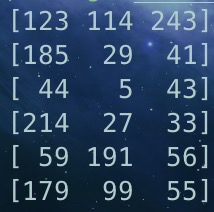
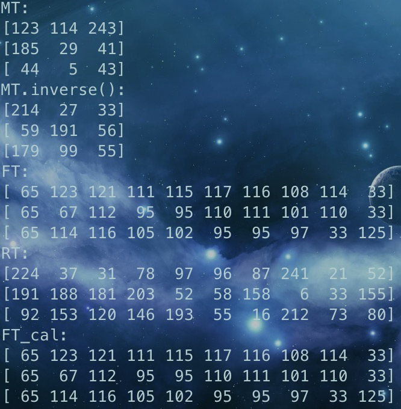

---
hide:
  #- navigation # 显示右
  #- toc #显示左
  - footer
  - feedback
comments: true
---  

# Lab1-Crypto Report

## Task 1

阅读 python 程序：

```python
from random import randrange

text_list=' !"#$%&\'()*+,-./0123456789:;<=>?@ABCDEFGHIJKLMNOPQRSTUVWXYZ[\\]^_`abcdefghijklmnopqrstuvwxyz{|}~\t\n'

key=[randrange(1,97) for i in range(randrange(15,30))]

print('key = '+str(key))

def encrypt(s,k):
    out=''
    for i in range(len(s)):
        index=text_list.index(s[i])
        index*=k[i%len(k)]
        index%=97
        out+=text_list[index]
    return out

plain=open('plain.txt','r').read() # TOEFL reading passage
cipher=encrypt(plain,key)
open('cipher.txt','w').write(cipher)
```

我们可以得到，密钥是一个长度在 15-29 的字符范围为 text_list 的字符串，同时通过加密算法的代码，我们可以发现，空格符经过加密算法后依旧为空格符，因此我们还是能将原文按照空格分割，编写 python 程序统计一下词频与出现位置（二元组第一位为词频）：

```python
encrypt = open('cipher.txt', 'r').read()
text = encrypt.split(" ")

dic = {}
count = [[] for i in range(1000)]
index = 0
num = 0

for word in text:
    if word in dic.keys():
        dic[word] = (dic[word][0] + 1, dic[word][1])
        count[dic[word][1]].append(index)
    else:
        dic[word] = (1, num)
        count[num].append(index)
        num += 1
    index += len(word) + 1

dic = sorted(dic.items(), key=lambda x: x[1][0], reverse=True)
print(dic)
print(count)
```


我们会发现出现次数最多的为 `{gY` 这个词，查看其出现位置：


以第一次出现位置为 0 ，那么这个列表就转换为：`[0,58,1102,1276,1653,2088]` ，这六个数的最大公因数为 29，那么密钥的长度正是 29。

同时，介于这个词长度为 3，我们可以猜测这个词对应的就是 the，通过加密算法编写 python 程序：

```python
import math

text_list = ' !"#$%&\'()*+,-./0123456789:;<=>?@ABCDEFGHIJKLMNOPQRSTUVWXYZ[\\]^_`abcdefghijklmnopqrstuvwxyz{|}~\t\n'

plain = input("Enter the plain text:")
cipher = input("Enter the cipher text:")
for i in range(len(plain)):
    index1 = text_list.index(cipher[i])
    index2 = text_list.index(plain[i])
    inverse = pow(index2, -1, 97)
    key = (index1 * inverse) % 97
    print(chr(key), end='')
```

得到这三个字母对应的 key 为 90 67 43，为密钥的第 4,5,6 位

我们抓住密钥第 4,5,6 位，还原密文的一部分，找到新的单词：（一对括号表示里面的字符已被还原，第一个是还原后字符，第二个是原来的字符）


猜这个词为 century，还原得到密钥的第 1,2,3,7 位为 51 14 22 17

再次还原找新单词：


猜这个词为 melting，还原得到密钥的第 8,9,10 位为 82 48 17

还原找新单词：


猜 possible，还原得到密钥的第 11,12,13 位为 41 33 89

重复以上操作即可找到完整 key，还原整篇文章：

```
By the mid-nineteenth century, the term "icebox" had entered the American language, but ice was still only beginning to affect the diet of ordinary citizens in the United States. The ice trade grew with the growth of cities. Ice was used in hotels, taverns, and hospitals, and by some forward-looking city dealers in fresh meat, fresh fish, and butter.After the Civil War (1861-1865), as ice was used to refrigerate freight cars, it also came into household use. Even before 1880, half the ice sold in New York, Philadelphia, and Baltimore, and one-third of that sold in Boston and Chicago, went to families for their own use. This had become possible because a new household convenience, the icebox, a precursor of the modern refrigerator, had been invented.
Making an efficient icebox was not as easy as we might now suppose. In the early nineteenth century, the knowledge of the physics of heat, which was essential to a science of refrigeration, was rudimentary. The commonsense notion that the best icebox was one that prevented the ice from melting was of course mistaken, for it was the melting of the ice that performed the cooling.
Nevertheless, early efforts to economize ice included wrapping the ice in blankets, which kept the ice from doing its job. Not until near the end of the nineteenth century did inventors achieve the delicate balance of insulation and circulation needed for an efficient icebox.
fLaG:AAA{i_like_T0ef1_v3ry_M3uh!!!}
But as early as 1803, an ingenious Maryland farmer, Thomas Moore, had been on the right track. He owned a farm about twenty miles outside the city of Washington, for which the village of Georgetown was the market center. When he used an icebox of his own design to transport his butter to market, he found that customers would pass up the rapidly melting stuff in the tubs of his competitors to pay a premium price for his butter, still fresh and hard in neat, one-pound bricks.
One advantage of his icebox, Moore explained, was that farmers would no longer have to travel to market at night in order to keep their produce cool.
Perhaps the most obvious way artistic creation reflects how people live is by mirroring the environment - the materials and technologies available to a culture. Stone, wood, tree bark, clay, and sand are generally available materials. In addition, depending on the locality, other resources may be accessible: shells, horns, gold, copper, and silver. The different uses to which societies put these materials are of interest to anthropologists who may ask, for example, why people choose to use clay and not copper when both items are available. Although there are no conclusive answers yet, the way in which a society views its environment is sometimes apparent in its choice and use of artistic materials. The use of certain metals, for example, may be reserved for ceremonial objects of special importance. Or the belief in the supernatural powers of a stone or tree may cause a sculptor to be sensitive to that material.
What is particularly meaningful to anthropologist is the realization that although the materials available to a society may to some extent limit or influence what it can do artistically, the materials by no means determine what is done. Why do the artists in Japanese society rake sand into patterns; and the artists in Roman society melt sand to form glass? Moreover, even when the same material is used in the same way by members of different societies, the form or style of the work varies enormously from culture to culture. A society may simply choose to represent objects or phenomena that are important to its population. An examination of the art of the Middle Ages tells us something about the medieval preoccupation with theological doctrine. In addition to revealing the primary concerns of a society, the content of that society's art may also reflect the culture's social stratification.
```

flag 就藏在文章当中：AAA{i_like_T0ef1_v3ry_M3uh!!!}

## Task 2

### Sage 初探

#### 随机生成矩阵+计算逆矩阵

编写 sage 程序如下：

```python
import random

MT = matrix(Zmod(256), [[0 for i in range(3)]for j in range(3)])

for i in range(3):
    for j in range(3):
        MT[i, j] = random.randint(0, 255)
assert MT.is_invertible()

print(MT)
print(MT.inverse())
```

得到输出：



将上面的输出记下，重新编写 sage 程序：

```python
MT = matrix(Zmod(256), [[123,114,243],[185,29,41],[44,5,43]])

print("MT:")
print(MT)
print("MT.inverse():")
print(MT.inverse())

flag = "AAA{Crypto_is_fun_to_learn!!!}"

FT = matrix(Zmod(256), 3, 10)
for i in range(3):
	for j in range(10):
		FT[i, j] = ord(flag[i + j * 3])
RT = MT * FT

print("FT:")
print(FT)
print("RT:")
print(RT)

FT_cal = MT.inverse() * RT
print("FT_cal:")
print(FT_cal)
```

得到输出：



最后的 FT_cal 与 FT 完全相同。

### HSC

用 python 将最后输出的转换回来：

```python
encoded = b'\xfc\xf2\x1dE\xf7\xd8\xf7\x1e\xed\xccQ\x8b9:z\xb5\xc7\xca\xea\xcd\xb4b\xdd\xcb\xf2\x939\x0b\xec\xf2'
encoded_iter = iter(encoded)

ans = [[0 for i in range(10)] for j in range(3)]
i = 0

for element in encoded_iter:
    ans[i % 3][i // 3] = element
    i += 1

for i in range(3):
    print(ans[i])
```


然后我们要关注的是给出的五个字符：`AAA{}`

根据加密算法，我们可以知道 `FT = MT.inverse() * RT`，因此根据矩阵乘法，针对已知的五个字符我们可以得到以下五个同余方程（记 MT.inverse() 为 MTI）：

$$
\begin{cases}
252*MTI[0,0]+242*MTI[0,1]+29*MTI[0,2]\equiv 65(mod\space 256)\\
69*MTI[0,0]+247*MTI[0,1]+216*MTI[0,2]\equiv 123(mod\space 256)\\
\\
252*MTI[1,0]+242*MTI[1,1]+29*MTI[1,2]\equiv 65(mod\space 256)\\
\\
252*MTI[2,0]+242*MTI[2,1]+29*MTI[2,2]\equiv 65(mod\space 256)\\
11*MTI[2,0]+236*MTI[2,1]+242*MTI[2,2]\equiv 125(mod\space 256)
\end{cases}
$$

同时题目给出了条件 flag 均为可打印字符，即 FT 的值范围为 32-126。

编写 sage 代码爆破 MTI：

```python
def check(matrix):
    for i in range(3):
        for j in range(10):
            if matrix[i,j] < 32 or matrix[i,j] > 126:
                return False
    return True

encoded = b'\xfc\xf2\x1dE\xf7\xd8\xf7\x1e\xed\xccQ\x8b9:z\xb5\xc7\xca\xea\xcd\xb4b\xdd\xcb\xf2\x939\x0b\xec\xf2'
encoded_iter = iter(encoded)

RT = matrix(Zmod(256), [[0 for i in range(10)] for j in range(3)])
i = 0

for element in encoded_iter:
    RT[i % 3, i // 3] = element
    i += 1

line1 = []
line2 = []
line3 = []

a1 = RT[0,0]
a2 = RT[1,0]
a3 = RT[2,0]
b1 = RT[0,1]
b2 = RT[1,1]
b3 = RT[2,1]
c1 = RT[0,9]
c2 = RT[1,9]
c3 = RT[2,9]

for i in range(256):
    for j in range(256):
        for k in range(256):
            if (a1 * i + a2 * j + a3 * k) % 256 == 65:
                if (32 <= (247 * i + 30 * j + 237 * k) % 256 <= 126 and 32 <= (204 * i+81 * j+139 * k) % 256 <= 126 and 32 <= (57 * i + 58 * j + 122 * k) % 256 <= 126):
                    if (b1 * i + b2 * j + b3 * k) % 256 == 123:
                        line1.append([i, j, k])
                    elif (c1 * i + c2 * j + c3 * k) % 256 == 125:
                        line3.append([i, j, k])
                    else:
                        line2.append([i, j, k])
print(line1)

total = 0
MTN = matrix(Zmod(256), [[0,0,0],[0,0,0],[0,0,0]])
for i in line1:
    for j in line2:
        for k in line3:
            for l in range(3):
                MTN[0,l] = i[l]
                MTN[1,l] = j[l]
                MTN[2,l] = k[l]
            if MTN.is_invertible():
                FT_cal = MTN * RT
                if check(FT_cal):
                    total += 1
                    print("Case "+str(total)+":")
                    print(FT_cal)
                    print("\n")
```

得到 FT：


转换为 flag 即可得到答案：AAA{sl1Hp*aB4c!1mZQT3^gTn1L&1}

