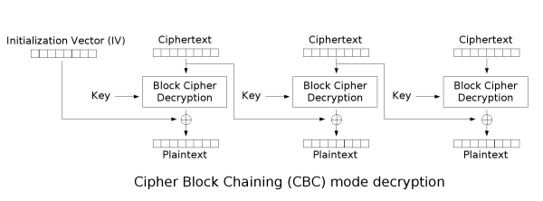
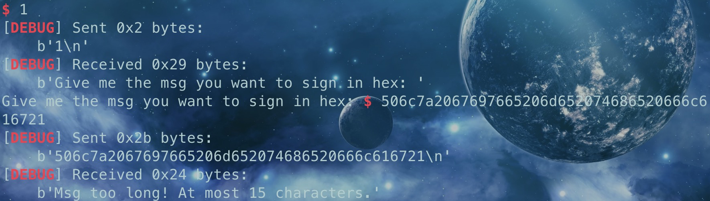
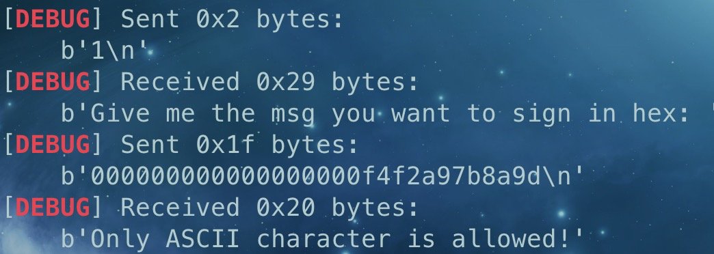
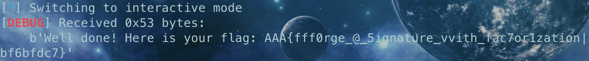

---
hide:
  #- navigation # 显示右
  #- toc #显示左
  - footer
  - feedback
comments: true
---  

# Lab2-Crypto Report

## AES 部分

### CBC Byte Flip



我们需要的是将 OriginString 替换为 HackString，根据 CBC 自身的编码特性，将两个字符串（带 Padding）分为 16 个一组（共 4 组，但是第四组在 HackString 中已经全是 Padding 的了，对我们的解题没有帮助，所以去掉）：

57 65 6c 63 6f 6d 65 20 74 6f 20 53 45 43 55 52 | Welcome to SECUR

45 20 43 72 79 70 74 6f 20 53 79 73 74 65 6d 0a | E Crypto System\n

4e 6f 20 77 61 79 20 74 6f 20 68 61 63 6b f0 9f | No way to hack\xf0\x9f


59 6f 75 72 20 43 72 79 70 74 6f 20 53 79 73 74 | Your Crypto Syst

65 6d 20 69 73 20 48 41 43 4b 45 44 20 42 59 20 | em is HACKED BY

41 41 41 f0 9f a4 a3 f0 9f a4 a3 f0 9f a4 a3 01 | AAA🤣🤣🤣\x01

如果有两个密文组 C1+C2，经过 Block Cipher Decryption 后为 D1+D2，解密结果为 P1+P2，对应的 HackString 部分为 H1+H2，我们可以得到 $P2=C1\oplus D2$，从而 $D2=P2\oplus C1$

因此我们想让 P2 变为 H2，我们可以将 C1 改为 $D2 \oplus H2$，再次交互获得新的 P1，通过前一个块改变 P1 使其为 H1，以此类推，直到最后我们需要通过 IV 来改变最前面这个块，这样就将输入的 Ciphertext 解密成我们想要的 HackString 了，编写 python 程序如下：

```python
from pwn import *
from wstube import websocket

OriginString = "Welcome to SECURE Crypto System\nNo way to hack😜"
OriginString_encode = OriginString.encode().hex()
HackString = "Your Crypto System is HACKED BY AAA🤣🤣🤣"
HackString_encode = HackString.encode().hex()
OriginString_encode = OriginString_encode[:96]
HackString_encode = HackString_encode + "01"


p = websocket("wss://ctf.zjusec.com/api/proxy/467a198b-77a8-4942-b9e4-b510cc864b7d")

p.recvline()
p.recvline()
p.recvline()

text = p.recvline()
cipher = text[13:-1]
cipher = cipher.decode()
cipher = bytes.fromhex(cipher)
IV = cipher[:16]
IV = IV.hex()
cipher = cipher[16:]
cipher = cipher.hex()
cipher = cipher[:96]
plain = OriginString_encode

for i in range(len(cipher)-32, 31, -32):
    cipher_block2 = int(cipher[i:i+32], 16)
    cipher_block1 = int(cipher[i-32:i], 16)
    plain_block2 = int(plain[i:i+32], 16)
    D2 = cipher_block1 ^ plain_block2
    temp = D2 ^ int(HackString_encode[i:i+32] ,16)
    if len(hex(temp)[2:]) < 32:
        str = "0" * (32-len(hex(temp)[2:])) + hex(temp)[2:]
    else:
        str = hex(temp)[2:]
    cipher = cipher[:i-32] + str + cipher[i:]
    p.sendline(IV + cipher)
    text1 = p.recvline()
    text = p.recvline()
    plain = text[12:-1]
    plain = plain.decode()
    plain = plain + "01"

cipher_block1 = int(IV, 16)
plain_block2 = int(plain[0:32], 16)
D2 = cipher_block1 ^ plain_block2
temp = D2 ^ int(HackString_encode[0:32] ,16)
if len(hex(temp)[2:]) < 32:
    str = "0" * (32-len(hex(temp)[2:])) + hex(temp)[2:]
else:
    str = hex(temp)[2:]
p.sendline(str + cipher)
p.interactive()
```

运行即可得到 flag:


### Padding Oracle

这道题我们需要利用程序 padding error 时只会报 500 错误而不会终止程序来进行解密，我们将密文照样分为 16 字节一组，一块一块地获得解密出来的原文。

对于两个密文组 C1+C2，经过 Block Cipher Decryption 后为 D1+D2，解密结果为 P1+P2，我们要想得到 P2，就得获得 D2，我们尝试在 C2 前加一个需要爆破的块 C，每次将 C+C2 送给程序，先对这个块的最后一个字节进行爆破，如果该字节与 D2 的最后一个字节异或结果为 0x01 时，其结果一定为 unpad 成功，即程序会输出 403，那么我们就可以得到 D2 的最后一个字节了，以此类推一个一个字节进行爆破，最后我们能获得完整的 D2，那么 P2 即为 $C1\oplus D2$。

这里需要补充的是“以此类推”的一个小细节，在进行下一个字节的爆破之前，我们需要重新改动爆破块 C 当中的值，因为我们已经确认了 D2 已爆破字节的值，我们需要将爆破块 C 已爆破字节的值全部更改掉使得这些值跟 D2 的已爆破的值异或结果为下一次爆破所需要的正确 padding 的值，这样才能使得爆破正常进行。

编写 python 程序如下：

```python
from pwn import *
from wstube import websocket

def trans_hex(x, target_len):
    str = hex(x)[2:]
    if(len(str) < target_len):
        str = "0" * (target_len - len(str)) + str
    return str

p = websocket("wss://ctf.zjusec.com/api/proxy/4d08cc5d-e490-434a-84e8-4e2f56c27eb1")

cipher = p.recvline()
cipher = cipher.decode()
cipher = bytes.fromhex(cipher)
IV = cipher[:16]
cipher = cipher[16:]
cipher = cipher.hex()
IV = IV.hex()

ans = ""
temp = IV
for i in range(0, len(cipher), 32):
    insert = "0" * 32
    D_block = "0" * 32

    cipher_block = cipher[i:i + 32]
    
    for j in range(16):
        for k in range(256):
            insert = insert[:30 - 2 * j] + trans_hex(k, 2) + insert[32 - 2 * j:]
            p.sendline(insert + cipher_block)
            text = p.recvline()
            text = text.decode()

            if(text == "403\n"):
                ans_value = k ^ (j + 1)
                D_block = D_block[:30 - 2 * j] + trans_hex(ans_value, 2) + D_block[32 - 2 * j:]

                for l in range(30 - 2 * j, 32, 2):
                    insert_str = D_block[l:l + 2]
                    insert_value = int(insert_str, 16) ^ (j + 2)
                    insert = insert[:l] + trans_hex(insert_value, 2) + insert[l + 2:]
                break
    
    P_value = int(temp, 16) ^ int(D_block, 16)
    P_block = trans_hex(P_value, 32)
    ans += P_block

    temp = cipher_block

flag = bytes.fromhex(ans).decode()
print(flag)
```

运行即可得到 flag:


## RSA 部分

### Republican Signature Agency

对于这样一个自动加解密的机器，要得到 flag，最简单的方法即为将`Plz give me the flag!`交给机器进行加密，然后将密文再次解密即可，但是当我们实践的时候便发现了这样的情况：



这便是这道题的限制，为了获得这个字符串加密后的结果，我们将这个字符串转为十进制，分解质因数：


根据 5 个质因数获得 5 个加密结果，根据模乘运算也可以获得整体加密后的结果。编写 python 程序如下：

```python
import math
from pwn import *
from pwnlib.util.iters import mbruteforce
from hashlib import *

def trans_hex(x, target_len):
    str = hex(x)[2:]
    if(len(str) < target_len):
        str = "0" * (target_len - len(str)) + str
    return str

def get_value(x):
    p.sendline("1")
    p.recvuntil("Give me the msg you want to sign in hex: ")
    p.sendline(trans_hex(x, 30))
    text = p.recvline()
    text = text[24:]
    text = text.decode()
    text = bytes.fromhex(text)
    return int(text.hex(), 16)

def check(x):
    str = hex(x)[2:]
    if(len(str) > 30):
        return False
    for i in range(len(str)-2, -1, -2):
        if int(str[i:i+2], 16) > 127:
            return False
    return True

context.log_level = 'debug'

p = remote('10.214.160.13', 12505)

p.recvuntil(b' == ')
s = p.recvn(6)
p.recvuntil(b'Give me str: ')

ans = mbruteforce(lambda x: sha256(x.encode()).hexdigest()[-6:] == s.decode(),
string.ascii_letters + string.digits, length = 4)

p.sendline(ans.encode())
p.recvlines(6)

c2 = get_value(2)
c4 = get_value(4)
c8 = get_value(8)
temp1 = pow(c2, 2) - c4
temp2 = pow(c2, 3) - c8
n = math.gcd(temp1, temp2)
i = 4
while(1):
    c = get_value(pow(2, i))
    temp = pow(c2, i) - c
    value = math.gcd(n, temp)
    if(value == n):
        break
    n = value
    i += 1

ans = 1
divisors = [3, 127, 281, 269323062708893, 4076418121333894008279720561313]
for divisor in divisors:
    p.sendline("1")
    p.recvuntil("Give me the msg you want to sign in hex: ")
    p.sendline(trans_hex(divisor, 30))
    text = p.recvline()
    if text == b'Only ASCII character is allowed!\n':
        for i in range(1,1000001):
            if(check(divisor * i) and check(i)):
                index1 = i
                break
        ans = (ans % n) * (get_value(divisor * index1) % n) % n
        ans = (ans % n) * (pow(get_value(index1), -1, n) % n) % n
    else:
        text = text[24:]
        text = text.decode()
        text = bytes.fromhex(text)
        ans = (ans % n) * (int(text.hex(), 16) % n) % n

p.sendline("2")
p.recvuntil("Give me the signature you want to verify in hex: ")
p.sendline(hex(ans)[2:])

p.interactive()
```

中途遇到了非常多挫折，其中最大的便是当我们将后面两个大质数送给程序进行加密时，我们还会碰到这样的情况：



这个程序还要求我们输入的明文必须都为 ASCII 字符，因此我们需要爆破这个质因数满足转换为字符串均为 ASCII 字符的倍数，通过一系列模乘模除运算最后获得准确的加密结果。

最后运行我们能得到 flag：



## 格密码

这道题与上课所讲的例题类似，有 $A_n=\begin{pmatrix}A_{n,1}&A_{n,2}&...&A_{n,m}\end{pmatrix}$，$S=\begin{pmatrix}S_1&S_2&...&S_m\end{pmatrix}$，$b_n=A_n\vdot S+e_n(mod\space q)$，构建格矩阵：
$$
M=\begin{pmatrix}
b_1&b_2&...&b_n&BIGNUM\\
A_{1,1}&A_{2,1}&...&A_{n,1}\\
A_{1,2}&A_{2,2}\\
\vdots&&\ddots\\
A_{1,m}&&&A_{n,m}\\
q\\
&q\\
&&\ddots\\
&&&q\\
\end{pmatrix}
$$
有：
$$
\begin{pmatrix}
-1&S_1&S_2&\cdots&S_m&k_1&k_2&\cdots&k_n
\end{pmatrix}
M=\begin{pmatrix}
e_1&e_2&\cdots&e_n
\end{pmatrix}
$$
求 CVP 问题，求得向量 e，通过 $S=A_n^{-1}\vdot(b-e)$ 可求得私钥 S，有了私钥我们就可以通过加密内容反推得到明文。

由于 sage 和 pwntools 的环境结合一直没配好 qwq 所以没法通过交互执行这个思路，就手动 copy 了一份 A 和 b 获得 S（求给点思路分 qwq），代码如下：

```python
# dimension
n = 64
# plaintext modulus
p = 257
# ciphertext modulus
q = 1048583
# round
m = 32

A = Matrix(GF(q), [[62150, 765691, 220189, 210229, 665372, 889007, 430087, 338872, 228551, 974003, 769749, 714331, 889696, 984671, 246519, 774306, 795377, 917484, 122723, 962381, 571501, 207496, 441106, 575473, 239167, 1044485, 673866, 1039262, 828418, 505893, 752507, 679612, 98341, 333916, 955, 1034561, 319301, 567017, 112342, 709662, 309989, 762947, 922438, 383933, 762238, 109885, 254600, 114960, 375926, 205285, 867202, 879040, 303127, 72557, 944808, 204340, 13029, 376139, 422300, 322884, 721617, 814578, 499827, 307478],...,[515303, 254710, 861003, 763864, 424911, 120233, 460228, 380402, 828974, 170186, 9356, 532322, 871752, 773971, 127138, 162150, 231220, 72427, 127203, 394264, 639836, 577960, 839868, 726208, 1040780, 531239, 572609, 918161, 666730, 212085, 293035, 757003, 805756, 326003, 930527, 1011569, 742863, 869273, 479116, 398372, 1035510, 718840, 1015570, 10974, 778261, 511245, 341426, 237200, 493892, 683874, 415592, 304513, 285692, 207888, 228031, 808095, 90046, 250402, 234259, 9071, 185236, 184198, 751346, 603098]]) #手动 copy 过来的 qwq
b = vector([717070, 73025, 54612, 186530, 212433, 454435, 270802, 349184, 243538, 678367, 700586, 472432, 348051, 531444, 658351, 788780, 882936, 235660, 148742, 870818, 99238, 537623, 1010294, 14794, 957557, 426333, 1043637, 386302, 237604, 618335, 84612, 740610])

#attack
mat = []
BIGNUM = q

for i in range(m):
    mat.append([int(b[i])]+list(map(int,A[i])))
mat.append([BIGNUM] + [0] * n)
M = Matrix(ZZ, mat)
M = M.transpose()
M = M.stack(diagonal_matrix(m + 1, [q] * m))
M = M.dense_matrix()
res = M.LLL()
error = list(res[-1])
print(error)
if error[-1] < 0:
    error = [e * -1 for e in error]
assert error[-1] == BIGNUM
assert all([abs(e) <= 1 for e in error[:-1]])

error = vector(GF(q),error[:-1])

Secret = A.solve_right(b-error)
print(Secret)
```

但是查看 A*S-b 得到全是 0，不知道是不是思路有问题，望指正。