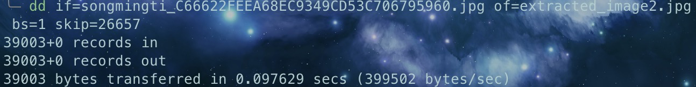
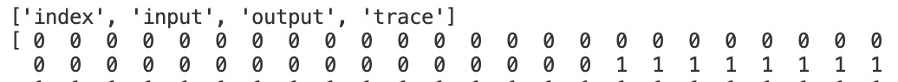

---
hide:
  #- navigation # 显示右
  #- toc #显示左
  - footer
  - feedback
comments: true
---  

# Lab2-Misc Report

## Challenge 1

用 Hex Fiend 打开图片，在翻看查找时我们发现这张图片出现了两次 JFIF，猜测这张图片是由两张图片叠加而成的，用 binwalk 查看验证：


果然这里有两张 JPEG 图片，分离：




得到两张图片：


得到 flag：AAA{the_true_fans_fans_nmb_-1s!}

## Challenge 2

我们将网页的 HTML 文件下载下来，发现：


这里面藏了一张图片，我们将网址改写为 `https://cdn.zjusec.com/Nov2/img/miao~870F6C667A6CDC0D1F533859E72C48E0.jpg` 并访问就可以拿到图片：


用 Hex Fiend 打开，我们会看见一个 key：


合理猜想这是用现有的工具进行了隐写，我们用 steghide 来查看：


果然里面藏了个 secret_file.txt，提取出来：


在 CyberChef 中 From Binary 即可得到 flag:AAA{D0_Y0u_L1ke_Ste9H1de_M1a0}

## Challenge 3

拿到图片用 stegsolve 打开，将绿色的 bit plane 设置为 0，我们可以看到：


可以看到这也是一个 PNG 文件！将其导出打开，得到：


合理猜测这张图片被截了一半，尝试拉长高度，最终得到了 flag：


## Challenge A：Palette Stego

根据相关资料查询，我们可以知道 EZStego 算法是将调色板图像像素内容（索引值）使用 LSB 隐写代替，因此对于每个像素来说提取其最低有效位就可以得到隐写内容的二进制，编写 python 代码如下：

```python
from PIL import Image

img = Image.open('palette.png')

bits = []
for i in range(img.size[1]):
    for j in range(img.size[0]):
        bits.append(img.getpixel((j, i)) & 1)

flag = ''.join(chr(int(''.join(map(str, bits[i:i+8])), 2)) for i in range(0, len(bits), 8))
flag = flag.rstrip('\x00')

print(flag)
```

得到 flag：


## Challenge B：Spectrogram

编写 python 代码如下：

```python
from PIL import Image, ImageSequence
import soundfile as sf
import numpy as np
import librosa

num_freqs = 32
quantize = 2
min_db = -60
max_db = 30
fft_window_size = 2048
frame_step_size = 512
window_function_type = 'hann'
color_pixel = (0, 0, 255)
white_pixel = (255, 255, 255)
sample_rate = 22050

def gif_to_spectrograms(gif_path):
    gif = Image.open(gif_path)
    frames = []
    try:
        while True:
            frame = np.array(gif.convert('RGB'))
            frames.append(frame)
            gif.seek(gif.tell() + 1)
    except EOFError:
        pass

    spectrograms = []
    for frame in frames:
        reduced_frame = frame[::quantize, ::quantize]

        frame_data = [0 for i in range(num_freqs + 1)]
        for freq in range(num_freqs * 2 + 1):
            for i in reversed(range(min_db, max_db + 1, quantize)):
                pixel = reduced_frame[(max_db - i) // quantize, freq]
                if np.array_equal(pixel, color_pixel):
                    frame_data[freq//2] = i
                    break

        spectrograms.append(frame_data)
    
    spectrograms = np.array(spectrograms).transpose()
    return spectrograms

def spectrogram_to_audio(spectrogram):
    power_spectrogram = librosa.db_to_power(spectrogram)
    stft = librosa.feature.inverse.mel_to_stft(power_spectrogram, sr=sample_rate, n_fft=fft_window_size)
    y = librosa.griffinlim(stft, hop_length=frame_step_size, window=window_function_type)
    return y

def convert_gif_to_audio(gif_path, audio_path):
    spectrograms = gif_to_spectrograms(gif_path)
    audio = spectrogram_to_audio(spectrograms)
    sf.write(audio_path, audio, sample_rate)

if __name__ == '__main__':
    convert_gif_to_audio('flag-2.gif', 'flag-2.mp3')
```

这里主要的关键的是如何逆向把 gif 转为 spectrograms 的这个过程，我们来看 generate.py 的转换代码：

```python
gif_data = [
        numpy.kron(
            numpy.array([
                [
                    color_pixel if freq % 2 and i < round(
                        frame[freq // 2]) else white_pixel
                    for i in reversed(
                        range(min_db, max_db + 1, quantize))
                ]
                for freq in range(num_freqs * 2 + 1)
            ]),
            numpy.ones([quantize, quantize, 1])
        )
        for frame in spectrogram.transpose()
    ]
```

经过查询，numpy.kron(A,B) 即为对 A 中的每个元素都乘以矩阵 B，从而扩大这个 A，这里相当于把 A 中的元素 x 替换为 $\begin{pmatrix}x\space x\\x\space x\end{pmatrix}$ ，那么我们逆向回来的时候只需要取一个就行，这样就能逆向得到这里的 numpy.array 部分。

然后再看 numpy.array 部分，不考虑 `freq % 2 == 1` 这个条件，它仅在 `i < round(frame[freq//2])` 时将这个位置赋值为 color_pixel，同时 i 还是从 max_db 从高向低枚举，因此当我们也从高向低枚举时，一看到 color_pixel 的时候就可以认定这就是 `round(frame[freq//2])`，记录到 frame 当中并 break 即可（类似于读频谱图时找到最高点即可记录其值），就有了转换代码的 34-38 行。

最后运行转换两个 gif，flag-1 是大名鼎鼎的 《Never Gonna Give You Up》，flag-2 是《一剪梅》

P.S.转换出来的 mp3 虽然能听出曲目了，但还是有很多杂音（尤其《一剪梅》），可能转换代码还是有一点点问题，还望指正。

## Challenge D：Power Trajectory Diagram

拿到一个 npz 文件，我们通过 python 能看见其包含的数组名及其内容：




可以看到这里面有 index,input,output,trace 四个数组，同时 index 里面有 40 个 0-12，同时 input 里面字符也正好是 40 个一组，合理猜想这应该是一一对应的，通过解析 trace 数组，对应 index 找到 input 的字符，拼起来即为 flag。

我们将 trace 数组导出为 csv 看看：


在这里有特殊的一列，1-40 行仅仅有第 37 行不同，猜测这就是 flag 的一部分，编写 python 程序如下：

```python
import numpy as np

data = np.load('attachment.npz')
array_names = data.files

trace = data['trace']
str = data['input'][0:40]
for i in range(12):
    indices = []
    for j in range(40):
        minindex = np.argmin(trace[i * 40 + j])
        indices.append(minindex)
    ansindex = np.argmax(indices)
    print(str[ansindex], end='')
```

得到最终 flag:

