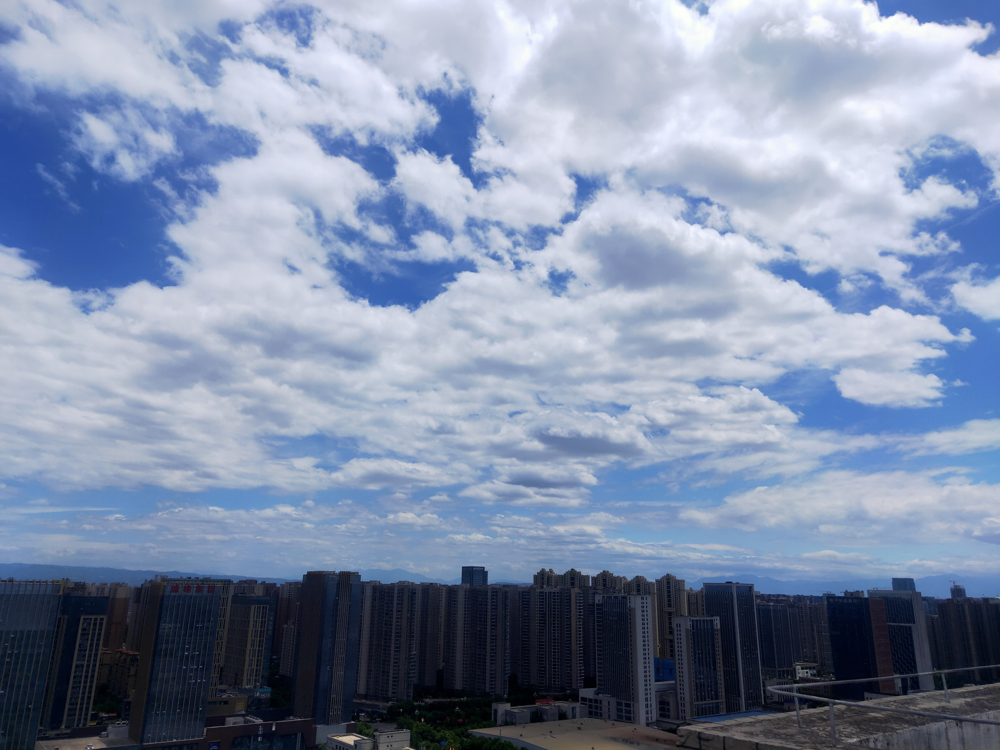

---
hide:
  #- navigation # 显示右
  #- toc #显示左
  - footer
  - feedback
comments: true
---  

# Misc-6｜Find It

## 做题心得 & 感想

OSINT！

这道题还是非常友好的给的特征建筑比较明显，并且限定在西安就非常好找了，Bruce 在数模课快结束以混沌的脑子也把它瞬秒了 hhh
***
## Writeup

观察图片：

放大可观察到“雄峰集团”和“桔子水晶酒店”两个标志性建筑，在百度地图查询位置：

根据图片方位可以得知出题人拍照的角度大概位于西安经开第十三小学这块地方，放大即可发现题目所要的两个幼儿园：

最后根据免费提示可得知这两个幼儿园的“的“念 di（第四声），于是即可得到 flag: `moectf{ji_di_bao_you_er_yuan}`
