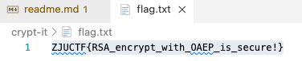

# crypt-it

## Tag

Openssl 命令行，RSA OAEP 模式
***
## Writeup

命令行 `openssl rsautl -decrypt -oaep -inkey private_key.pem -in flag.enc -out flag.txt` 即可直接出 flag：

flag：`ZJUCTF{RSA_encrypt_with_OAEP_is_secure!}`