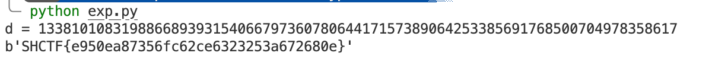

# Ez-RSA

## Tag

维纳攻击板子题

***

## Writeup

e 很大，明显维纳攻击，exp 如下：

```python
import gmpy2
import libnum
from Crypto.Util.number import long_to_bytes
def transform(x,y):       #使用辗转相处将分数 x/y 转为连分数的形式
    res=[]
    while y:
        res.append(x//y)
        x,y=y,x%y
    return res
    
def continued_fraction(sub_res):
    numerator,denominator=1,0
    for i in sub_res[::-1]:      #从sublist的后面往前循环
        denominator,numerator=numerator,i*numerator+denominator
    return denominator,numerator   #得到渐进分数的分母和分子，并返回

    
#求解每个渐进分数
def sub_fraction(x,y):
    res=transform(x,y)
    res=list(map(continued_fraction,(res[0:i] for i in range(1,len(res)))))  #将连分数的结果逐一截取以求渐进分数
    return res

def get_pq(a,b,c):      #由p+q和pq的值通过维达定理来求解p和q
    par=gmpy2.isqrt(b*b-4*a*c)   #由上述可得，开根号一定是整数，因为有解
    x1,x2=(-b+par)//(2*a),(-b-par)//(2*a)
    return x1,x2

def wienerAttack(e,n):
    for (d,k) in sub_fraction(e,n):  #用一个for循环来注意试探e/n的连续函数的渐进分数，直到找到一个满足条件的渐进分数
        if k==0:                     #可能会出现连分数的第一个为0的情况，排除
            continue
        if (e*d-1)%k!=0:             #ed=1 (mod φ(n)) 因此如果找到了d的话，(ed-1)会整除φ(n),也就是存在k使得(e*d-1)//k=φ(n)
            continue
        
        phi=(e*d-1)//k               #这个结果就是 φ(n)
        px,qy=get_pq(1,n-phi+1,n)
        if px*qy==n:
            p,q=abs(int(px)),abs(int(qy))     #可能会得到两个负数，负负得正未尝不会出现
            d=gmpy2.invert(e,(p-1)*(q-1))
            return d
    
    
e = 3924586561728843234261049280560557566669922961436496251423249382498887294225142535297862819865029081145630384268177735578769958711287734205364353929040337350836000661255957087233897675207507752217828489549059197109918195953230752720210793300168746820366115929509596904295875481061789801178045962611893883689
n = 107464134871680646151655304067173578951022679613817744422854142736895193478923970402314237869266898585661396817719803005109183572552933963881756199330890085692291647461683934019264121186823772581796061998307778635680038707808422026396560620912393186072263186503236380890048319797143644270579169484448179083299
d = wienerAttack(e,n)
print("d =",d)
c = 4557192604704814579224198928010541193712311907197292139423304635523945088581321950910727673367241811197226152299201713883344661436550024661781925551129803469824570154317098612833694631836257698682075695287756551674264966935203485636255394639674521955953445322493019052791894426980946209383266707043869522774
m = pow(c,d,n)
print(long_to_bytes(m))
```

