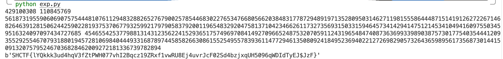

# TE

## Tag

共模攻击板子题

***

## Writeup

一眼共模攻击，exp 如下：

```python
from Crypto.Util.number import long_to_bytes
import gmpy2

n = 136622832042809215646904518487100682818433235485047740604612449039291802103378650845690420527029208661555957840623544220907967041438993189882681277161437473818861280518627112617436473837014181944318974950710633690704711613682306786783611123590732850783007770603201513394002330426718261667816328404673167404897
e1 = 740153575
e2 = 2865243571
message1 = 56187319559060690757544481076112948328826527679002578544683022765347668056620384831778729489197135280950314627119815558644487151419126272267146826463912815062442590228193753706779325992179790583792001196548329204758137104234662611732735693150331594645734142941475121453410494160975503459516324097097434727685
message2 = 45042409947237296641429229414329516753664139389113206575966507524195434716702812078844474626406932213486611190698953613898299571473488550533642524208077653917354039305279692307471529748408234617430389423630015569730564585740596832844917494965974840512412454337766930330443409183293514761911902752336129193323

gcd, s, t = gmpy2.gcdext(e1, e2)
if s < 0:
    s = -s
    message1 = gmpy2.invert(message1, n)
if t < 0:
    t = -t
    message2 = gmpy2.invert(message2, n)
print(s, t)
print(message1, message2)
plain = gmpy2.powmod(message1, s, n) * gmpy2.powmod(message2, t, n) % n
print(long_to_bytes(plain))
```

