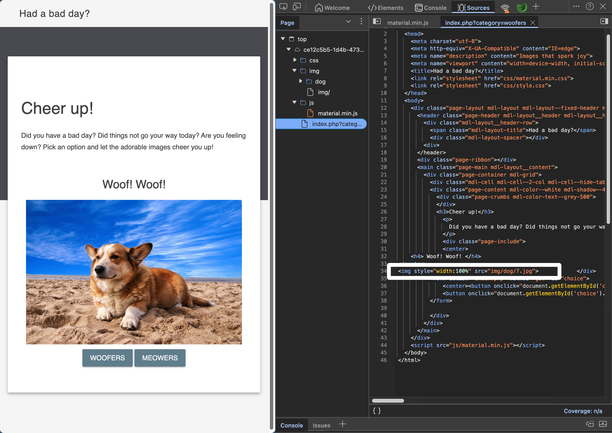
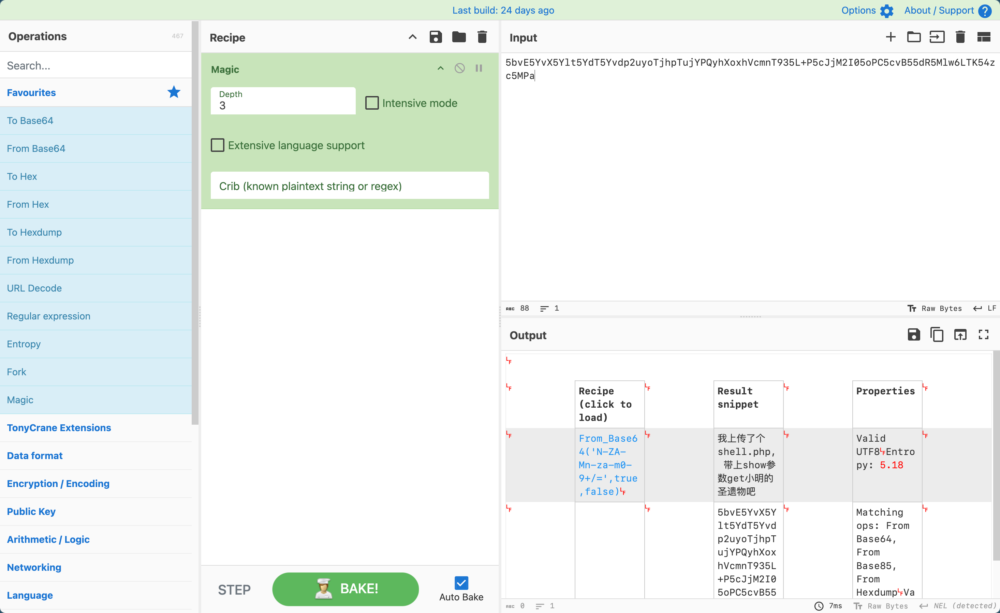
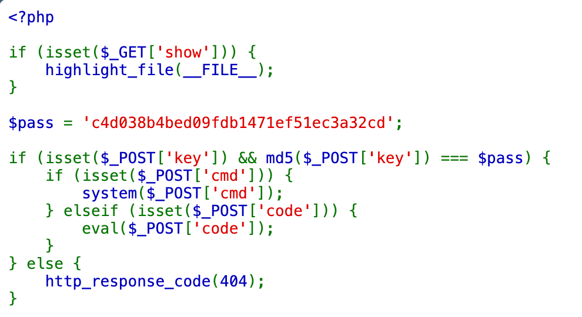
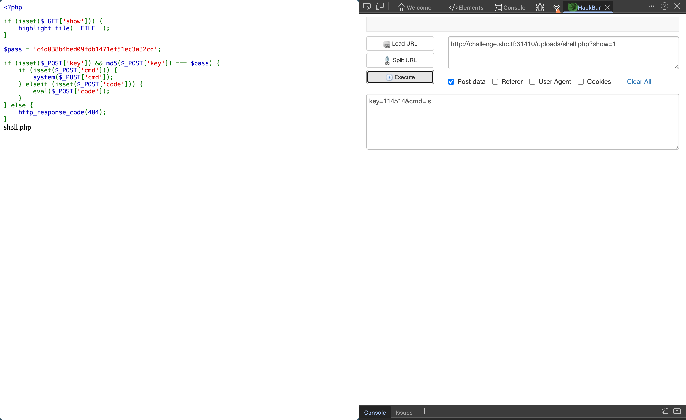
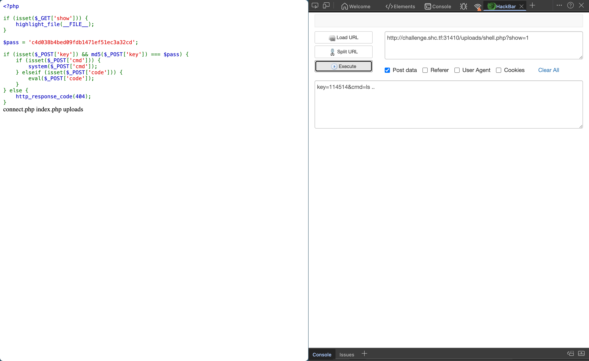
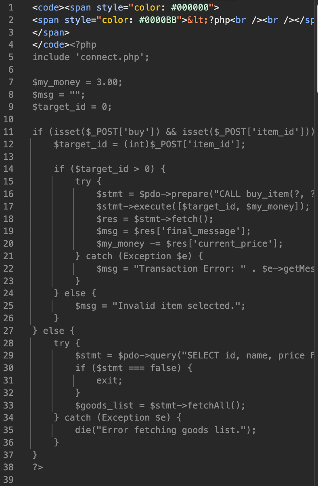
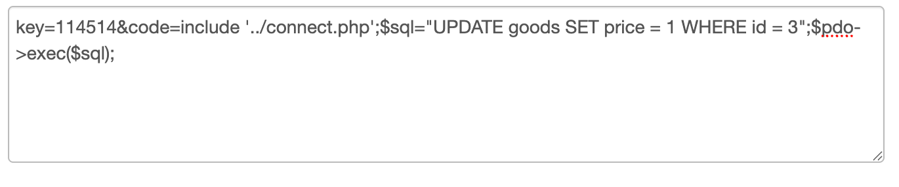
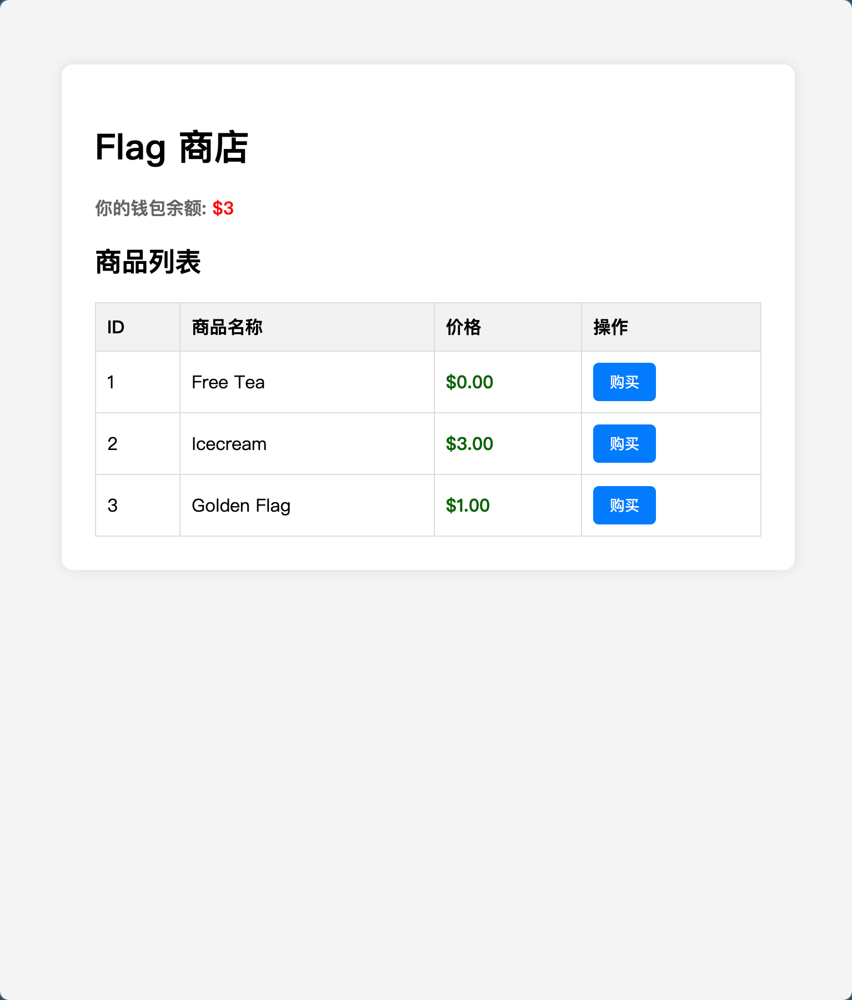
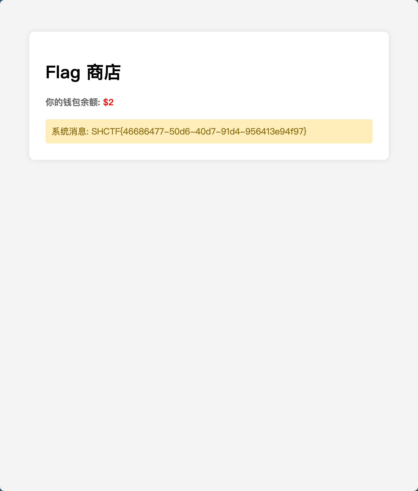

# 05_em_v_CFK

## Tag

源码审计 RCE

***

## Writeup

源码里面有一串字符串：

Magic 一解：

Dirsearch 能搜到有 uploads 这个目录，因此访问 /uploads/shell.php?show=1：

MD5 解密可以得到 114514 因此传参 key=114514&cmd=ls 和 key=114514&cmd=ls ..：

有一个 connect.php，其他什么都没有，先看一下 index.php：

那我们也可以仿照着去修改 flag 的 price：

购买即可：

