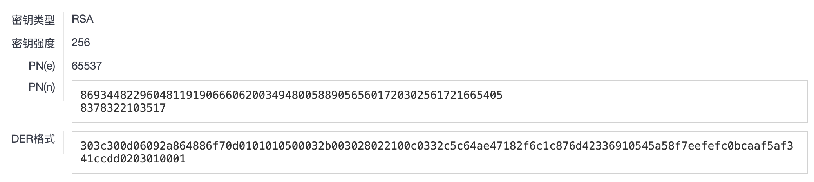
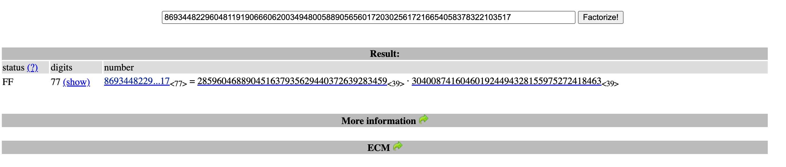

# RSA(1)

## Tag

带 .enc&key 的 RSA（工具向）

***

## Writeup

要将 key 放入[公钥解析网站](http://www.hiencode.com/pub_asys.html)进行解析如下：



Factordb 一解即可：



exp 如下：

```python
from Crypto.Util.number import *
import gmpy2

with open('flag.enc', 'rb') as f:
    c = int(f.read().hex(), 16)

p = 285960468890451637935629440372639283459
q = 304008741604601924494328155975272418463
e = 65537
n = p * q
phi = (p - 1) * (q - 1)
d = gmpy2.invert(e, phi)
m = pow(c, d, n)
print(long_to_bytes(m))
```

