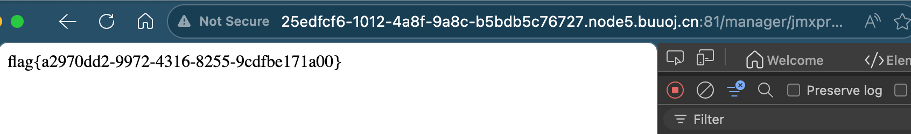
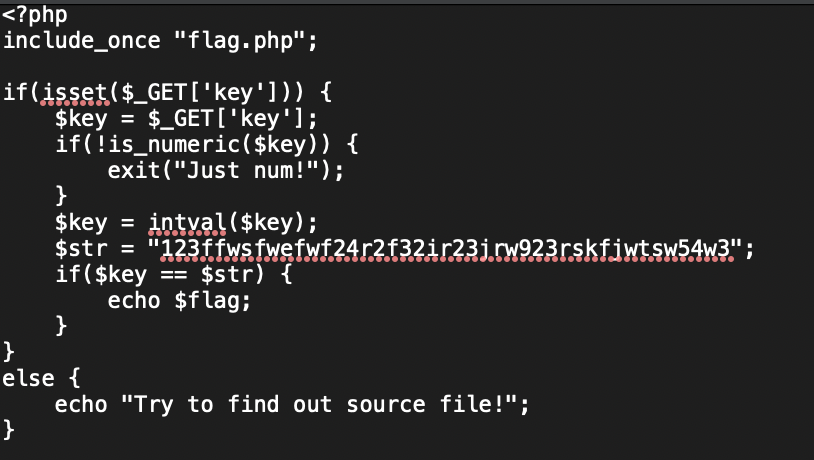

# [ACTF2020 新生赛]BackupFile

## Tag

Dirsearch 大法

***

## Writeup

Dirsearch 只有一个路径 `/manager/jmxproxy/?get=BEANNAME&att=MYATTRIBUTE&key=MYKEY` 显示 200，但是访问：

因此尝试把 key 改成 123 即可获得 flag：

***

后记：其实是非预期了，dirsearch 没有搜到 index.php.bak：

实际上只要传 key 参数为 123 才可以，属于是运气爆棚了