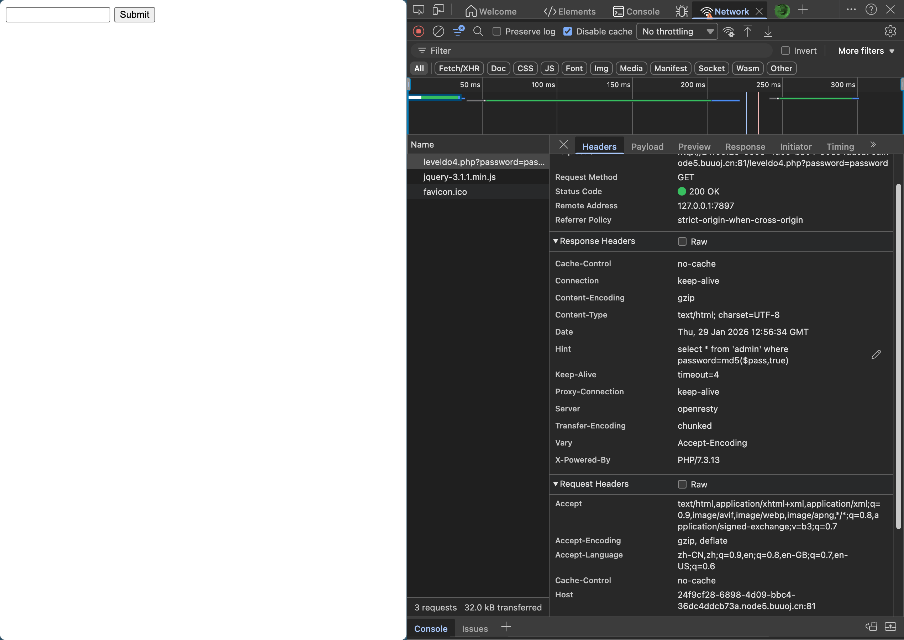
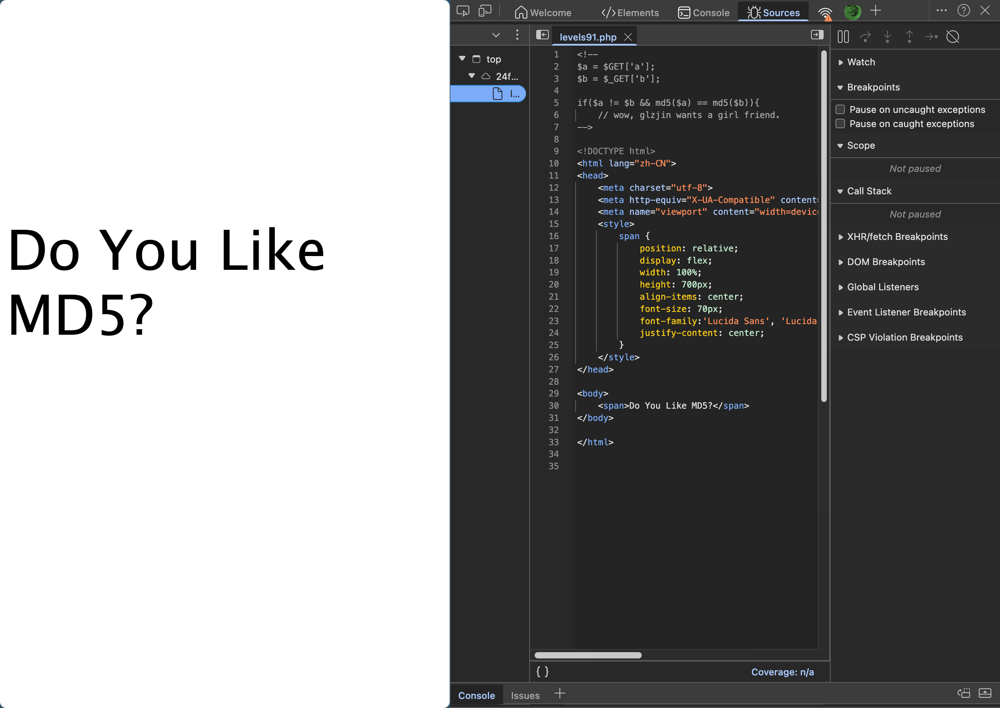
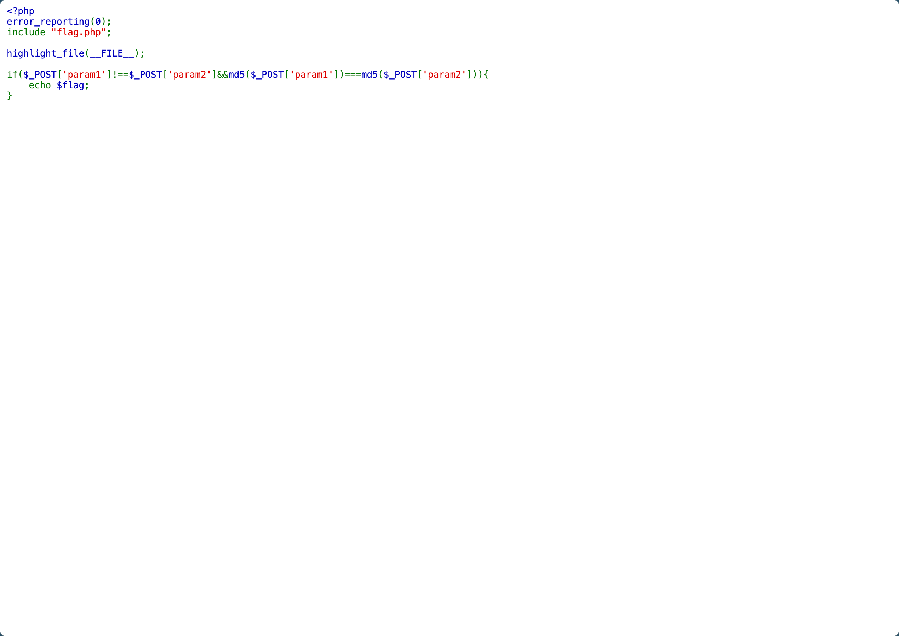
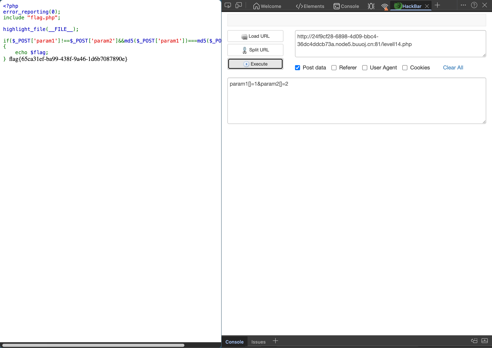

# [BJDCTF2020]Easy MD5

## Tag

MD5 SQL 注入，弱比较强比较

***

## Writeup

源码中没有任何信息，在请求头里面有 Hint：

在 PHP 中，`md5($string, true)` 会返回 MD5 哈希的原始二进制格式（16字节），而不是我们平时看到的 32 位十六进制字符串。如果某个字符串经过 MD5 转换后的 16 字节原始数据中，包含了类似 `...'or'1...` 这样的字符串，那么 SQL 语句就会变成 `select * from 'admin' where password='...'or'1...`，在 mysql 中会把后面的 1... 认为是 1，即 True，那么即可绕过，典型 Payload 为 `ffifdyop`，输入进入下一关：

典型 MD5 碰撞，令 `a=240610708&b=QNKCDZO` 即可进入下一关：

这里看到使用了强等于 === 来判断，查询资料得知，数组的 MD5 均为 Null，因此传递 `param1[]=1&param2[]=2` 即可：

