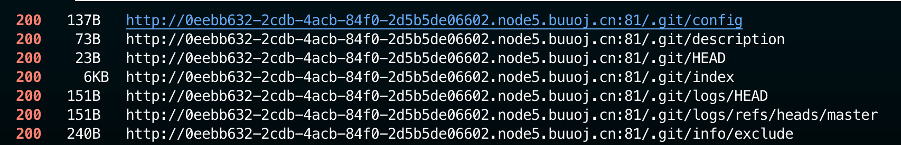

# [BJDCTF2020]Mark loves cat

## Tag

源码泄露

***

## Writeup

Dirsearch 能看到有 .git 目录：



上 GitHack 可以得到源码：

```php
<?php

include 'flag.php';

$yds = "dog";
$is = "cat";
$handsome = 'yds';

foreach($_POST as $x => $y){
    $$x = $y;
}

foreach($_GET as $x => $y){
    $$x = $$y;
}

foreach($_GET as $x => $y){
    if($_GET['flag'] === $x && $x !== 'flag'){
        exit($handsome);
    }
}

if(!isset($_GET['flag']) && !isset($_POST['flag'])){
    exit($yds);
}

if($_POST['flag'] === 'flag'  || $_GET['flag'] === 'flag'){
    exit($is);
}

echo "the flag is: ".$flag;
```

构造 GET 参数 handsome=flag, flag=handsome 即可将 flag 转移给 handsome 并输出：

