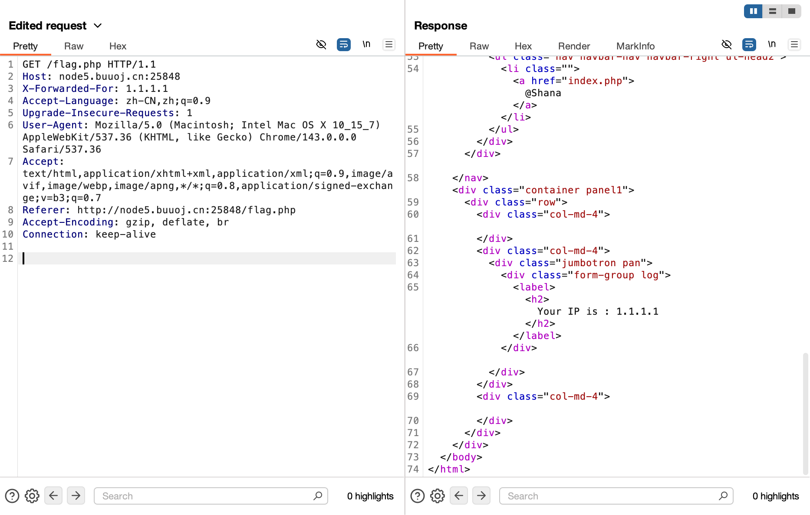
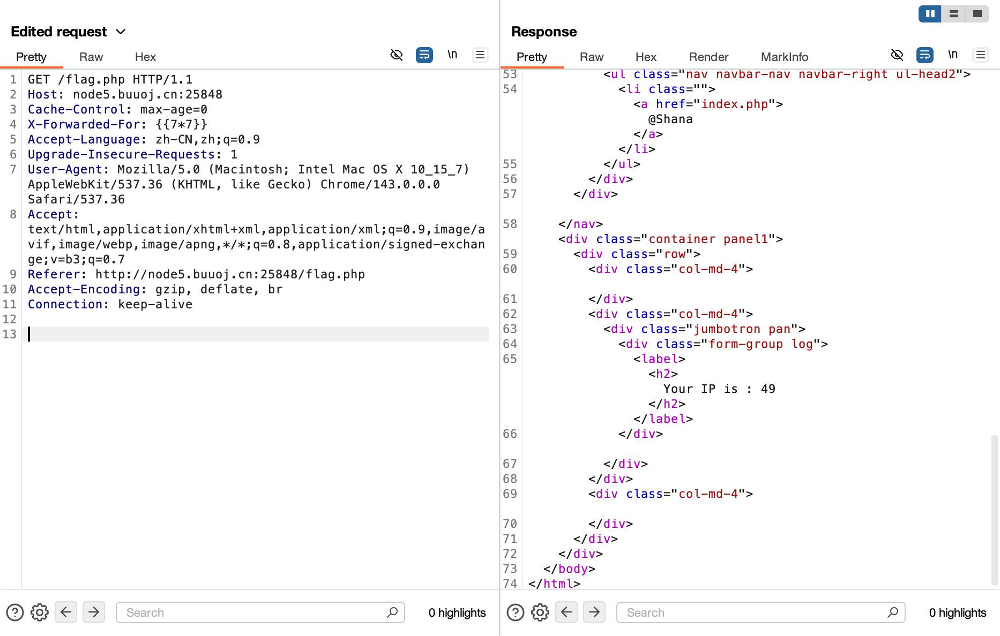
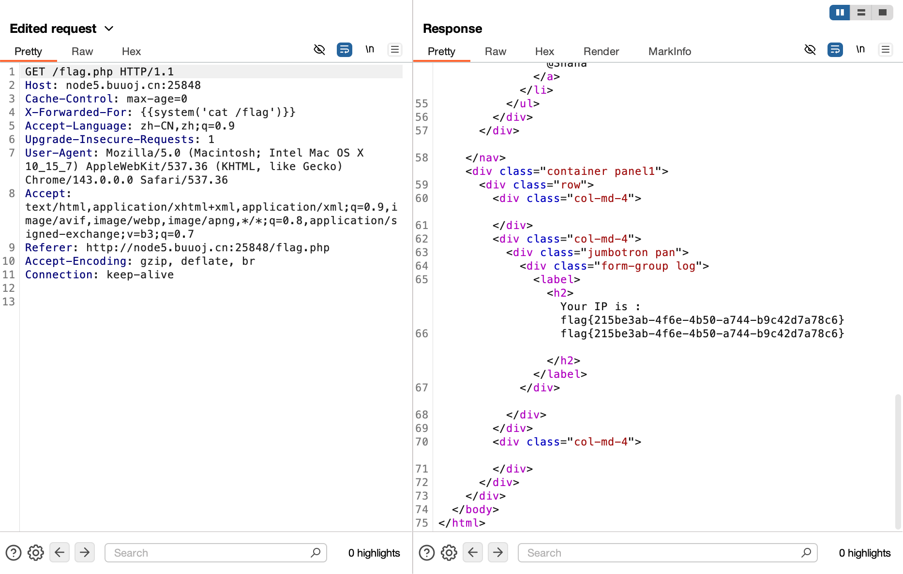
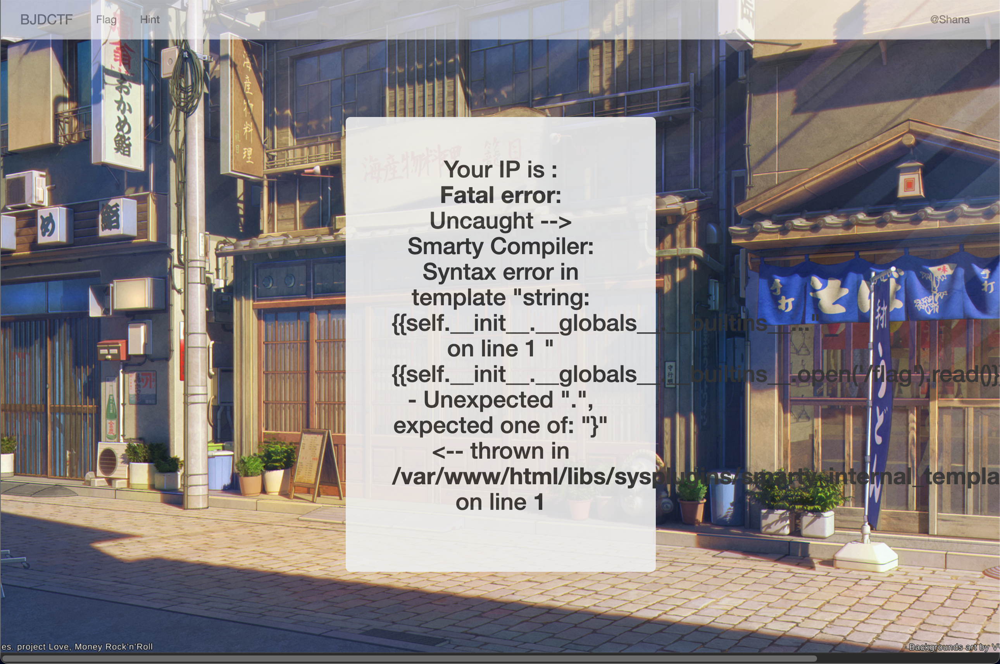

# [BJDCTF2020]The mystery of ip

## Tag

SSTI 注入

***

## Writeup

根据提示，合理猜想和 X-Forwarded-For 有关系，尝试修改成功：

尝试 SSTI 注入：

成功，那么注入 `{{system('cat /flag')}}` 即可：

后记：本来想用 MoeCTF SSTI 注入的方法的，但是都不可行，会报错

里面提到了一个叫 Smarty Compiler，说明是一个叫 Smarty 的模板