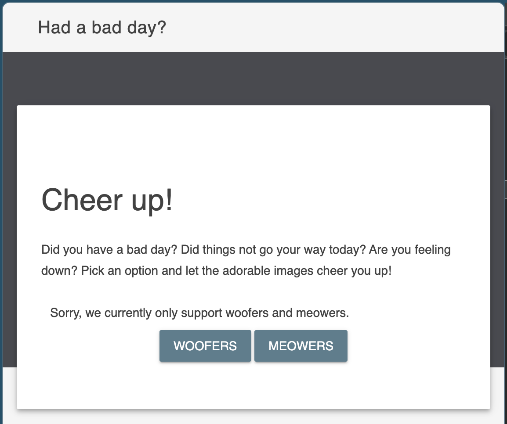
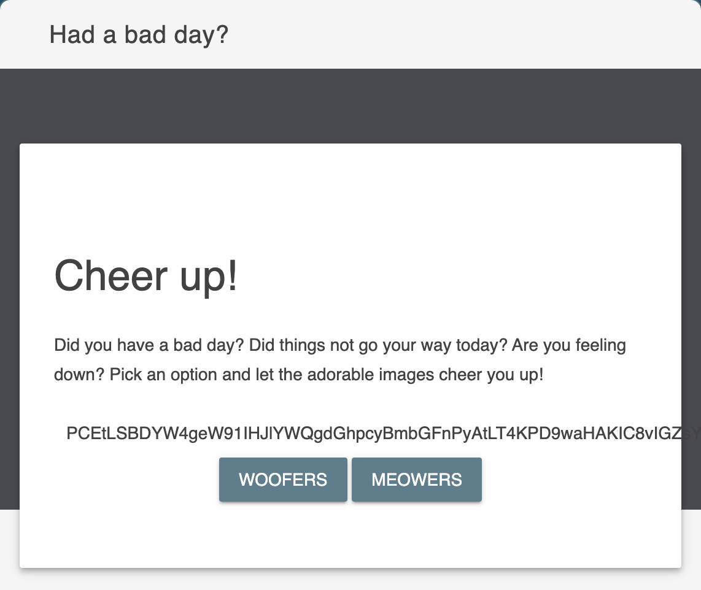
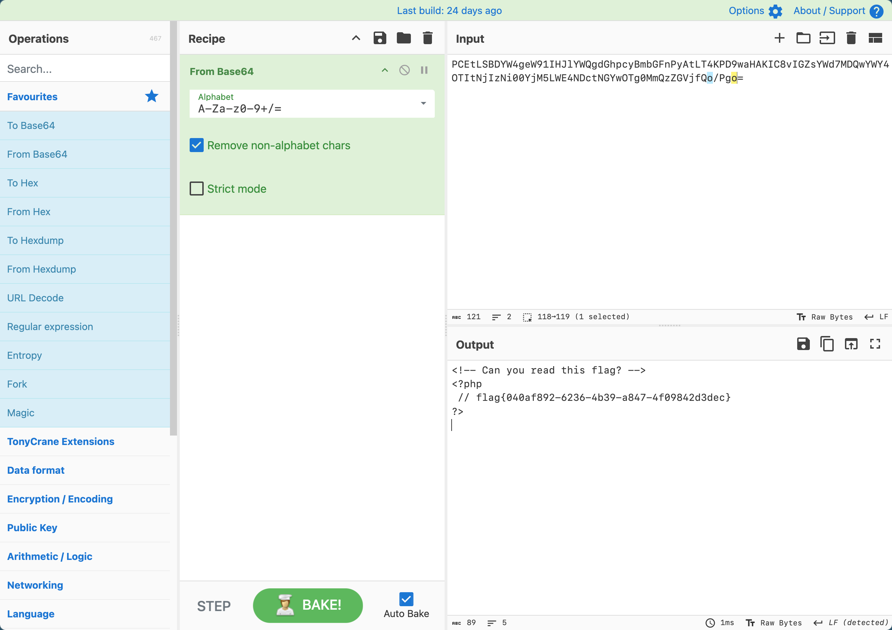

# [BSidesCF 2020]Had a bad day

## Tag

文件绕过

***

## Writeup

访问 Woofer/Meower，会发现访问的是 `/index.php?category=woofers`，会把图片放在里面：

多访问几遍会发现图片不一样，猜测后端逻辑是会将 woofers 拼接 .php，然后 include 进来，所以访问 `/index.php?category=flag`：

一定要有 woofers/meowers，那么访问 `/index.php?category=php://filter/read=convert.base64-encode/resource=woofers/../flag`：

Cyberchef 一解即可：

