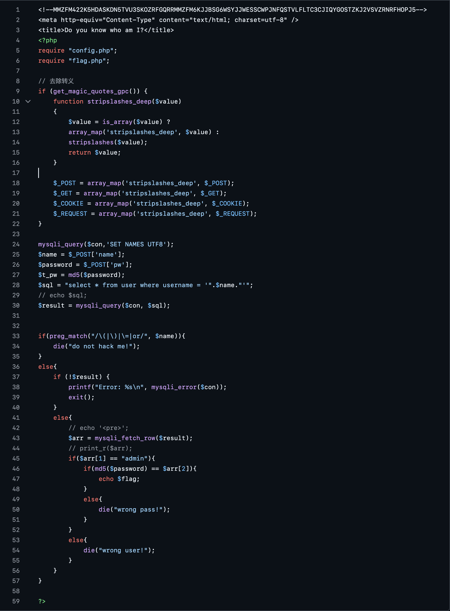
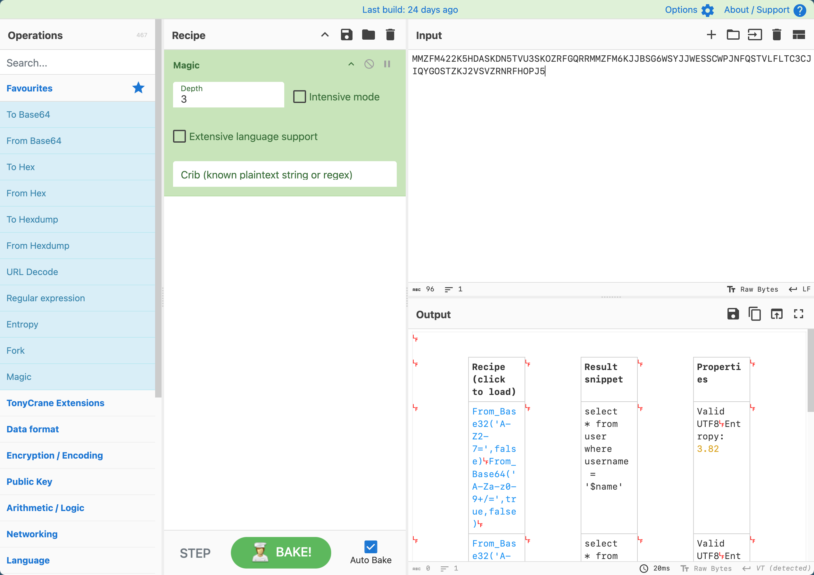
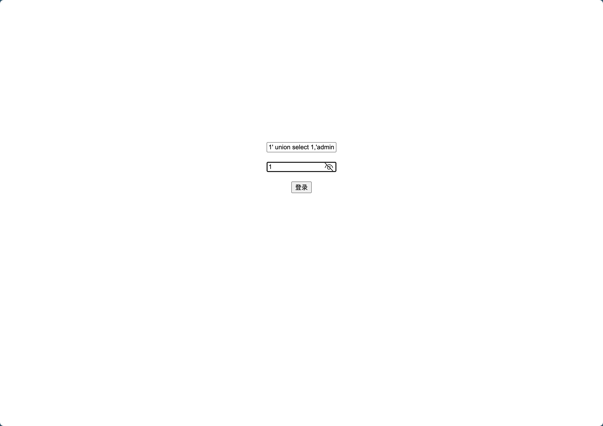

# [GXYCTF2019]BabySQli

## Tag

SQL 注入（读源码版）

***

## Writeup

为数不多一定要读源码的题目...不读源码大概是脑洞吧

头顶上有一个注释掉的东西，magic 解：

一个是在尝试过程中碰到 do not hack me 的时候 F12 就能发现这一串，另一个是知道了也没用，源码里有写，而且其他的东西必须看源码（感觉是题出坏了）

根据源码也能看到 `=, or, ()` 都被过滤了，真就摁死了，根据 db.sql 也可以知道有 id, username, passwd 三个字段，那么直接构造 payload `1' union select 1,'admin','c4ca4238a0b923820dcc509a6f75849b'#` 即可（c4... 是 1 的 MD5 值，因此输入的时候输入密码也得为 1）：

