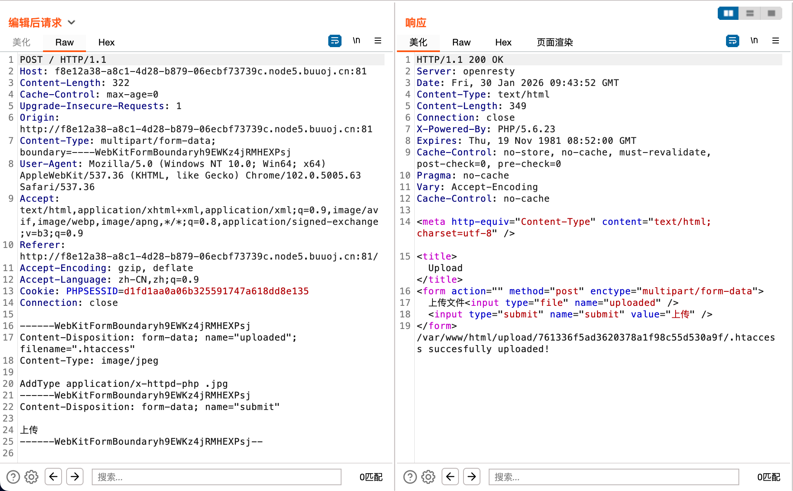
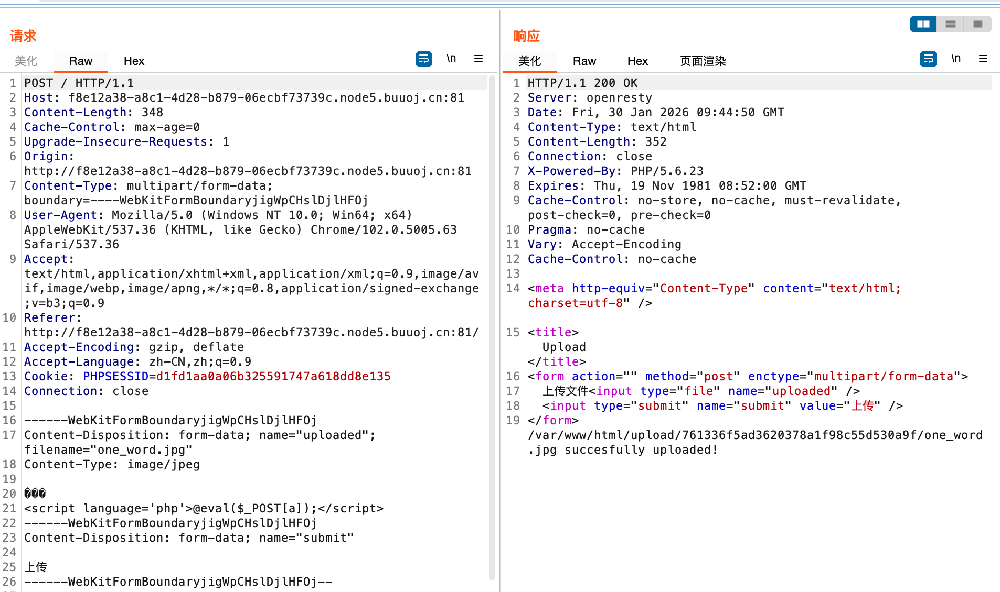
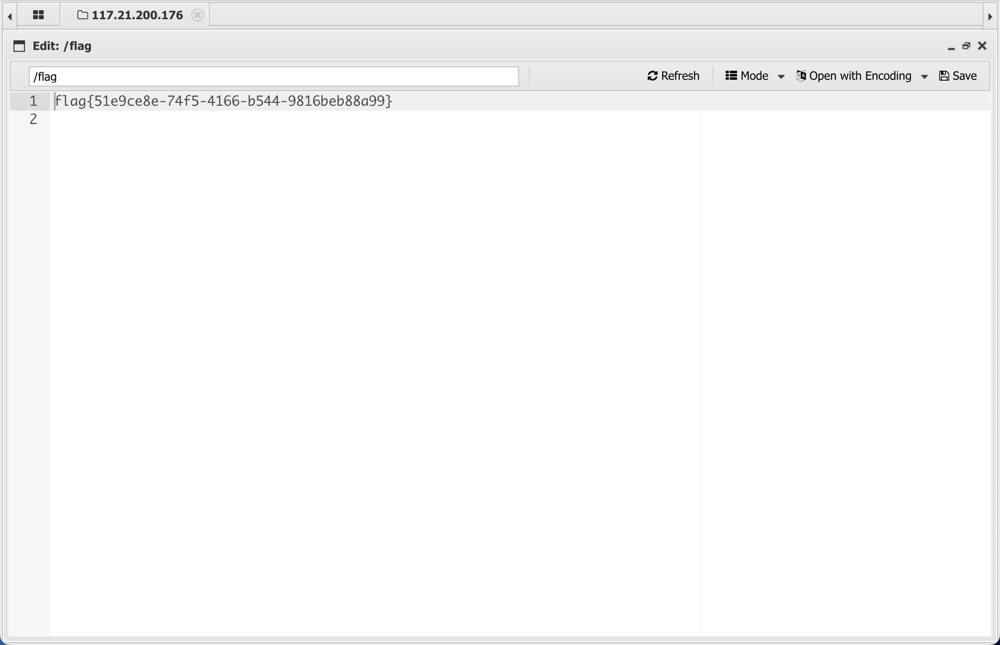

# [GXYCTF2019]BabyUpload

## Tag

.htaccess+一句话木马

***

## Writeup

跟  [[MRCTF2020]你传你🐎呢]([MRCTF2020]你传你🐎呢)  一样，还是只看 Content-Type，过滤 php, phtml，因此上传 .htaccess：

然后上传一句话木马即可，但是不一样的是正经的一句话木马过不了，得放 phtml 版本的：

蚁剑一连即可：

