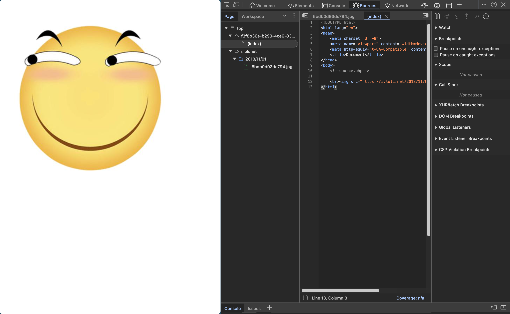
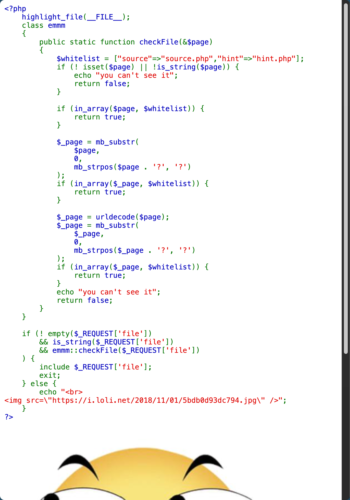
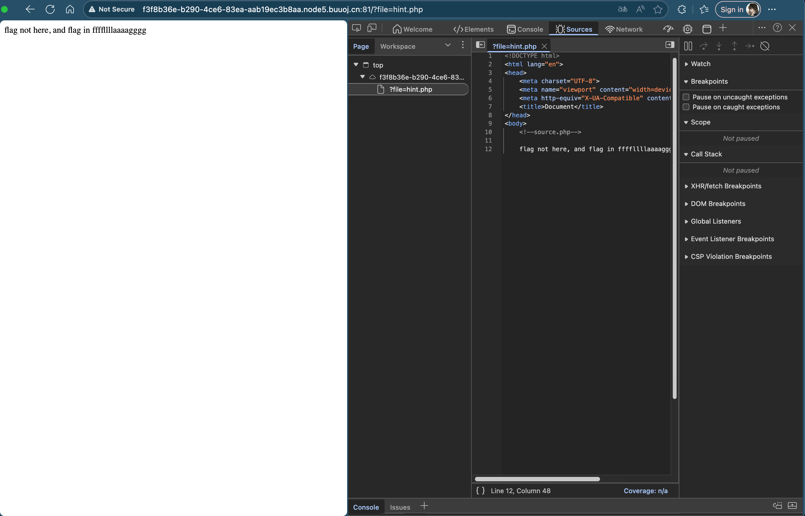
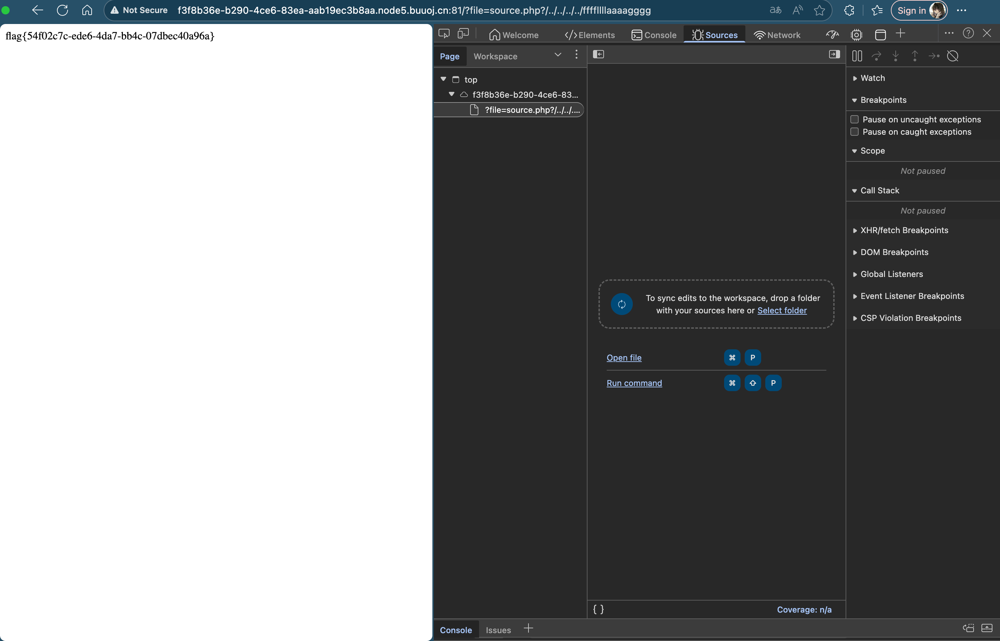

# [HCTF 2018]WarmUp

## Tag

文件包含绕过

***

## Writeup

访问源代码可以看到有 source.php：

访问可以得到 source.php 源代码：

访问 hint.php 可以得到：

因此只要通过 `checkFile` 检查即可，Payload：`/?file=source.php?/../../../../ffffllllaaaagggg`，`checkFile` 检测到 ? 后截取前半部分为白名单中的 source.php，因此返回 True，而 include 解析会将 `source.php?` 作为一个文件名，层级跳到根目录从而得到 flag：

