# [HCTF 2018]admin

## Tag

弱密码爆破、代码审计、Session 伪造

***

## Writeup

有一个登录和注册界面，弱密码 admin/123 即可登录：

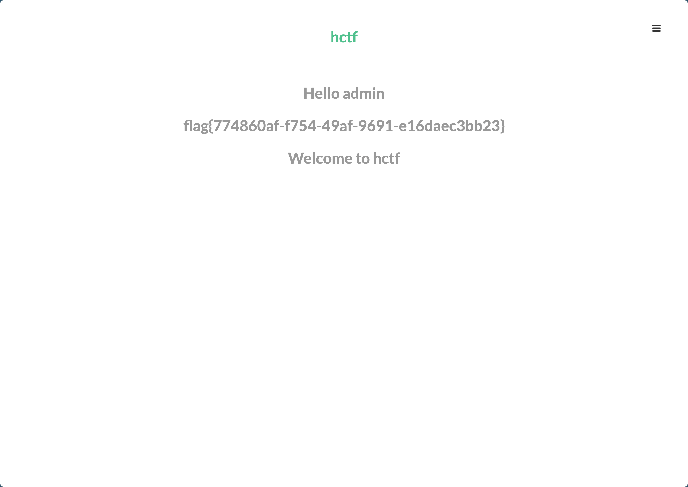

后记：肯定是非预期，解法有很多

***

### 解法 1：Burp 爆破

随便尝试登录抓包：

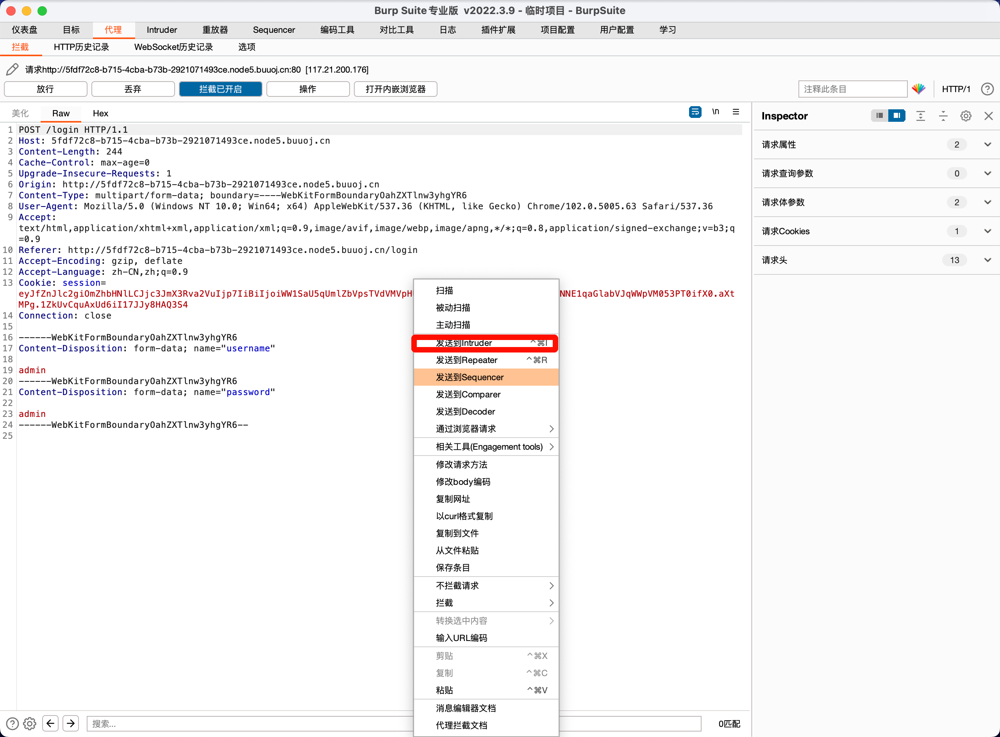

发送到 Intruder 去：

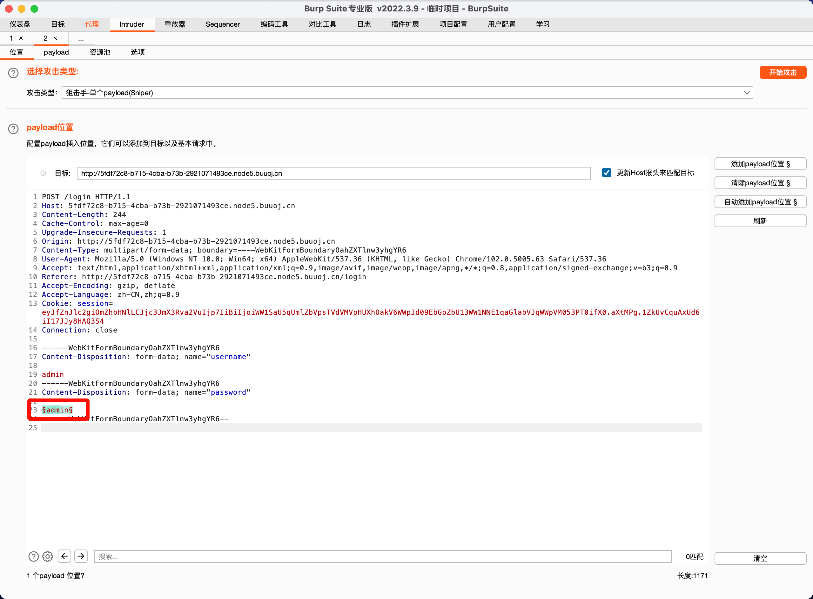

仅设置一个爆破位置，并加载爆破字典：

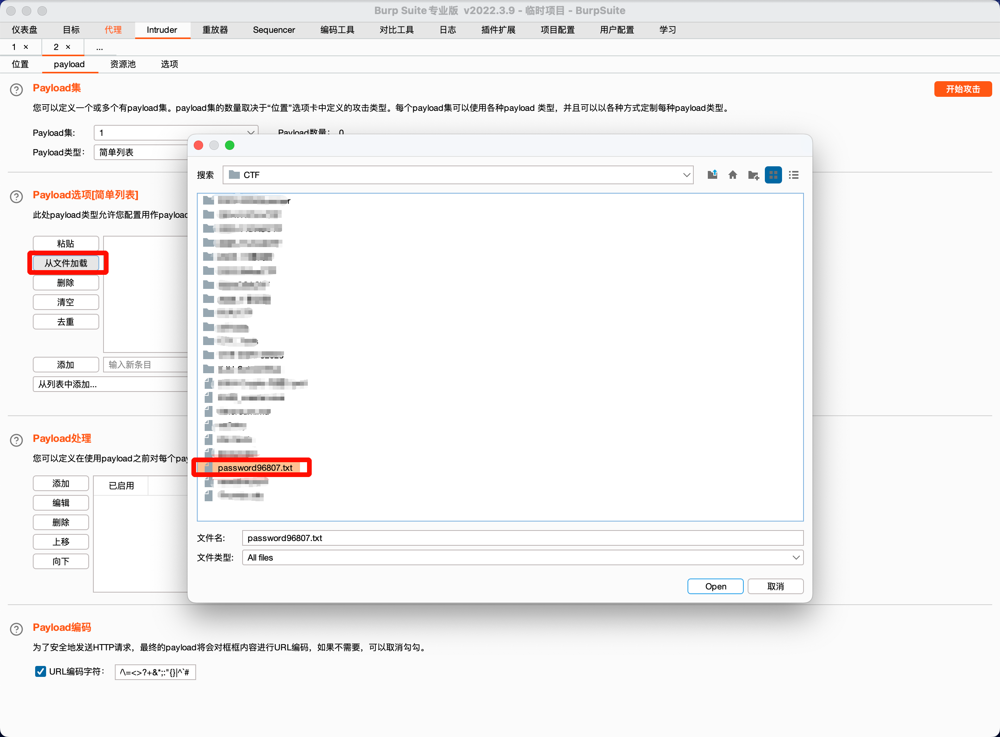

点击右上角开始攻击即可爆破出密码：

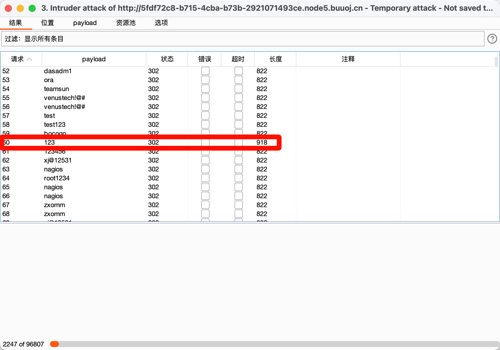

***

### 解法 2：源码审计

随便注册一个用户到更改密码界面，能看到源码地址：

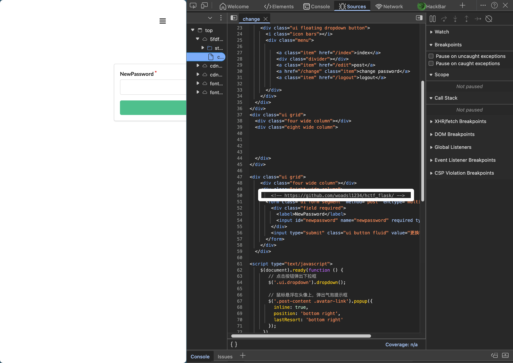

地址已经无效了，但是有其他的地址：https://github.com/Wkh19/hctf_flask，查看到登录源码：

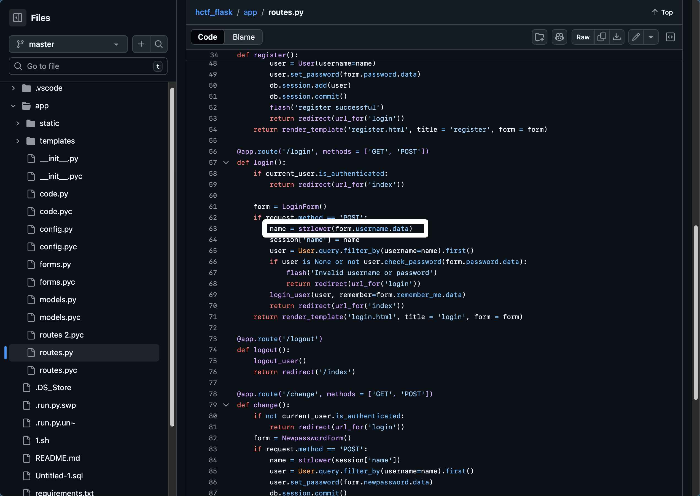

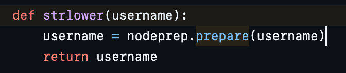

可以看到在登录、更改密码、注册部分都用了这个函数，而`nodeprep.prepare()` 这个函数存在问题：

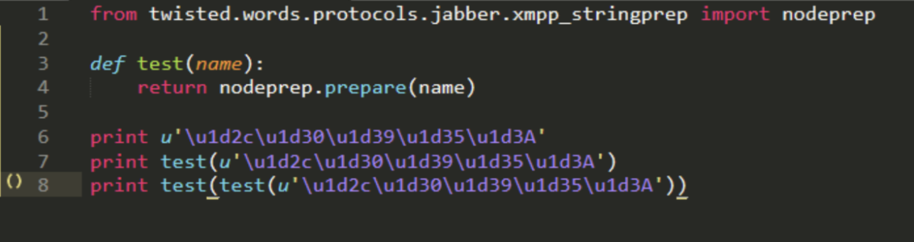

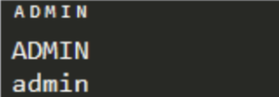

因此我们只要注册用户 ᴬᴰᴹᴵᴺ，登录，然后更改密码成我们知道的即可，再用 admin 和我们修改的密码登录即可

***

### 解法 3：Flask Session 伪造

Flask 中 Session是存储在客户端 Cookie中的，也就是存储在本地。Flask仅仅对数据进行了签名。众所周知的是，签名的作用是防篡改，而无法防止被读取。而 Flask 并没有提供加密操作，所以其 Session 的全部内容都是可以在客户端读取的，这就可能造成一些安全问题。加解密工具：https://github.com/noraj/flask-session-cookie-manager，加解密需要一个 key，在 config.py 里面能找到：

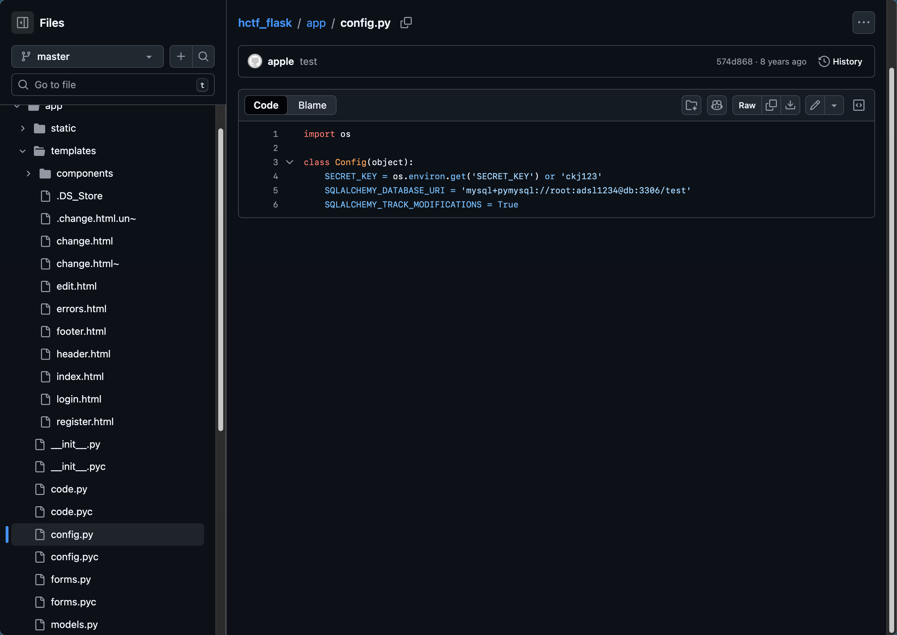

通过我们注册的用户 aaa 的 session 可以解密得到：

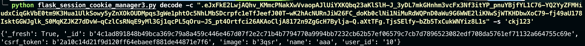

改成 admin 再加密一次：

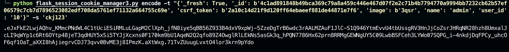

将得到的值直接覆盖 sessionid，刷新即可获得 flag：

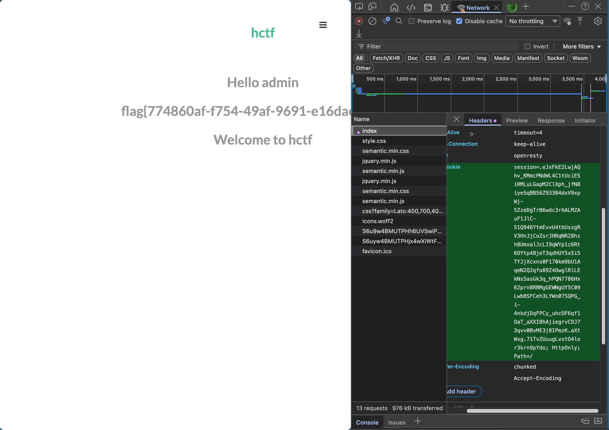

