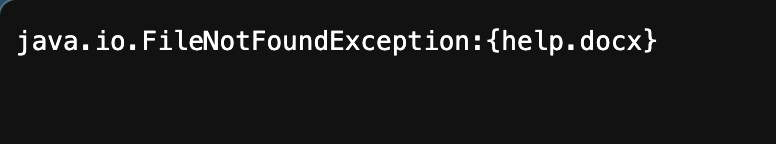
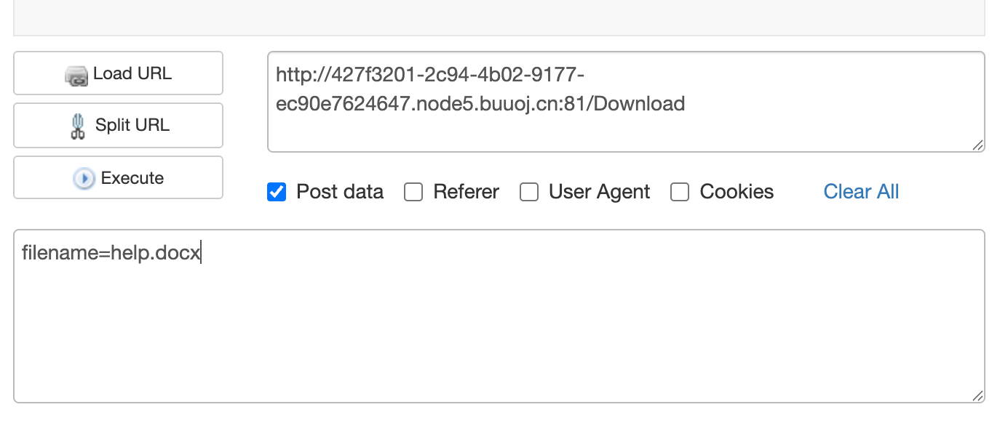
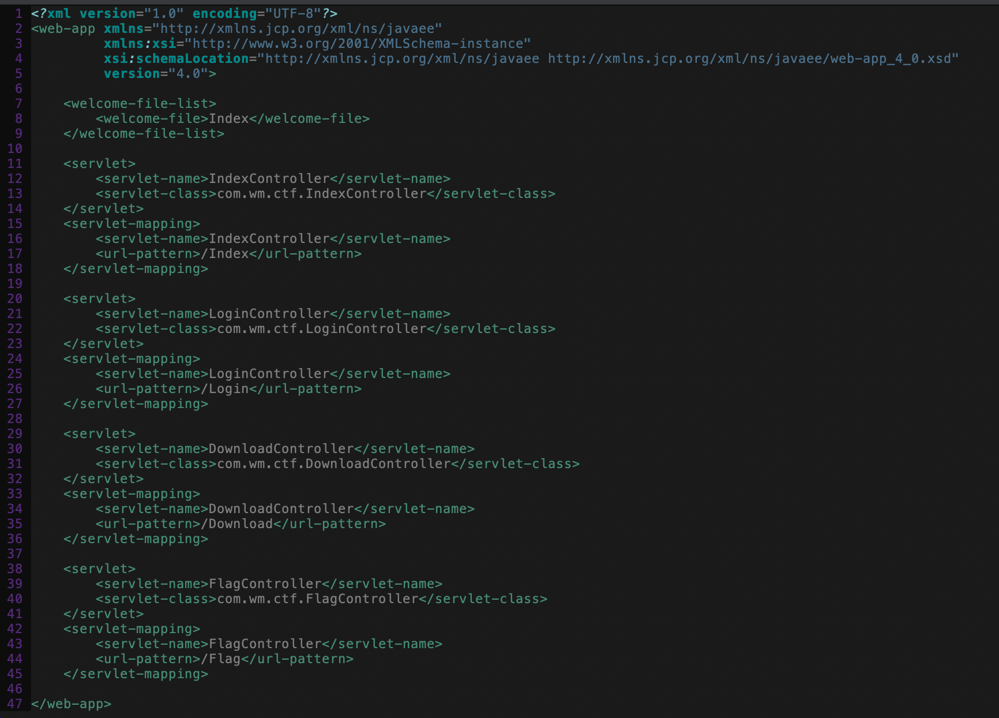
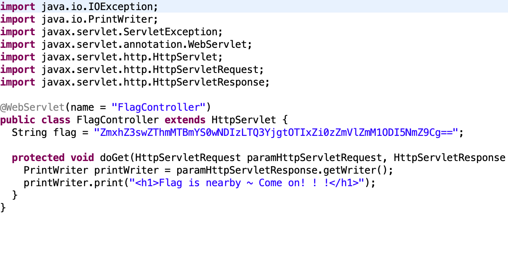
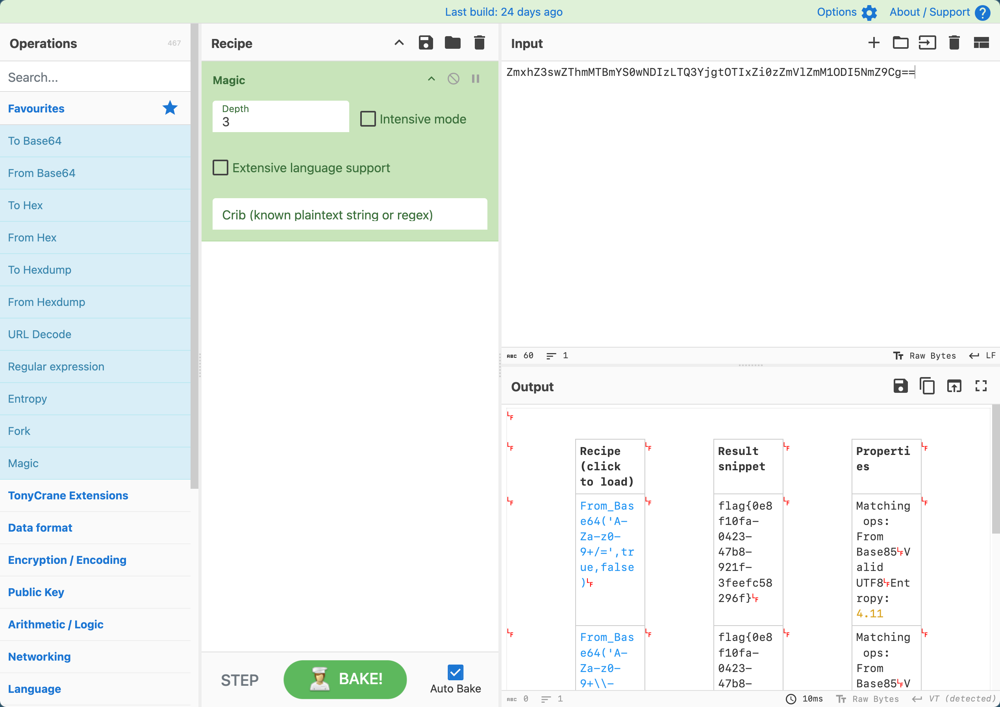

# [RoarCTF 2019]Easy Java

## Tag

Java 任意文件下载

***

## Writeup

访问 help 发现：

说明到达了 Download 路由但是没下载下来，用 POST 请求再发一遍即可：

得到：

说明可以下载任意文件，`WEB-INF` 是 Java Web 应用的安全目录，它包含了应用的配置文件、类文件（.class）和库文件（.jar），而 WEB-INF/web.xml 是 Java Web 的部署描述文件，里面记录了所有的 **Servlet 映射路径** 和 **类名**，下载下来：

里面有一个 FlagController，对应的路径为 `/WEB-INF/classes/com/wm/ctf/FlagController.class`，下载并反编译得到：

cyberchef 一解即可：

