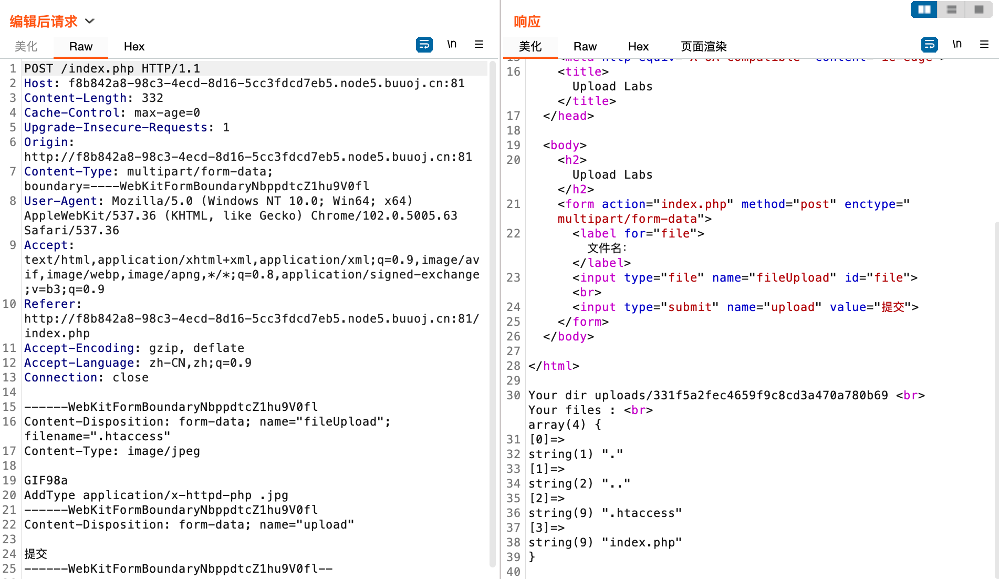
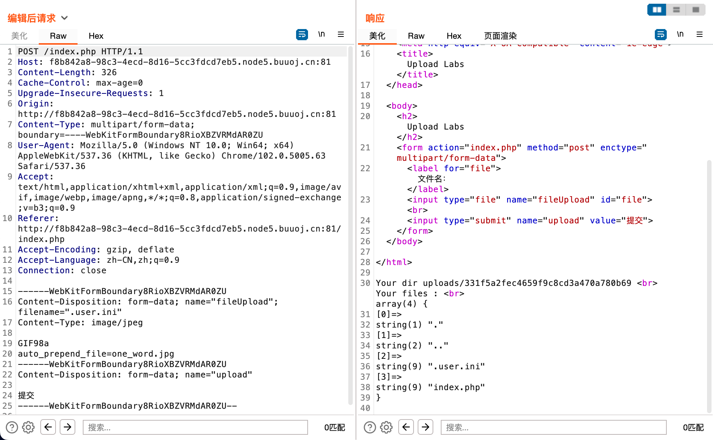
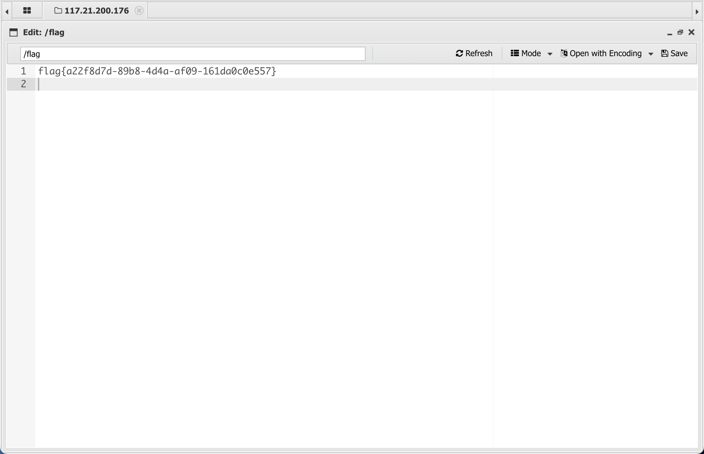

# [SUCTF 2019]CheckIn

## Tag

.user.ini+一句话木马

***

## Writeup

严格检查 GIF98a 文件头，上传 .htaccess 会返回给你目录下的文件：

上传 phtml 版本的一句话木马不行，可以看到有一个 index.php，合理转向 .user.ini：

这里的 `auto_prepend_file` 的意思是在每一个 php 文件后面附加上一个文件，然后我们上传 phtml 版本的一句话木马（<?被过滤了），然后蚁剑连 index.php 即可：

