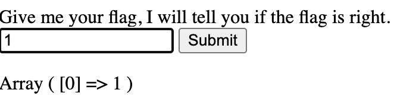
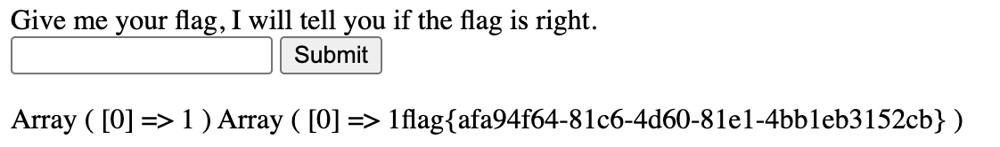
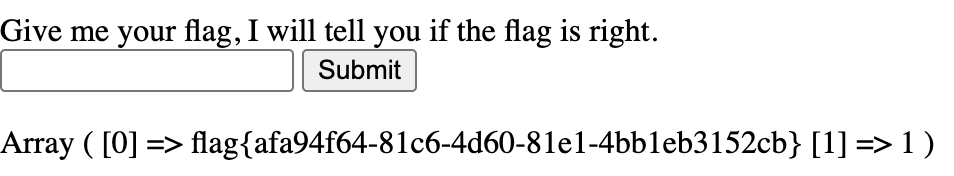

# [SUCTF 2019]EasySQL

## Tag

SQL 注入

***

## Writeup

各种尝试发现输入 1 以上的数字会有回显：

其他都回显 Nonono，说明存在 `||` 结构（短路逻辑），猜测后端代码为 `SELECT [输入] || flag FROM Flag`

方法 1：`1;set sql_mode=PIPES_AS_CONCAT;select 1`，其中 `set sql_mode=PIPES_AS_CONCAT` 表示将`||`从**逻辑或运算符**转为**字符串连接符**，那么就可以把 flag 强制拼接：

方法 2：`*,1`，最后就变成了 `SELECT *,1 FROM Flag`（`1 || flag=1`）

