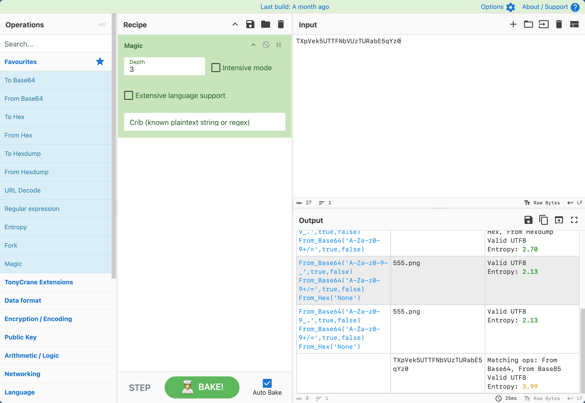

# [安洵杯 2019]easy_web

## Tag


***

## Writeup

访问会发现 img 自己会加一个参数，magic 一解：



用相同的加密方式加密查看 index.php，得到源码：

```php
<?php
error_reporting(E_ALL || ~ E_NOTICE);
header('content-type:text/html;charset=utf-8');
$cmd = $_GET['cmd'];
if (!isset($_GET['img']) || !isset($_GET['cmd'])) 
    header('Refresh:0;url=./index.php?img=TXpVek5UTTFNbVUzTURabE5qYz0&cmd=');
$file = hex2bin(base64_decode(base64_decode($_GET['img'])));

$file = preg_replace("/[^a-zA-Z0-9.]+/", "", $file);
if (preg_match("/flag/i", $file)) {
    echo '';
    die("xixi～ no flag");
} else {
    $txt = base64_encode(file_get_contents($file));
    echo "</img>";
    echo "<br>";
}
echo $cmd;
echo "<br>";
if (preg_match("/ls|bash|tac|nl|more|less|head|wget|tail|vi|cat|od|grep|sed|bzmore|bzless|pcre|paste|diff|file|echo|sh|\'|\"|\`|;|,|\*|\?|\\|\\\\|\n|\t|\r|\xA0|\{|\}|\(|\)|\&[^\d]|@|\||\\$|\[|\]|{|}|\(|\)|-|<|>/i", $cmd)) {
    echo("forbid ~");
    echo "<br>";
} else {
    if ((string)$_POST['a'] !== (string)$_POST['b'] && md5($_POST['a']) === md5($_POST['b'])) {
        echo `$cmd`;
    } else {
        echo ("md5 is funny ~");
    }
}

?>
<html>
<style>
  body{
   background:url(./bj.png)  no-repeat center center;
   background-size:cover;
   background-attachment:fixed;
   background-color:#CCCCCC;
}
</style>
<body>
</body>
</html>
```

要想绕过过滤，首先看到 MD5，那么采用完全一致的 MD5 例子 unhex 一下并用 urlencode，cmd 可以用反斜杠 l\s：


