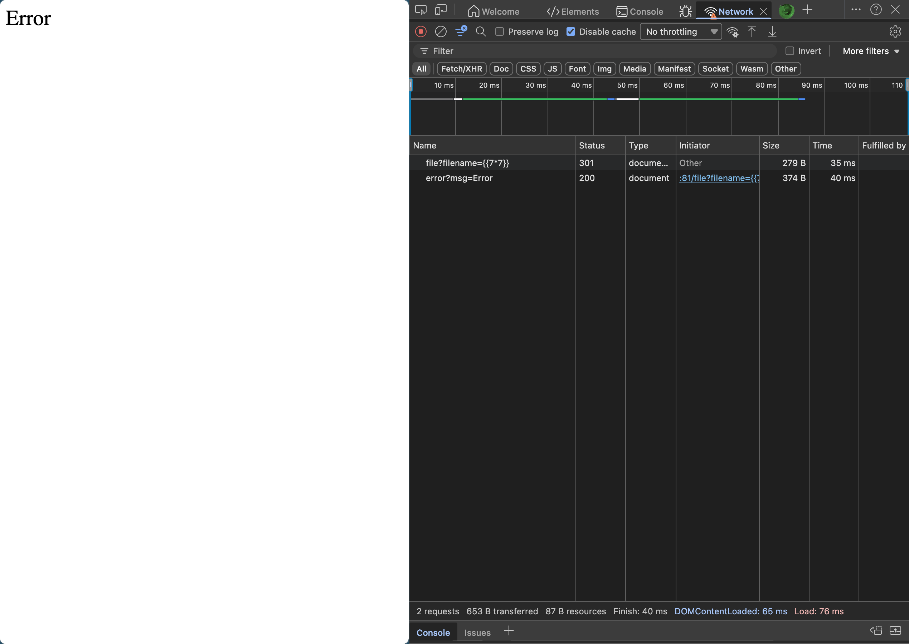
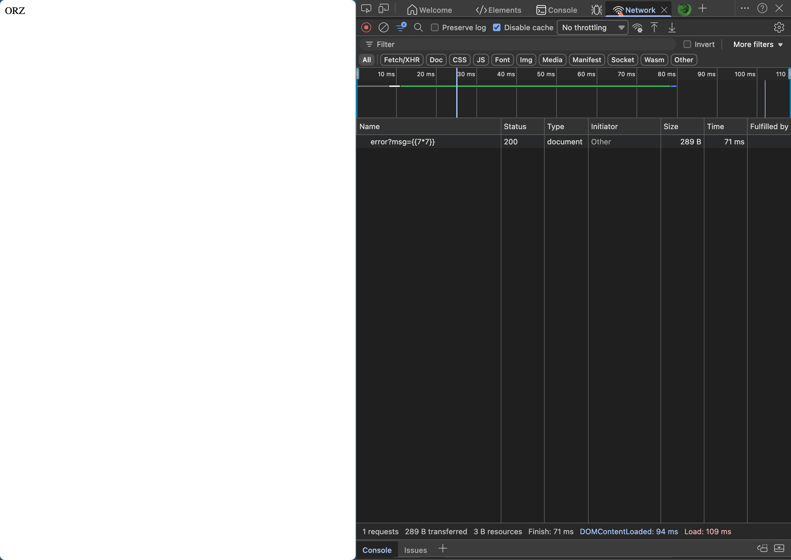
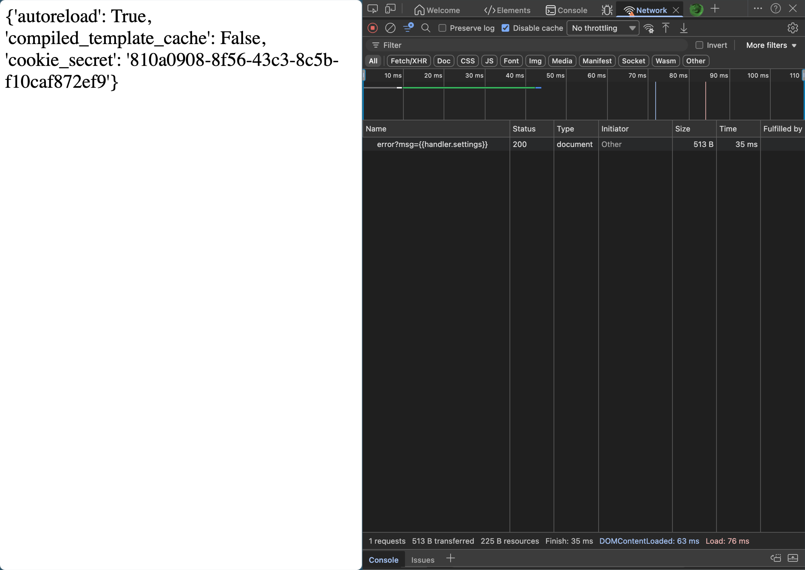
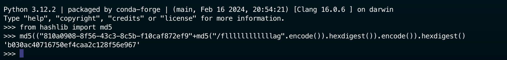
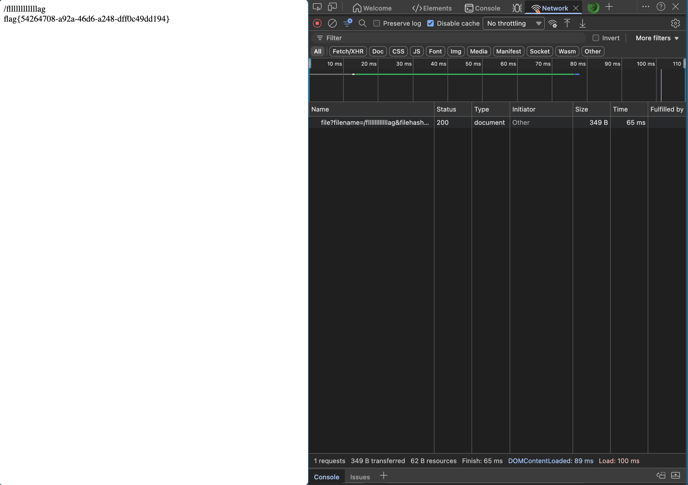

# [护网杯 2018]easy_tornado

## Tag

Tornado Python 模板 SSTI 注入

***

## Writeup

查询资料可以知道 Tornado 跟 Flask 类似，是一个 Python 框架，尝试 SSTI 注入：

那我们针对 `error?msg=` 注入：

注入 `{{handler.settings}}` 即可获得 cookie_secret：

然后就可以通过它的加密方式获得 flag：

